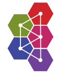
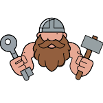
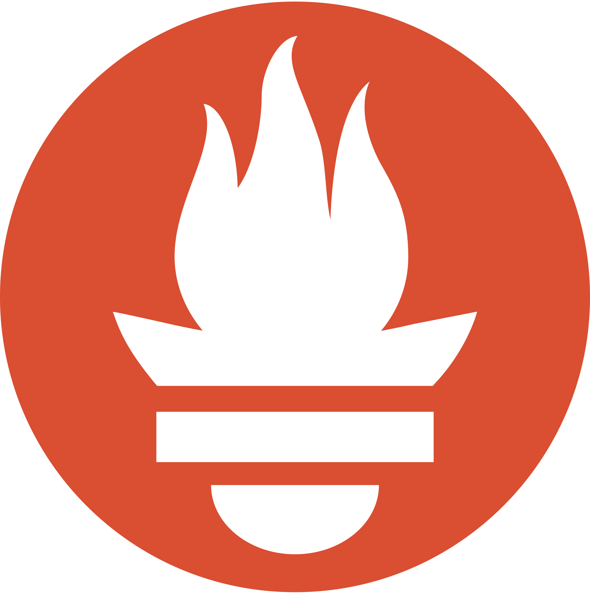
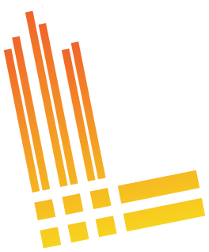
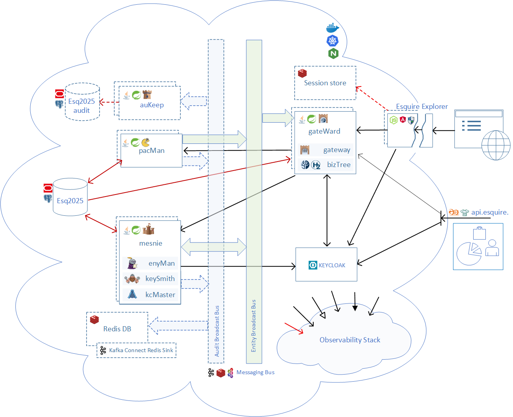
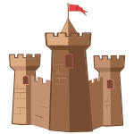

---

# Esquire Application Frameworks(tm) 2.0

***Every framework promises "you write only business logic". Esquire is the one where nothing else is left to
write.***

Esquire is a **business entity framework** — the structural backbone for any backoffice system. It organizes
people, organizations, and resources in a single tree, and runs your business operations against it.

What you write is the domain: place an entity on the tree and describe what it *means* — its fields, its rules,
its commands. Storage, identity and sign-in, permissions, the messaging between services, the audit trail,
metrics, logs and traces are in the framework already, and already wired to each other. **Three things make that
possible.**

**Tree-shaped authorization.** Authorization comes from the tree itself, in two dimensions at once: **role-based
rules** for what a user may *do*, and **tree-based scope** for what a user may *see*. A user's position resolves
both, on every read and every write — so there is no permission filter to write by hand, and none to forget.

**The server defines the UI.** Describe what an entity *means* — its fields, its rules, its commands — and the
server serves that description. The **administration UI** that ships with Esquire **renders it at runtime**, so
a new field is a change to the description and not to the frontend code. That same UI is the worked example of
using the REST API: any end-user app you write yourself reads the same descriptions the same way.

**Open, portable architecture.** The parts are the **widely used stack** — a relational database, Spring Boot,
Node.js with Angular, Grafana/Prometheus — and none of them is a commitment: the database dialect and the
message broker are settings. The same code and the same settings run as eight programs, as five, or as four, on
a laptop, on Kubernetes, or in the cloud. The shape is a deployment choice, and nothing about the framework
changes with it.

That is the claim, and it is checkable. Esquire ships a complete administrative backoffice — onboarding, profile
maintenance, permissions, and a working accounting domain. Accounting is the deliberately familiar example, so
the framework speaks for itself; any other hierarchy sits on the same backbone. The stack is driven **to the end
of what it can do**: a hybrid REST-and-event engine, vendor-neutral messaging, high availability that shrugs off
losing a machine, and full, switch-on-anywhere observability. **Released by pipeline and live in production,**
everything the framework promises, it does — in a running deployment, on three targets, open for anyone to
check.

**See it live — [esquire.mir0n.pro](https://esquire.mir0n.pro).** Sign in, browse the tree, run the operations.

---
> 
> **v1.2.13 — in progress.** The framework grows by **continuous development** — sprints against a target,
> rather than one long sequential line. This one separates **what the framework is** from **how many
> programs it runs as**. The same code, the same settings, run as eight separate programs, as five, or as
> four — you choose the shape that fits where you are running it, and nothing about the framework changes.
> A small deployment stops paying for a large one.
> 
> **v1.2.12 — complete.** Every record has a **change number**: a count that goes up by one each time the
> record is written. Small in itself, it settles two things that were left open — a record's history reads
> back in the order the changes really happened, and a message that arrives twice, or late and out of turn,
> is recognised and skipped.
> 
> What comes next is chosen from the
> [continuing-development backlog](doc/Esquire.ContinuingDev.md) — several sprints can run in parallel, each
> against its own target. See [Release History](#release-history).
>

## Installation

Esquire runs as a whole framework on your own machine — the services, the browser tier, the
messaging bus, a seeded demo database, and identity, all together. Two step-by-step routines bring up
the same application, each with an optional one-click view of what the running system is doing:

- **[Install & Run — Docker sandbox](doc/install/Docker.md)** — the fast single-instance stack: build,
  start, open the browser.
- **[Install & Run — Local Kubernetes](doc/install/LocalK8s.md)** (Docker Desktop) — the same
  application in its redundant deploy shape, every service running twice.

Both seed a demo organization tree with a working accounting example, so there is something to click
through the moment it is up. Background, the architecture, and the developer workflow are in
[Developer Setup](doc/Esquire.DevSetup.md).

---

## Project Structure

| Repository | Description |
|---|---|
| [esquire.services](https://github.com/mir0n-pro/esquire.services) | Backend microservices and API gateway |
| [esquire.explorer](https://github.com/mir0n-pro/esquire.explorer) | Angular frontend: entity tree explorer and operation dialogs |
| [esquire.ui.lib](https://github.com/mir0n-pro/esquire.ui.lib) | Shared Angular UI library (`@mir0n-pro/esquire.ui`) |
| [esquire.db.seed](https://github.com/mir0n-pro/esquire.db.seed) | Database schema and seed scripts (Oracle and Postgres) |

---

## Release History

**[Releases.md](Releases.md)** -- full release notes for every version, plus milestone reports across all four repositories.

---

## Documentation

### Architecture & Design
- [Esquire Messaging Bus — the vendor-agnostic bus subframework](doc/Esquire.MessagingBus.md) *(topology catalog, x-rod frontend, and a pluggable transport-provider SPI: tp-activemq / tp-kafka / tp-redis)* — suite: [how Esquire uses the bus](doc/Esquire.Messaging.md), [message structure](doc/Esquire.MessagingBus.MessageStructure.md), [integration guides](doc/Esquire.MessagingBus.Guides.md), [design Q&A](doc/Esquire.MessagingBus.Q&A.md), [continuing development](doc/Esquire.MessagingBus.ContinuingDev.md)
- [Observability Stack](doc/Esquire.ObservabilityStack.md) *(metrics, tracing, and logging as common tooling)* — suite: [logging strategy](doc/Esquire.ObservabilityStack.Logging.md), [Grafana dashboards guide](doc/Esquire.GrafanaGuide.md)
- [Authentication & Authorization — the tree-shaped security model](doc/Esquire.Auth.md) *(identity claims `esq_uid` / `esq_rootpath`; the keySmith / kcMaster / KeyCloak collaboration; `ep_path` visibility + role-based authority)* — suite: [token patterns](doc/Esquire.Auth.TokenPatterns.md) (BFF / JWT / Vanilla & Phantom Token Relay; JWE parked under stock KC) and [keySmith credential routines](doc/Esquire.Auth.keySmithRoutine.md)
- [bizTree — Taijitu Recoverable Cache Architecture](doc/Esquire.BizTree.md) *(the Supreme Ultimate Cache: two-monad anti-entropy double-buffer + night-watch sweep)*
- [Audit Logging Stack](doc/Esquire.AuditLoggingStack.md) *(pluggable audit seam over the generic keep engine; six selectable strategies, ActiveMQ / Kafka / Redis transport, the auKeep consumer service)*
- [High Availability](doc/Esquire.HighAvailability.md) *(replica topology, the resilience budget, and how each delivery channel survives duplication)*
- [Design Q&A](doc/Esquire.Q&A.md) *(cross-cutting design questions and how they were resolved)*

### Domain & Data Model
- [Entity Dictionary](doc/EntityDictionary.md) *(what an entity says about itself: its fields, labels, allowed values, defaults, and how the screens are built from them; the full kind enumeration is its appendix)*
- [Database Dictionary](doc/DatabaseDictionary.md)

### Testing
- [Testing Stack — frameworks, scope, coverage](doc/Esquire.TestingStack.md) *(every framework in use across all Esquire projects, what it covers, current test counts)*
- [Haubergeon — Gatling harness reference](doc/Esquire.Haubergeon.md)

### Deployment & Setup
- [Developer Setup](doc/Esquire.DevSetup.md) *(local build, the docker stack, and OCI / OKE cloud setup)*
- [CI/CD — Automated Build and Release Pipeline](doc/Esquire.GitHubActions.md) *(three stages: automatic build-and-test on every change, deploy to a local test cluster during development, and a human-approved cloud release deploy checked against the live site)*
- [Configuration Reference — every service parameter, logging, gateway routes, audit-logging modes/options](doc/services.configuring.md)

### Development Process
- [Development Process](doc/Esquire.DevProcess.md) *(the sprint lifecycle, the documentation routine, and the release flow)*
- [Continuing Development](doc/Esquire.ContinuingDev.md) *(cross-cutting backlog and deferred design notes)*

### Value Proposition & Roadmap
- [Esquire Application Frameworks — What, Why, and for Whom](doc/Esquire.Vision.md)
- [v1.2.x Goal](doc/v1.2.x.Goal.md) *(what the v1.2.x horizon set out to achieve, and the maturity it reached)*
- [v1.2.x Planning — release-line roadmap, sprint themes, and the road to v1.3.0](doc/v1.2.x.Planning.md) *(rolling roadmap / white paper across all four Esquire repositories)*

---

## Component Model

---

The **gateway**, the six backend **services** (bizTree, enyMan, pacMan, keySmith, kcMaster, auKeep), and the
**BFF** each run **redundant, with (optional) autoscale**, for high availability — spread across separate
nodes so losing one keeps the site up. The databases, Keycloak, the message broker, and the Session Store
run as a single instance here; each is a third-party platform that brings its **own** high-availability
(clustering / replication), set up by the operator when wanted — outside Esquire's concern.

<table style="width: 100%; table-layout: fixed;">
  <tr></tr>
  <tr><td style="width: 100%;">
    <table style="width: 100%; table-layout: fixed;">
      <tr></tr>
      <tr>
        <td style="width: auto; white-space: nowrap;"><b>Esq2025</b></td>
        <td style="width: 8%;"></td>
        <td style="width: 100%;"></td>
      </tr>
    </table>
    The database (Postgres or Oracle); persistent store for all entity data,
       transactions, permissions, configuration parameters, and the audit log (when triggers are enabled).
  </td></tr>

  <tr><td style="width: 100%;">
    <table style="width: 100%; table-layout: fixed;">
      <tr>
        <td style="width: auto; white-space: nowrap;"><b>Esq2025 audit</b></td>
        <td style="width: 8%;"></td>
        <td style="width: 100%;"></td>
      </tr>
    </table>
    Optional, the database (Postgres or Oracle); persistent store for the entity audit log (<code>*_log</code> tables).
  </td></tr>

  <tr><td style="width: 100%;">
    <table style="width: 100%; table-layout: fixed;">
      <tr></tr>
      <tr>
        <td style="width: auto; white-space: nowrap;"><b>Messaging Bus</b></td>
        <td style="width: 8%;"></td>
        <td style="width: 8%;"></td>
        <td style="width: 100%;"></td>
      </tr>
    </table>
    Three logical channels:
         - <i>IAM Request-Response Bus</i> — carries identity commands (create / update / delete user)
         from keySmith to kcMaster, and acknowledgement replies back
         - <i>Entity Broadcast Bus</i> — enyMan and pacMan publish entity change events on every mutation;
         bizTree and other interested consumers subscribe
         - <i>Audit Broadcast Bus</i> — optional (off by default); the entity-updating services (enyMan, pacMan, keySmith)
         publish each committed change event. Transport vendors: ActiveMQ, Kafka, or Redis.
  </td></tr>

  <tr><td style="width: 100%;">
    <table style="width: 100%; table-layout: fixed;">
      <tr>
        <td style="width: auto; white-space: nowrap;"><b>pacMan</b></td>
        <td style="width: 8%;"></td>
        <td style="width: 8%;"></td>
        <td style="width: 100%;"></td>
      </tr>
    </table>
    Personal Account Manager; the accounting service; manages account balance
       operations: deposit, withdrawal, cross-currency transfer; the place where business logic lives;
       all other services exist to support it.
  </td></tr>

  <tr><td style="width: 100%;">
    <table style="width: 100%; table-layout: fixed;">
      <tr></tr>
      <tr>
        <td style="width: auto; white-space: nowrap;"><b>bizTree</b></td>
        <td style="width: 8%;"></td>
        <td style="width: 8%;"></td>
        <td style="width: 8%;"></td>
        <td style="width: 100%;"></td>
      </tr>
    </table>
    The entity tree service; maintains an H2 database in-memory cache of the business entity
       tree; serves tree navigation to the frontend; stays current by consuming the broadcast bus.
       A <b>recoverable cache service</b>: a two-buffer anti-entropy design whose periodic
       night-watch rebuilds a shadow from the database, compares the two, and self-heals any drift —
       so an event missed while the service was down is reconciled automatically, with no restart.
  </td></tr>

  <tr><td style="width: 100%;">
    <table style="width: 100%; table-layout: fixed;">
      <tr>
        <td style="width: auto; white-space: nowrap;"><b>enyMan</b></td>
        <td style="width: 8%;"></td>
        <td style="width: 8%;"></td>
        <td style="width: 100%;"></td>
      </tr>
    </table>
    Entity Manager; manages organizations and users; handles create, update, delete,
       and move operations; publishes entity change events to the entity broadcast bus, and now also
       receives from it — a two-way link, so the redundant copies stay coordinated, each aware of the
       entity changes the other makes.
  </td></tr>

  <tr><td style="width: 100%;">
    <table style="width: 100%; table-layout: fixed;">
      <tr></tr>
      <tr>
        <td style="width: auto; white-space: nowrap;"><b>keySmith</b></td>
        <td style="width: 8%;"></td>
        <td style="width: 8%;"></td>
        <td style="width: 100%;"></td>
      </tr>
    </table>
    Authentication and access profile service; manages IAS integration and
       JWT-based authorization; serves access profiles to the frontend; publishes identity change
       requests to the IAM bus.
  </td></tr>

  <tr><td style="width: 100%;">
    <table style="width: 100%; table-layout: fixed;">
      <tr>
        <td style="width: auto; white-space: nowrap;"><b>kcMaster</b></td>
        <td style="width: 8%;"></td>
        <td style="width: 8%;"></td>
        <td style="width: 100%;"></td>
      </tr>
    </table>
    Keycloak IAS sync coordinator; the only service that writes to Keycloak directly;
       consumes identity commands from the IAM bus and executes create / update / delete in the IAM. Also
       listens on the entity broadcast bus to keep a moved entity's Keycloak path in sync.
  </td></tr>

  <tr><td style="width: 100%;">
    <table style="width: 100%; table-layout: fixed;">
      <tr></tr>
      <tr>
        <td style="width: auto; white-space: nowrap;"><b>auKeep</b></td>
        <td style="width: 8%;"></td>
        <td style="width: 8%;"></td>
        <td style="width: 100%;"></td>
      </tr>
    </table>
    Optional, the audit consumer service, writes audit events to the <code>*_log</code> tables.
  </td></tr>

  <tr><td style="width: 100%;">
    <table style="width: 100%; table-layout: fixed;">
      <tr>
        <td style="width: auto; white-space: nowrap;"><b>Redis DB</b></td>
        <td style="width: 100%;"></td>
      </tr>
    </table>
    Optional, the alternative non-SQL (document-DB) audit sink; the Redis stream itself holds the
       audit trail (the stream <i>is</i> the log). Feeding it from the Kafka transport needs one extra component, a
       <b>Kafka Connect Redis Sink</b>
       .
  </td></tr>

  <tr><td style="width: 100%;">
    <table style="width: 100%; table-layout: fixed;">
      <tr></tr>
      <tr>
        <td style="width: auto; white-space: nowrap;"><b>gateway</b></td>
        <td style="width: 8%;"></td>
        <td style="width: 8%;"></td>
        <td style="width: 100%;"></td>
      </tr>
    </table>
    Spring Cloud Gateway; the API router; routes requests to the appropriate
       backend service by path and entity kind; validates JWT tokens on every request and, for
       opted-in clients, accepts two additional auth shapes. Reachable two ways: in-cluster
       from the BFF on <code>/api/*</code>, and externally at <code>https://api.esquire.mir0n.pro</code> —
       the <code>public REST API</code> for non-browser callers.
  </td></tr>

  <tr><td style="width: 100%;">
    <table style="width: 100%; table-layout: fixed;">
      <tr>
        <td style="width: auto; white-space: nowrap;"><b>Keycloak</b></td>
        <td style="width: 100%;"></td>
      </tr>
    </table>
    External IAM; issues JWT access tokens; manages user identities, realm
       configuration, and authentication flows including TOTP; runs as a containerized service.
  </td></tr>

  <tr><td style="width: 100%;">
    <table style="width: 100%; table-layout: fixed;">
      <tr></tr>
      <tr>
        <td style="width: auto; white-space: nowrap;"><b>Esquire Explorer Backend</b></td>
        <td style="width: 100%;"></td>
      </tr>
    </table>
    Node.js BFF tier — Backend-for-Frontend; the  administrative GUI entry point</b>
       at <code>https://esquire.mir0n.pro</code>. 
       Owns the OIDC code+PKCE flow with Keycloak
       (<code>/auth/login</code>, <code>/callback</code>, <code>/logout</code>, <code>/me</code>); 
       proxies <code>/api/*</code>to the gateway with bearer
       injection; caches static entity dictionaries (<code>/esq-kinds</code>, <code>/esq-dictionary</code>) per pod,
       shared across users; bakes the Angular SPA into its image at build time and serves it on <code>/</code>.
       The  browser never sees the access token — it holds an opaque session cookie. When run redundant, login
       sessions are kept in the <b>Session Store</b> so any copy can serve any request.
  </td></tr>

  <tr><td style="width: 100%;">
    <table style="width: 100%; table-layout: fixed;">
      <tr>
        <td style="width: auto; white-space: nowrap;"><b>Session Store</b></td>
        <td style="width: 100%;"></td>
      </tr>
    </table>
    Optional; a Redis instance holding the BFF's login sessions, so the redundant BFF copies share them —
       any copy can serve any request. Only needed when the BFF runs as more than one copy; distinct from the
       audit-sink Redis.
  </td></tr>

  <tr><td style="width: 100%;">
    <table style="width: 100%; table-layout: fixed;">
      <tr></tr>
      <tr>
        <td style="width: auto; white-space: nowrap;"><b>Esquire Explorer Frontend</b></td>
        <td style="width: 8%;"></td>
        <td style="width: 8%;"></td>
        <td style="width: 100%;"></td>
      </tr>
    </table>
    Angular SPA — the user-facing tree explorer and operations UI; consumes the <code>@mir0n-pro/esquire.ui</code> library;
       communicates only with the BFF via same-origin <code>/auth/*</code> and <code>/api/*</code>, never directly with the gateway or Keycloak.
       Shipped baked into the BFF image; one deployable.
  </td></tr>

  <tr><td style="width: 100%;">
    <table style="width: 100%; table-layout: fixed;">
      <tr>
        <td style="width: auto; white-space: nowrap;"><b>Public REST API</b></td>
        <td style="width: 8%;"></td>
        <td style="width: 100%;"></td>
      </tr>
    </table>
    Exposed for gatling-based load / smoke harnesses and other integrations.
  </td></tr>
</table>

**The two public hosts at a glance:**

| Host | Purpose | Auth shape | Who talks to it |
|---|---|---|---|
| `esquire.mir0n.pro` | Administrative GUI (BFF + SPA) | OIDC code+PKCE -> opaque session cookie | Humans in a browser |
| `api.esquire.mir0n.pro` | Public REST API (gateway direct) | Bearer JWT on every request | Service-to-service callers, integrations, load / smoke harnesses |

**Observability Stack**

Every piece below is open-source, and any of it can be swapped out — no lock-in, the same rule as the rest of the platform.

<table style="width: 100%; table-layout: fixed;">
  <tr></tr>
  <tr><td style="width: 100%;">
    <table style="width: 100%; table-layout: fixed;">
        <tr></tr>
        <tr>
        <td style="width: auto; white-space: nowrap;"><b>Postgres Exporter</b></td>
        <td style="width: 8%;"></td>
        <td style="width: 100%;"></td>
      </tr>
    </table>
    Turns the database's own statistics into numbers the metrics store can read.
  </td></tr>

  <tr><td style="width: 100%;">
    <table style="width: 100%; table-layout: fixed;">
      <tr>
        <td style="width: auto; white-space: nowrap;"><b>Prometheus</b></td>
        <td style="width: 100%;"></td>
      </tr>
    </table>
    The metrics store — collects the numbers (rates, timings, counts) from every service and keeps their history.
  </td></tr>
  
  <tr><td style="width: 100%;">
    <table style="width: 100%; table-layout: fixed;">
      <tr></tr>
      <tr>
        <td style="width: auto; white-space: nowrap;"><b>OpenTelemetry Collector</b></td>
        <td style="width: 100%;"></td>
      </tr>
    </table>
    The traces hub — a separate service that gathers each request's trace from every service, passes it to the trace store, and builds the live map of which service calls which.
  </td></tr>
  
  <tr><td style="width: 100%;">
    <table style="width: 100%; table-layout: fixed;">
      <tr>
        <td style="width: auto; white-space: nowrap;"><b>Grafana Tempo</b></td>
        <td style="width: 100%;"></td>
      </tr>
    </table>
    The trace store — keeps each request's end-to-end trace, found by the same id as its logs.
  </td></tr>
  
  <tr><td style="width: 100%;">
    <table style="width: 100%; table-layout: fixed;">
      <tr></tr>
      <tr>
        <td style="width: auto; white-space: nowrap;"><b>Grafana Alloy</b></td>
        <td style="width: 100%;"></td>
      </tr>
    </table>
    The log collector — gathers the log lines from every service and passes them to the log store.
  </td></tr>
  
  <tr><td style="width: 100%;">
    <table style="width: 100%; table-layout: fixed;">
      <tr>
        <td style="width: auto; white-space: nowrap;"><b>Grafana Loki</b></td>
        <td style="width: 100%;"></td>
      </tr>
    </table>
    The log store — keeps all the logs, searchable, and serves them to the dashboard.
  </td></tr>

  <tr><td style="width: 100%;">
    <table style="width: 100%; table-layout: fixed;">
      <tr></tr>
      <tr>
        <td style="width: auto; white-space: nowrap;"><b>Grafana</b></td>
        <td style="width: 100%;"></td>
      </tr>
    </table>
    The one screen — dashboards for logs, traces, and numbers together; because everything shares one id, a log line, its trace, and its numbers are one click apart.</td></tr>
  </td></tr>
</table>

For how the pieces connect — the protocols, the ports, and the full detail — see the [Observability Stack](doc/Esquire.ObservabilityStack.md) design doc.

**Compact topology**

The same framework in fewer programs. Services that always run together are placed in one program — nothing
is removed, nothing is rewritten, and every path, message and screen behaves exactly as before. The model at
the top of this page stays the default; this is the second shape, and which one to run is chosen per
installation. Eight programs become five, or four in the cloud, where the audit trail is written by the
database itself and the program that drains it is not needed. A small deployment stops paying for a large
one.

Two programs carry the change, and both hold framework parts only. **pacMan**, the accounting service, is
never a candidate: it is the business domain built *on* the framework, not a part *of* it. A domain grows
and changes at its own pace, and tying it to the backbone would take that freedom away — so it stays its own
program in every shape, exactly as any domain you build on Esquire would. The audit keeper stays on its own
for a different reason: in the cloud shape it is not there at all, because the database writes the audit
trail itself. The browser tier is its own program as always.

Measured, not assumed: on the cloud deployment the same load rig turns **27% more work** with the watching
switched off and **42% more** with metrics, logs and traces fully on, the whole application uses **1.5 GiB**
of memory, and it runs on **7 pods instead of 13**. Every running-stack test suite passes on both shapes,
unchanged.

The cost is worth saying plainly: services that share a program restart together, scale together, and one
crash takes all of them down at once. The work itself does not change — the same requests and the same
messages, carried by fewer machines. It is a deployment choice, and it can be reversed.

<table style="width: 100%; table-layout: fixed;">
  <tr></tr>
  <tr><td style="width: 100%;">
    <table style="width: 100%; table-layout: fixed;">
      <tr></tr>
      <tr>
        <td style="width: auto; white-space: nowrap;"><b>Mesnie</b></td>
        <td style="width: 8%;"></td>
        <td style="width: 8%;"></td>
        <td style="width: 8%;"></td>
        <td style="width: 8%;"></td>
        <td style="width: 8%;"></td>
        <td style="width: 100%;"></td>
      </tr>
    </table>
    The write side in one program: the entity manager, the identity service and the Keycloak agent.
       Identity work that used to travel over the message bus is a call inside the program, so a whole round
       trip disappears while the commands and the events on the outside stay the same.
  </td></tr>

  <tr><td style="width: 100%;">
    <table style="width: 100%; table-layout: fixed;">
      <tr></tr>
      <tr>
        <td style="width: auto; white-space: nowrap;"><b>gateWard</b></td>
        <td style="width: 8%;"></td>
        <td style="width: 8%;"></td>
        <td style="width: 8%;"></td>
        <td style="width: 8%;"></td>
        <td style="width: 8%;"></td>
        <td style="width: 100%;"></td>
      </tr>
    </table>
    The read side in one program: the API router together with the business-tree cache and the in-memory H2
       database that holds it. A tree read is answered in the program that received it, so the request never
       leaves the machine to be served.
  </td></tr>
</table>

