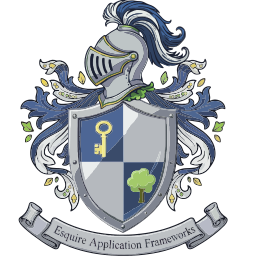
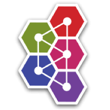
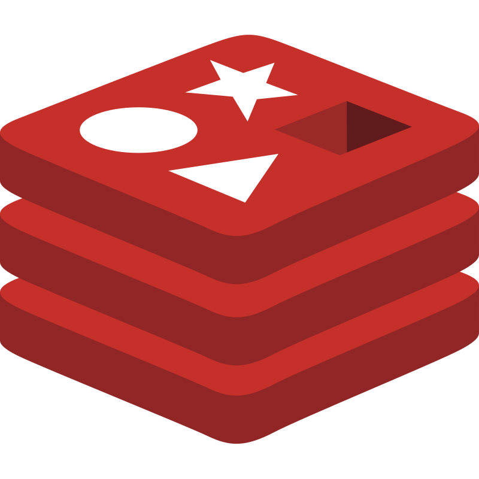
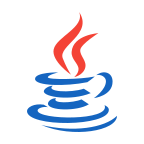
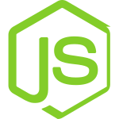
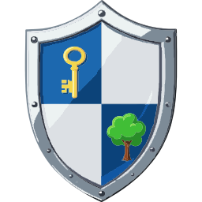

---

# Esquire Application Frameworks(tm) 2.0

***Tree-shaped authorization. Write business logic only. The server defines the UI.***

Esquire is a **business entity framework** — the structural backbone for any system that
needs to organize people, organizations, and resources in a tree, enforce who can see and
do what within that tree, and run business operations against it.

The point of a framework is to let you write **only business logic.** You place an entity on the tree
and describe what it *means*; how it is stored, synchronized across services, secured, audited, and
served to the browser is **inherited, not coded.** Persistence, messaging, identity, deployment — the
plumbing every application drags along — is the framework's job, not the domain developer's.

The backoffice scenario — onboarding, profile maintenance, permissions, accounting — is the
demonstration domain. Accounting in particular is the "everybody's know-how" example: a
universally understood domain that exercises the full framework stack end to end. It is not
the destination. It is the proof of concept for the real idea.

**See it live: [esquire.mir0n.pro](https://esquire.mir0n.pro)** — sign in, browse the tree, run the operations.

---
> 
> **v1.2.8 — complete.** A **major refactoring** sprint built around the **Messaging Bus**: a vendor-agnostic bus — entity broadcast and identity request/response across the whole services set — extracted into a reusable subframework (`esquire-messaging` plus the pluggable transport-provider drivers `tp-activemq` / `tp-kafka` / `tp-redis`). The shared **`esquire-audit`** and **`esquire-data-keep`** libraries were split out of `common`; the audit-writer service `xx-rod` was renamed to the clearer **`auKeep`**; and a small **system-entity flag** project (protects core entities from deletion) rode along with the release. See [Release History](#release-history).
>

## Project Structure

| Repository | Description |
|---|---|
| [esquire.services](https://github.com/mir0n-pro/esquire.services) | Backend microservices and API gateway |
| [esquire.explorer](https://github.com/mir0n-pro/esquire.explorer) | Angular frontend: entity tree explorer and operation dialogs |
| [esquire.ui.lib](https://github.com/mir0n-pro/esquire.ui.lib) | Shared Angular UI library (`@mir0n-pro/esquire.ui`) |
| [esquire.db.seed](https://github.com/mir0n-pro/esquire.db.seed) | Database schema and seed scripts (Oracle and Postgres) |

---

## Documentation

### Architecture & Design
- [Esquire Messaging Bus — the vendor-agnostic bus subframework](doc/Esquire.MessagingBus.md) *(topology catalog, x-rod frontend, and a pluggable transport-provider SPI: tp-activemq / tp-kafka / tp-redis)*
- [Esquire Messaging Bus topology](doc/Messaging.md) *(the live buses — entity broadcast, IAM request/response, audit)*
- [Observability Stack](doc/Esquire.ObservabilityStack.md)
- [Logging Strategy](doc/Logging.md)
- [Keycloak / Gateway — Authentication Patterns](doc/keyCloak-gateway.JWE.md) *(four working patterns: BFF / JWT / Vanilla Token Relay / Phantom Token Relay; JWE parked under stock KC, gateway-side lab kept armed)*
- [KeySmith Credential Routines — State Machine & Collaboration](doc/keySmithCredentialRoutine.md)
- [bizTree — Taijitu Recoverable Cache Architecture](doc/Esquire.BizTree.md) *(the Supreme Ultimate Cache: two-monad anti-entropy double-buffer + night-watch sweep)*
- [Audit Logging Stack](doc/Esquire.AuditLoggingStack.md) *(pluggable audit seam over the generic keep engine; six selectable strategies, ActiveMQ / Kafka / Redis transport, the auKeep consumer service)*

### Domain & Data Model
- [Object Kind Enumeration](doc/Object.Kind.enum.md)
- [Entity Path Semantics](doc/entity.path.semantics.md)
- [Default Field Rule](doc/DefaultRule.md)
- [bizTree — H2-backed In-Memory Cache](doc/H2BizTree.md)
- [Database Dictionary](doc/DatabaseDictionary.md)

### Testing
- [Testing Stack — frameworks, scope, coverage](doc/Esquire.TestingStack.md) *(every framework in use across all Esquire projects, what it covers, current test counts at v1.2.6)*
- [Haubergeon — Gatling harness reference](doc/Esquire.Haubergeon.md)

### Reports

|                                                                   |                                                                                                                                                                                                                                                                                                                                                                        |
|-------------------------------------------------------------------|------------------------------------------------------------------------------------------------------------------------------------------------------------------------------------------------------------------------------------------------------------------------------------------------------------------------------------------------------------------------|
| **esquire.services**| - [v1.2.8 Milestone Report](doc/reports/report_v1.2.8.md) - [v1.2.7 Milestone Report](doc/reports/report_v1.2.7.md) - [v1.2.6 Milestone Report](doc/reports/report_v1.2.6.md) - [v1.2.5 Milestone Report](doc/reports/report_v1.2.5.md) - [v1.2.4 Milestone Report](doc/reports/report_v1.2.4.md) - [v1.2.3 Milestone Report](doc/reports/report_v1.2.3.md) - [v1.2.2 Milestone Report](doc/reports/report_v1.2.2.md)                                                                                                                                                                                  |
| **esquire.explorer**| - [v1.2.8 Milestone Report](https://github.com/mir0n-pro/esquire.explorer/blob/develop/doc/reports/report_v1.2.8.md) - [v1.2.7 Milestone Report](https://github.com/mir0n-pro/esquire.explorer/blob/develop/doc/reports/report_v1.2.7.md) - [v1.2.6 Milestone Report](https://github.com/mir0n-pro/esquire.explorer/blob/develop/doc/reports/report_v1.2.6.md) - [v1.2.5 Milestone Report](https://github.com/mir0n-pro/esquire.explorer/blob/develop/doc/reports/report_v1.2.5.md) - [v1.2.4 Milestone Report](https://github.com/mir0n-pro/esquire.explorer/blob/develop/doc/reports/report_v1.2.4.md) - [v1.2.3 Milestone Report](https://github.com/mir0n-pro/esquire.explorer/blob/develop/doc/reports/report_v1.2.3.md) - [v1.2.2 Milestone Report](https://github.com/mir0n-pro/esquire.explorer/blob/develop/doc/reports/report_v1.2.2.md) |
| **esquire.ui.lib**| - [v1.2.3 Release Report](https://github.com/mir0n-pro/esquire.ui.lib/blob/develop/doc/reports/report_v1.2.3.md)  - [v1.2.2 Release Report](https://github.com/mir0n-pro/esquire.ui.lib/blob/develop/doc/reports/report_2026_04_19_31750f3.md)                                                                                                                     |
| **esquire.db.seed**| - [v1.2.8 Milestone Report](https://github.com/mir0n-pro/esquire.db.seed/blob/develop/doc/reports/report_v1.2.8.md)  - [v1.2.7 Milestone Report](https://github.com/mir0n-pro/esquire.db.seed/blob/develop/doc/reports/report_v1.2.7.md)  - [v1.2.4 Milestone Report](https://github.com/mir0n-pro/esquire.db.seed/blob/develop/doc/reports/report_v1.2.4.md)  - [v1.2.2 Milestone Report](https://github.com/mir0n-pro/esquire.db.seed/blob/develop/doc/reports/report_v1.2.2.md)                                                                                                                          |

### Deployment
- [CI/CD — Automated Build and Release Pipeline](doc/Esquire.GitHubActions.md) *(three stages: automatic build-and-test on every change, deploy to a local test cluster during development, and a human-approved cloud release deploy checked against the live site)*
- [Configuration Reference — every service parameter, logging, gateway routes, audit-logging modes/options](doc/services.configuring.md)
- [Where To Go — Deployment Plan and Platform Decisions](doc/WhereToGo.md)
- [OCI Pricing Reference](doc/OCI.Pricing.md)

### Value Proposition
- [Esquire Application Frameworks — What, Why, and for Whom](doc/Esquire.Vision.md)

---

## Component Model

---

**Esq2025**

  The database (Postgres or Oracle); persistent store for all entity data,
transactions, permissions, configuration parameters, and the audit log (when triggers are enabled).

**Esq2025 audit**

  Optional, the database (Postgres or Oracle); persistent store for the entity audit log (`*_log` tables).

**Messaging Bus**

  Three logical channels:
- *IAM Request-Response Bus* — carries identity commands (create / update / delete user)
  from keySmith to kcMaster, and acknowledgement replies back
- *Entity Broadcast Bus* — enyMan and pacMan publish entity change events on every mutation;
  bizTree and other interested consumers subscribe
- *Audit Broadcast Bus* — optional (off by default); the entity-updating services (enyMan, pacMan, keySmith)
  publish each committed change event. Transport vendors: ActiveMQ, Kafka, or Redis. 

**pacMan**

 Personal Account Manager; the accounting service; manages account balance
operations: deposit, withdrawal, cross-currency transfer; the place where business logic lives;
all other services exist to support it.

**bizTree**

 The entity tree service; maintains an H2 database in-memory cache of the business entity
tree; serves tree navigation to the frontend; stays current by consuming the broadcast bus.
A **recoverable cache service**: a two-buffer anti-entropy design whose periodic
night-watch rebuilds a shadow from the database, compares the two, and self-heals any drift —
so an event missed while the service was down is reconciled automatically, with no restart.

**enyMan**

 Entity Manager; manages organizations and users; handles create, update, delete,
and move operations; publishes entity change events to the broadcast bus.

**keySmith**

 Authentication and access profile service; manages IAS integration and
JWT-based authorization; serves access profiles to the frontend; publishes identity change
requests to the IAM bus.

**kcMaster**

 Keycloak IAS sync coordinator; the only service that writes to Keycloak directly;
consumes identity commands from the IAM bus and executes create / update / delete in the IAM. Also
listens on the entity broadcast bus to keep a moved entity's Keycloak path in sync.

**auKeep**

  Optional, the audit consumer service, writes audit events to the `*_log` tables.

**Redis DB**

 Optional, the alternative non-SQL (document-DB) audit sink; the Redis stream itself holds the
audit trail (the stream *is* the log). Feeding it from the Kafka transport needs one extra component, a
**Kafka Connect Redis Sink**
.

**gateway**

  Spring Cloud Gateway; the API router; routes requests to the appropriate
backend service by path and entity kind; validates JWT tokens on every request and, for
opted-in clients, accepts two additional auth shapes. Reachable two ways: in-cluster
from the BFF on `/api/*`, and externally at `https://api.esquire.mir0n.pro` — the
**public REST API** for non-browser callers.

**Keycloak**

 External IAM; issues JWT access tokens; manages user identities, realm
configuration, and authentication flows including TOTP; runs as a containerized service.

**Esquire Explorer Backend**

 Node.js BFF tier — Backend-for-Frontend; the **administrative
GUI entry point** at `https://esquire.mir0n.pro`. Owns the OIDC code+PKCE flow with Keycloak
(`/auth/login`, `/callback`, `/logout`, `/me`); proxies `/api/*` to the gateway with bearer
injection; caches static entity dictionaries (`/esq-kinds`, `/esq-dictionary`) per pod, shared
across users; bakes the Angular SPA into its image at build time and serves it on `/`. The
browser never sees the access token — it holds an opaque session cookie.

**Esquire Explorer Frontend**

 Angular SPA — the user-facing tree explorer and operations UI;
consumes the `@mir0n-pro/esquire.ui` library; communicates only with the BFF via same-origin
`/auth/*` and `/api/*`, never directly with the gateway or Keycloak. Shipped baked into the
BFF image; one deployable.

**Public REST API**

 Exposed for gatling-based load / smoke harnesses and other integrations.

The two public hosts at a glance:

| Host | Purpose | Auth shape | Who talks to it |
|---|---|---|---|
| `esquire.mir0n.pro` | Administrative GUI (BFF + SPA) | OIDC code+PKCE -> opaque session cookie | Humans in a browser |
| `api.esquire.mir0n.pro` | Public REST API (gateway direct) | Bearer JWT on every request | Service-to-service callers, integrations, load / smoke harnesses |

---
## Release History
### v1.2.8 — complete (06/19/2026)

v1.2.8 is a **major refactoring** sprint built around the **Messaging Bus**. What was an audit-specific,
ActiveMQ-wired fan-out is now a general, vendor-agnostic messaging concept the whole services set shares:
every cross-service conversation — entity broadcast, the keySmith ↔ kcMaster identity request/response, and
the audit feed — runs over one uniform bus.

**The Messaging Bus concept.** A *bus* names a conversation; *slots* and *x-rods* carry its traffic; the wire
is a *transport provider* chosen per deployment. Two interaction patterns are the contract — **broadcast**
(many publishers, many subscribers) and **request/response** — and the underlying broker is a deployment choice
behind a pluggable transport-provider interface, not a hard dependency. The topology (which buses exist and
which broker each uses) is declared once in a shared catalog rather than wired in code.

**Implementation status.** The bus is implemented and live across all services. It ships as four libraries:
`esquire-messaging` (the bus core — topology catalog, x-rod frontend, codec) plus three transport-provider
drivers, `tp-activemq`, `tp-kafka`, and `tp-redis`. **ActiveMQ is the first transport provider** and the
default deployed today; Kafka and Redis providers are built on the same SPI, so adding a vendor is a new
driver with no change to the bus.

Alongside the bus, the keep stack was split into shared libraries — **`esquire-data-keep`** (a generic,
audit-unaware engine that applies incoming changes to a database) and **`esquire-audit`** (the thin audit
rules on top) — and lifted out of the shared `common` library, so a service that does not use them no longer
pulls them in. The standalone audit-writer service, formerly `xx-rod`, was renamed to the more accurate
**`auKeep`** and rebuilt on the generic engine. A small side project rode along with the release: a
**system-entity flag** that protects core entities from deletion. 
[The Esquire Messaging Bus](doc/Esquire.MessagingBus.md) · [The Audit Logging Stack](doc/Esquire.AuditLoggingStack.md) · [v1.2.8 Release Notes](doc/release_notes.txt) 

### v1.2.7 — complete (06/10/2026)

v1.2.7 is the **audit-logging** sprint: entity-change auditing reframed from in-database triggers into a
**pluggable, decoupled concern** — one audit seam in the entity services with six interchangeable strategies
behind it, from DB triggers to an in-process write to a fully bus-driven pipeline (ActiveMQ / Kafka / Redis),
plus a standalone audit-writer service. It also **established the CI/CD pipeline** — automated build-and-test,
local-cluster deploy, and a human-approved cloud release. 
[More Details: v1.2.7 README](https://github.com/mir0n-pro/esquire.services/tree/release/v1.2.7?tab=readme-ov-file#project-structure)

### v1.2.6 — complete (06/02/2026)

v1.2.6 is an **enyMan-redundancy** sprint: instance-aware entity-id minting consolidated into enyMan, account CREATE moved from pacMan to enyMan, an async move queue, the race-8b / race-8c move-path fixes, and bizTree event work-batching. 
[More Details: v1.2.6 README](https://github.com/mir0n-pro/esquire.services/tree/release/v1.2.6?tab=readme-ov-file#project-structure)

### v1.2.5 — complete (05/24/2026)

bizTree's cache rebuilt as the **Taijitu** recoverable cache service — a two-monad anti-entropy
double-buffer reconciled by a periodic night-watch that rebuilds a shadow from the database, checksums
both, and self-heals drift, so a non-durable broadcast subscription suffices. 
[More Details: v1.2.5 README](https://github.com/mir0n-pro/esquire.services/tree/release/v1.2.5?tab=readme-ov-file#project-structure)

### v1.2.4 — complete (05/14/2026)

v1.2.4 is the **stress / load / race-repro + auth-pattern sprint** — a pure-REST Gatling 3.13
harness (codename "hauberk") becomes the platform's standard testing surface, and the gateway
gains two non-browser auth patterns — **Vanilla Token Relay** and **Phantom Token Relay** —
alongside BFF and plain JWT. 
[More Details: v1.2.4 README](https://github.com/mir0n-pro/esquire.services/tree/release/v1.2.4?tab=readme-ov-file#project-structure)

### v1.2.3 — complete (05/08/2026)

v1.2.3 is the **BFF sprint** — Backend-for-Frontend tier introduced between the Angular SPA and
the Spring Cloud Gateway. The browser is now a thin client over an opaque session cookie; the
access token never leaves the cluster. 
[More Details: v1.2.3 README](https://github.com/mir0n-pro/esquire.services/tree/release/v1.2.3?tab=readme-ov-file#project-structure)

### v1.2.2 — complete (04/20/2026)

v1.2.2 is the first complete vertical slice of the Esquire framework — schema, services,
UI library, and frontend all built, connected, and tested as one working system.
 
[More Details: v1.2.2 README](https://github.com/mir0n-pro/esquire.services/tree/release/v1.2.2?tab=readme-ov-file#project-structure)

