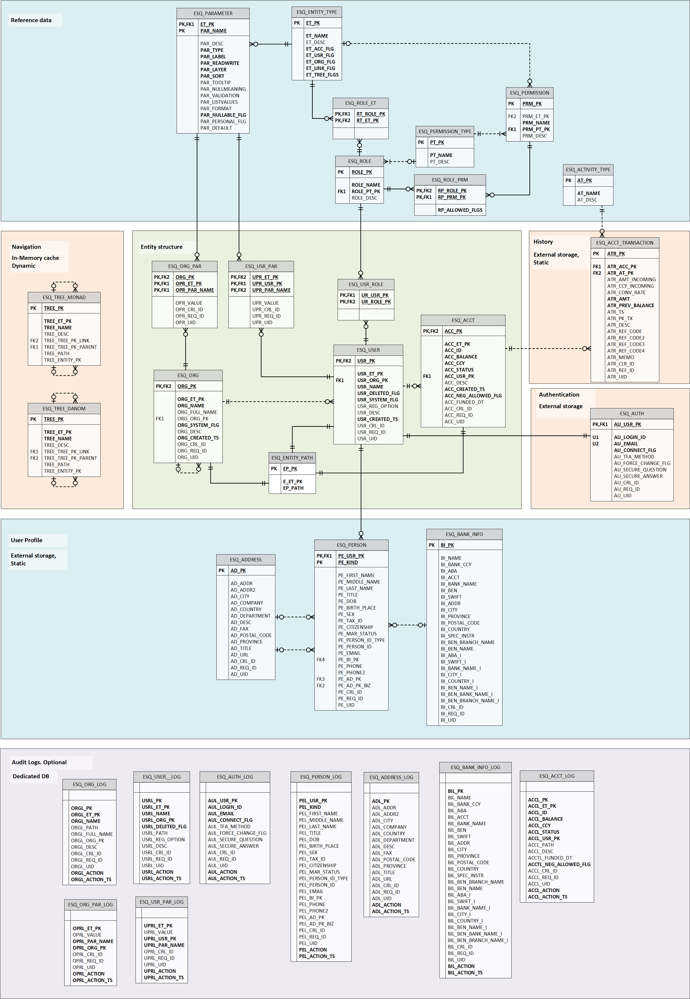

#  Esquire Application Frameworks(tm) 2.0

# Esquire Database Dictionary

Covers all persistent tables in **Esq2025** — the Esquire relational store (Oracle and Postgres).
Does not cover the H2 in-memory cache (ESQ_TREE_MONAD / ESQ_TREE_DANOM), which is documented in the
[Navigation — H2 In-Memory Cache](#7-navigation--h2-in-memory-cache) section below.

Source scripts: `esquire.db.seed / postgres|oracle / create`

---

## Entity Relationship Diagram

---

## Sequences

| Sequence | Start | Used by |
|---|---|---|
| `ESQ_REF_SEQ` | 1 | ESQ_ADDRESS, ESQ_BANK_INFO — profile reference PKs |

`ESQ_ACCT_TRANSACTION.ATR_PK` is a `VARCHAR(64)` UUID generated by the application — no sequence.

---

## Audit Infrastructure

Every entity table carries three audit columns written by the service layer on every mutation:

| Column suffix | Type | Description |
|---|---|---|
| `*_CRL_ID` | VARCHAR(64) | Distributed trace correlation ID (MDC) |
| `*_REQ_ID` | VARCHAR(64) | HTTP request ID (MDC) |
| `*_UID` | VARCHAR(16) | Initiating user ID |

Audit logging is **optional and pluggable** (see
[Esquire.AuditLoggingStack.md](Esquire.AuditLoggingStack.md)). When enabled, each entity table has a matching
`*_LOG` table carrying the same columns plus `*_ACTION VARCHAR(1)` (`I`/`U`/`D`) and `*_ACTION_TS TIMESTAMP`.
Per the chosen audit model the `*_LOG` tables either live **in the entity database** (populated
in-transaction by BRIUD — Before Row Insert/Update/Delete — triggers) or in a **dedicated audit database**
(populated by the application or the xx-rod consumer). When audit is off they are not present at all.

---

## Type Mapping

| Postgres | Oracle |
|---|---|
| `BIGINT` | `NUMBER(16,0)` |
| `INT` | `NUMBER(5,0)` |
| `SMALLINT` | `NUMBER(5,0)` |
| `VARCHAR(n)` | `VARCHAR2(n)` |
| `NUMERIC(p,s)` | `NUMBER(p,s)` |
| `TIMESTAMP DEFAULT CURRENT_TIMESTAMP` | `TIMESTAMP DEFAULT SYS_EXTRACT_UTC(SYSTIMESTAMP)` |
| `DATE` | `DATE` |

---

## Table Groups

1. [Reference Data](#1-reference-data)
2. [Entity Structure](#2-entity-structure)
3. [User Profile](#3-user-profile)
4. [Configuration Parameters](#4-configuration-parameters)
5. [Authentication](#5-authentication)
6. [Roles and Permissions](#6-roles-and-permissions)
7. [Navigation — H2 In-Memory Cache](#7-navigation--h2-in-memory-cache)
8. [Accounting](#8-accounting)
9. [Audit Logs](#9-audit-logs)

---

## 1. Reference Data

Static lookup tables. No audit columns. No BRIUD triggers.

---

### ESQ_ENTITY_TYPE

Kind (entity type) definitions — drives routing, tree placement, UI rendering, and command availability.
Loaded once at startup into `EsqObjectKindStorage`.

Primary key: `ET_PK`

| Column | Postgres | Oracle | Description |
|---|---|---|---|
| ET_PK | INT | NUMBER(5,0) | Entity type code (kind) |
| ET_NAME | VARCHAR(25) | VARCHAR2(25) | Entity type name |
| ET_DESC | VARCHAR(100) | VARCHAR2(100) | Entity type description |
| ET_ACC_FLG | VARCHAR(1) | VARCHAR2(1) | Account kind flag, Y/N |
| ET_USR_FLG | VARCHAR(1) | VARCHAR2(1) | User kind flag, Y/N |
| ET_ORG_FLG | VARCHAR(1) | VARCHAR2(1) | Organization kind flag, Y/N |
| ET_LINK_FLG | VARCHAR(1) | VARCHAR2(1) | Shortcut (link node) flag, Y/N |
| ET_TREE_FLGS | VARCHAR(8) | VARCHAR2(8) | Tree behavior flags: B=in bizTree, T=expandable, b=leaf |

---

### ESQ_PERMISSION_TYPE

Classifies permissions into groups (Admin, Tools, Application, Reports).

Primary key: `PT_PK`

| Column | Postgres | Oracle | Description |
|---|---|---|---|
| PT_PK | INT | NUMBER(5,0) | Permission type code (980=Admin, 982=Tools, 984=App, 986=Reports) |
| PT_NAME | VARCHAR(25) | VARCHAR2(25) | Permission type name |
| PT_DESC | VARCHAR(100) | VARCHAR2(100) | Permission type description |

---

### ESQ_PERMISSION

Individual permission definitions — the granular capabilities assigned to roles.

Primary key: `PRM_PK`  
Foreign keys: `PRM_ET_PK` -> ESQ_ENTITY_TYPE; `PRM_PT_PK` -> ESQ_PERMISSION_TYPE

| Column | Postgres | Oracle | Description |
|---|---|---|---|
| PRM_PK | INT | NUMBER(5,0) | Permission code |
| PRM_NAME | VARCHAR(50) | VARCHAR2(50) | Permission name |
| PRM_DESC | VARCHAR(100) | VARCHAR2(100) | Permission description |
| PRM_ET_PK | INT | NUMBER(5,0) | Entity type where permission applies -> ESQ_ENTITY_TYPE |
| PRM_PT_PK | INT | NUMBER(5,0) | Permission type group -> ESQ_PERMISSION_TYPE |

---

### ESQ_ACTIVITY_TYPE

Account transaction type codes (Deposit, Withdrawal, Transfer).

Primary key: `AT_PK`

| Column | Postgres | Oracle | Description |
|---|---|---|---|
| AT_PK | INT | NUMBER(5,0) | Activity type code |
| AT_NAME | VARCHAR(25) | VARCHAR2(25) | Activity short name |
| AT_DESC | VARCHAR(500) | VARCHAR2(500) | Activity description |

---

## 2. Entity Structure

The three canonical entity tables plus the path satellite. Every row in ESQ_ORG,
ESQ_USER, and ESQ_ACCOUNT has a corresponding row in ESQ_ENTITY_PATH (shared-PK 1-1).

Primary keys are **globally unique across all three entity tables** — no org, user, or
account will ever share a PK value. This is the key invariant that makes the shared-PK
satellite pattern work: any entity PK alone is sufficient to locate its authorization path
in ESQ_ENTITY_PATH without knowing which table it belongs to.

---

### ESQ_ORG

Organization unit. Self-referential — an org can contain other orgs.

Primary key: `ORG_PK`  
Foreign keys:
- `ORG_ORG_PK` -> ESQ_ORG (parent org, nullable — root has no parent)
- `ORG_PK` -> ESQ_ENTITY_PATH (shared-PK, path satellite)

| Column | Postgres | Oracle | Description |
|---|---|---|---|
| ORG_PK | BIGINT | NUMBER(16,0) | Organization primary key |
| ORG_ET_PK | INT | NUMBER(5,0) | Organization kind -> ESQ_ENTITY_TYPE |
| ORG_NAME | VARCHAR(50) | VARCHAR2(50) | Short name |
| ORG_FULL_NAME | VARCHAR(150) | VARCHAR2(150) | Full legal name |
| ORG_ORG_PK | BIGINT | NUMBER(16,0) | Parent organization -> ESQ_ORG (nullable) |
| ORG_DESC | VARCHAR(1024) | VARCHAR2(1024) | Description |
| ORG_SYSTEM_FLG | VARCHAR(1) | VARCHAR2(1) | System entity, protected from deletion, Y/N (DB-set only; never via the app, not on the GUI) |
| ORG_CRL_ID | VARCHAR(64) | VARCHAR2(64) | Correlation ID |
| ORG_REQ_ID | VARCHAR(64) | VARCHAR2(64) | Request ID |
| ORG_UID | VARCHAR(16) | VARCHAR2(16) | Update initiator user ID |

---

### ESQ_USER

User entity — Client, Merchant, Admin, SysAdmin.

Primary key: `USR_PK`  
Foreign keys:
- `USR_ORG_PK` -> ESQ_ORG (owning organization)
- `USR_PK` -> ESQ_ENTITY_PATH (shared-PK, path satellite)

Child tables with ON DELETE CASCADE: ESQ_AUTH, ESQ_PERSON, ESQ_USR_PAR, ESQ_USR_ROLE

| Column | Postgres | Oracle | Description |
|---|---|---|---|
| USR_PK | BIGINT | NUMBER(16,0) | User primary key |
| USR_ET_PK | INT | NUMBER(5,0) | User kind -> ESQ_ENTITY_TYPE |
| USR_NAME | VARCHAR(50) | VARCHAR2(50) | Display name: First M. Last |
| USR_REG_OPTION | VARCHAR(25) | VARCHAR2(25) | Registration option (Single, Joint, Corporation…) |
| USR_ORG_PK | BIGINT | NUMBER(16,0) | Owning organization -> ESQ_ORG |
| USR_DELETED_FLG | VARCHAR(1) | VARCHAR2(1) | Soft-delete flag, Y/N |
| USR_DESC | VARCHAR(1024) | VARCHAR2(1024) | Description |
| USR_SYSTEM_FLG | VARCHAR(1) | VARCHAR2(1) | System entity, protected from deletion, Y/N (DB-set only; never via the app, not on the GUI) |
| USR_CRL_ID | VARCHAR(64) | VARCHAR2(64) | Correlation ID |
| USR_REQ_ID | VARCHAR(64) | VARCHAR2(64) | Request ID |
| USR_UID | VARCHAR(16) | VARCHAR2(16) | Update initiator user ID |

---

### ESQ_ACCOUNT

Money account owned by a user entity.

Primary key: `ACC_PK`  
Unique key: `ACC_ID`  
Foreign keys:
- `ACC_USR_PK` -> ESQ_USER (account owner)
- `ACC_PK` -> ESQ_ENTITY_PATH (shared-PK, path satellite)

Child tables: ESQ_ACCT_TRANSACTION (no cascade — transactions are never deleted)

| Column | Postgres | Oracle | Description |
|---|---|---|---|
| ACC_PK | BIGINT | NUMBER(16,0) | Account primary key |
| ACC_ET_PK | INT | NUMBER(5,0) | Account kind -> ESQ_ENTITY_TYPE |
| ACC_ID | VARCHAR(50) | VARCHAR2(50) | Human-readable account ID (unique) |
| ACC_BALANCE | NUMERIC(16,3) | NUMBER(16,3) | Current balance |
| ACC_CCY | VARCHAR(3) | VARCHAR2(3) | Currency code (default USD) |
| ACC_STATUS | VARCHAR(1) | VARCHAR2(1) | Status: O=Open, C=Closed, L=Locked |
| ACC_USR_PK | BIGINT | NUMBER(16,0) | Owner -> ESQ_USER |
| ACC_DESC | VARCHAR(1024) | VARCHAR2(1024) | Description |
| ACC_FUNDED_DT | DATE | DATE | Date account was first funded |
| ACCT_NEG_ALLOWED_FLG | VARCHAR(1) | VARCHAR2(1) | Negative balance allowed, Y/N |
| ACC_CRL_ID | VARCHAR(64) | VARCHAR2(64) | Correlation ID |
| ACC_REQ_ID | VARCHAR(64) | VARCHAR2(64) | Request ID |
| ACC_UID | VARCHAR(16) | VARCHAR2(16) | Update initiator user ID |

---

### ESQ_ENTITY_PATH

Path satellite — one row per entity (org, user, account). Stores the full tree path string.
Shared-PK 1-1: `EP_PK` holds the same value as the entity's own PK.

Primary key: `EP_PK`

| Column | Postgres | Oracle | Description |
|---|---|---|---|
| EP_PK | BIGINT | NUMBER(16,0) | Entity primary key (equals org_pk / usr_pk / acc_pk) |
| EP_ET_PK | INT | NUMBER(5,0) | Entity kind (equals org_et_pk / usr_et_pk / acc_et_pk) |
| EP_PATH | VARCHAR(4000) | VARCHAR2(4000) | Entity path string (e.g. /1/100/200) |

---

## 3. User Profile

Personal and contact data attached to a user entity.

---

### ESQ_PERSON

Personal details for a user. Composite PK (user + contact kind) allows multiple persons
per user: primary contact (992), secondary contact (994), joint contact (996).

Primary key: `(PE_USR_PK, PE_KIND)`  
Foreign keys:
- `PE_USR_PK` -> ESQ_USER ON DELETE CASCADE
- `PE_AD_PK` -> ESQ_ADDRESS ON DELETE SET NULL
- `PE_AD_PK_BIZ` -> ESQ_ADDRESS ON DELETE SET NULL
- `PE_BI_PK` -> ESQ_BANK_INFO ON DELETE SET NULL

| Column | Postgres | Oracle | Description |
|---|---|---|---|
| PE_USR_PK | BIGINT | NUMBER(16,0) | Reference to user -> ESQ_USER (part of PK) |
| PE_KIND | INT | NUMBER(5,0) | Person kind: 992=Primary, 994=Secondary, 996=Joint (part of PK) |
| PE_FIRST_NAME | VARCHAR(50) | VARCHAR2(50) | First (given) name |
| PE_MIDDLE_NAME | VARCHAR(50) | VARCHAR2(50) | Middle name |
| PE_LAST_NAME | VARCHAR(50) | VARCHAR2(50) | Last (family) name |
| PE_TITLE | VARCHAR(50) | VARCHAR2(50) | Title or honorifics |
| PE_DOB | DATE | DATE | Date of birth |
| PE_BIRTH_PLACE | VARCHAR(50) | VARCHAR2(50) | Birth place |
| PE_SEX | VARCHAR(1) | VARCHAR2(1) | Sex code |
| PE_TAX_ID | VARCHAR(50) | VARCHAR2(50) | Tax ID or SSN |
| PE_CITIZENSHIP | VARCHAR(50) | VARCHAR2(50) | Citizenship country |
| PE_MAR_STATUS | VARCHAR(1) | VARCHAR2(1) | Marital status: S/M/D/P |
| PE_PERSON_ID_TYPE | VARCHAR(50) | VARCHAR2(50) | ID document type (Passport, Driver License…) |
| PE_PERSON_ID_NUMBER | VARCHAR(50) | VARCHAR2(50) | ID document number |
| PE_EMAIL | VARCHAR(50) | VARCHAR2(50) | Email address |
| PE_PHONE | VARCHAR(20) | VARCHAR2(20) | Phone number |
| PE_PHONE2 | VARCHAR(20) | VARCHAR2(20) | Alternative phone number |
| PE_BI_PK | BIGINT | NUMBER(16,0) | Bank information -> ESQ_BANK_INFO |
| PE_AD_PK | BIGINT | NUMBER(16,0) | Personal address -> ESQ_ADDRESS |
| PE_AD_PK_BIZ | BIGINT | NUMBER(16,0) | Business address -> ESQ_ADDRESS |
| PE_CRL_ID | VARCHAR(64) | VARCHAR2(64) | Correlation ID |
| PE_REQ_ID | VARCHAR(64) | VARCHAR2(64) | Request ID |
| PE_UID | VARCHAR(16) | VARCHAR2(16) | Update initiator user ID |

---

### ESQ_ADDRESS

Postal or business address. Referenced by ESQ_PERSON (up to two per person: personal + business).
Allocated from ESQ_REF_SEQ.

Primary key: `AD_PK`

| Column | Postgres | Oracle | Description |
|---|---|---|---|
| AD_PK | BIGINT | NUMBER(16,0) | Address primary key |
| AD_ADDR | VARCHAR(50) | VARCHAR2(50) | Street address line 1 |
| AD_ADDR2 | VARCHAR(50) | VARCHAR2(50) | Street address line 2 |
| AD_CITY | VARCHAR(50) | VARCHAR2(50) | City name |
| AD_COMPANY | VARCHAR(50) | VARCHAR2(50) | Company name (business address) |
| AD_COUNTRY | VARCHAR(50) | VARCHAR2(50) | Country name |
| AD_DEPARTMENT | VARCHAR(50) | VARCHAR2(50) | Department name (business address) |
| AD_DESC | VARCHAR(200) | VARCHAR2(200) | Additional description |
| AD_FAX | VARCHAR(20) | VARCHAR2(20) | Fax number |
| AD_POSTAL_CODE | VARCHAR(20) | VARCHAR2(20) | Zip or postal code |
| AD_PROVINCE | VARCHAR(50) | VARCHAR2(50) | State or province |
| AD_TITLE | VARCHAR(50) | VARCHAR2(50) | Title with company (business address) |
| AD_URL | VARCHAR(50) | VARCHAR2(50) | Internet URL |
| AD_CRL_ID | VARCHAR(64) | VARCHAR2(64) | Correlation ID |
| AD_REQ_ID | VARCHAR(64) | VARCHAR2(64) | Request ID |
| AD_UID | VARCHAR(16) | VARCHAR2(16) | Update initiator user ID |

---

### ESQ_BANK_INFO

Banking details for wire transfer. Referenced by ESQ_PERSON. Includes intermediary bank fields.
Allocated from ESQ_REF_SEQ.

Primary key: `BI_PK`

| Column | Postgres | Oracle | Description |
|---|---|---|---|
| BI_PK | BIGINT | NUMBER(16,0) | Bank info primary key |
| BI_NAME | VARCHAR(50) | VARCHAR2(50) | Bank info entry name |
| BI_BANK_NAME | VARCHAR(250) | VARCHAR2(250) | Bank name |
| BI_BANK_CCY | VARCHAR(10) | VARCHAR2(10) | Bank account currency |
| BI_ABA | VARCHAR(50) | VARCHAR2(50) | ABA routing code |
| BI_SWIFT | VARCHAR(50) | VARCHAR2(50) | SWIFT code |
| BI_ACCT | VARCHAR(50) | VARCHAR2(50) | Account number |
| BI_ADDR | VARCHAR(50) | VARCHAR2(50) | Bank address line |
| BI_CITY | VARCHAR(50) | VARCHAR2(50) | Bank city |
| BI_PROVINCE | VARCHAR(50) | VARCHAR2(50) | Bank province |
| BI_POSTAL_CODE | VARCHAR(16) | VARCHAR2(16) | Bank postal code |
| BI_COUNTRY | VARCHAR(50) | VARCHAR2(50) | Bank country |
| BI_SPEC_INSTR | VARCHAR(255) | VARCHAR2(255) | Special instructions |
| BI_BEN_NAME | VARCHAR(250) | VARCHAR2(250) | Beneficiary name |
| BI_BEN_BANK_NAME | VARCHAR(250) | VARCHAR2(250) | Beneficiary bank name |
| BI_BEN_BRANCH_NAME | VARCHAR(250) | VARCHAR2(250) | Beneficiary bank branch |
| BI_BANK_NAME_I | VARCHAR(250) | VARCHAR2(250) | Intermediary bank name |
| BI_ABA_I | VARCHAR(50) | VARCHAR2(50) | Intermediary bank ABA |
| BI_SWIFT_I | VARCHAR(50) | VARCHAR2(50) | Intermediary bank SWIFT |
| BI_CITY_I | VARCHAR(50) | VARCHAR2(50) | Intermediary bank city |
| BI_COUNTRY_I | VARCHAR(50) | VARCHAR2(50) | Intermediary bank country |
| BI_BEN_NAME_I | VARCHAR(250) | VARCHAR2(250) | Intermediary beneficiary name |
| BI_BEN_BANK_NAME_I | VARCHAR(250) | VARCHAR2(250) | Intermediary beneficiary bank |
| BI_BEN_BRANCH_NAME_I | VARCHAR(250) | VARCHAR2(250) | Intermediary beneficiary branch |
| BI_CRL_ID | VARCHAR(64) | VARCHAR2(64) | Correlation ID |
| BI_REQ_ID | VARCHAR(64) | VARCHAR2(64) | Request ID |
| BI_UID | VARCHAR(16) | VARCHAR2(16) | Update initiator user ID |

---

## 4. Configuration Parameters

Server-driven UI configuration. ESQ_PARAMETER defines field metadata per entity kind.
ESQ_USR_PAR and ESQ_ORG_PAR store the actual values per entity instance.

---

### ESQ_PARAMETER

Field definitions for entity forms — drives the server-driven UI. One row = one field
in one entity kind's dialog. The frontend reads these at runtime; no field layout is
hardcoded in the Angular application.

Primary key: `(PAR_NAME, PAR_ET_PK)`  
Foreign key: `PAR_ET_PK` -> ESQ_ENTITY_TYPE

| Column | Postgres | Oracle | Description |
|---|---|---|---|
| PAR_ET_PK | INT | NUMBER(5,0) | Entity kind this parameter belongs to -> ESQ_ENTITY_TYPE |
| PAR_NAME | VARCHAR(25) | VARCHAR2(25) | Parameter name (field key) |
| PAR_DESC | VARCHAR(50) | VARCHAR2(50) | Parameter description |
| PAR_TYPE | VARCHAR(25) | VARCHAR2(25) | Value type: STRING, NUMBER, DATE, DATETIME, LIST, IMAGE, HREF |
| PAR_LABEL | VARCHAR(25) | VARCHAR2(25) | UI field label |
| PAR_READWRITE | SMALLINT | NUMBER(5,0) | Access bitmap: 0=hidden, 1=read-only, 3=editable |
| PAR_LAYER | INT | NUMBER(5,0) | UI tab number |
| PAR_SORT | INT | NUMBER(5,0) | Display order within tab |
| PAR_TOOLTIP | VARCHAR(50) | VARCHAR2(50) | Field tooltip text |
| PAR_NULLMEANING | VARCHAR(50) | VARCHAR2(50) | Display text when value is null |
| PAR_NULLABLE_FLG | VARCHAR(1) | VARCHAR2(1) | Value can be null, Y/N |
| PAR_DEFAULT | VARCHAR(4000) | VARCHAR2(4000) | Default value expression |
| PAR_VALIDATION | VARCHAR(512) | VARCHAR2(512) | Validation rule, regex syntax |
| PAR_LISTVALUES | VARCHAR(4000) | VARCHAR2(4000) | Dropdown list options |
| PAR_FORMAT | VARCHAR(4000) | VARCHAR2(4000) | Format string for NUMBER/DATETIME; alt text for IMAGE; link text for HREF |
| PAR_PERSONAL_FLG | VARCHAR(1) | VARCHAR2(1) | Owner-editable flag, Y/N |

---

### ESQ_USR_PAR

User entity parameter values — actual field values for a specific user instance.

Primary key: `(UPR_USR_PK, UPR_PAR_NAME, UPR_PAR_ET_PK)`  
Unique key: `(UPR_USR_PK, UPR_PAR_NAME)`  
Foreign keys:
- `UPR_USR_PK` -> ESQ_USER ON DELETE CASCADE
- `(UPR_PAR_NAME, UPR_PAR_ET_PK)` -> ESQ_PARAMETER

| Column | Postgres | Oracle | Description |
|---|---|---|---|
| UPR_USR_PK | BIGINT | NUMBER(16,0) | User -> ESQ_USER |
| UPR_PAR_NAME | VARCHAR(25) | VARCHAR2(25) | Parameter name -> ESQ_PARAMETER |
| UPR_PAR_ET_PK | INT | NUMBER(5,0) | Entity kind -> ESQ_PARAMETER |
| UPR_VALUE | VARCHAR(4000) | VARCHAR2(4000) | Parameter value |
| UPR_CRL_ID | VARCHAR(64) | VARCHAR2(64) | Correlation ID |
| UPR_REQ_ID | VARCHAR(64) | VARCHAR2(64) | Request ID |
| UPR_UID | VARCHAR(16) | VARCHAR2(16) | Update initiator user ID |

---

### ESQ_ORG_PAR

Organization parameter values — actual field values for a specific org instance.

Primary key: `(OPR_ORG_PK, OPR_PAR_NAME, OPR_PAR_ET_PK)`  
Unique key: `(OPR_ORG_PK, OPR_PAR_NAME)`  
Foreign keys:
- `OPR_ORG_PK` -> ESQ_ORG ON DELETE CASCADE
- `(OPR_PAR_NAME, OPR_PAR_ET_PK)` -> ESQ_PARAMETER

| Column | Postgres | Oracle | Description |
|---|---|---|---|
| OPR_ORG_PK | BIGINT | NUMBER(16,0) | Organization -> ESQ_ORG |
| OPR_PAR_NAME | VARCHAR(25) | VARCHAR2(25) | Parameter name -> ESQ_PARAMETER |
| OPR_PAR_ET_PK | INT | NUMBER(5,0) | Entity kind -> ESQ_PARAMETER |
| OPR_VALUE | VARCHAR(4000) | VARCHAR2(4000) | Parameter value |
| OPR_CRL_ID | VARCHAR(64) | VARCHAR2(64) | Correlation ID |
| OPR_REQ_ID | VARCHAR(64) | VARCHAR2(64) | Request ID |
| OPR_UID | VARCHAR(16) | VARCHAR2(16) | Update initiator user ID |

---

## 5. Authentication

---

### ESQ_AUTH

User credentials and Keycloak connection state. One row per user (1-1 with ESQ_USER).
keySmith reads and writes this table; kcMaster syncs the state to Keycloak asynchronously.

Primary key: `AU_USR_PK`  
Unique keys: `AU_LOGIN_ID`, `AU_EMAIL`  
Foreign key: `AU_USR_PK` -> ESQ_USER ON DELETE CASCADE

| Column | Postgres | Oracle | Description |
|---|---|---|---|
| AU_USR_PK | BIGINT | NUMBER(16,0) | User primary key -> ESQ_USER (also the PK) |
| AU_CONNECT_FLG | VARCHAR(1) | VARCHAR2(1) | Login allowed flag, Y/N |
| AU_LOGIN_ID | VARCHAR(50) | VARCHAR2(50) | Keycloak username (loginId) |
| AU_EMAIL | VARCHAR(50) | VARCHAR2(50) | Authentication email address |
| AU_TFA_METHOD | VARCHAR(1) | VARCHAR2(1) | Two-factor method: N=none, G=Google TOTP |
| AU_FORCE_CHANGE_FLG | VARCHAR(1) | VARCHAR2(1) | Force password change on next login, Y/N |
| AU_SECURITY_QUESTION | VARCHAR(512) | VARCHAR2(512) | Security question (reserved) |
| AU_SECURITY_ANSWER | VARCHAR(512) | VARCHAR2(512) | Security answer (reserved) |
| AU_CRL_ID | VARCHAR(64) | VARCHAR2(64) | Correlation ID |
| AU_REQ_ID | VARCHAR(64) | VARCHAR2(64) | Request ID |
| AU_UID | VARCHAR(16) | VARCHAR2(16) | Update initiator user ID |

---

## 6. Roles and Permissions

Role-based access control. A role groups permissions and is scoped to entity kinds.
Users are assigned roles through ESQ_USR_ROLE.

---

### ESQ_ROLE

Named role — groups a set of permissions under a permission type (Admin, Tools, etc.).

Primary key: `ROLE_PK`  
Unique key: `ROLE_NAME`  
Foreign key: `ROLE_PT_PK` -> ESQ_PERMISSION_TYPE

| Column | Postgres | Oracle | Description |
|---|---|---|---|
| ROLE_PK | INT | NUMBER(5,0) | Role primary key |
| ROLE_PT_PK | INT | NUMBER(5,0) | Permission type: 980=Admin, 982=Tools -> ESQ_PERMISSION_TYPE |
| ROLE_NAME | VARCHAR(32) | VARCHAR2(32) | Unique role name (upper case) |
| ROLE_DESC | VARCHAR(100) | VARCHAR2(100) | Role description |

---

### ESQ_ROLE_PRM

Many-to-many: role to permission assignments with per-permission flag set.

Primary key: `(RP_ROLE_PK, RP_PRM_PK)`  
Foreign keys: `RP_ROLE_PK` -> ESQ_ROLE; `RP_PRM_PK` -> ESQ_PERMISSION

| Column | Postgres | Oracle | Description |
|---|---|---|---|
| RP_ROLE_PK | INT | NUMBER(5,0) | Role -> ESQ_ROLE |
| RP_PRM_PK | INT | NUMBER(5,0) | Permission -> ESQ_PERMISSION |
| RP_ALLOWED_FLGS | VARCHAR(32) | VARCHAR2(32) | Comma-separated Y/N flags per permission bit |

---

### ESQ_ROLE_ET

Many-to-many: role to entity type scope — defines which entity kinds a role applies to.

Primary key: `(RT_ROLE_PK, RT_ET_PK)`  
Foreign keys: `RT_ROLE_PK` -> ESQ_ROLE; `RT_ET_PK` -> ESQ_ENTITY_TYPE

| Column | Postgres | Oracle | Description |
|---|---|---|---|
| RT_ROLE_PK | INT | NUMBER(5,0) | Role -> ESQ_ROLE |
| RT_ET_PK | INT | NUMBER(5,0) | Entity kind scope -> ESQ_ENTITY_TYPE |

---

### ESQ_USR_ROLE

Many-to-many: user to role assignments.

Primary key: `(UR_ROLE_PK, UR_USR_PK)`  
Foreign keys:
- `UR_ROLE_PK` -> ESQ_ROLE
- `UR_USR_PK` -> ESQ_USER ON DELETE CASCADE

| Column | Postgres | Oracle | Description |
|---|---|---|---|
| UR_ROLE_PK | INT | NUMBER(5,0) | Role -> ESQ_ROLE |
| UR_USR_PK | BIGINT | NUMBER(16,0) | User -> ESQ_USER |

---

## 7. Navigation — H2 In-Memory Cache

Under the **bizTree** service's embedded, memory-only H2 database the entity tree is held in
**two equal tables — `ESQ_TREE_MONAD` and `ESQ_TREE_DANOM`**.See [H2BizTree.md](H2BizTree.md) for more details.

### ESQ_TREE_MONAD / ESQ_TREE_DANOM

In-memory entity tree cache (both monad tables share this schema). Every node is one row, linked
to its parent by `TREE_TREE_PK_PARENT` (the tree edge; null for the root). Link nodes (shortcuts)
additionally carry a `TREE_TREE_PK_LINK` reference pointing to the canonical node.

Primary key: `TREE_PK`  
Indexes: `TREE_TREE_PK_PARENT`, `TREE_ENTITY_PK`

| Column | H2 Type | Description |
|---|---|---|
| TREE_PK | VARCHAR(33) | Node primary key (composite: kind-prefix + entity PK) |
| TREE_ET_PK | INTEGER | Entity kind code |
| TREE_NAME | VARCHAR(50) | Display name |
| TREE_DESC | VARCHAR(1024) | Description |
| TREE_TREE_PK_PARENT | VARCHAR(33) | Parent node PK (null for root) |
| TREE_TREE_PK_LINK | VARCHAR(33) | Canonical node PK for shortcut nodes (null for canonical nodes) |
| TREE_ENTITY_PK | BIGINT | Persistent store entity PK (null for virtual folder nodes) |
| TREE_LEVEL | INTEGER | Depth in tree (root = 0) |
| TREE_PATH | VARCHAR(2000) | Navigation path (PK chain from root) |
| TREE_ENTITY_PATH | VARCHAR(2000) | Entity path from ESQ_ENTITY_PATH (for visibility scoping) |
| TREE_STATUS | INTEGER | Status code: 0=default, 1=open/active, 2=locked |

---

## 8. Accounting

---

### ESQ_ACCT_TRANSACTION

Immutable ledger of all account operations. Every deposit, withdrawal, and transfer
leg is one row. Transfers are linked by a shared `ATR_PK_TX` UUID.

Primary key: `ATR_PK` (UUID VARCHAR, application-generated)  
Foreign keys:
- `ATR_ACC_PK` -> ESQ_ACCOUNT (no cascade — transactions are permanent)
- `ATR_AT_PK` -> ESQ_ACTIVITY_TYPE

| Column | Postgres | Oracle | Description |
|---|---|---|---|
| ATR_PK | VARCHAR(64) | VARCHAR2(64) | Transaction primary key (UUID) |
| ATR_PK_TX | VARCHAR(64) | VARCHAR2(64) | Transfer cross-reference PK; shared by both legs of a transfer |
| ATR_ACC_PK | BIGINT | NUMBER(16,0) | Account -> ESQ_ACCOUNT |
| ATR_AT_PK | INT | NUMBER(5,0) | Activity type -> ESQ_ACTIVITY_TYPE |
| ATR_AMT_INCOMING | NUMERIC(16,3) | NUMBER(16,3) | Incoming amount before conversion (cross-currency transfers) |
| ATR_CCY_INCOMING | VARCHAR(3) | VARCHAR2(3) | Incoming currency code |
| ATR_CONV_RATE | NUMERIC(12,6) | NUMBER(12,6) | Conversion rate applied (incoming / posted) |
| ATR_AMT | NUMERIC(16,3) | NUMBER(16,3) | Amount posted to account (positive = credit, negative = debit) |
| ATR_PREV_BALANCE | NUMERIC(16,3) | NUMBER(16,3) | Account balance immediately before this transaction |
| ATR_TS | TIMESTAMP | TIMESTAMP | Transaction timestamp |
| ATR_DESC | VARCHAR(512) | VARCHAR2(512) | Transaction description |
| ATR_REF_CODE | VARCHAR(512) | VARCHAR2(512) | Reference code 1 |
| ATR_REF_CODE2 | VARCHAR(512) | VARCHAR2(512) | Reference code 2 |
| ATR_REF_CODE3 | VARCHAR(512) | VARCHAR2(512) | Reference code 3 |
| ATR_REF_CODE4 | VARCHAR(512) | VARCHAR2(512) | Reference code 4 |
| ATR_MEMO | VARCHAR(512) | VARCHAR2(512) | Free-text memo |
| ATR_CRL_ID | VARCHAR(64) | VARCHAR2(64) | Correlation ID |
| ATR_REQ_ID | VARCHAR(64) | VARCHAR2(64) | Request ID |
| ATR_UID | VARCHAR(16) | VARCHAR2(16) | Initiating user ID |

---

## 9. Audit Logs

One log table per entity table. **Optional** — present only when audit logging is enabled, and located
either in the entity database or in a dedicated audit database depending on the chosen audit model (see
[Esquire.AuditLoggingStack.md](Esquire.AuditLoggingStack.md)). Populated either by BRIUD triggers — before
every insert, update, or delete the trigger copies the row into the log table with an action code and a
timestamp, in the same transaction — or, in the decoupled models, by the application or the xx-rod consumer.

Each log table mirrors all columns of its source table (with a log-specific prefix)
plus two additional columns:

| Column | Postgres | Oracle | Description |
|---|---|---|---|
| `*_ACTION` | VARCHAR(1) | VARCHAR2(1) | Trigger action: I=Insert, U=Update, D=Delete |
| `*_ACTION_TS` | TIMESTAMP | TIMESTAMP DEFAULT SYS_EXTRACT_UTC(SYSTIMESTAMP) | Timestamp of the triggering statement |

Log tables have no primary key constraint and no foreign keys.

---

### ESQ_USER_LOG

Mirrors ESQ_USER. Prefix `USRL_`. Additional: `USRL_PATH VARCHAR(512)` — entity path
snapshot captured at the time of the write (not stored in ESQ_USER itself, which uses
the ESQ_ENTITY_PATH satellite).

---

### ESQ_AUTH_LOG

Mirrors ESQ_AUTH. Prefix `AUL_`.

---

### ESQ_ORG_LOG

Mirrors ESQ_ORG. Prefix `ORGL_`. Additional: `ORGL_PATH VARCHAR(512)` — path snapshot.

---

### ESQ_ACCOUNT_LOG

Mirrors ESQ_ACCOUNT. Prefix `ACCL_`. Additional: `ACCL_PATH VARCHAR(512)` — path snapshot.

---

### ESQ_PERSON_LOG

Mirrors ESQ_PERSON. Prefix `PEL_`.

---

### ESQ_ADDRESS_LOG

Mirrors ESQ_ADDRESS. Prefix `ADL_`.

---

### ESQ_BANK_INFO_LOG

Mirrors ESQ_BANK_INFO. Prefix `BIL_`.

---

### ESQ_USR_PAR_LOG

Mirrors ESQ_USR_PAR. Prefix `UPRL_`.

---

### ESQ_ORG_PAR_LOG

Mirrors ESQ_ORG_PAR. Prefix `OPRL_`.

---

*Esquire Frameworks(tm) 2.0 — mir0n&co — mir0n.the.programmer@gmail.com*
