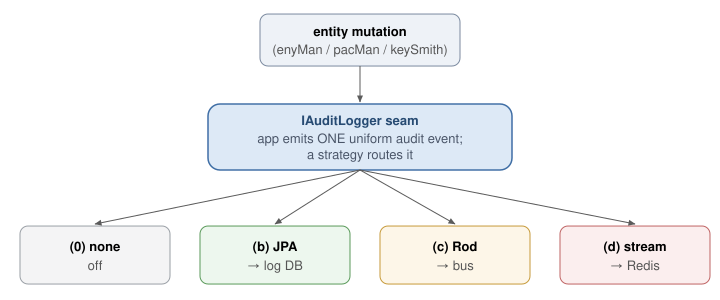
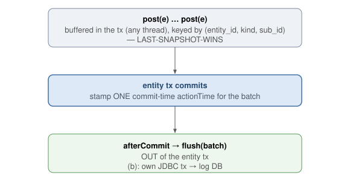
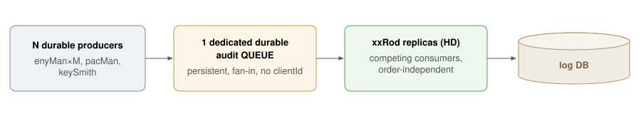

<table style="width: 100%; table-layout: fixed;">
  <tr>
    <td style="width: 12%"></td>
    <td style="width: 88%;">
       <h1>Esquire Application Frameworks(tm) 2.0</h1>
    </td>
  </tr>
</table>

# Esquire Audit Logging Stack

## At a glance

Every business mutation (create / update / delete / move) must leave an audit trail — *who changed what,
when, from what to what*. The traditional OLTP answer is **DB triggers** — the row-level shadow-table
pattern audit trails have historically come from. Esquire treats audit as a **pluggable concern**: one seam
in the services, several interchangeable strategies behind it, each picked by configuration so a deployment
chooses the trade-off that fits its environment.

**Options:** **(0)** persist nothing · **(a)** DB triggers · **(b)** in-process write · **(c)** bus → a
standalone `auKeep` consumer → SQL · **(d)** Redis Stream (the stream *is* the log) · **(e)** log-based CDC
(out of framework scope). Both broadcast options also run over **Kafka** instead of ActiveMQ: **(c-k)**
`service → Kafka → auKeep → SQL`, and **(d-k)** `service → Kafka → Kafka Connect Redis sink → Redis`.

**These live at two separate levels, and they are not the same switch:**
- **At the database level** (option **a**, DB triggers) — *not* a service setting at all. Triggers are part
  of the **database setup** (the trigger DDL applied to the DB); the services stay out of it.
- **At the service level** (options **b / c / d**) — a service's own config turns audit on, and it runs
  over the **Messaging Bus**. Even the in-process option (b) is a bus leg: instead of fanning the event out
  over a wire, it hooks it straight to a datasource and writes the `*_log` there. So "audit on a service"
  always means a bus x-rod, wire or not.

**The framework default is (0) — persist nothing** (all disabled; only the INFO request log). A fresh
deploy with no audit config imposes no audit. Each **deployment then configures a topology** on top of that
baseline, chosen for footprint / monitoring needs, *not* performance:
- **Dev (Docker + local k8s) → (c) bus → auKeep over ActiveMQ, with the async publisher pool**
  (`publisher-pool.size=4`), selected by **`AUDIT_BUS_ID=audit-c`**. Reason: **minimum external images** —
  ActiveMQ is **already in the stack** (the entity-broadcast bus runs on it), so (c) adds **no new external
  image**, only auKeep as an app pod; (d) would pull in Redis, Kafka a broker + Connect. The two dev
  environments run the **identical** topology so the GitHub Actions deploy scripts stay consistent; the async
  pool (not the single sync publisher) avoids the saturation tail (§8).
- **OKE → (a) DB triggers.** On the Always-Free tier the goal is an **always-on, zero-extra-pod** way to
  **monitor user activity** for the demo: triggers live in the DB (the app producers stay OFF), so there is
  no auKeep pod and no extra broker audit traffic — OKE is a demo, not a load-test sandbox. (The trigger DDL
  is applied to the OKE postgres.)

Every other topology is a config flip (plus its own infra) away. Note: (c) is actually the *heaviest* on the
request path (§8) — these are footprint / monitoring choices, never cost.

**Headline cost finding:** at the request level audit is **cheap to free** in every mode, with a clear best
and worst.
- **Best (cheapest on the request path): (d) Redis** — effectively free (its direct `XADD` out-drains the
  feed worker), on par with audit-off and (a) triggers (which are unmeasurable end-to-end). (b) in-process
  is close behind (light).
- **Worst: (c) bus → auKeep with a single *synchronous* publisher** (`publisher-pool.size=0`) — the one
  mode that **saturates under high load** (one broker round-trip per event caps the rate; p99 spikes). This
  is exactly why the (c) **default uses the async publisher pool** instead — the pool removes the
  saturation, and (c)'s real payoff is **offload** (the `*_log` writes leave the business DB/JVM entirely).

The real reason to move off triggers is **write offload + transactional independence**, not request latency.

---

## 1. Why — the problem

Triggers work, but they pin the audit trail **inside the live operational database** — and *that*, not the
trigger code, is the real cost:

- **Operational burden on the production DB (the core con).** Every mutation writes a second row into the
  *operational* store, kept forever — so audit growth becomes **continuous DBA work on the live database**:
  watching and clearing the active tablespace, partitioning the log tables, managing retention. There is no
  separate place to offload or age the data into. It bites hardest when the DB runs as a **pod with bounded
  storage** (self-run / Always-Free), where the write amplification simply fills finite space.
- **In-transaction coupling** — the audit INSERT rides the mutation's own transaction, so an audit-side
  failure (full tablespace, constraint violation) can roll back the *real* operation, and it lengthens
  lock-hold time.
- **Hard to evolve** — changing the audit shape means a schema migration on the live DB.

Note what is **not** on this list. The Oracle/Postgres **trigger-dialect difference**, and the fact the
trigger **logic lives in two places**, are a *one-time* write kept in the seed — **not a real problem**.
Nor is "hidden / invisible to the service code": out-of-band auditing is equally true of CDC (e) and of the
decoupled bus options (c/d) — and of the entity-broadcast bus itself — which all treat publisher-blind
decoupling as a *feature*. The honest case against triggers is the **operational / space burden of keeping
audit *in* the live DB**; the case for moving it off (b/c/d) is **write offload + transactional
independence**, not request latency (§8).

Triggers are not thrown away. Audit is **one seam with interchangeable strategies** — triggers become
*one* option, not *the* option.

---

## 2. The design seam

The app-side outcomes — **0** (no store), **b**, **c**, **d** — sit behind a single audit-logging strategy
(an `IAuditLogger`-style SPI), selected by configuration / Spring profile. The database-side options — **a**
triggers and **e** CDC — capture *below* the app and never touch the seam. This is the same shape Esquire
already uses for swappable concerns (the Taijitu cache behind `IBizTreeCacheRepository`, TokenRelay
strategies behind one filter). The entity services emit a uniform **audit event** and stay ignorant of
where it lands.



*(a) DB triggers and (e) CDC capture **below** the app (in the DB / redo log) — they never touch the seam.*

(0) persists nothing (the change is still broadcast on the entity bus and traceable on the per-leg msg-audit
log; request-level INFO logging is the only standing trace). The others persist it. Because the change is
already broadcast, **(c) is simply (0) plus an auKeep consumer that lands it in SQL**.

When audit is OFF the audit bus resolves to the **`XRodDisabled`** no-op x-rod — the default x-rod when a bus
is unconfigured.

---

## 3. What — the options

Two questions, in order. **First — do you persist a data-delta audit at all?** Option **0** says no.
**If yes — how?** Options **a–e** span *tightly coupled / synchronous / same DB* to *decoupled /
asynchronous / separate store / non-SQL*.

### 0) No audit store — *"persist nothing"* (baseline)
- **Where:** nowhere. The change rides the existing entity-broadcast bus; nothing persists it for audit.
- **Visibility:** at **INFO**, the existing request IN/OUT logging records every operation at the request
  boundary (who called which command, when) — trail enough for many deployments. Per-leg message-audit detail
  goes to the separate **msg-audit** channel (§A.5), to trace the bus. We deliberately do **not** INFO-log
  update payloads (floods logs; a log line is not a queryable, retained record).
- **+** zero audit cost and coupling; removes trigger write-amplification outright.
- **–** no SQL-queryable record of *what changed*, no retention beyond the log pipeline.
- **Stance:** the no-store baseline and the natural first build step — get the decoupled change event
  flowing, then (c) adds the SQL sink when a real audit trail is needed.

### a) Local Sync Logging — *"in place, in transaction"*
- **Where:** log tables in the **same** operational DB. **Filled by** DB triggers, synchronously, inside
  the mutation's transaction.
- **+** strongest integrity (the audit row commits atomically; cannot be lost or bypassed); zero app code.
- **–** write amplification + the **operational burden** on the live DB (tablespace cleanup, partitioning,
  retention — continuous DBA work; finite space when the DB is a pod); the audit INSERT shares the
  mutation's transaction. (Dialect-specific trigger code is a one-time seed write, not the real con.)
- **Use when:** integrity is paramount and the operational DB has headroom + DBA care.
- **The triggers write the change number too**, taking it from the row being written — and on a delete, the
  row's number **plus one**, so the delete record continues that row's history rather than repeating its
  last number. That is what keeps a trigger-written trail and a bus-written trail the same shape.

### b) Local Async Logging — *"off the hot path, still ours"*
- **Where:** log tables in a **separate log DB**. **Filled by** the originating service, asynchronously
  over JDBC — after commit, the in-process **`XRodInProcess`** x-rod (rod-class on a service-level leg) feeds
  each record to its worker pool, which runs the audit keep applier to write the `*_log` table. The applier's
  pool is either DEDICATED (its own auto-commit Hikari pool, the default -- can target a different DB/dialect) or
  SHARED (`datasource.shared=true` -> reuses the service's own datasource pool); either way the keep reads its SQL
  dialect from the database URL (`jdbc:postgresql...` -> Postgres, `jdbc:oracle...` -> Oracle) and the writes run
  outside any Spring transaction. Selected by **`AUDIT_BUS_ID=audit-b`**.
- **+** removes write pressure from the operational DB and the request hot path; the service keeps the
  audit logic in plain Java; no new infrastructure or deployable.
- **–** the write leaves the mutation's transaction (a crash in the commit→write gap can drop a row unless
  backed by an outbox); each service grows a small queue + pool.
- **Stance:** *possible, not recommended* — mostly a stepping-stone toward an async stream. Since the
  trigger is invisible end-to-end (§8), moving the write into the service only spends app CPU + a second
  connection for no real gain.

### c) Distributed Logging — *"auKeep"* (the in-framework decoupled option)
- **Where:** log tables in the log DB. **Filled by** the **auKeep** consumer — the service's `XRod` producer
  posts the event to the audit bus (ActiveMQ queue under `audit-c`, Kafka topic under `audit-ck`); the
  standalone auKeep consumes it and owns the log-DB write. Selected by `AUDIT_BUS_ID=audit-c` (or
  `audit-ck` for Kafka).
- **+** full decoupling — the entity services carry no JPA or log-DB dependency, they just publish; the
  audit pipeline is its own independently-deployable, scalable concern and can fan out to many sinks;
  the only decoupled option that can be hardened to **zero-loss** (§5).
- **–** more moving parts; eventual consistency; the consumer needs throughput headroom (§4 pool).
- **Stance:** *the* decoupled-but-still-SQL option, and the one we would actually build — RDBMS log storage
  via messaging over the bus we already run; no Kafka or Debezium required (though Kafka is a swap-in, §6).
  **This is the dev-deploy topology (Docker + local k8s), with the async pool** — over the framework's (0)
  baseline (§7).

### d) Streamed Doc DB Logging — *"new fashion"* (Redis)
- **Where:** a non-SQL append-only store — **Redis Streams**. **Filled by** the `XRod` producer (producer-
  only, no receive leg) XADD-ing each committed event straight to a stream via the Redis transport provider —
  **the stream IS the audit log**, so there is no auKeep consumer (read with `XRANGE`); consumer groups can
  fan out later. Selected by `AUDIT_BUS_ID=audit-d` (the Kafka-log variant is `audit-dk`).
- **+** schema-flexible, very high write throughput, native streaming; cheapest on the request path (§8).
- **–** new infrastructure (Redis); eventual consistency; ad-hoc *relational* audit queries ("who changed
  entity X, ranges by user") are answered more directly by the SQL `*_log` of (b)/(c).
- **Streams, not RedisJSON:** a Stream matches the append-only trail and stays portable to managed
  Redis/Valkey (OCI Cache ships core only, no modules); RedisJSON/RediSearch would lock us to self-hosting
  (explored locally — `research/RedisJSON-local.md`, `research/Redis-on-OCI.md`).
- **No native partitioning:** a stream is a single key on one node. To scale out you shard at the
  application level (N stream keys routed by `hash(entityId)`); order is preserved only within each stream.
  For our volume a single stream is ample. This DIY-partitioning is exactly where Kafka differs.

### e) Log-based CDC — *"capture from the redo log, outside the framework"*
- **Where:** any sink. **Filled by** the DB's own transaction log — a CDC connector (Debezium on the
  Postgres WAL, Oracle LogMiner on redo) tails the log the DB already writes.
- **+** zero write-amplification on the operational path (reads redo the DB already produces); no app CPU.
- **–** raw row diffs, not semantic events; external infra + ongoing ops (slot/lag monitoring, schema
  evolution); cannot see app-level crl/req/uid.
- **Stance:** **out of framework scope** — a DBA / tooling concern. Listed for completeness as the "free"
  async alternative; we are not implementing it.

### Kafka as the audit transport (a transport for (c)/(d), not a new option)
Kafka can stand in for ActiveMQ under **(c)** (`service → Kafka → auKeep`) and front Redis under **(d)**
(`service → Kafka → Kafka Connect Redis sink → Redis`) — a **transport swap, not a new option**. Its draws
are native, declarative **partitioning** (parallelism + per-key ordering, auto-distributed across brokers)
and **multi-sink fan-out** (one topic, many consumer groups) — the axes where Kafka is structurally stronger
than Redis Streams (DIY partitioning) and the ActiveMQ queue (not a partitioned log). Full treatment, incl.
the BUILT (c-k) path and the consumer model, in **§6**.

### Comparison

| Option | Store | Filled by | Sync? | New infra | Integrity | Decoupling |
|---|---|---|---|---|---|---|
| **0** No store | none (request INFO log) | nothing — broadcast + msg-audit | n/a | none | none (request-level) | high |
| **a** Local Sync | operational DB | DB triggers | sync | none | highest | lowest |
| **b** Local Async | log DB | originating service (JDBC) | async | log DB | high (outbox) | medium |
| **c** Distributed (auKeep) | log DB | auKeep consumer (bus) | async | log DB + Rod | medium (zero-loss-capable) | high |
| **d** Streamed Doc | Redis | producer XADD | async | Redis | medium | highest |
| **e** Log-based CDC | any sink | DB redo log (Debezium/LogMiner) | async | connector + stream + sink | medium | highest |

**Whose decision this is.** The framework's responsibility ends at **emitting the change event** and
logging each operation at the request boundary. *Whether and how to persist an audit trail is the deploying
user's decision*, sized to their compliance / reporting / retention needs. Esquire ships the mechanism and
a sensible default — not a mandate.

---

## A. On the Messaging Bus

Audit runs on the **Messaging Bus** — a declarative bus catalog with a per-vendor transport SPI. There is no
audit-specific producer/consumer wiring and no hard-coded `transport=activemq|kafka` switch: an option is
selected by **bus-id**, and the wire vendor is a swappable module the framework never names — (b) in-process,
(c) bus, (d) redis, plus the Kafka variants. Everything below is the bus, seen from the audit sink. For the
bus itself, see [Esquire.MessagingBus.md](Esquire.MessagingBus.md).

The bus itself — the access point (x-rod) and its two legs, the rod-class catalogue, the topology-file
shape, the transport SPI and drivers, and the message logging channel — is **not audited-specific and is not
described here**. It is the [Messaging Bus](Esquire.MessagingBus.md). This section is only what the **audit
sink** adds on top of it.

### A.1 The audit sink is one bus leg

Audit reaches the bus the same way any participant does: it takes a per-leg **access point** (an x-rod) from
the bus for its leg. Nothing about the access point, its transmit/receive legs, or the rod-class model is
audit's — see [Esquire.MessagingBus.md](Esquire.MessagingBus.md#the-x-rod-engine-axrod-and-the-two-legs).
The audit legs use three of the bus's rod-classes:

| Audit leg | Bus rod-class | Ends on |
|---|---|---|
| producer (options c / ck / d / dk) and the auKeep receiver | the standard transceiver | a broker / topic / stream |
| in-process (option b) | the in-process rod-class | a datasource — no wire; writes the `*_log` directly |
| audit off (option 0) | the disabled (no-op) rod-class | nothing |

### A.2 Selecting the audit sink — `AUDIT_BUS_ID`

Audit picks its sink by **bus-id**, one env var: the audit entry binds `{ bus-id: ${AUDIT_BUS_ID}, slot-id:
audit }`. `AUDIT_BUS_ID` names which catalog bus the producer (and the auKeep) uses — `audit-b` / `audit-c` /
`audit-ck` / `audit-d` / `audit-dk`, or unset → the disabled rod-class (option 0). Docker and k8s default to
`audit-c`; the code default in `application.yml` is `audit-b`. The in-process (b) leg lives in the service's
own catalog overlay, because its keep datasource is service-specific. How a catalog is written, unioned and
loaded is the bus's — see
[Esquire.MessagingBus.md](Esquire.MessagingBus.md#configuration-and-the-parameter-model).

The one logical audit destination is **`esquire.rod.audit`**; the leg's driver maps it to a queue / topic /
stream, and vendor knobs pass through `transport.params` (e.g. `jms.useAsyncSend`, a Kafka `group-id`, a
Redis `max-len`) — the driver model itself is the bus's.

### A.3 Reading a `UA` event in the message log

The bus's per-leg message log (a `TX`/`RX` line per hop) shows the audit event under `msgType` **`UA`**: it
logs `TX` on the producer leg and, for the `audit-c` / `audit-ck` buses, `RX` again on the auKeep leg; the
producer-only buses (`audit-d` / `audit-dk`) log only `TX`. The channel itself — its per-leg naming, format
and routing — is the bus's, see [Esquire.MessagingBus.md](Esquire.MessagingBus.md#logging).

---

## 4. Architecture — where & how

### 4.1 On the Messaging Bus — the audit sink

Audit runs on the **Messaging Bus**. A service does not open a broker connection or a datasource of its own
for audit; it asks the bus for the audit leg and relays committed changes through it. The bus is the whole
mechanism — the bus catalog names the audit leg, the transport driver carries the wire, and the same access
point works whether the leg ends on a broker, a stream, or a local datasource.

The bus's per-leg access point is the **x-rod** (**Rod = RoD = Relay of Data**). It is not audit-specific:
a producer leg captures every committed (sub)entity change and relays it to one or more **sinks**; a
consumer leg (option c) relays it onward. **Audit is the first sink** — replication, search-index feed,
webhook, cache-warm are future sinks on the *same* access point, plugged in behind the sink seam without
touching the write sites. So the bus types carry no "audit" in their names: the access point lives in the
messaging library (`XRodManager`, the `XRod` and its rod-class impls, the transport SPI), the generic keep
engine in **`esquire-dataKeep`** (the in-process `XRodInProcess`, `RodEventDbWriter`, `KeepSqlStore`,
`KeepApplier` — none of it audit-aware), and the audit specifics in a thin **`esquire-audit`** module
(`AuditBusBridge`, the `AuditKeepDirector`, the `*_log` SQL).

- **Producer leg** — male/transmitter. One audit access point per asset-updating service (enyMan, pacMan,
  keySmith), taken from the bus for the audit leg. The transactional buffering lives in **`AuditBusBridge`**
  (not the access point): it stamps `msgType=UA`, buffers each row-change in the current tx, and **after
  commit** builds each `RodEvent` and hands it to the access point; the access point is a pure relay — its
  feed (sized by `feed-capacity` / `publisher-pool.size`) carries the event onto the leg's transport, off
  the request thread.
- **Consumer leg (auKeep)** — female/receiver. A `WorkerPool` bounded by `receiver-pool.size` with **no queue
  of its own**; the receive leg's transport hands each decoded `RodEvent` to it, the keep applier resolves
  the event's `kind` to a statement key, and writes it. The same consumer mechanism in every bus-fed option;
  only its **location and feed** differ — the in-process leg (option b) has no wire and its access point
  writes straight to a datasource; the standalone, bus-fed auKeep serves (c)/(ck).

> **As-built note.** Per-`kind` work is a dialect-keyed SQL statement: the keep applier (`KeepApplier`)
> resolves the event `kind` through the director's kind->statement-key map and `RodEventDbWriter` binds the
> event to that statement (loaded by `KeepSqlStore`). The in-process (b) x-rod (`XRodInProcess`) skips the wire
> entirely and runs the same applier against its own keep pool.

The **body is built by the entity itself** via `IMappable.fillMap(Map)` (a JPA-layer capability —
`EsqEntityJpa` emits `name`/`desc`/`parentId`, concrete entities override) — so the producer carries **no
domain field names** and there is no reflection. The keep applier binds that body straight to dialect-keyed
SQL via `RodEventDbWriter`. There is **no Rod-owned context type**: the audit triple
(`crl_id`/`req_id`/`uid`) already lives in the `EsqRequestContext`, read via
`RequestContextUtils.getContext()` — captured once per request and re-established on worker threads.

### 4.2 The Rod event (`RodEvent`)

The `RodEvent` is the carried event: `{ op, kind, entityId, subId, changeNo, actionTime, correlationId,
requestId, uid, rodId, msgType, body }`. On the wire it **extends the entity `UE` message** with **four
optional audit header fields** and a **full body**; the audit message's `msgType` is **`UA`**. No structural
fork; the cache-broadcast simply omits the optional fields.

**Header:** the existing envelope (`op` C/U/D, `kind` → routes to the `*_log` table, `entityId` = owning
entity, `correlationId`=crl_id, `requestId`=req_id, `rodId` = the producing instance, `msgType`=`UA` for
audit) **plus** four audit header fields on the wire: **`SubID` (50011)** (the sub-row's own id; absent for
the entity itself), **`Uid` (50012)** (the acting user), **`ActionTime` (50013)** (epoch-ms captured
**at commit** — the audit "when" → `*_log.action_ts`, distinct from the build/flush time), and
**`ChangeNo` (50015)** (which version of the row this event carries — the order key, and half the dedup
key; see 4.3). The audit triple (crl/req/uid) is **header**, not body — infra metadata, not entity data.

**The change number is taken from the row, not computed here.** The service raises it under the row's own
lock and the producer reads it off the object it just wrote — including a DELETE, which raises the number on
the row object before posting, so the delete record continues the row's history instead of repeating its
last number.

**Body (`Text`, JSON):** strictly (sub)entity **data** fields (no audit triple, no `path`).
**CREATE/UPDATE → the FULL committed row**; **DELETE → empty** (id+kind are in the header; the last full
state is recoverable from prior CREATE/UPDATE entries). The body is a complete self-contained record; the
header *duplicates* the identity so the consumer can route and dedup **from the header alone** without
parsing the body.

**The path is not carried, and the log tables have no column for it.** Leaving it out keeps the producer
fully generic — it needs no extra read. And it is a matter of truth, not effort: these paths are
**asynchronous**, so a lookup at write time reads the path as it is *then*, not as it was when the change
happened, and would record a plausible falsehood. A path is a point of view on the data, not the data. The
current path is always available by joining `esq_entity_path`.

### 4.3 Identity & routing — the uniform model

```
entity_id = the OWNING entity id        (usr_pk / org_pk / acct)
kind      = the (sub)asset kind         -> routes to the *_log table
            (a person carries its OWN sub-kind here: 992/994/996 = primary/secondary/joint)
sub_id    = a discriminator, present ONLY when (entity_id, kind) is not unique on its own
            -- multiple rows of one kind under an owner: ad_pk (address) | par_name (param); else null

   row identity     = (entity_id, kind, sub_id)
   footprint group  = (crl_id, entity_id)                  -- the owner's whole footprint in one operation
   dedup key        = (row identity, change_no)            -- exactly-one record per (row, version)
```

**The dedup key is the row plus its change number** — the correlation id is not in it. That is the point of
the change number: it belongs to the row itself, not to the request that happened to change it. A
redelivered message carries the same number, collides, and is dropped; two real changes carry different
numbers and both survive. The **same change re-announced under a different correlation id** — a producer
re-issue — is caught as well, because the key names a version of a row, not an operation.

In each table the key is spelled with that table's own row identity, so a `pk` alone where it is already
unique and a composite where it is not:

| `*_log` table | dedup key |
|---|---|
| `esq_org_log` | `(orgl_pk, orgl_change_no)` |
| `esq_user_log` | `(usrl_pk, usrl_change_no)` |
| `esq_account_log` | `(accl_pk, accl_change_no)` |
| `esq_auth_log` | `(aul_usr_pk, aul_change_no)` |
| `esq_address_log` | `(adl_pk, adl_change_no)` |
| `esq_person_log` | `(pel_usr_pk, pel_kind, pel_change_no)` |
| `esq_usr_par_log` | `(uprl_usr_pk, uprl_par_name, uprl_change_no)` |
| `esq_org_par_log` | `(oprl_org_pk, oprl_par_name, oprl_change_no)` |

`sub_id` is needed **only when `(entity_id, kind)` does not already pin a single row** — i.e. address
(`sub_id`=`ad_pk`) and custom param (`sub_id`=`par_name`). Not for the entity itself, nor for person (its
sub-kind is in `kind`). **`kind` selects the table, `sub_id` selects the row within it.**

| Asset | kind | entity_id | sub_id | `*_log` |
|---|---|---|---|---|
| org / usr / acct | (existing kind) | own id | null | esq_org_log / esq_user_log / esq_account_log |
| person | person sub-kind (992/994/996…) | usr_pk | null | esq_person_log |
| address | ADDRESS | usr_pk | ad_pk | esq_address_log |
| custom param (user) | **USR_PARAM** (new) | usr_pk | par_name | esq_usr_par_log |
| custom param (org) | **ORG_PARAM** (new) | org_pk | par_name | esq_org_par_log |

`USR_PARAM`/`ORG_PARAM` are **two** new reserved kinds (not one) because `esq_usr_par`/`esq_org_par` are two
tables and a global `entity_id` can't tell owner type — keeping routing header-only. `auth` is **not** here
— it is the access profile, owned by keySmith (`esq_auth_log`). `esq_address_log` has no owner column (it
stores `adl_pk`=ad_pk, unique); the owner link is the FK chain `address → person → user`, not denormalized.

### 4.4 Lifecycle



- **Coalesce within the tx.** A request may write the same row twice (insertPerson then updatePerson);
  those are intra-tx intermediate states. Last-snapshot-wins yields **one event per row per transaction =
  its final committed state**, and it carries the change number that state was committed with. Op precedence:
  any insert → CREATE; only updates → UPDATE; ends in delete → DELETE; created **and** deleted in one tx →
  emit nothing (never committed).
- **Flush is post-commit, out of the entity tx.** In-tx flush is rejected — it would let an audit failure
  roll back the business operation (the trigger coupling we removed) and hold the connection.
- **Loss window:** a crash between *commit* and the sink durably accepting the batch loses those events.
  Inherent to async audit; accepted. *(An outbox — event row in the business tx, relay ships it — closes it
  at the cost of one in-tx write; opt-in for strict-compliance deployments only.)*

### 4.5 Per-operation workflow

- **CREATE** — one full-snapshot event per touched row (user/person/address/usr_par + the initial `auth`
  row created at user-create). `op=CREATE`.
- **UPDATE** — one full-snapshot event per *changed* row, carrying the **final committed state**. Since the
  named-query writes touch only changed columns, the producer must **materialize the full row** — one extra
  full read per audited row on updates.
- **DELETE** — gated by the enabled flag: enabled → enumerate child **ids** (pk-only, cheap), `post({op=D,
  kind, id})` per row, then delete (body empty); disabled → plain DB cascade. Params cascade with the owner
  → no per-param delete events.
- **MOVE** — audit **only the parent-reference update** (`org_org_pk`/`usr_org_pk`, old→new); the
  `entity_path` rewrites are not audited (the move broadcast carries the path; `entity_path` has no `*_log`).
  Runs on the move-queue worker thread; context comes from the rehydrated `EsqRequestContext`.

### 4.6 Transport & consumer

- **(b)** — in-process `XRodInProcess`: the worker pool runs the keep applier → JDBC insert into the `*_log`
  tables. No transport leg, no JSON.
- **(c)** — the `tp-activemq` provider maps the logical `esquire.rod.audit` destination to a **dedicated,
  durable audit QUEUE** (ActiveMQ), single-purpose, **separate** from `esquire.entity.broadcast`. A
  **queue**, not a topic, because audit is **fan-in** (every producer → one sink) and a queue persists +
  buffers + load-levels — and needs no durable-sub `clientId`, so it dodges the rolling-update clientId trap.
- **Consumer = a redundant set of auKeeps** — k8s replicas all competing on the queue. HD comes from
  **redundancy**, not a single durable box: a pod dying shifts its share to the others, no stall. Each
  message is a self-contained full snapshot and audit is pure append, so processing is **order-independent**
  — competing/parallel consumers are safe with **no per-key assignment** (unlike the cache-sync path, which
  is read-modify-write and must be parents-first). This HD shape is essentially **free**: the queue's
  competing-consumer semantics + `replicaCount` give it with no custom coordination. At-least-once; **ack
  only after the log row commits** ⇒ consumer/DB downtime holds messages in the queue, no loss.
- **Dedup / exactly-one:** the key `(row identity, change_no)` maps to a per-table unique constraint
  (e.g. `esq_org_log(orgl_pk, orgl_change_no)`, `esq_address_log(adl_pk, adl_change_no)`). A redelivered
  message carries the same change number, collides, and is dropped — and so does the same change re-issued
  under a different correlation id. **This is a
  (c)/(d)-only concern** — (b) has no redelivery (one in-process delivery) so no duplicates by definition;
  the Postgres `ON CONFLICT DO NOTHING` is a forward-compatible clause inert under (b), active under (c).



### 4.7 The auKeep consumer as a generic keep host — pluggable `IKeepDirector`

The standalone (c) consumer service, **auKeep**, is built **director-agnostic**, not audit-only. It is a
generic keep host: it reads the audit-bus ref from the catalog, opens the configured bus's consumer via the
resolved transport provider, decodes each message into a `RodEvent`, and applies it through the generic keep
engine (`esquire-dataKeep`). What it applies is declared by one **`IKeepDirector`** — reduced to a pure
declaration of `sqlGroup()` (the classpath SQL group) + `kinds()` (the kind->statement-key map). The generic
engine does everything else (builds the pool, the `RodEventDbWriter`, and the kind registry). The audit
director (`AuditKeepDirector`) declares the SQL group `"audit"` + the audit kinds, so the engine writes the
`*_log`. auKeep **carries all `tp-*` modules** and drains whichever bus the ref names (`audit-c` ActiveMQ,
`audit-ck` Kafka); the producer-only buses (`audit-d` / `audit-dk`) have **no auKeep** at all. **Adding a
sink** (replication, doc-DB) is config-selected — drop in a new `IKeepDirector`.

### 4.8 SQL externalization — the `META-INF/audit/` spec folder

The `*_log` INSERT/MERGE statements are **not in code**. They live in a spec folder named by the director's
SQL group — `src/main/resources/META-INF/audit/{postgres,oracle}.xml` (CDATA, keyed by sql-key);
`KeepSqlStore` (in `esquire-dataKeep`) is a **generic, dialect-keyed loader** (no SQL of its own, no audit
knowledge). The audit `*_log` SQL ships in the `esquire-audit` module; each asset service that produces audit
carries **only the statements for the tables it writes** (enyMan: org/user/person/address/params/account;
pacMan: account; keySmith: auth), while the standalone **auKeep** carries the **full set**.

**Why a spec folder (deploy-time toggle):** the loader tolerates an absent resource (no file → empty map),
so audit is opt-in at **packaging/deploy time**, not only via the `enabled` flag — a setup that does not
need audit simply omits the `META-INF/audit/` files (no code change). The same seam swaps dialect or
restricts which tables are logged. SQL stays a **deployable spec artifact**, decoupled from the code.

---

## 5. Delivery semantics — loss, duplication, and why dedup lives only on the bus path

**In plain terms:** once a service commits its change, the audit event is held in memory and then sent to
the bus. If the broker is down, or the process crashes, before that send lands, the event can be dropped —
nothing is written to disk to recover it. So an audit event is **not guaranteed to follow the change it
records** — except option (a), which writes the audit row inside the same transaction as the change. This
is not a gap to close: async audit is decoupled from the change's transaction on purpose, to keep the
change path as fast as possible when everything works — it is the fast-path record, not the source you
reconstruct an outage from. The rest of this section is the per-option detail behind that statement.

> **Send-retry — a brief broker blip does not drop the event.** The messaging layer has an
> opt-in producer **send-retry** sublayer: when a send throws, the feed worker holds and re-dispatches the
> same event over a backoff ladder (holding the worker is the back-pressure), dropping it only past an
> optional attempt cap. So a short broker outage is ridden out rather than lost. Two limits keep §5's
> statement true for audit as shipped: send-retry is **not enabled on the audit buses** by default (the
> `audit-c` leg does not set it), and that leg runs the broker **non-persistent** (`persistent: false`), so
> a broker *restart* still drops any backlog auKeep has not yet drained — accepted for dev/demo. Durable,
> zero-loss audit is still the **ack-after-write + dedup** hardening of (c) below, not send-retry. The
> retry path reports its own metrics (held-count gauge, backoff and drop counters) — see the observability
> stack.

Each option sits at a different point on the **loss vs duplication** spectrum, and only some can be made
zero-loss. This decides where a dedup mechanism is needed — and is the real reason the `*_log` dedup unique
index exists on the bus path but nowhere else.

| Option | Delivery | Failure mode | Dedup | Zero-loss capable? |
|---|---|---|---|---|
| (a) triggers (in-tx) | **exactly-once**, transactional | none (atomic) | N/A | **Yes, by construction** (it *is* the tx) |
| (b) in-process (post-commit) | best-effort / at-most-once | loss (commit→write gap) | not needed (no redelivery) | No |
| (c) bus → auKeep | best-effort *as built*; **at-least-once capable** | loss now; dup once hardened | `*_log` unique index + ON CONFLICT/MERGE | **Yes** — ack-after-write + the index |
| (d) redis stream (XADD) | best-effort / at-most-once | loss (fire-and-forget) | not needed; entry-ID if a consumer is added | No (as built) |
| (e) CDC | at-least-once | dup (connector replay) | downstream keys on the log offset (LSN/SCN) | Yes (the DB's own log) |

**The spine of it:**
- **(a) is the only transactionally exactly-once option** — commit gives both rows, rollback gives neither.
  Nothing to lose, nothing to dedup. Its price is structural (audit schema in the business DB; can't see
  crl/req/uid except via carried columns).
- **(b), (c), (d) all write *after* the business commit**, off the request thread — so all three can
  **lose** an event in the commit→write gap. That gap is the inherent cost of decoupling audit from the tx.
- **Duplicates only appear where something *redelivers*.** (b) hands off once in-JVM; (d) fires `XADD` once
  with no ack — neither can redeliver, so **neither needs dedup**. Only the **broker** (c) can redeliver an
  un-acked message (consumer crash / recovery before ack).
- **(c) is the one post-commit option that can be hardened to zero-loss** — that is its whole reason to
  exist over (b). Ack **after** the `*_log` write (CLIENT_ACKNOWLEDGE / transacted listener / Kafka
  ack-after-process): a crash between write and ack now **redelivers** instead of losing → at-least-once →
  and the dedup index makes the re-write idempotent → effective exactly-once. The index is the cheap (one
  DDL) prerequisite, paid up-front, and it is the only part of the hardening that is already in place.
  **The rest is transport work, not a setting.** Esquire holds no acknowledgement of its own — there is no
  `acknowledge()` anywhere in the tree; the acking is the JMS container's, inside the transport provider. And
  the provider's listener hands the event to the rod's receive pool and returns, so it is already "done" from
  the container's point of view before the `*_log` write is attempted. Hardening (c) therefore means changing
  the PROVIDER: apply on the delivery thread so the ack follows the write (the audit leg trades its receive
  concurrency for it), or carry the acknowledgement back to the worker (which changes the transport
  contract). Both are vendor-half work; neither is reachable by flipping an acknowledge mode, and neither
  belongs to auKeep, which only writes the row it is handed.
- **(d) trades the zero-loss door for the fastest request path** — `XADD` has no ack protocol, nothing to
  harden. To make (d) zero-loss you bolt a consumer group on top and dedup on the **stream entry ID**
  (unique/stable — actually simpler than dedup on the bus).
- **(e) is zero-loss via the DB's own log**, at the cost of living outside the framework.

**Takeaway:** dedup is not a tax the broker imposes — it is the *enabler* of the bus path's selling point
(recoverable, zero-loss-capable audit). Pick the option by the loss posture you want: **(a)** never-lose-
on-the-tx, **(c)-hardened** never-lose-off-box, **(b)/(c)-best-effort/(d)** lose-rarely-and-cheap.

---

## 6. Kafka under audit — why, and the audit-specific choices

Kafka is a **transport choice for the bus options, not a new audit option**: it can replace ActiveMQ under
**(c)** and front Redis under **(d)** — a bus-id swap (`audit-c` → `audit-ck`, `audit-d` → `audit-dk`), same
codec, director, `*_log`, dedup. Both are proven: `audit-ck` (`service → Kafka → auKeep`) is built;
`audit-dk` (`service → Kafka → Kafka Connect Redis sink → Redis`, or the topic as the log itself) is
smoke-proven, infra-only.

How Kafka is partitioned, how its consumer is sized, connection budgeting, replay and replication are **bus /
Kafka concerns, not audit's** — the running guidance lives with the transport. Only the choices that are
*audit's own* are here:

- **Partition key = none.** Audit is **order-independent** — each event is a self-contained full snapshot and
  the write is pure append — so audit deliberately does **not** ask for per-key ordering. `key=none` gives
  even spread and full parallelism. (`key=entityId` would buy per-entity order audit does not need and risk a
  hot partition; `key=kind` has only ~8–10 heavily-skewed keys — the worst.)
- **Fan-out is the reason audit would pick Kafka.** One topic, many consumer groups, each getting every
  record: the same audit stream can feed the SQL `*_log`, a Redis sink, and a future search index off a
  single publish — which the ActiveMQ queue (one delivery, one consumer) cannot do. Replay/backfill (a sink
  added later rebuilds itself from offset 0) is the second draw. These, more than the transport swap, are
  audit's case for Kafka; everything else is a have-it-when-needed dial.

For running Kafka well on the bus (consumer-per-instance, the dedicated pool, the topic-as-buffer, the
connection budget, ack-after-write for zero-loss), see
[Esquire.MessagingBus.md](Esquire.MessagingBus.md).

---

## 7. Configuration & deploy defaults

Everything is external — which audit style runs is decided entirely by config + deploy artifacts, no
framework code change. Four layers compose the choice: **(1) the bus catalog** (the shared external
`topology.yml` defining every audit bus, plus the one env var `AUDIT_BUS_ID` selecting which bus the
audit sink binds — §A.3), **(2) DB deploy** (`db.seed`: the `*_log` tables, triggers, dedup indexes), **(3)
SQL spec artifacts** (`META-INF/audit/{dialect}.xml`, shipped or omitted at packaging), **(4) infra**
(ActiveMQ + auKeep, or Redis, or Kafka — plus the matching `tp-*` module on the deployable). Full recipe per
option + the env reference: [services.configuring.md](services.configuring.md).

**The deployment shape does not change the audit design, and one shape uses it to remove a program.** In the
classic and compact shapes the audit bus runs as configured and **auKeep** consumes it in its own program --
compact composes the REQUEST path, and the audit sink is not on it. The cloud profile takes option (a),
**database triggers**, so there is no bus leg to drain and no consumer to run: it sets `AUDIT_BUS_ID` to
`audit-off`, a bus DEFINED in the catalog as "no audit bus". Setting it blank or leaving it out is not the
same thing -- that fails fast at startup, deliberately, so audit is never off by accident.

**Deploy defaults — the code baseline is (0), each deployment configures its own topology:**

- **Code default `application.yml`:** `AUDIT_BUS_ID=audit-b` (in-process); a deployment that names no
  bus, or names an unconfigured one, resolves to `XRodDisabled` → **(0)**, persist nothing (only the INFO
  request log).
- **Dev (Docker + local k8s) → (c) with the async pool.** Producers set `AUDIT_BUS_ID=audit-c`; the
  `audit-c` catalog leg names `tp-activemq` and the async publisher pool (`publisher-pool.size=4`). `aukeep`
  is a standard pod/service (Docker: a non-profile-gated compose service; k8s: the `esquire-aukeep` chart
  deployed by `k8s-up`). The shared topology file is delivered as a Docker bind-mount and a k8s ConfigMap
  (the `esquire-topology` chart, installed first by `k8s-up`/`k8s-rebuild`). (c) reuses the ActiveMQ already
  in the stack — **no Redis/Kafka deployed by default**. Both dev environments are identical (GHA-script
  consistency).
- **OKE → (a) DB triggers.** The producer overlays (`k8s-oci-compact/values/*`) leave the audit bus unconfigured
  (app audit OFF); the audit comes from **DB triggers** (`db.seed/<vendor>/triggers/all.sql` applied to the
  OKE postgres) — always-on user-activity monitoring with **no auKeep pod / no extra broker load** on the
  Always-Free tier.

Switch topology purely by **bus-id** (chart values / env), no rebuild — the named bus already exists in the
catalog:
- **(b) in-process:** `AUDIT_BUS_ID=audit-b` (no auKeep; the `XRodInProcess` x-rod runs the audit keep
  applier to write `*_log` directly). Its `datasource` comes from
  `DB_DATAKEEP_{SHARED,URL,USERNAME,PASSWORD,POOL_SIZE}` (the SQL dialect is read from the URL).
- **(d) redis:** `AUDIT_BUS_ID=audit-d` + `REDIS_HOST=esq-redis`, deploy a Redis and carry the
  `tp-redis` module. **Name the service `esq-redis`, never `redis`** — see §9.
- **(c) over Kafka:** `AUDIT_BUS_ID=audit-ck` (+ `KAFKA_BOOTSTRAP`), deploy Kafka and carry the
  `tp-kafka` module.

The `*_log` tables are seeded on a fresh cluster by the `esquire-postgres` image (`create/all.sql` chains to
`create.log/all.sql`); (b)/(c) need them, (a) needs them + the triggers, (d) needs neither.

---

## 8. Measured cost

### 8.1 What triggers actually cost (option a, Postgres + Oracle, 2026-06-03)

**End-to-end (service layer).** Sustained `POST /esq-cmd-save` address edits, three runs changing only the
trigger state:

| Trigger state | Throughput | mean | p95 | p99 |
|---|---|---|---|---|
| dropped | 995 rps | 8 ms | 10 | 12 |
| disabled | 1003 rps | 8 ms | 10 | 12 |
| enabled | 1004 rps | 8 ms | 10 | 12 |

All within ~1% — **end-to-end the trigger is unmeasurable**, dwarfed by gateway routing, JWT, the JMS
broadcast, and the network round-trip (the audit INSERT is well under 1 ms of an ~8 ms request). A
*disabled* trigger costs exactly nothing.

**DB layer (isolated, 50k single-row UPDATEs, trigger ON vs OFF):**

| DB | OFF | ON | ratio | added/row |
|---|---|---|---|---|
| Postgres 17 | 128 ms | 437 ms | **3.4×** | +6 µs |
| Oracle 19 | 121 ms | 771 ms | **6.4×** | +13 µs |

At the database the trigger multiplies the bare write 3–6× — real, but only when the *DB itself* is the
bottleneck. **The real con of (a) is not latency.** Its true costs: **DB write amplification + operational
burden** (a second write per mutation + a row kept forever, so WAL/vacuum/backup/tablespace/partitioning/
retention all become continuous DBA work on the live DB — acute when it is a bounded pod) and
**transactional coupling** (the audit INSERT shares the mutation's transaction). The dialect-specific
trigger code maintained twice is a one-time seed write, **not** a real con. So the case for moving off
triggers rests on **write offload + transactional independence**, not on shaving request latency.

### 8.2 Request processing time, options a/b/c/d (Docker, srvOuter, 2026-06-08)

The right metric is **request processing time inside the service** (`srvOuter` = wall-clock around the
in-service request; `srvInner` = JPA time; `srv_self` = the non-JPA work where the post-commit enqueue
lives). Same `UpdateLoadSimulation`, warm, flipping only enyMan's mode.

**Normal load (4 workers)** — audit is effectively free in every mode (all within ~0.6 ms; p99 6–9): off
3.90, (a) 3.85, (b) 3.80, (c) sync 4.36, (c) pool×4 4.04, **(c-k) Kafka 3.90**, (d) redis 3.83, (d-k) 4.28.

**High load (8 workers)** — pushes (c) sync past its single-publisher drain ceiling:

| Audit mode | srvOuter | p50 | p95 | p99 | cost lands in |
|---|---|---|---|---|---|
| (0) off | 5.36 | 5 | 7 | 9 | — |
| (a) triggers | 6.46 | 6 | 9 | 12 | srvInner (in-tx) |
| (b) in-process | 6.21 | 6 | 8 | 10 | srv_self (~+1 ms) |
| (c) bus → auKeep, **sync** | **10.64** | 9 | **24** | **51** | srv_self (saturation tail) |
| (c) bus → auKeep, async pool×4 | 6.16 | 6 | 8 | 10 | srv_self (~+1 ms) |
| (c-k) bus → auKeep, Kafka | 5.87 | 6 | 8 | 10 | srv_self (no saturation) |
| (d) redis stream | 5.67 | 6 | 8 | 9 | srv_self (~+0.3 ms, no saturation) |
| (d-k) Kafka → Connect → Redis | 6.68 | 6 | 9 | 12 | = c-k producer + host load |

- **srvInner (JPA) is flat across every mode** — no option pushes meaningful cost onto the request thread's
  DB time. The audit cost, when any shows, is in `srv_self` (the post-commit enqueue).
- **(a), (b), (c)-pool, (c-k), (d) all add only ~0.3–0.9 ms** — the request thread only does `feed.put()`
  after commit; the difference is purely what the feed worker does downstream, off the request thread.
- **(c) sync is the only one with a problem, and only under saturation.** The single feed worker publishes
  **synchronously** (one broker round-trip per event, ~1.5 ms); when ingest exceeds that drain rate the
  bounded feed fills and `feed.put()` blocks → p95/p99 jump to 24/51. A throughput-cap effect, not a
  per-request tax: same mode, varying workers — 1w 2.59, 2w 3.10, 4w 3.95, 8w 14.65 (knee 4→8). **(c) sync
  is fine for normal load**; the async pool raises the ceiling.
- **(d) redis is the cheapest and does NOT saturate even single-worker** — the synchronous `XADD` is a
  sub-ms local round-trip, not a broker hop, so one worker out-drains 8-worker ingest. Needs no pool.
- **Kafka producer tuning barely moved c-k** (5.98→5.87) — *which is the finding*: the sender was never the
  bottleneck; the residual gap to Redis is the **co-located broker JVM's host footprint**, not config. It
  disappears when Kafka runs on its own node. Same theme for (d-k): the sink never touches the request path.
- **(c)'s real payoff is offload** — the `*_log` writes leave the business DB/JVM entirely (verified:
  EnqueueCount == DequeueCount == rows, queue drained to 0, zero errors). Under a DB-bound workload that
  offload is the win.

### 8.3 Local k8s client-side throughput, a/b/c/d (clean (c)-default cluster, 2026-06-09)

Measured on the **clean-rebuilt (c)-default stack** (chart-deployed auKeep, chart-default bus producers,
fresh `esquire-postgres` seeding the `*_log` tables — the authoritative deploy default). hauberk
`update-load`, 8 workers × 60s, warm, via the ingress. **Client-side** (incl. ingress), so compare rows to
each other, not to §8.2. All **0 KO**.

| Audit on enyMan | rps | p50 | p95 | p99 | proven path |
|---|---|---|---|---|---|
| (a) disabled | 1450 | 5 | 8 | 10 | baseline |
| (b) in-process | 1113 | 7 | 11 | 13 | wrote esq_address_log directly (+187k) |
| (c) bus → auKeep (default) | 591 | 12 | 39 | 60 | auKeep drained 108k rows |
| (d) redis stream | 1456 | 5 | 7 | 9 | stream XLEN 128,360 |

Ranking: **disabled ≈ redis > in-process > bus.** (d) is effectively free; (b) costs ~23%; (c) is heaviest
(~41% of baseline) with a saturation tail — `publisher-pool.size=0` so the single feed worker does one
synchronous JMS publish per event (the §8.2 c-sync pattern; the async pool is the lever, not exercised
here). (c)'s payoff remains offload — the `*_log` writes leave the business JVM/DB entirely.

---

## 9. Decisions & rationale, lessons learned

### 9.1 Design choices
- **Generic fan-out frontend, audit the first sink** — `messaging.xrod` (the generic `XRodManager` / `XRod`
  / rod-class impls / transport SPI) and the generic keep engine `esquire-dataKeep` (`XRodInProcess` +
  the applier engine, audit-unaware) split from the thin `esquire-audit` (the sink specifics:
  `AuditBusBridge`, the `AuditKeepDirector`, the `*_log` SQL); `IMappable` at the JPA layer so entities
  depend downward. Future sinks plug in with a new `IKeepDirector` and no write-site change.
- **(0) → (c) is one path in two phases** — shared producer; step 3 only adds the consumer + sink.
- **The code default is (0); each deployment picks a topology for footprint / monitoring, not performance.**
  Dev (Docker + local k8s) configure **(c) with the async pool** — chosen only because ActiveMQ is
  **already in the stack**, so (c) adds **no new external image** (just auKeep as an app pod), whereas (d)
  needs Redis and Kafka needs a broker + Connect; both dev environments are identical for GHA-script
  consistency. OKE configures **(a) DB triggers** — always-on, zero-extra-pod user-activity monitoring on
  the Always-Free demo. (c) is in fact the heaviest on the request path (§8); its merits — first-class
  pipeline, zero-loss-*capable* — are why it is a *good* option, not why dev defaults to it.
- **SQL externalized to `META-INF/audit/`** — a deployable spec artifact; audit is opt-in at packaging.
- **The generic engine holds only abstract code** — no SQL, no audit knowledge in `esquire-dataKeep` (the
  audit `*_log` SQL and the kinds live in the thin `esquire-audit` module); the vendor wiring lives in the
  per-vendor `tp-*` transport modules (each behind the `ITransportProvider` SPI), carried only by a
  deployment that uses it.
- **Kafka key = none; dedup only on the bus path** — order-independent audit wants even spread, not
  per-key order; dedup enables (c)'s zero-loss, so it lives on (c) alone.
- **Streams, not RedisJSON** — portability to managed Redis (OCI Cache has no modules) over richer queries.
- **`TolerantSource` null-binding is a documented feature** (`RodEventDbWriter`): a `:param` the body lacks
  binds to NULL instead of failing — that is what lets the empty-body DELETE bind every data column to NULL
  without the writer knowing each table's columns. The trade is loss of fail-fast on a future name drift;
  `EntityFillMapTest` + the SQL pin the keys independently. Lowest priority; resolved structurally by a
  future DaBaBeRe persistence layer.
- **`actionTime` = app-node wall-clock ms** (M6) — not monotonic across pods, and not an order key.
  **The change number is the order key.** Sort a row's history by `*_change_no` and it is in true order
  whatever the clocks did; `action_ts` is the human "when".
- **The dedup key is the row plus its change number.** The number belongs to the row, so the key means
  "this version of this row" — one record per version, whatever the transport or the producer did. A key
  built on the correlation id would name an *operation* instead, and the same change re-announced under a
  new correlation id would read as a new change.
- **The trigger option and the dedup overlay deploy together.** A trigger fires on every physical write,
  and every physical write carries its own version, so each one produces a distinct key and nothing
  collides. Verified live on both dialects rather than reasoned about.

### 9.2 Operational lessons / gotchas (k8s)
- **Docker Desktop containerd image store:** an `:latest`-tagged local-only image with
  `imagePullPolicy: Never` fails to resolve (`ErrImageNeverPull`). The fix the deploy uses: a **unique
  stamped tag + `IfNotPresent`** (what `k8s-rebuild` does for every service). A manual `docker build` adds
  buildx attestation manifests; `docker compose build` (what the deploy uses) is fine.
- **A k8s Service named `redis` is a trap** — Kubernetes injects `REDIS_PORT=tcp://ip:6379` into *every*
  pod, which collides with the producers' `spring.data.redis.port=${REDIS_PORT:6379}` and crashes them
  (`NumberFormatException`). **Name the audit redis service `esq-redis`** (injects `ESQ_REDIS_PORT`).
- **Postgres seed must bake `create.log`** — `create/all.sql` chains `\i ../create.log/all.sql`, but the
  image Dockerfile must `COPY db.seed/postgres/create.log` or a fresh cluster misses the `*_log` tables and
  (c)/(b) cannot write.
- **auKeep's Dockerfile has no ENTRYPOINT** (compose supplies the command) — the k8s chart sets
  `args:[java,-jar,app.jar]` (the temurin base entrypoint execs them); and **log paths go to `/tmp`** (no
  `./logs` volume in k8s).
- **The manual working-tree → git promotion is the failure mode CI guards** — twice CI caught
  "correct-in-the-dev-tree, missing-from-the-commit" gaps. Keep dev tree / git repo / runner checkout
  strictly separate.

---

## 10. auKeep — the audit consumer service

**auKeep** (image `esquire.aukeep`) is the standalone consumer service of options (c)/(ck): it hosts a bus
receive leg, decodes each event and applies it to the `*_log` through the generic keep engine (§4.7). It is
audit's own deployable — the in-process option (b) needs no auKeep, and the producer-only options (d)/(dk)
have none.

The worker-pool that (b), (c) and the busy end of (d) all lean on to keep up — its sizing, the planned
multi-worker assignment model (fan writes across `*_log` tables while keeping per-table order) — is the
messaging/keep enabling infrastructure, not audit's; auKeep is simply its first real user. See
[Esquire.MessagingBus.md](Esquire.MessagingBus.md).

**The name.** *au* = audit, *Keep* = the keep engine it hosts. The audit event is like a lightning strike
and the pipeline a **lightning rod** — it catches the event and conducts it to the log store without letting
it tear through the operational path.

---

## 11. Cross-references

- [Esquire.MessagingBus.md](Esquire.MessagingBus.md) — the bus this sink rides: the access point (x-rod) and
  its legs, the rod-class model, the catalog and parameter model, the transport SPI and drivers, the message
  log channel, health, and Kafka on the bus. Everything about the bus mechanism lives there.
- [services.configuring.md](services.configuring.md) — the external config reference (*Selecting an audit
  option*, the env table, deploy defaults).
- [EntityDictionary.md](EntityDictionary.md#appendix----the-kind-enumeration) — the `kind` codes (entity + sub-entity kinds 988–998).
- [DatabaseDictionary.md](DatabaseDictionary.md) — §2 Entity Structure + the `*_log` tables.
- [Esquire.MessagingBus.MessageStructure.md](Esquire.MessagingBus.MessageStructure.md) — the `UE` entity message this design extends.
- [Esquire.Messaging.md](Esquire.Messaging.md) — the entity-broadcast + IAM buses (the audit queue is parallel to, and
  separate from, the entity-broadcast bus).
- [Esquire.ObservabilityStack.md](Esquire.ObservabilityStack.md) — the metrics, logs and traces that
  cover the audit path (the send-retry meters, and the traced bus hops from producer to auKeep).
- `doc/research/Redis-on-OCI.md`, `doc/research/RedisJSON-local.md` — the Redis sink research.
