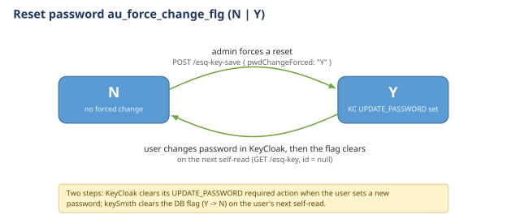
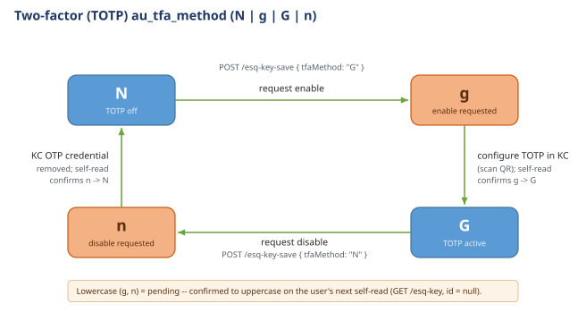
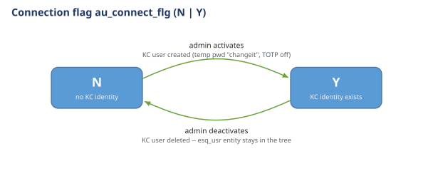

#  Esquire Application Frameworks(tm) 2.0

# KeySmith Credential Routines — State Machine & Collaboration

> Part of the **[Esquire.Auth suite](Esquire.Auth.md)** — this member covers the credential-lifecycle state
> machines; the tree-shaped security model and the keySmith / kcMaster / KeyCloak collaboration overview are in
> [`Esquire.Auth.md`](Esquire.Auth.md).

Describes the collaboration between **End-User UI**, **keySmith service**, and **KeyCloak (KC)**
for the three credential lifecycle operations: reset password, TOTP, and connection flag.

---

## 1. Reset Password

### DB flag: `au_force_change_flg` — values: `Y` | `N`

| Step | Actor | Action |
|------|-------|--------|
| 1 | Admin UI | Sends `POST /esq-key-save` with `{ pwdChangeForced: "Y" }` |
| 2 | keySmith | Writes `au_force_change_flg = 'Y'` to DB via `updateAccess` |
| 3 | keySmith | Syncs to KC: `forcePasswordChange = true` → KC adds `UPDATE_PASSWORD` required action |
| 4 | User | Logs in to KC; KC intercepts and forces new password entry |
| 5 | KC | Clears `UPDATE_PASSWORD` required action after user completes the change |
| 6 | User UI | Calls `GET /esq-key` (no `id` — self-read) |
| 7 | keySmith | Detects `au_force_change_flg = 'Y'` on self-read → clears to `'N'` via `confirmPendingFlags` |
| 8 | keySmith | Returns profile with `pwdChangeForced = "N"` |

### State diagram

---

## 2. TOTP (Google Authenticator)

### DB flag: `au_tfa_method` — values: `N` | `g` | `G` | `n`

| Value | Meaning |
|-------|---------|
| `N` | TOTP disabled (stable) |
| `g` | TOTP enable requested — pending setup |
| `G` | TOTP active and confirmed |
| `n` | TOTP disable requested — pending removal |

### Enable TOTP

| Step | Actor | Action |
|------|-------|--------|
| 1 | User UI | Sends `POST /esq-key-save` with `{ tfaMethod: "G" }` |
| 2 | keySmith | `applyFields` validates: only `"G"` or `"N"` accepted; value differs from current → stores `"g"` (lowercase = pending) |
| 3 | keySmith | Writes `au_tfa_method = 'g'` to DB |
| 4 | keySmith | Syncs to KC: `requireTotp = true` → KC adds `CONFIGURE_TOTP` required action |
| 5 | User | Logs in to KC; KC intercepts and forces TOTP setup (QR code scan) |
| 6 | KC | Clears `CONFIGURE_TOTP` required action after user completes setup |
| 7 | User UI | Calls `GET /esq-key` (no `id` — self-read) |
| 8 | keySmith | Detects `au_tfa_method = 'g'` on self-read → confirms to `'G'` via `confirmPendingFlags` |
| 9 | keySmith | Returns profile with `tfaMethod = "G"` |

### Disable TOTP

| Step | Actor | Action |
|------|-------|--------|
| 1 | User UI | Sends `POST /esq-key-save` with `{ tfaMethod: "N" }` |
| 2 | keySmith | `applyFields` validates; value differs from current → stores `"n"` (lowercase = pending) |
| 3 | keySmith | Writes `au_tfa_method = 'n'` to DB |
| 4 | keySmith | Syncs to KC: `removeTotp = true` → KC deletes all `otp`-type credentials for the user |
| 5 | User | Re-logs in (no TOTP prompt — credential removed) |
| 6 | User UI | Calls `GET /esq-key` (no `id` — self-read) |
| 7 | keySmith | Detects `au_tfa_method = 'n'` on self-read → confirms to `'N'` via `confirmPendingFlags` |
| 8 | keySmith | Returns profile with `tfaMethod = "N"` |

### State diagram

### Validation rules (applyFields)
- Only `"G"` and `"N"` are accepted from the UI; any other value is silently ignored
- If the incoming value (case-insensitive) equals the current effective value → no-op
- On accepted change: stored as lowercase (`G→g`, `N→n`) to mark pending state

---

## 3. Connection Flag

### DB flag: `au_connect_flg` — values: `Y` | `N`

| Value | Meaning |
|-------|---------|
| `N` | User account not yet activated — no KC identity exists |
| `Y` | User account active — KC identity exists |

### Activate user (N → Y)

| Step | Actor | Action |
|------|-------|--------|
| 1 | Admin UI | Sends `POST /esq-key-save` with `{ connectFlg: "Y" }` |
| 2 | keySmith | `saveAccess`: runs `applyFields`; detects N→Y transition |
| 3 | keySmith | If `tfaMethod != 'N'`: forces `au_tfa_method = 'N'` before `updateAccess` (TOTP must be clean on activation) |
| 4 | keySmith | Writes `au_connect_flg = 'Y'` (and `au_tfa_method = 'N'` if corrected) to DB |
| 5 | keySmith | Syncs to KC: `createUser(loginId, email, password="changeit", enabled=true, forcePasswordChange=true, requireTotp=false, roles, {esq_uid, esq_rootpath})` |
| 6 | KC | User created with temporary password; `UPDATE_PASSWORD` required action set |
| 7 | User | Logs in with `"changeit"` → KC forces new password |

### Deactivate user (Y → N)

| Step | Actor | Action |
|------|-------|--------|
| 1 | Admin UI | Sends `POST /esq-key-save` with `{ connectFlg: "N" }` |
| 2 | keySmith | Writes `au_connect_flg = 'N'` to DB |
| 3 | keySmith | Syncs to KC: `deleteUser(loginId)` — KC identity fully removed |

### State diagram

### KC attributes set at creation
| Attribute | Value | Constant |
|-----------|-------|----------|
| `esq_uid` | user DB primary key | `EsqConstants.JWT_CLAIM_ENTITY_ID` |
| `esq_rootpath` | user path | `EsqConstants.JWT_CLAIM_ENTITY_ROOTPATH` |

> These attributes are set **once at creation only** and never updated by keySmith.

---

## Handshake Summary (`GET /esq-key` with `id = null`)

On every self-read (user's own login handshake), keySmith checks for pending flags and
promotes them atomically via a single `confirmPendingFlags` DB call:

| Condition | Action |
|-----------|--------|
| `pwdChangeForced = 'Y'` | → set to `'N'` (password was changed in KC) |
| `tfaMethod = 'g'` | → set to `'G'` (TOTP setup confirmed) |
| `tfaMethod = 'n'` | → set to `'N'` (TOTP removal confirmed) |

Both flags are updated in one `UPDATE` using `COALESCE` — only non-null values are written.
