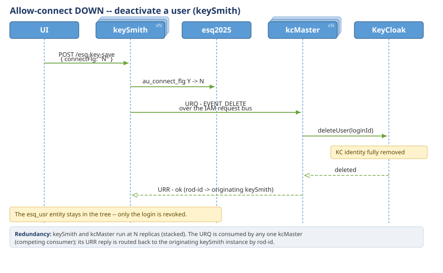
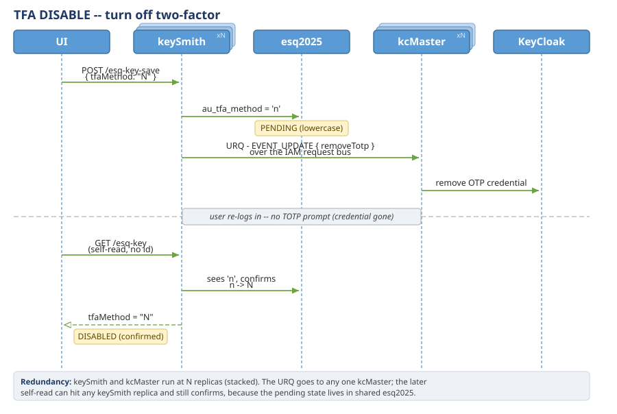

<table style="width: 100%; table-layout: fixed;">
  <tr>
    <td style="width: 12%"></td>
    <td style="width: 88%;">
       <h1>Esquire Application Frameworks(tm) 2.0</h1>
    </td>
  </tr>
</table>

# Esquire Authentication & Authorization — the tree-shaped security model

Esquire declares everywhere that **the tree is the authorization model** — the org chart and the access rules
are the same artifact, not two that drift apart. This document is how that actually works: who a caller is, what
they may see, and what they may do — resolved from **where they sit in the tree**, not from rules written
separately per feature.

Two members complete the **Esquire.Auth** suite:

- [`Esquire.Auth.TokenPatterns.md`](Esquire.Auth.TokenPatterns.md) — the four token-handling patterns at the edge
  (BFF / Plain JWT / Vanilla Token Relay / Phantom Token Relay) and the JWT / JWE formats behind them.
- [`Esquire.Auth.keySmithRoutine.md`](Esquire.Auth.keySmithRoutine.md) — the credential-lifecycle state machines
  (reset password, TOTP, connection flag) keySmith runs with KeyCloak.

---

## 1. The idea

A caller authenticates once, over **OAuth 2.0 / OIDC** (against KeyCloak — Section 3). Once verified, their token
carries **everything that defines authorization** — the caller's **claims** and **roles**. That token rides on
**every REST request**, and each service reads the caller's identity and rights **from the request itself** —
**never** from the `esq2025` database and **never** from a KeyCloak session. The token is validated locally
(against KeyCloak's cached JWKS), so there is no per-request DB read and no per-request call to KeyCloak. A service
decides what the caller may see and do **from the token alone**:

- **Claims define visibility.** `esq_uid` (the caller's entity **id**) and `esq_rootpath` (their **path** in the
  tree) fix *which slice of the tree* the caller can see (Section 4).
- **Roles define permissions.** The caller's roles fix *which operations* they may perform, per entity kind
  (Section 5).

Two orthogonal dimensions, both read from the same tree: **position (the claims) → what you see; role → what you
do.** Traditional role-based access control answers only the second; Esquire makes visibility a first-class,
independent dimension — which is what *"the tree is the authorization model"* means in practice. A caller's
effective rights are the intersection: the role says *what* you may do; the path says *to which slice of the tree*
you may do it.

---

## 2. Identity — the two claims

Every authenticated caller carries two Esquire claims in their token, alongside the standard OIDC claims:

| Claim | Constant | What it is |
|---|---|---|
| `esq_uid` | `EsqConstants.JWT_CLAIM_ENTITY_ID` | the caller's **entity id** — the primary key of their `esq_usr` row (globally unique across kinds, branches, and services). |
| `esq_rootpath` | `EsqConstants.JWT_CLAIM_ENTITY_ROOTPATH` | the caller's **visibility root** — the `ep_path` of the subtree they belong to (Section 4). |

**Set once, at creation.** Both are written onto the KeyCloak user as attributes at user-creation time and are
**never updated** afterward by the services — except `esq_rootpath`, which is re-issued when the user is **moved**
(their position in the tree changes). Identity is stable; only position follows a move.

Inside a service these two land in the per-request context: `EsqRequestContext(correlationId, requestId, uid,
rootPath)` — `uid` and `rootPath` originate from the JWT claims, read once by the `JwtAuthenticationFilter` and
carried through the request. The correlation / request ids are the tracing pair (see
`Esquire.ObservabilityStack.md`); `uid` and `rootPath` are the security pair.

**KeyCloak username = loginId.** A user is looked up in KeyCloak by their `loginId` (the KC `username`), so the
services never need the KC user UUID to address a principal.

---

## 3. The collaboration — keySmith / kcMaster / KeyCloak

Esquire never writes to KeyCloak from the business path. Identity changes are a **command over the IAM bus**, so
the entity mutation and the KeyCloak sync never block each other:


- **keySmith** owns the credential side of a user: it writes the `esq_usr` access columns (connection flag,
  force-password-change, TOTP method) and **publishes** the matching identity command to the IAM bus. It never
  touches KeyCloak directly.
- **kcMaster** is the **only** service that writes to KeyCloak. It consumes the request, performs the create /
  update / delete / update-path against KC, and replies. Because it is the single writer, KeyCloak state has one
  authority.
- **KeyCloak** is the identification host (below).

> **Everything here runs redundant.** keySmith, enyMan, and kcMaster each run at **N replicas**, and that is what
> gives these flows their shape: a request (`URQ`) is competing-consumed by **one** kcMaster and its reply routes
> back to the **originating** instance by rod-id, while the entity-broadcast **topic** fans out to **every** kcMaster
> replica (each holding its own path buffer). The sequence diagrams below draw the services as stacked replicas,
> and each legend calls out where the redundancy adds routing complexity.

### 3.1 KeyCloak — the identification host

KeyCloak is Esquire's **authentication authority**. Per user it holds the **credentials** (the password hash, the
TOTP / OTP credential), the Esquire **claims** (`esq_uid`, `esq_rootpath`), and the user's **roles**. It runs the
login — OIDC authorization-code + PKCE for the browser — and, on success, issues the signed JWT that carries all
three (`esq_uid`, `esq_rootpath`, and the roles in `realm_access.roles`). The Esquire services store **no
password** and never authenticate a user themselves; they only *validate* the KeyCloak-signed JWT locally against
its cached JWKS. Authentication is KeyCloak's; authorization (Sections 4-5) is Esquire's, off the claims KeyCloak
stamped.

### 3.2 Keeping esq2025 and KeyCloak in sync

The two stores hold two views of the same user, and **`esq2025` is the source of truth**:

- **`esq2025`** (the database) owns identity-as-*data* — who exists, their kind, their position (`ep_path`), their
  role, their access flags. This is where a change originates.
- **KeyCloak** mirrors only the auth-relevant slice — the login credential, the two claims, and the roles — so it
  can authenticate and stamp a token.

Every change flows one way, **DB → KeyCloak, always through kcMaster** (the single writer), by two paths:

1. **The command path (authoritative).** When a user is created / updated / deleted, or a credential state changes
   (activation, password reset, TOTP), keySmith — or enyMan for a **move** — publishes a request (`URQ`) on the KC
   request/response bus. kcMaster applies it to KeyCloak: create / update / delete the user, set the **roles**
   (`req.getRoles()`), write the **claim** attributes (`esq_uid`, `esq_rootpath`), or update the path
   (`EVENT_UPDATE_PATH`, which re-stamps `esq_rootpath` when a user is moved).
2. **The broadcast safety-net.** kcMaster also consumes the entity-broadcast topic. If a moved user's new path
   arrives before KeyCloak has that user (the race a create-during-move opens), kcMaster parks it in a small
   path buffer (a per-pod expiring cache) and the pending create flushes the post-move path. The command path is
   authoritative; the broadcast is belt-and-suspenders so a relocation is never lost.

`esq_uid` is written once, at create, and never changes — identity is stable. `esq_rootpath` is the one attribute
re-issued on a move, so the token's visibility root always matches the tree.

### 3.3 Creating a user — two separate transactions

A user comes into being in **two independent steps, by two different services** — the entity first, the ability to
log in second:

1. **Create the user entry (enyMan).** enyMan writes the `esq_usr` row and its `esq_entity_path`. The user now
   **exists in the tree** — it has an id, a kind, a position, and can be seen and managed — but has **no way to log
   in**: the connection flag is `N`, and **no KeyCloak identity exists** yet.
2. **Activate the access profile (keySmith).** A separate operation flips the connection flag `N → Y`. keySmith
   writes the access columns and publishes the identity command; kcMaster creates the KeyCloak user with the
   user's **roles + claims**, a **temporary password `"changeit"`**, and a force-password-change action. Only now
   can the user log in — and on first login KeyCloak makes them replace `"changeit"` with a real password.

The connection flag is an **up / down switch on login ability**, run through keySmith (the
[credential state machine](Esquire.Auth.keySmithRoutine.md)): `N → Y` creates the KeyCloak identity (access
granted); `Y → N` deletes it (access revoked) while the `esq_usr` entity stays in the tree. So a user can exist
without access, be granted it, and have it taken away — **entity and login are decoupled** (deleting the entity is
even blocked while the connection is still `Y` — disable the login first).




> **esq2025 never stores a password.** The password — and the TOTP secret — live **only** in KeyCloak. esq2025
> holds the access *state* (the connection flag, the force-change flag, the TOTP method), but never the secret
> itself. `"changeit"` is a one-time bootstrap value KeyCloak forces the user to replace; it is kept nowhere in the
> Esquire database.

### 3.4 Credential changes — a ping-pong collaboration

A credential change is **not** a single request-response. Because the user completes the step **inside KeyCloak**
(at their next login), the change is written as **pending** first and **confirmed on a later self-read** — a
ping-pong across the **UI ↔ keySmith ↔ esq2025 / kcMaster ↔ KeyCloak** (keySmith owns the access-profile columns
like `au_tfa_method`; kcMaster is the only KeyCloak writer). Turning on **two-factor (TOTP)** is the clearest
example:


- **The request and the confirmation are two different round trips.** Between them the user must actually configure
  TOTP at KeyCloak, so keySmith cannot flip the flag active on the spot — it parks it **pending** (lowercase `g`)
  and promotes it (`g → G`) only when a later self-read proves KeyCloak accepted the setup. esq2025 carries the
  pending/active *state*; the OTP secret itself lives only in KeyCloak.
- **Disable is the mirror image.** `POST {tfaMethod:"N"}` parks `n`, kcMaster removes the OTP credential from
  KeyCloak, and the next self-read confirms `n → N`.


- **Password reset rides the same pattern** — `au_force_change_flg = Y` → KeyCloak's `UPDATE_PASSWORD` action →
  the flag clears on the next self-read once the user has changed it.

The exact flag values, validation rules, and the disable path are in
[`Esquire.Auth.keySmithRoutine.md`](Esquire.Auth.keySmithRoutine.md).

### 3.5 The enyMan side — email / login-id and rootpath

keySmith owns the *credential* side (Sections 3.3–3.4). **enyMan** owns the *entity* side, and it runs its own
synchronization routines for the two identity fields carried on the entity: the **email / login-id** (when a
person's properties change) and the **rootpath** (when a user moves).

**Change person properties — email / login-id.** A person-property change flows to enyMan, which keeps the
`esq_auth` access-profile row (`au_login_id` / `au_email`) in step with the person inside `esq2025` (guarded by an
email-uniqueness check). Propagating a login / email change on to **KeyCloak** is the separate keySmith leg
(`EVENT_UPDATE`, Section 3.2) — the KC username *is* the loginId — so the two legs together keep `esq2025` and
KeyCloak aligned.


**Move — rootpath.** A move rewrites the whole subtree's `ep_path` in `esq2025` (parents-first) and enyMan
re-stamps each moved user's `esq_rootpath` in KeyCloak. This is where the **create-while-move race (race-8c)** is
fought:


- **Authoritative path.** enyMan publishes an `EVENT_UPDATE_PATH` URQ; kcMaster re-stamps `esq_rootpath` on the KC
  user — *if that user exists*.
- **The race.** A user can be **created while it is being moved**: the move's `UPDATE_PATH` can reach kcMaster
  before the user's KeyCloak identity has been created. The authoritative URQ then finds no user and **silently
  skips** — the new path would be lost.
- **The safety-net.** The same move is also broadcast on the entity-broadcast topic; kcMaster's topic worker parks
  the new path in a per-pod **expiring path buffer** (an `ExpiringCache`, bean in `KeycloakConfig`). The next keySmith `CREATE` URQ for that user **flushes the buffer**
  and applies the post-move path — so the relocation is never lost. When the user already exists, the URQ owns the
  update and the topic side stays passive (no double write).
- **The buffer keeps the newest path, not the last one to arrive.** A path is parked with the change number of
  the path row it came from, and a park only replaces what is there when its number is greater. That matters
  because the topic worker runs on a pool: two moves of the same entity can be handled at once, and in either
  order. The comparison is one atomic step inside the cache, so two workers cannot both decide they are newer and
  have the slower one land last. A path with no number parks into an empty slot but never displaces a numbered
  one — an arrival that says nothing about its order cannot outrank one that does.

The broader create-while-move handling on the entity / tree side (the move queue, parents-first ordering, and the
bizTree cache) is in [`Esquire.BizTree.md`](Esquire.BizTree.md); here it matters only for keeping `esq_rootpath`
correct in the token.

Replacing KeyCloak means replacing kcMaster with a service that speaks to a different IAM — the rest of the system
is unchanged (the pluggable-IAM property; see [`Esquire.Vision.md`](Esquire.Vision.md)).

Which token shape reaches the services from the edge — a browser cookie, a plain JWT, or a relayed one — is the
gateway's concern, covered in [`Esquire.Auth.TokenPatterns.md`](Esquire.Auth.TokenPatterns.md).

---

## 4. Dimension 1 — hierarchical visibility (`ep_path`)

Visibility is structural: it is the `ep_path` of the `esq_entity_path` row. `esq_rootpath` (Section 2) is exactly
this value for the caller. A read is scoped to the caller's subtree with a single prefix match —
`... WHERE ep_path LIKE :rootPath || '%'` — so a user sees their own branch, a regional manager sees their region,
and a root administrator (`ep_path` = `1.`) sees everything. **No per-query filter is written; the scope is the
path.** GET reads therefore need no explicit permission check — the `rootPath` already bounds what the query can
return.

### 4.1 What `ep_path` holds, per entity type

`esq_entity_path` stores one row per entity; `ep_path` is a dot-separated hierarchical path string
(`1.9.200.`). Its meaning depends on the entity type and kind:

| Entity type | `ep_path` value | Example |
|---|---|---|
| **ORG** | the org's own full path — `parentOrgPath + orgPk + "."` | `1.9.200.` |
| **USR — admin (kind 30, 32)** | the parent org's path only — no user PK appended | `1.9.200.` |
| **USR — regular (kind 34, 36)** | the user's own full path — `parentOrgPath + usrPk + "."` | `1.9.200.100.` |
| **ACCT** | the owner user's `ep_path` — no account PK appended | `1.9.200.100.` |

- **ORG** — navigated hierarchically; the path includes its own PK so children scope via `LIKE '1.9.200.%'`.
- **Admin users (SYS_ADMIN / ADMIN, kind 30 / 32)** — their visibility root is their **org**. They see everything
  under it but do not form a subtree of their own, so the path is the org's path (no user PK).
- **Regular users (CLIENT / MERCHANT, kind 34 / 36)** — their visibility root is their **own node**; they own
  accounts beneath them, so the path is the org path + their own PK.
- **ACCT** — accounts belong to a user; their path equals the owner user's `ep_path`. No account PK is appended;
  an account is always scoped through its owner.

### 4.2 The parent-only rule — `isPathParentOnly()`

Whether an entity appends its own PK is one predicate on the kind:

```java
public boolean isPathParentOnly() {
    return id == 30 || id == 32;   // SYS_ADMIN and ADMIN
}
```

`true` means the entity's `ep_path` equals its parent's (no own PK). It drives both forming a path —

```java
String path = eek.isPathParentOnly() ? parentPath : parentPath + newId + ".";
```

— and reading the org PK back out of a user's path (admin: the last segment is the org PK; regular: the
second-to-last is).

### 4.3 Move semantics

A move re-parents a subtree; `ep_path` must be rewritten, and *how* depends on the parent-only rule:

- **Admin user** — several admins under one org share the same `ep_path`, so a move updates by **`ep_pk`** (not by
  path equality, which would hit all of them): `UPDATE esq_entity_path SET ep_path = :newPath WHERE ep_pk = :id`.
  Admins own no accounts, so no cascade is needed.
- **Regular user** — the path is unique (ends with the user's own PK), and the user's account rows share it, so a
  move updates by **path equality** in one statement, covering the user and all their accounts:
  `UPDATE esq_entity_path SET ep_path = :newPath WHERE ep_path = :oldPath`.

The org-move ordering (parents processed before children so a child's new path is built from its parent's
already-updated one) and the create-while-move race are the bizTree concern —
see [`Esquire.BizTree.md`](Esquire.BizTree.md).

### 4.4 `ep_path` == `esq_rootpath`

When a user is created or moved, keySmith / kcMaster write exactly this value onto the KeyCloak user as
`esq_rootpath` — no transformation. So the visibility root the services scope reads by (`rootPath` in the request
context) is the same string that lives in the token and in `esq_entity_path`. One value, three places: the DB
column, the KC attribute, the JWT claim.

### 4.5 Where the path rules live

| Location | What |
|---|---|
| `enyMan / UsrService.createUsr()` | path computed via `isPathParentOnly()` |
| `enyMan / UsrService.moveUsr()` | admin: `moveAdminPath` by pk; regular: `moveUsrPaths` by equality |
| `enyMan / EnyManService.publishKcMoveRequest()` | sends the new path straight to KeyCloak (no stripping) |
| `bizTree / BizTreeCacheRepository.moveUsrNode()` | org PK extracted via `isPathParentOnly()` |
| `enyMan / AcctService.createAcct()` | account path fetched from the parent user's `ep_path` (`EsqAcctRepository.acctPath`) — account CREATE lives in enyMan; pacMan works only with existing accounts (read / update / delete + transactions) |

---

## 5. Dimension 2 — positional authority (roles)

Where visibility bounds *what a caller can reach*, roles bound *what a caller can do* (and what tools they see).

### 5.1 The enforcement points

- **GET reads — scoped by the path, no explicit permission check.** A read cannot return anything outside the
  caller's `rootPath` (Section 4), so position *is* the authorization for reads.
- **POST writes — gated by `EsqRolesStorage.isAdminCmdPermitted()`.** The gate runs ahead of any entity-level
  guard, and it is the one place the authorization decision is made (counted as `esq.biz.perm.check.total`, tagged
  allow / deny — the permission meter on the business dashboard).
- **Self-update bypass.** A caller acting on **their own** record (`id.equals(uid)`) passes the command gate
  without any admin role — editing yourself is not an admin authorization decision, which is why a regular user can
  maintain their own profile and credentials with no role at all. This is **not** carte blanche: *which* properties
  you may change on yourself is bounded field-by-field by the **`personal` flag** (5.3).

### 5.2 Role types — expandable with the domain

A role in Esquire is itself an **entity with a kind**, so the role system grows the same way any other entity
does. Four role / permission kinds exist; two are live, two are reserved for domain growth:

| Role kind | Code | Status | What it governs |
|---|---|---|---|
| **Admin** | 980 | live | what admin **functions** a holder may perform, **per entity kind** |
| **Tools** | 982 | live | tool-side / UI behavior — e.g. the **TREE** role that filters what the Esquire Explorer shows |
| **Applications** | 984 | reserved | (future) per-application access as the domain grows |
| **Reports** | 986 | reserved | (future) per-report access as the domain grows |

**Admin roles (980).** An admin role carries, **for each entity kind**, a small permission record — a flag per
admin command: `CREATE`, `UPDATE`, `DELETE`, `AUTH` (credential / connection operations), `ACCT` (account
operations). `"Y"` at a command's position permits it. So an admin role reads as a *function-per-kind* matrix —
e.g. *"for a MERCHANT (kind 36) this role may CREATE and UPDATE but not DELETE."* Esquire ships a **preset set of
admin roles**; `isAdminCmdPermitted` (5.1) is the gate that reads them. In storage this is
`Map<roleName, Map<entityKind, EsqPermission>>` — role, then entity kind, then the command flags.

The **preset admin roles** (seeded in `db.seed/.../fill/esq_role.sql`), each a function-per-kind matrix over the
demonstration kinds (org / admin / client / merchant / their accounts):

| Role | Held by | In short |
|---|---|---|
| **SYSADMIN** | system administrator (kind 30) | root authority — every function on every kind |
| **SUPERVIZOR** | office admin (kind 32) | full authority on the org subtree (org / admins / clients / merchants / accounts) |
| **MANAGER** | office admin | office manager — full authority for the office it runs |
| **OPERATOR** | office admin | limited — create / update client & merchant records; no deletes, no org / admin changes |
| **SUPPORT** | office admin | customer support — read / limited-update; no create or delete |
| **CLIENT** | client (kind 34) | the client's own scope — their own accounts / postings |
| **MERCHANT** | merchant (kind 36) | the merchant's own scope |

These describe the **demonstration** domain (a back-office of offices, admins, clients, merchants, accounts); a
real domain ships its own preset of the same shape (a role, a kind, the allowed functions).

**Tool roles (982).** These govern the **tools** a user sees, not the entity commands. The one in use is the
**TREE** role — seeded as *"Use of Esquire explorer api"* and attached across the admin / client / merchant kinds
— a **filter for the Esquire Explorer UI** that shapes what the tree presents to a given user. Tool roles are
deliberately **expandable**: the seed also carries a couple of placeholder tool roles, precisely because the kind
is meant to be filled per domain — a new tool role is just a new entity of kind 982, no framework change.

**Applications (984) / Reports (986) — reserved.** Declared but **not in use today**, held for domain expansion:
when a deployment grows per-application or per-report access, the role model already has the slots and the pattern
is the same (a role entity of the right kind carries the permissions), so the expansion needs no new mechanism.

Roles are held in an in-memory `EsqRolesStorage` (declared explicitly per service, per the no-`@Autowired` rule),
loaded from the seed. Role **exceptions** — a per-node override of a role's default permission — layer on top.

Together with Dimension 1: the role decides *whether* an operation is allowed and *what tools* appear; the path
decides *which entities* it can touch. A `DENY` at the gate, or an out-of-subtree target, stops the write.

### 5.3 Acting on yourself — the `personal` flag

Roles answer *what an admin may do to other people*. There is a separate, orthogonal question — *what a holder may
do to themselves* — and Esquire answers it **not** with roles but with a per-property **`personal`** marker.

Passing the self bypass (5.1) lets you edit your **own** record, but not every field on it. Each property in the
entity dictionary carries a **`personal`** flag (DB column `par_personal_flg`, dictionary element `<personal>` —
`Y` | `N`). When the caller is editing their own record (`personal = id.equals(uid)` is true), the validator
enforces it: a field **not** flagged `personal="Y"` is rejected with *"You cannot update the value by yourself."*
So self-service is a **whitelist of self-editable properties**, applied field-by-field:

| On your own record | Properties | Who may change them |
|---|---|---|
| **Personal (`Y`) — self-editable** | your contact / profile details (name, address, phone, email, company, title, ...) and your access-profile credential settings (**loginId, email, password-change request, TOTP method**) | you, yourself — no role needed |
| **Not personal — admin-only** | the structural / authority properties: your **roles**, your **path / position**, entity **kind**, the **connection** and **system** flags | only an admin acting under a role (5.1–5.2) |

The split is deliberate: you maintain your own particulars and credentials, but you cannot grant yourself a role,
move yourself in the tree, or flip your own connection state — those stay behind the role gate even on your own
record. When an admin edits **someone else** (`personal = false`), the `personal` flag does not apply at all; only
the role gate does.

---

## 6. Token flow at the edge

Everything above assumes the services already hold a validated JWT with `esq_uid` / `esq_rootpath`. **How** that
token reaches them from a client — and how the claims are kept off an untrusted wire — is the gateway's job, and
Esquire ships four patterns for it (BFF, Plain JWT, Vanilla Token Relay, Phantom Token Relay), plus the JWT / JWE
format analysis behind the "ideal encrypted, self-contained token" that stock KeyCloak cannot emit. That is the
subject of [`Esquire.Auth.TokenPatterns.md`](Esquire.Auth.TokenPatterns.md). Whatever the pattern, the services
downstream of the gateway always validate a plain signed JWT locally against KeyCloak's cached JWKS — no per-request
call to KeyCloak.

---

## The Esquire.Auth suite

- **This doc** — the tree-shaped security model: the two dimensions, the identity claims, the
  keySmith / kcMaster / KeyCloak collaboration, and `ep_path` visibility semantics.
- [`Esquire.Auth.TokenPatterns.md`](Esquire.Auth.TokenPatterns.md) — the four edge token-handling patterns and the
  JWT / JWE formats.
- [`Esquire.Auth.keySmithRoutine.md`](Esquire.Auth.keySmithRoutine.md) — the credential-lifecycle state machines
  (password / TOTP / connection flag).
