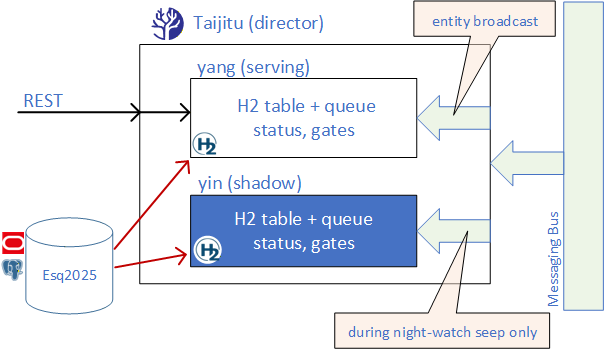
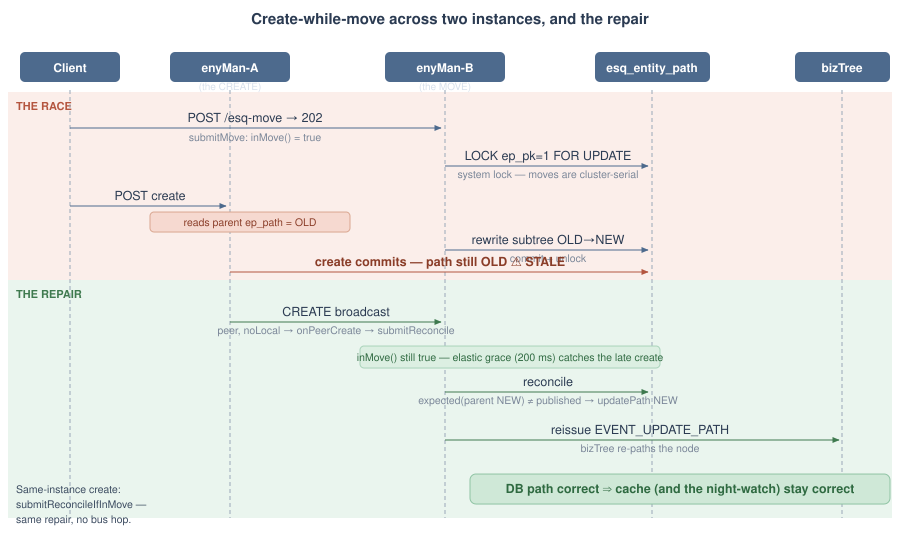
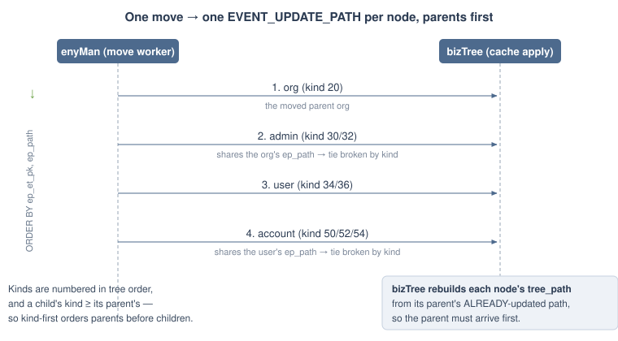

#  Esquire Application Frameworks(tm) 2.0


#  **Esquire bizTree**


**The read-side query model.** bizTree owns the in-memory, hierarchical view of
every business entity in the system -- organizations, users, accounts -- shaped
exactly as it's traversed (parent / children, ep_path, kind, status). It is fed
continuously by entity-broadcast JMS events from the entity-mutation services
(enyMan for entity CRUD, pacMan for accounting state) and rebuilds itself from
the canonical DB tables at startup. Other services, the BFF, and the UI ask
bizTree for tree queries instead of stitching joins against the database --
the cache is the answer to "what does the world look like right now, from
where I'm standing in it." The DB remains the source of truth; bizTree is the
shape that makes traversal cheap.


## The name

The cache is the **Supreme Ultimate Cache** (Chinese: 太極, *Taiji*, "Supreme
Ultimate"); its structure is the **Taijitu** (太極圖, "Diagram of the Supreme
Ultimate") -- two equal monads, yang and yin, behind a single director that
swaps them on drift. Three labels for three audiences:

- **Supreme Ultimate Cache** -- the formal name. Doc headings, lead sentences.
- **Taijitu** -- the short, technical name. Code identifiers (`ATaijituRig`,
  `Monad`, the `sweep` night-watch), filenames, log lines.
- **Anti-entropy double-buffer with shadow promotion** -- the dry industry
  vocabulary. Use when the metaphor isn't helpful (papers, externals,
  pattern catalogues).

Same shape as **Haubergeon / hauberk / Gatling harness** in the testing layer.


## The external surface

bizTree exposes two contracts, and nothing else:

- **Read-only access** to retrieve tree data (the REST endpoints `/esq`,
  `/esq-path`, `/esq-enode`, `/esq-tree`, plus the admin `/esq-sweep`).
- **Inbound event sink** that accepts the entity-broadcast JMS events that
  mutate the tree.

The cache's internal structure -- the Taijitu below -- is invisible to callers.
They see the same API whichever director implementation is active.


## Structure: two monads behind one director

The cache is a **Taijitu**: two independent **monads** behind one **director**.




Each monad is a **complete bizTree data cache** -- its own H2 table, its own
queue, its own worker -- and offers the same two capabilities: read access for
queries, and event processing on its own queue. The two monads are never
directly connected; the director sits between them and the outside world. The
two monad instances are named `monad` and `danom` (the latter is "monad"
reversed -- a name, not a role); which one is serving vs. shadow is a role
pointer the director flips.


### The two roles: yang and yin

At any moment one monad holds the **yang** role and the other **yin**:

| Role | Character | Behaviour |
|---|---|---|
| **yang** | bright, serving | Answers REST reads; receives every entity-broadcast event on its queue. |
| **yin** | dark, shadow | Idle until a night-watch sweep loads it fresh from the DB; receives entity-broadcast events only for the duration of the sweep. |

The pair is symmetric -- either monad can hold either role. The roles swap
during a sweep when drift is detected (see *Night-watch sweep*).


### The director

The director (`ATaijituRig` in `pro.mir0n.utils.taijitu`, specialized by
bizTree's `BizTreeDirectorTaijitu`) owns:

1. **Read routing.** Every REST read goes to the serving monad (`yang()`).
2. **Event fanout.** Entity-broadcast events always flow to yang's queue, and
   additionally to yin's queue while yin is part of an active sweep.
3. **Command issuance.** Drives each monad's state machine through the command
   set below.
4. **Result reception.** Each monad calls back a per-monad listener
   (`gateFor(monad)`) when a command completes; the listener drives that
   monad's gates off the result.


### Monad state

Each monad carries:

| Field | Values | Meaning |
|---|---|---|
| `queueEnabled` | on / off | Whether new events can land on the monad's queue. |
| `processingEnabled` | on / off | Whether the worker drains the queue or holds it. |
| `status` | `IDLE` / `LOADING` / `LOADED` / `FAILED` | Lifecycle position. |


### Monad commands

The director issues three commands; each rides the monad's queue as a
`QueueItem` (`MonadCmd`):

| Command | Effect |
|---|---|
| `CLEAR` | Truncate the monad's H2 table; `status -> IDLE`. |
| `LOAD`  | Bulk-load the tree from `esq2025` into the monad's H2 table; `status -> LOADING -> LOADED` (or `FAILED`). |
| `CHECKSUM` | Compute a content hash of the monad's H2 table and report it back through the result listener. |

`LOAD` and `CLEAR` run **synchronously** on the monad's single worker thread
(`doCommand` blocks until the worker signals). `CHECKSUM` is the exception --
see *Off-worker CHECKSUM* below.


### The checksum

The digest is **order-independent** (rows concatenated in `TREE_PK` order so
physical row order doesn't matter) and **content-only** (no security role -- it
detects drift between two locally-computed hashes of the same data, so MD5 is
the right, fast choice):

```sql
SELECT RAWTOHEX(HASH('MD5', STRINGTOUTF8(COALESCE(GROUP_CONCAT(
    TREE_PK || '~' || TREE_ET_PK || '~' || COALESCE(TREE_NAME,'') || '~' || ...
    ORDER BY TREE_PK SEPARATOR '|'), ''))))
  FROM {table};
```

`COALESCE(..., '')` keeps an empty table's digest non-null (the MD5 of the
empty string), so two empty legs match rather than both reporting "no value".


## Routines

The director owns three routines: a once-at-startup bootstrap, the periodic
night-watch sweep, and shutdown.


### Bootstrap (process startup)

Brings the serving monad from `IDLE` to `LOADED` and opens the read gate. Runs
once, synchronously; a failed load retries (~5 s apart) until it succeeds.

```
0. yang.status = IDLE; gates off; the director rejects reads.
1. CLEAR yang (clean slate), then LOAD yang with queueEnabled = ON,
   processingEnabled = OFF -- events arriving mid-load BUFFER, are not applied.
2. yang.status -> LOADING -> LOADED (or FAILED).
3. LOADED  -> processingEnabled = ON; yang drains the buffered events in
              arrival order onto the now-consistent cache; reads open.
   FAILED  -> gates off, CLEAR, retry LOAD after the retry delay.
```


### Night-watch sweep (periodic; also forceable via REST)

The anti-entropy mechanism. The shadow is rebuilt from `esq2025`, both monads
are checksummed, and the director reacts to drift. The sweep is **serialized**
(one at a time, guarded) and **re-armed after it ends** -- the next sweep starts
`sweep.interval-ms` after the previous one finishes, not on a fixed clock.
`/esq-sweep` forces a sweep asynchronously (the director runs it on the
night-watch thread and returns `202` at once -- the request never blocks for a
full sweep).

```
1. LOAD the shadow (yin) fresh from esq2025 into its own table.
   Shadow LOAD FAILED -> abandon this sweep; retry next round.
2. Submit CHECKSUM to BOTH legs; collect each digest within sweep.timeout-ms.
3. A FAILED (timed-out / cancelled) digest is inconclusive -> abandon, retry next round.
4. Compare the two digests:
     MATCH    -> serving monad is healthy; nothing to do.
     MISMATCH -> react per the configured mode (below).
5. Clear the shadow back to idle (always).
```

On mismatch the reaction is configurable (`biztree.taijitu.on-mismatch`):

| Mode | Reaction |
|---|---|
| `LOG` | Record the drift, keep serving the current monad (conservative). |
| `SWAP` | Promote the freshly-loaded shadow to serving (the double-buffer pointer flip); the old serving monad becomes the next shadow. |
| `TERMINATE` | Exit the process so an orchestrator (k8s) relaunches it from a clean load. |


### Shutdown (process exit)

Spring lifecycle stops both monads' workers. Nothing is persisted -- the H2
tables are in-memory; `esq2025` is the source of truth and is rebuilt on the
next bootstrap.


## Readiness

The bootstrap LOAD blocks after the HTTP server is already accepting
connections, so a plain health check would report UP before the cache can
serve. bizTree closes that window with a readiness gate:

- `isReady()` on the director is true once the serving monad is `LOADED`.
- `CacheReadinessHealthIndicator` (health name `cacheReadiness`) reports UP/DOWN
  off `isReady()` and is wired into the **readiness** probe group. k8s holds
  traffic until the cache is serving.
- The readiness group carries **two** cache-independent conditions, not one:
  `cacheReadiness` (the cache is loaded) **and** `messagingBus` (the
  entity-broadcast connection is up). Either being DOWN depools the pod, because
  a bizTree that cannot receive events would serve an increasingly stale tree.
  The bus indicator is registered late (at application-ready, after the
  membership-validating refresh), so startup group-membership validation is off
  and the group resolves it per request.
- **Liveness** is `livenessState` only -- a slow load, or a broker outage,
  delays or depools traffic but never crashloops the pod.

Actuator (health, and the Prometheus scrape) listens on a **separate,
internal-only port** (`8090`, `MANAGEMENT_SERVER_PORT`), reached in-cluster by
the k8s probes and the metrics collector; the ingress exposes only the main
service port, so `/actuator` is never reachable from outside.


## Invariants

Architectural rules, not knobs:

- **Two monads, always.** "Taijitu" *is* "two equal units behind one director."
- **Sequential message processing.** Each monad drains its queue with exactly
  one worker thread; event ordering (`CREATE` before `UPDATE` before `DELETE`)
  is preserved end-to-end. There is no concurrency on the write path. Under a
  backlog the worker batches a run of queued events into one cache transaction
  (`biztree.queue.bulk-threshold`) -- still strictly in order, still one thread,
  just fewer commits.
- **Event fanout during a sweep is ALL.** From the moment yin's `queueEnabled`
  flips on it receives every entity-broadcast event, unfiltered, so it converges
  with yang on the same stream -- otherwise the CHECKSUM comparison can't be
  trusted.
- **DB is the source of truth.** Monads hold in-memory H2 tables only; restart
  always rebuilds from `esq2025`.
- **Broadcast subscription is non-durable.** bizTree joins the entity-broadcast bus
  through the x-rod broadcast consumer (an `XRod` on the `esquire.entity` topic) with a
  non-durable subscription: events missed during downtime are not retained by the broker,
  and don't need to be -- bootstrap and the next sweep rebuild from the canonical DB.
  Anti-entropy reconciliation replaces durable delivery as the "no event loss" mechanism.
  Side benefits: no durable `clientId` on the connection (so bizTree is free of the
  clientId rolling-update deadlock), and multiple pod replicas become safe to run.


## Configuration

The cache and Taijitu knobs, exposed via Spring properties (env-overridable). The
**Default** column is the shipped deployment default (compose + Helm); the **Code
fallback** is the value the `@Value` binding uses if the property is left entirely
unset. The full service configuration (H2 pool, datasource, logging) is in
[services.configuring.md](services.configuring.md):

| Property | Default | Code fallback | Role |
|---|---|---|---|
| `biztree.director` | `taijitu` | `legacy` | Cache director: `taijitu` (two-monad + night-watch) or `legacy` (single-pass). |
| `biztree.taijitu.on-mismatch` | `SWAP` | `LOG` | Drift reaction: `LOG` (keep serving) / `SWAP` (promote shadow) / `TERMINATE` (exit for relaunch). |
| `biztree.taijitu.sweep.interval-ms` | `600000` (10 min) | `10000` | Delay between the end of one sweep and the start of the next. |
| `biztree.taijitu.sweep.timeout-ms` | `10000` (10 s) | `10000` | Per-leg CHECKSUM deadline within a sweep. |
| `biztree.monad.queue.capacity` | `4096` | `4096` | Max queue depth per monad (event-stream back-pressure boundary). |
| `biztree.queue.bulk-threshold` | `10` | `10` | Backlog depth above which the worker batches queued events into one cache transaction (drain a burst in one commit). |
| `biztree.cache-load.tx-timeout-s` | `0` | `0` | Cap on the startup full-tree LOAD transaction; `0` = uncapped. |
| `biztree.cache.table` | `ESQ_TREE` | `ESQ_TREE` | Base cache table; each monad suffixes it (`ESQ_TREE_MONAD`, `ESQ_TREE_DANOM`). |

The compose / Helm deployments wire these from environment variables:
`BIZTREE_DIRECTOR`, `BIZTREE_TAIJITU_ON_MISMATCH`, `BIZTREE_TAIJITU_SWEEP_INTERVAL_MS`,
`BIZTREE_TAIJITU_SWEEP_TIMEOUT_MS`, `BIZTREE_MONAD_QUEUE_CAPACITY`, `BIZTREE_QUEUE_BULK_THRESHOLD`.


## How it's built

### Per-monad pre-composed SQL

Each monad owns its **own H2 table** (`ESQ_TREE_MONAD`, `ESQ_TREE_DANOM`),
created in one shared H2 datasource. SQL bodies live in a properties file
(`h2-cache-sql.properties`), one template per query, with a `{table}` token
standing in for the table name -- editing SQL means editing properties, no
recompile.

Composition happens **once per monad**, not per call. Two value types:

- `BizTreeCacheSql` -- the property-backed raw templates (table-agnostic, holding
  the `{table}` token and the fragment shapes). One per JVM; shared.
- `CacheSqlSet` -- an immutable record of the fully-assembled, executable
  statements for one table, built by `CacheSqlSet.forTable(templates, table)`,
  which substitutes `{table}` and pre-joins the read fragments. The hot path
  then runs ready statements with zero per-query string work.

`BizTreeDirectorConfig` builds a dedicated backend per monad inline
(`buildCache(table)`): its own `CacheSqlSet` + DDL, `BizTreeCacheRepository`,
`BizTreeCacheLoader`, and read service -- all bound to that monad's table on the
shared `cacheJdbcTemplate`. This per-table isolation is what lets the shadow
load and clear its own table without colliding with the serving monad's.


### Off-worker CHECKSUM with cancellation

`LOAD` and `CLEAR` are ordering-sensitive and run on the monad's single worker
thread. `CHECKSUM` is different: a full content-hash scan can take
seconds-to-minutes, so it runs on a **separate one-run thread** (`checksumExec`)
detached from the queue, keeping the worker free to process events.

A timed-out checksum must actually abort the running query, not merely ignore a
late result (otherwise a slow scan ties up a DB connection and a thread). The
seam:

- When the checksum starts, before it issues the query, it registers an
  `ICancelable` with the result listener via `onStarted(command, cancelable)`.
- bizTree's `PrepareStatementCancelable` holds the executing `PreparedStatement`;
  its `cancel()` calls `Statement.cancel()`, which H2 honours -- the in-flight
  query throws and the leg reports `FAILED`.
- `CancelableStatement` bundles the statement with its connection so a
  try-with-resources releases both on every path (including a cancel mid-query).

The sweep's per-leg `timeout-ms` arms this: if a digest doesn't arrive in time
the director cancels the query, the leg comes back `FAILED`, and the sweep is
abandoned as inconclusive (a `FAILED` leg is not evidence of drift).


### The two-flag load sequence

Each monad carries two independent gates -- `queueEnabled` and
`processingEnabled` -- not one, to solve the load-with-live-event-stream
problem:

```
queueEnabled   processingEnabled   behaviour
------------   -----------------   ----------------------------------------
off            off                 idle; events dropped
on             off                 events BUFFER in the queue; none applied   <- mid-LOAD
on             on                  steady state: worker drains + applies
```

While LOAD reads the snapshot out of `esq2025`, events keep arriving. Dropping
them would drift the cache; applying them to a half-loaded table would corrupt
it. Buffering (queue on, processing off) then draining after LOAD completes
loses nothing and corrupts nothing. The same two-step flip runs on yang at
bootstrap and on yin at each sweep.


## A reusable pattern: `common/taijitu`

The control core lives in `pro.mir0n.utils.taijitu` (with the queue machinery in
`pro.mir0n.utils.concurrent`) and is **domain-agnostic** -- it knows nothing
about trees, entities, or SQL. It is a reusable pattern: any cache that needs
anti-entropy reconciliation against a source of truth can adopt it by supplying
two small, ordinary beans -- the most logical and easily-employed extension
points being plain POJO / JPA-backed Spring beans:

- **Extend `AMonad`** (the monad mechanics: queue, gates, status, off-worker
  CHECKSUM) and fill the one cache-work hook -- `LOAD` / `CLEAR` / `CHECKSUM` and
  event apply against whatever backing store the domain uses. bizTree's `Monad`
  does this over H2 + JPA loaders.
- **Extend `ATaijituRig`** (the two-monad director, swap, gates, night-watch) and
  add the domain read methods, routed to the serving monad. bizTree's
  `BizTreeDirectorTaijitu` (implementing `IBizTreeDirector`) does this.
- **Wire the two monads + the director** as ordinary beans in a `@Configuration`
  (bizTree: `BizTreeDirectorConfig`).

The framework supplies the control contracts (`IMonad`, `ITaijituRig`), the
command vocabulary (`MonadCmd`), the status machine (`MonadStatus`), the drift
policy (`MismatchAction`), the listener/cancel seams (`ICmdResponseListener`,
`ICancelable`), and the night-watch itself. A new application reuses all of that
unchanged and contributes only its domain-specific cache work and reads.
bizTree is the first such application.


## Pattern identification

The Taijitu composes three patterns that are well-known individually; the
composite is an Esquire-original synthesis:

- **Anti-entropy repair** (Dynamo / Cassandra family). A periodic routine
  recomputes content hashes on two replicas (yang + a freshly-loaded yin),
  compares, and reconciles on divergence. The night-watch sweep is exactly an
  anti-entropy run -- except the comparator is built fresh per sweep from the
  canonical DB and discarded afterward, not a long-lived second replica.
- **Double-buffering** (graphics / OS rendering). Two equal buffers, one serving
  (front / yang) while the other is prepared (back / yin); an atomic pointer flip
  promotes back to front. The swap-on-mismatch is the pointer flip -- except it
  only swaps on drift, not every frame.
- **Shadow / phantom replica** (payments, search-index rebuilds). A parallel copy
  is built from the source of truth, exists only long enough to validate the live
  system, and is discarded (no drift) or promoted (drift). The yin lifecycle is
  the shadow lifecycle -- except yin receives only the mutating event stream,
  never read traffic, and only during the sweep.

One-liner when the metaphor isn't wanted:
**"anti-entropy double-buffer with shadow promotion."**


---

## Appendix -- the H2 storage layer

The control architecture above sits on top of an embedded **H2 database, memory-only**, queried
with plain JDBC. This appendix is the **data model and storage mechanics** -- the table each monad
holds, the node kinds, how it is loaded, and where the SQL lives.

### Where it sits

- **Embedded + in-memory.** H2 runs inside the bizTree JVM (`jdbc:h2:mem:biztree`); nothing is
  persisted to disk. A restart rebuilds the tree from scratch.
- **Outside `esquireDB`.** The tree table is independent of the business-entity tables -- no
  foreign keys, no shared datasource. `esq2025` (Oracle / Postgres) remains the source of truth;
  the H2 tree is a derived, traversal-shaped projection of it.
- **One table per monad.** The table name is a `{table}` token. The Taijitu builds one table per
  monad (`ESQ_TREE_MONAD`, `ESQ_TREE_DANOM`) inside the single H2 instance, so the serving and
  shadow caches never collide; `ESQ_TREE` is the configurable base name (`biztree.cache.table`).

### The tree table

One row per tree node. Real entities, virtual folders, and account shortcuts all share the same
table, distinguished by which columns are set.

| Column | Type | Meaning |
|---|---|---|
| `TREE_PK` | VARCHAR(33), PK | Node id. Real entity = the entity id; virtual folder = `<parentPk>~<kind>`; account shortcut = its own pk. |
| `TREE_ET_PK` | INTEGER | Entity-type / kind code (e.g. org=20, client user=34, account=50; folder kinds 4 / 6 / 8 / 10). |
| `TREE_NAME` | VARCHAR(50) | Display name. |
| `TREE_DESC` | VARCHAR(1024) | Description. |
| `TREE_TREE_PK_PARENT` | VARCHAR(33) | Parent node's `TREE_PK` -- the tree edge. |
| `TREE_TREE_PK_LINK` | VARCHAR(33) | Set on an **account shortcut** node; links it back to the real account row. |
| `TREE_ENTITY_PK` | BIGINT | The business entity id. **NULL for virtual folder nodes.** |
| `TREE_LEVEL` | INTEGER | Depth from the root. |
| `TREE_PATH` | VARCHAR(2000) | Materialized path of `TREE_PK`s -- fast subtree queries via prefix `LIKE`. |
| `TREE_ENTITY_PATH` | VARCHAR(2000) | Materialized path of entity ids -- the rootPath-scoping axis for JWT-scoped reads. |
| `TREE_STATUS` | INTEGER | Status code (0 default; 1 / 2 derived from entity status). |

Indexes: `{table}_PARENT_I` on `TREE_TREE_PK_PARENT`, `{table}_ENTITY_PK_I` on `TREE_ENTITY_PK`;
primary key `{table}_PK` on `TREE_PK`. Index, constraint, and table names are all parameterized
by the `{table}` token so multiple monad tables coexist in one H2 instance without name clashes.

#### Node kinds

- **Real-entity node** -- `TREE_ENTITY_PK` set; an org, user, or account.
- **Virtual folder node** -- `TREE_ENTITY_PK` NULL; the grouping folders under an entity
  ("All clients", "All accounts", "All admin-s", ...), with `TREE_PK = <parentPk>~<kind>`.
- **Account shortcut node** -- `TREE_TREE_PK_LINK` set; a second placement of an account under
  the owning org's accounts folder, linked back to the real account row.

### Loading and staying current

- **Startup load.** `BizTreeCacheLoader` bulk-reads the canonical entity tables (org / user /
  account repositories), inserts one node per entity plus the virtual folders and account
  shortcuts, then computes `TREE_LEVEL` / `TREE_PATH` in a second pass (`update-path`). There is
  no tree seed script -- the tree is derived from the live entity data on every load.
- **Live updates.** The cache stays current by consuming the entity-broadcast bus:
  CREATE / UPDATE / DELETE / MOVE events from enyMan and pacMan are applied directly to the table
  (insert / CASE-based update / delete / re-path).
- **Reconciliation.** The night-watch sweep (above) reloads a shadow table from `esq2025`,
  checksums both legs, and self-heals any drift -- so an event missed while the service was down is
  recovered automatically.

### SQL

All cache SQL lives in `bizTree/src/main/resources/META-INF/h2-cache-sql.properties` -- one
template per query, carrying the `{table}` token, grouped as **DDL / Repository / Loader**
(a different embedded vendor would supply its own `*-cache-sql.properties`). At startup
`CacheSqlSet.forTable(templates, table)` substitutes the table name and pre-joins the read
fragments **once per monad**, so the hot path executes ready statements with no per-call string
assembly.


---

## Appendix -- path consistency under a move

The night-watch heals **cache-vs-DB**: it copies whatever the DB says into the cache. It cannot heal
**DB-vs-reality** -- a wrong path in the DB is faithfully copied into the cache, drift and all. So the
tree stays correct only if two things hold whenever the tree is reshaped by a **move**:

1. a single move's path-update events reach the cache **parents-before-children**, and
2. the DB path itself stays correct when a **create races a move**.

Both are enyMan's doing, not bizTree's -- but they are the other half of "the tree stays consistent,"
so they are documented here beside the cache that depends on them.

### 1. The move broadcast, and why parents-first

A move rewrites `ep_path` for the **whole moved subtree** in one prefix rewrite, then lists the moved
nodes and broadcasts one `EVENT_UPDATE_PATH` per node. bizTree applies each event by rebuilding that
node's cached `tree_path` **from its parent's already-updated cached path** (`moveOrgNode` /
`moveUsrNode` / `moveAcctNode`). A child processed before its parent would rebuild off the parent's
*old* path and corrupt the cache. So the broadcast must be ordered **parents first**.

The order is `ORDER BY ep_et_pk, ep_path` (`EsqOrgJpa.listMovedPaths`):

- **Kind first (`ep_et_pk`).** The entity kinds are numbered in tree order -- org `20` < admin
  `30/32` < user `34/36` < account `50/52/54` -- and a child's kind is always **at least** its
  parent's. So ordering by kind puts every parent's kind-group ahead of its children's, by
  construction. This is what breaks the **parent-only tie**: an admin shares its org's `ep_path` and
  an account shares its user's `ep_path` (`isPathParentOnly`), so they would tie on path or depth --
  but their kinds differ, and the higher kind sorts after. (A user move needs only `ORDER BY
  ep_et_pk`: its subtree is the user plus its accounts, and user `<` account settles it.)
- **`ep_path` second** orders org-under-org (all kind `20`, no parent-only among orgs): a parent
  org's path is a prefix of its descendants', so a lexicographic sort places the parent ahead.

This replaced an earlier `ORDER BY length(ep_path)`, which was a weak string-length proxy: it
mis-weighted same-depth nodes (`1.2.` length 4 vs `1.14.` length 5) and, fatally, could not separate
a parent-only child from its parent -- they share the same path, so they tied. Kind-first fixes both,
with plain columns and no function in the `ORDER BY`.

> A materialized `EP_TREE_LEVEL` column (the dot-count of `ep_path`, maintained on every path write)
> ordered as `ep_et_pk, ep_tree_level` would be the conceptually cleanest key and is noted in the
> query as a **DBA optimization option** for very large trees. It is deliberately **not** built at the
> current scale -- the result set is one moved subtree, and the plain columns already sort correctly.

### 2. The create-while-move race, and how the DB path stays correct

**Move is the heaviest operation, and the rarest.** Moving a branch rewrites the `ep_path` of every
node beneath it: a small move touches a handful of rows, but moving a large branch can rewrite
thousands, then broadcast one event per moved node and have bizTree re-path each one. It is the most
expensive thing the tree does. It is also rare -- a move is an administrative reshaping of the org
tree, not a per-second or even per-hour event. The race below needs a move **and** a create landing in
the same brief window on the same subtree, which a normal workload almost never produces and only a
heavy-duty load test reliably reproduces. Everything in this section exists to keep the cache correct
in **real time**, at best effort, for that rare collision -- a deliberate cost, for the reason spelled
out at the end of the appendix.

**The race (race-8b).** A move rewrites the subtree's `ep_path`; a concurrent `CREATE` under a node in
that subtree reads the parent's `ep_path` to compose the child's. If the create reads the **pre-move**
path but commits **after** the move rewrote it, the new entity is left with a path under the old
location -- one that no longer exists. The DB is now wrong, and the night-watch cannot fix it.

In a **redundant deployment** the create and the move may run on **different enyMan instances**, so an
in-JVM guard is not enough. Four mechanisms close the window:

- **A system lock serializes moves across the whole cluster.** Every move first takes a DB row lock
  on the entity-path root -- `SELECT ep_pk FROM esq_entity_path WHERE ep_pk = 1 FOR UPDATE`. Because
  every instance contends on the *same* row, moves are **globally serial**: one move at a time across
  all instances, no interleaved subtree rewrites.
- **The move runs on an async FIFO queue.** `/esq-move` returns `202` at once; `MoveQueueManager`'s
  single worker drains the queue in order. An in-flight counter (`inMove()`) is incremented **at
  submit, before the item is queued**, so a `CREATE` the instant after already sees a move in
  progress. The worker runs the move on a dedicated transaction that opts out of the request-path
  timeout cap (a full-subtree rewrite may be long).
- **Reconciliation events repair a create that raced.** When a `CREATE` fires while `inMove()`:
  - a **local** create (same instance) enqueues a `CreateReconcileItem` on the move queue after it
    broadcasts (`submitReconcileIfInMove`);
  - a **peer** create (another instance) is delivered to the instance running the move through the
    entity-broadcast receive leg -- a broker selector for `CREATE` events plus `noLocal` (not self) --
    and forwarded to the same reconcile intake (`onPeerCreate`).

    The reconcile worker recomputes the expected path from the parent's **current** (post-move) path;
    if it differs from the path the create published, it **fixes the DB** (`updatePath`) and
    **reissues `EVENT_UPDATE_PATH`** -- which bizTree applies, re-pathing the node. DB and cache
    converge.
- **"Elastic end of move" catches the last stragglers.** A create can read the pre-move path, then
  the move can finish and drain **before** the create reaches its `inMove()` check -- slipping past
  with no reconcile. So `inMove()` stays true for a short **grace window**
  (`enyman.move-queue.in-move-grace-ms`, default `200`) after the last move drains. It is not a hard
  guarantee -- a create stalled longer than the grace between its read and its check still misses, and
  its residual falls to a later move (the night-watch cannot, since the DB is wrong) -- but it closes
  the common window cheaply.

**Config (`enyman.move-queue.*`):**

| Property | Default | Role |
|---|---|---|
| `capacity` | `16384` | Move/reconcile queue depth. |
| `validate-create-during-move` | `true` | Master toggle for the reconcile path (the race-8b simulation flips it off to prove the race still fires). |
| `in-move-grace-ms` | `200` | The elastic-end grace window; `0` disables it (`inMove()` becomes exactly "counter > 0"). |
| `tx-timeout-s` | `0` | The move worker's transaction timeout; `0` = uncapped (opts out of the request-path cap). |

**Why carry all this for a rare case.** The cheap way to dodge the whole problem would be to stop
caching and read the tree straight from `esq2025` on every query -- no cache, no move-vs-create window,
nothing to reconcile. But that is exactly what bizTree exists to avoid: a live join against the source
tree makes every UI traversal slow, and a fast tree is the entire reason the cache is there. So the
choice is made the other way -- keep the cache, and keep it correct in real time even through the rare,
heavy move. The lock, the queue, the reconcile, and the elastic grace are the price of a tree that is
both fast and current; the night-watch is the backstop beneath them.




