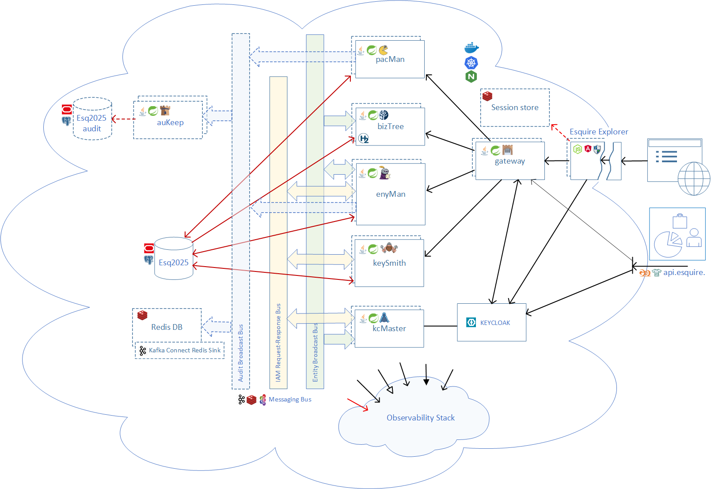
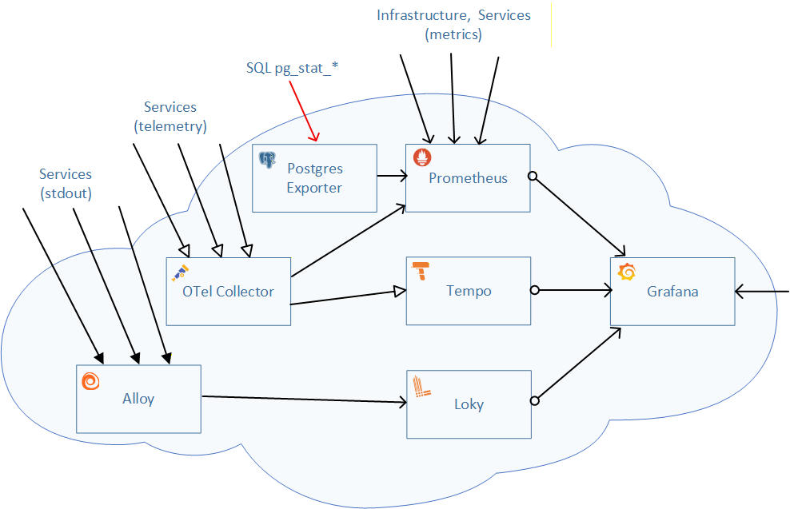

<table style="width: 100%; table-layout: fixed;">
  <tr>
    <td style="width: 12%"></td>
    <td style="width: 88%;">
       <h1>Esquire Application Frameworks(tm) 2.0</h1>
    </td>
  </tr>
</table>

# Esquire — Developer Setup (from zero)

How to go from a clean machine to a running Esquire stack you can build, run,
and test — on the two local targets the project uses: the **docker sandbox** and **local
Kubernetes** (Docker Desktop). This is the developer-facing companion to the front-door
`README.md` (which stays plain prose); setup detail and jargon live here.

---

## 1. What you are setting up

Esquire is a set of cooperating pieces, not a single app. It has five layers: the **application
services**, the **browser tier** in front of them, the **messaging bus** that joins them, the
**backing infrastructure** they run on, and — on demand — the **observability stack** that watches
them. This section is a map; the architecture docs carry the depth.



*The Esquire component model: the application services and the browser tier over the messaging bus,
with the backing infrastructure they depend on. (Larger, in the front-door `README.md`.)*

### 1.1 Application tier — the seven Spring services

| service | what it does |
|---|---|
| `gateway`   | the API front door — one entry URL, routes to the services, validates the JWT |
| `bizTree`   | the business-tree cache (the recoverable Taijitu cache) that answers tree reads |
| `enyMan`    | the entity manager — organizations and users; owns the tree MOVE |
| `pacMan`    | the account manager — accounts under a user |
| `keySmith`  | credentials — publishes credential changes toward KeyCloak over the bus |
| `kcMaster`  | owns KeyCloak synchronization (the SERVER on the KeyCloak request/response bus) |
| `auKeep`    | the audit keeper — consumes the audit bus and writes the `*_log` tables |

Behind the services are the **shared libraries**, layered base-first —
`mir0n-utils` &larr; `messaging` &larr; `common` — plus `dataKeep` (the generic keep engine) and
the companions `audit` (audit wiring) and the transport drivers `tp-activemq` / `tp-redis` /
`tp-kafka` (one per bus provider). Details: `Esquire.MessagingBus.md`, `Esquire.BizTree.md`.

### 1.2 Browser tier — BFF + SPA (the `explorer` repo)

- **SPA** — the Angular **Explorer** in the browser.
- **BFF** — a Node back-end-for-frontend: the `/api/*` proxy that holds the session and injects the
  bearer token on every call to the services (so the browser never handles the token directly).
- **`esquire.ui.lib`** — the reusable Angular UI library the Explorer consumes (its own repo).

The `explorer` repo also holds the **e2e** (Playwright) suite and the **hauberk** load harness.

### 1.3 Messaging bus — the topology

The services talk over the **Esquire Messaging Bus**. The whole layout is one external **catalog**
(`compose/topology/esquire-topology.yml`, bind-mounted at `/etc/esquire/topology.yml` and loaded by
every service via `spring.config.import`). Three logical buses ship:

| bus | kind | who / where |
|---|---|---|
| `esquire.entity` | broadcast (topic) | publishers post entity updates on `esquire.entity.broadcast`; `bizTree` + `kcMaster` consume and apply |
| `esquire.kc`     | request / response | two nodes `esquire.kc.request` + `esquire.kc.response`; `enyMan` / `keySmith` are the CLIENT, `kcMaster` the SERVER |
| `audit-*`        | sink | the audit feed — `auKeep` consumes and writes the log. One `audit` slot, several transports: `audit-c` (ActiveMQ, the default), `audit-ck` (Kafka), `audit-d` (Redis stream), `audit-dk` (Kafka topic), and `audit-off` (an explicit no-op when DB triggers carry the audit instead) |

The default transport is an **ActiveMQ** broker; **Kafka** and **Redis** providers also exist and
are selected per slot in the catalog. Full model (bus / slot / node / role / rod-class / transport):
`Esquire.MessagingBus.md`.

### 1.4 Backing infrastructure

- **Data** — PostgreSQL, database `esq2025`. Both docker and k8s run the SAME baked-seed Postgres
  container image (built from `db.seed`); each service's `DB_*_HOST/PORT/VENDOR` can be overridden to
  point at a host database instead — including a host **Oracle** instance for the Oracle branch (see
  sections 5 and 6). OKE uses OCI-managed Postgres.
- **Identity** — a KeyCloak realm (`esquire`) the services trust.
- **Broker** — ActiveMQ by default (the bus transport above).

### 1.5 Observability (on demand)

Opt-in, off in the everyday stack (section 8). When enabled it stands up a **Grafana** single pane
over: **Prometheus** (metrics), **Loki** + **Alloy** (logs — Alloy ships them to Loki), **Tempo** +
**OTel Collector** (traces), a **postgres-exporter** (DB metrics), and the per-target exporters on
the broker (JMX on `:9404`) and KeyCloak. Details: `Esquire.ObservabilityStack.md`,
`Esquire.GrafanaGuide.md`.



*The observability stack: Grafana as the single pane over the three pillars — Prometheus (metrics),
Loki + Alloy (logs), Tempo + OTel Collector (traces) — fed by the services and the exporters.*

### 1.6 High availability & resilience

On Kubernetes each service is a **StatefulSet** that can run **redundant instances** (local k8s and
OKE deploy x2; the design supports up to ten). Instances spread across nodes (`topologySpread`).
Redundancy is made safe by the **resilience budget** (R1&ndash;R5), a set of knobs the HA charts
turn ON that are OFF in the plain single-instance config:

- **Web** (R2) — bounded Tomcat: `maxThreads` 25, `acceptCount` 50.
- **DB pool** (R3) — `dbPoolMax` 10 / `minIdle` 2, `connectTimeout` 5000&nbsp;ms; pools sized so the
  whole fleet fits Postgres `max_connections`.
- **DB socket** (R5) — pgjdbc `socketTimeout` 35&nbsp;s + `tcpKeepAlive`, so a silently-dropped DB
  connection is detected (HikariCP `isValid()` alone cannot see it).
- **Bus** — the producer **send-retry** sublayer (block mode) on the entity + KeyCloak legs (opt-in;
  ON in docker + k8s), so a brief broker hiccup back-pressures instead of dropping.
- **Move** — `in-move-grace-ms` 200 (the elastic end-of-move that keeps the tree consistent while a
  MOVE drains). Details: `Esquire.BizTree.md`.

Full budget and the cloud (OKE) HA deploy: `Esquire.HighAvailability.md`.

### 1.7 Run targets

Three run targets run the **same images and the same charts** — they differ only in redundancy and
in what each trims for its purpose:

- **docker sandbox** — the fast local stack under `services/compose/` (section 5).
- **local k8s** — Docker Desktop Kubernetes + ingress-nginx + MetalLB (section 6).
- **cloud (OKE)** — Oracle Kubernetes Engine, the live public deployment (section 7).

| | docker sandbox | local k8s | cloud (OKE) |
|---|---|---|---|
| **Instances / service** | 1 | x2 (StatefulSet) | x2, spread across 3 app nodes |
| **Redundancy** | none | rehearsed — x2 on ONE node | real — x2 across nodes / ADs |
| **PostgreSQL** | baked-seed container (same image as k8s; host DB / host Oracle optional) | baked-seed container | OCI Postgres — `ALTER`-migrated, never reseeded |
| **Audit** | bus `audit-c` (ActiveMQ) &rarr; `auKeep` | bus `audit-c` &rarr; `auKeep` | DB triggers — `audit-off`, **no `auKeep` pod** |
| **BFF** | 1 | redundant-capable (Redis present) | 1 (no HA Redis yet) |
| **Observability** | on demand (section 8) | on demand (section 8) | on demand, **transient** (section 7/8) |
| **Purpose** | fast dev / test | correctness rehearsal of the deploy shape | live public demo |

**Reading the differences — why each target looks the way it does:**

- **docker is deliberately minimal** — single instances, host DB. It is the fast inner loop for
  writing and testing a change, not a deployment rehearsal, so it carries no redundancy.
- **local k8s is the "full" model — the complete component set, rehearsed.** It runs EVERY piece
  (all services INCLUDING `auKeep`, the audit bus, and the containerized infra — baked-seed Postgres,
  KeyCloak, broker, Redis) as StatefulSets at **x2**. That x2 exercises the real deployment shape —
  shared session, rolling update, peer reconcile between instances — but it sits on ONE Docker
  Desktop node, so it is **redundant only "twice" and only in shape**: it proves correctness, it is
  not a real failure domain. It is the correctness rehearsal for OKE, not a stand-in for HA.
- **OKE has no audit bus** because it is the Always-Free public DEMO, not a load-test sandbox. To
  spare the small node and broker budget it takes audit option (a): **DB triggers** write the log
  directly, so no `auKeep` pod and no extra broker audit traffic are needed. Its audit ref points at
  the explicit `audit-off` no-op bus (section 1.3).
- **OKE keeps the BFF at a single instance** because the BFF holds the login session in **Redis**,
  and HA of the browser tier IS HA of Redis. OKE has no HA Redis yet, and scaling the BFF against a
  single shared Redis only moves the failure (that Redis is then the SPOF). So the BFF stays at 1
  until HA Redis exists. Local k8s DOES run a Redis, so there the BFF can be redundant.

Full HA reasoning and the OKE-vs-local comparison: `Esquire.HighAvailability.md`.

---

## 2. Prerequisites

Install and put on `PATH`:

- **JDK 25** — the runtime. (Source/bytecode target is Java 24; the build runs on JDK 25.)
- **Maven 3.9+**.
- **Docker Desktop** — with the built-in **Kubernetes** enabled (for the k8s target) and enough
  memory (the full stack plus a redundant k8s deploy is heavy).
- **Node.js LTS** + npm — for the Angular SPA and the Playwright e2e suite.
- **`psql`** client — handy for poking the DB (the sandbox ships its own Postgres container, reachable
  on `localhost:5433`; a host Postgres is NOT required). A host **Oracle** instance is optional — only
  if you want to exercise the Oracle `db.seed` branch (section 5).
- **git**.

Optional / target-specific:
- `kubectl` + `helm` — for the local k8s target (bundled scripts wrap them).
- OCI CLI — only for the cloud (OKE) target, not needed for local work.

---

## 3. Repositories and workspace layout

The working copy ("dev tree") is a set of SIBLING repos under one folder:

```
C:\MyProjects\esquire\
  services\        (this repo — the seven services + shared libs + compose + k8s)
  explorer\        (Angular SPA "Explorer", the Node BFF, the e2e suite, the hauberk load harness)
  db.seed\         (the database schema + seed data — Postgres and Oracle branches)
  esquire.ui.lib\  (the reusable Angular UI library the Explorer consumes)
```

Two rules that matter:
- **The dev tree is a working copy, NOT a git tree.** Git lives in a separate mirror
  (`C:\mir0n-git\esquire.*`) and the CI runner has its own checkout again. Never mix the three.
- Changes are promoted dev-tree → git mirror by hand as a deliberate step (reviewed at commit).

---

## 4. Build

From `services/`:

```
mvn -q -DskipTests clean package        # all services + libs, skip tests
mvn -q -pl enyMan -am package           # one service and everything it needs
mvn -q -pl messaging -am test           # run one module's tests (see section 9)
```

The compose rebuild script (section 5) runs the Maven build for you.

---

## 5. Run — the docker sandbox

**Database (read this first):** the docker sandbox runs Postgres AS A CONTAINER — `esq-postgres`,
image `esquire-postgres:17`, built from the sibling `db.seed` tree via `services/postgres/Dockerfile`
(the SAME image k8s uses). The services reach it at `postgres:5432` (the `DB_*_HOST` defaults =
`postgres`), database `esq2025`. It **seeds itself on first init** (an empty data volume) — no manual
`psql` step. Host tools reach the same DB on **`localhost:5433`** (the container maps `5433:5432`, so
a host Postgres on `:5432` does not clash). To reseed: bring the stack down, remove the
`postgres-data` volume, bring it up again (the seed re-runs only on an empty volume).

**Using a host database instead (optional).** Every DB-backed service takes `DB_<svc>_HOST` /
`DB_<svc>_PORT` / `DB_<svc>_VENDOR` overrides, so you can point a service at a database on the host
rather than the container. In particular a host **Oracle** instance is supported —
`DB_<svc>_VENDOR=dev-oracle`, `DB_<svc>_PORT=1521`, `DB_<svc>_HOST=host.docker.internal` (the
commented lines in `compose.yaml` show the switch). No Oracle container ships in the stack; pointing
at a host Oracle is how the Oracle `db.seed` branch is kept exercised and in shape.

**KeyCloak** is also a container here (`esq-keycloak`), started with `start-dev --import-realm`, its
data bind-mounted at `compose/data/keycloak`.

Bring the stack up (from `services/compose/`):

```
compose-rebuild.bat                 # build ALL service images from each service's own dir, recreate
compose-rebuild.bat enyman          # rebuild + recreate ONE service (gateway|biztree|enyman|pacman|
                                    #   keysmith|kcmaster|aukeep|backend|frontend)
docker compose up -d                # (re)create containers from already-built images
docker-compose-down.bat             # stop + remove
```

Handy endpoints once up:
- Explorer SPA + BFF — `http://localhost:4200` (the ng-serve container; the BFF `/api/*` proxy is
  behind it).
- KeyCloak — `http://localhost:8081/kc-auth` (relative path `/kc-auth`).
- ActiveMQ console — `http://localhost:8161` (admin/admin).

**Reseed gotchas (they bite):**
- Postgres seeds only on an EMPTY volume. To re-seed, wipe the `postgres-data` volume (down, remove
  the volume, up); a running-but-stale DB will not re-apply the seed on its own.
- KeyCloak's `--import-realm` is SKIPPED if the realm already exists. To re-import an edited realm
  (`keycloak/import/esquire.json`): stop, wipe `compose/data/keycloak`, recreate.
- If the stack is in a bad state, **rebuild from scratch** rather than firefighting partial
  restarts: down, wipe the `postgres-data` volume and the relevant `compose/data/*` dirs, up.

---

## 6. Run — local Kubernetes (Docker Desktop)

This target mirrors the cloud shape: the SPA + BFF answer on `http://esquire.localhost/` (port 80
via ingress-nginx + MetalLB).

**Safety first:** always confirm the kube context before any up/down/helm — a wrong context has
destroyed the real cloud cluster once.

```
kubectl config current-context      # must be: docker-desktop
```

**Database:** unlike docker, k8s DOES run a Postgres container — a **baked-seed image**
(`esquire-infra-postgres` StatefulSet) that seeds only on an empty volume. Reseed locally by
wiping the PVC and redeploying. (Never reseed the cloud DB — that wipes production.)

One-time cluster add-ons, then bring up (from `services/k8s/`):

```
addIngressNginx.bat                 # one-time: ingress-nginx
addMetalLB.bat                      # one-time: MetalLB (serves esquire.localhost on :80)
k8s-up.bat                          # helm install/upgrade the whole stack
k8s-rebuild.bat                     # rebuild images + roll the deploys
k8s-down.bat                        # tear down
show.them.all.bat                   # status of everything
```

Host file prerequisite: map `esquire.localhost` (and `api.esquire.localhost`) to `127.0.0.1`.

---

## 7. Run — the cloud (OKE)

The live public deployment runs on **Oracle Kubernetes Engine (OKE)** at
`https://esquire.mir0n.pro`. It uses the SAME charts and images as local k8s, with a per-chart
values overlay under `services/k8s-oci/values/`. Everything for it lives in `services/k8s-oci/`
(its own `README.md` is the full runbook; this is the orientation).

**Shape.** The Oracle Always-Free envelope: four A1.Flex ARM nodes (one `tier=infra` + three
`tier=app`, 1 OCPU / 6 GB each). The deploy is HA — each service runs x2, spread across the three
app nodes — for a 16-pod stack: 6 services x2 + the BFF + 3 infra pods. `auKeep` is NOT deployed
here: OKE takes audit option (a), DB triggers, so its audit ref points at `audit-off` (section 1.3).

**Prerequisites** (beyond section 2): an OCI account with an OKE cluster; the **OCI CLI** configured
(`oci setup config`); a GHCR token with `write:packages`; Docker `buildx` (for multi-arch images);
and the `esquire.mir0n.pro` DNS A record pointed at the OCI load-balancer IP.

**Deploy flow** (from `services/k8s-oci/`; full detail in that README):

```
ghcr-push.bat                 # build + push all images multi-arch (amd64 + arm64) to GHCR
oke-login.bat                 # fetch kubeconfig, switch kubectl context to OKE
oke-bootstrap.bat             # ONE-TIME: ingress-nginx (creates the public LB) + cert-manager +
                              #   Let's Encrypt issuer; prints the LB IP for the DNS A record
cluster\node-labels.bat       # ONE-TIME: label nodes tier=infra / tier=app
oke-up.bat <pgPw> <kcPw>      # deploy the stack with prod values (secrets passed in, never baked)
show.them.all.bat             # verify: 16 pods Ready, TLS cert bound, replicas on different nodes
oke-down.bat                  # uninstall (cluster + LB + PVCs stay; re-install is fast)
```

Ingress is a single A record + path routing: `/` -> frontend, `/api/` -> gateway,
`/auth/` -> KeyCloak.

**Safety — the same kube-context rule as local k8s, but stricter.** OKE is the real cloud. NEVER
run a local `k8s-*.bat` while the context is OKE, and NEVER reseed the OKE database — it holds real
state (migrate with `ALTER`, never reseed). Confirm the context (`oke-login.bat` sets it) before any
command; a wrong context has destroyed the cluster once.

**Observability on OKE is transient — do not leave it on.** Enable it on demand with
`oke-o11y-on.bat` / `oke-o11y-off.bat` (reach Grafana via `oke-grafana-forward.bat`), verify, then
take it back down — the Always-Free tier has no room to host it always-on (section 8;
`Esquire.ObservabilityStack.md`). `oke-config-parity.bat` diffs the local-k8s and OKE ConfigMaps to
catch a setting applied locally but missed on OKE.

Full HA rationale and the OKE-vs-local comparison: `Esquire.HighAvailability.md`.

---

## 8. Observability (opt-in, on demand)

Logs, traces, and metrics are OFF in the everyday stack. A pair of scripts per target turns the
whole single pane on and off — logs (Loki + Alloy), traces (Tempo + OTel Collector), metrics
(Prometheus), all viewed in Grafana. Turning it on both deploys the viewing stack AND recreates the
app services with observability enabled; turning it off tears the viewing stack down again.

- **docker** (from `services/compose/`): `o11y-on.bat` / `o11y-off.bat`; `o11y-log-on.bat` /
  `o11y-log-off.bat` for logs only; `o11y-verify.bat`, `o11y-test.bat`. Grafana at
  `http://localhost:3009` (admin/admin) — note `:3000` is the BFF, not Grafana.
- **local k8s** (from `services/k8s/`, run AFTER `k8s-up.bat`): `o11y-on.bat` / `o11y-full-on.bat`
  / `o11y-off.bat` (and `o11y-log-on.bat` / `o11y-log-off.bat`); `o11y-forward.bat` /
  `o11y-forward-stop.bat` to reach the pane; `o11y-verify.bat`, `o11y-test.bat`. Grafana at
  `http://grafana.localhost` (admin/admin).
- **cloud (OKE)** (from `services/k8s-oci/`, kube-context on OKE): `oke-o11y-on.bat` /
  `oke-o11y-off.bat`; reach Grafana via `oke-grafana-forward.bat`; `oke-o11y-verify.bat`,
  `oke-o11y-test.bat`. Here it is **strictly transient** — the Always-Free tier has no room to host
  it always-on, so the pattern is enable &rarr; verify &rarr; take it back down (section 7).
  `oke-config-parity.bat` diffs the local-k8s and OKE ConfigMaps to catch a setting missed on OKE.

**On demand by design.** The viewing stack is not left running: the everyday stack — and the
resource-limited dev / demo environments — is not burdened when nobody is looking. Enable it at any
point on any target, verify, then turn it back off. On OKE this is not just polite but required —
the free tier cannot carry the observability stack and the app fleet at the same time.

In Grafana: Explore → Loki → `{job="esq-docker"}` (or `esq-k8s`) `| json | correlationId = "<traceId>"`,
and Tempo → search that same `correlationId` as the trace id — logs and traces meet on one id.

---

## 9. Tests

- **Unit + integration** — `mvn test` (module-scoped: `mvn -q -pl <svc> -am test`). The
  integration tests (`*IntegrationTest`, Testcontainers + `@SpringBootTest`) need **Docker running**
  (they start real Postgres/KeyCloak/broker containers) but run the app code in-JVM.
  Coverage report (JaCoCo, unit + in-JVM ITs combined): `target/site/jacoco/index.html` per module.
- **End-to-end** (Playwright) — in `explorer/e2e-test/`:
  - `e2e-test.bat` — against the docker sandbox (`http://localhost:4200`).
  - `e2e-k8s.bat` — against local k8s (`http://esquire.localhost`).
  - Credentials in `e2e-test/.env` (default `mainadmin` / `q`). The mutating specs build and tear
    down their own working data under the seeded Test House (they do not touch the shared seed tree).
- **Load / stress** (Gatling) — the `explorer/hauberk` harness (its own `.bat` launchers).

---

## 10. Generated API docs

From `services/`:

```
make-javadoc.bat                    # API reference for the reusable library modules
```

Output is published OUTSIDE `target`, under `doc/java-doc/<module>/` — a browsable reference for
extenders (common, messaging, dataKeep, audit, tp-*).

---

## 11. Gotchas worth memorizing

- **Rebuild from scratch** beats firefighting a half-broken local stack (down + wipe data + up).
- **Seed/realm changes apply only on a fresh init** — the DB seed runs on an empty data dir; KC
  `--import-realm` is skipped if the realm exists. Wipe the data dir to re-apply.
- **kubectl context** — check it before every k8s command.
- **`:latest` digest trap** — Docker Desktop can hold a stale `:latest`; rebuild pulls the new
  digest. The same applies to infra images.
