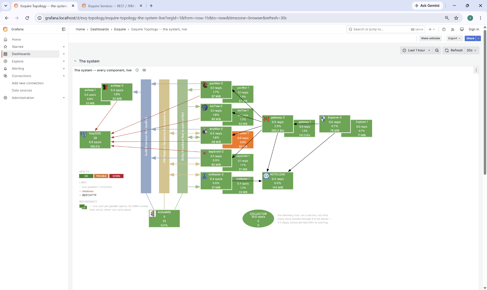
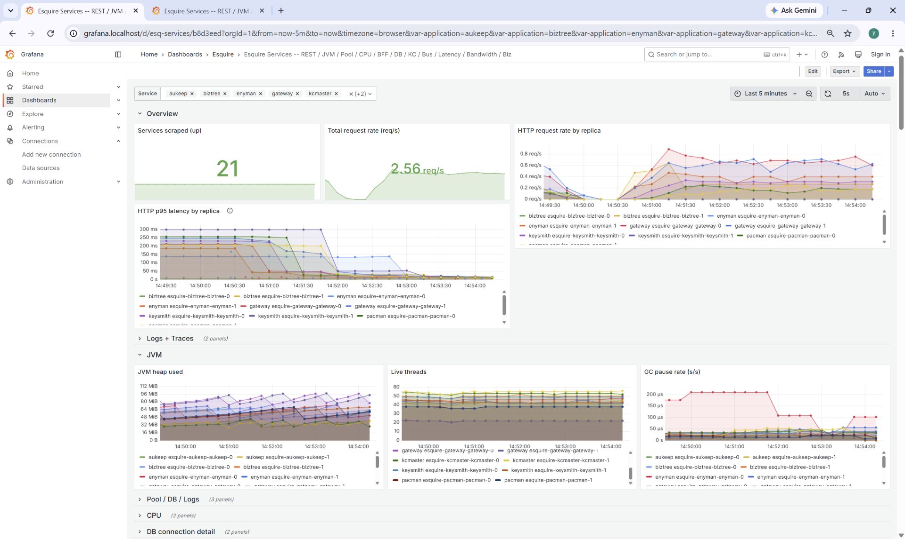
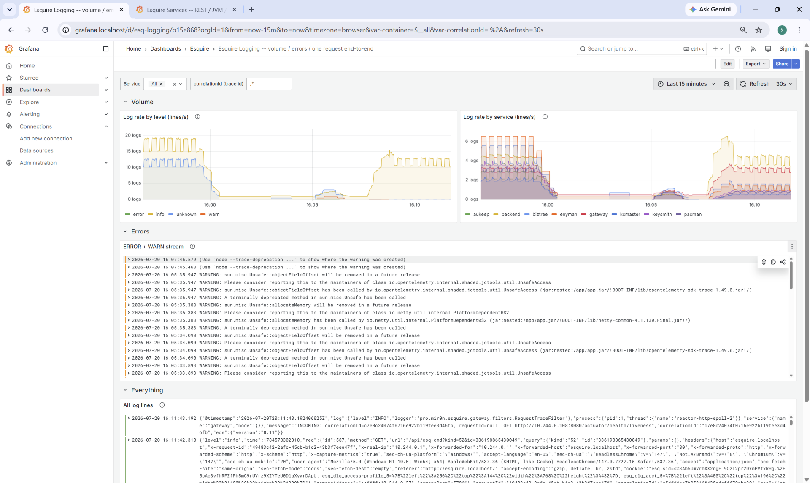

#  Esquire Application Frameworks(tm) 2.0

# **Reading the Esquire Grafana Panes -- a User Guide**

This is for someone who **opens** the dashboards to answer a question -- "why was that request slow?", "what broke?", "what did the system do in the last hour?" -- not for someone building the stack. How the pieces fit together is the [Observability Stack](Esquire.ObservabilityStack.md) design record; this page is just how to use them.

---

## First: dark, or empty, is usually not broken

Observability is **off by default**, so a fresh stack is dark all over -- and empty panels look broken when they only mean "not turned on yet." An empty panel is almost always one of four things; from the whole board down to a single panel, name which one before you go hunting for a bug:

1. **The whole board is dark -> observability is off.** `ESQ_OBSERVABILITY_ENABLED` is the master switch, **off by default**: no metrics, no traces, no logs shipped. Turn it on with the `o11y-on` script for your target (`o11y-off` takes it back down).
2. **The percentiles and their diamonds are dark, but the averages beside them are full -> histograms are off.** `ESQ_METRICS_HISTOGRAMS` is a second switch, **also off by default**; the percentile panels and the exemplar diamonds ride the histogram buckets (the expensive part of the bill). Blank percentiles next to full averages is the switch, not a break.
3. **One counter panel is empty -> it has not fired yet.** A counter does not exist until its first event, so a freshly restarted stack shows nothing on it until then. Create one entity, move one account, and it appears.
4. **An error or warning panel is empty -> the system is healthy.** That is the good case -- empty is the answer you want.

**These switches are NOT on the Grafana screen.** They are settings on the **services' own config** (`application.yml` / environment variables), read at start-up -- so you do not hunt for a toggle in Grafana, and changing them means recreating the services (which the `o11y-on` / `o11y-off` scripts do for you). Grafana only *shows* what the services chose to emit.

---

## The three dashboards, and what each one answers

**Esquire Services -- how the system RUNS.** Request rate, errors, and timing for every service, replica by replica. This is where you watch health and find a slow or failing service. The **business rows** at the bottom are the other half: not how the system runs but **what it does** -- entities created and moved, account postings, identity syncs -- the domain activity in numbers.

**Esquire Logging -- what the system SAID.** The log lines from every service. The one control that matters here is the **correlationId box**: paste a correlationId and **every panel narrows to that one request**, across every service it touched -- the whole story of one request on one screen.

**Esquire Topology -- the shape of the system, live.** One picture of every component and every connection between them, each box coloured by its own health and carrying its own live numbers. This is the **first screen to open** for production support: it shows at a glance what is up, what is degraded, and where a problem is spreading -- without opening a single service. From any box you click through to that component's detail on the Services dashboard.

---

## The three things you actually walk in with

You almost never arrive wanting "a trace" or "a metric." You arrive with one of three situations, and each has a path across the panes. (Under the hood these are four links between metrics, traces, and logs -- but you reach them from these three starting points.)

**1. "I see an error."**
Start in **Esquire Logging**. Find the error line, expand it, and click **View trace** on its `correlationId` field -- that opens the request's full trace, every service it passed through. From a span in that trace, **Logs for this span** jumps back to the exact log lines that span produced. You now have the error, its trace, and its logs, all tied together.

**2. "I see a spike."**
Start in **Esquire Services**, on a latency panel. A percentile panel carries little **diamonds** (exemplars) -- each diamond is one real request that produced that sample. Click the diamond on the spike and it opens **the trace of that exact slow request** -- not a similar one, that one. From there, **Logs for this span** takes you to its log lines.

**3. "I have a correlationId."** (from an error report, or a user's support ticket)
Go straight to **Esquire Logging**, paste the id in the box, and every panel narrows to that request. Expand any line and **View trace** opens its trace; from a span, the service's own **rate/errors/timing** metrics are one click away.

**The four links, named** (so you know they exist):
- **metric -> trace:** a diamond on a percentile panel opens the trace behind that one sample.
- **trace -> logs:** "Logs for this span".
- **log -> trace:** expand a line, the `correlationId` field's "View trace".
- **trace -> metric:** a span jumps to the rate/errors/timing of the service it ran in. This is the only hop you reach **from a trace**, not from a dashboard -- so it is the one nobody finds by accident.

---

## The diamonds (exemplars) -- where they are and how to click one

An **exemplar** is a single real request pinned onto a metric. On a latency panel it draws as a small **diamond** sitting on the line at the moment that request happened. It is the bridge from "the graph moved" to "here is the one request that moved it."

- **Where they appear.** Only on the **percentile / p95 latency** panels (Overview "HTTP p95 latency by replica", "Gateway total p95 by route", "Bus send latency p95", ...). They ride the histogram buckets, so they need **both** switches on: observability, **and** `ESQ_METRICS_HISTOGRAMS`. With histograms off, the average panels still work but the diamonds are gone -- that is the switch, not a break.
- **How to click one.** Hover the diamond to see the request; click it, and Grafana opens **that request's trace** in Tempo (the diamond carries the `trace_id`). Not a similar request -- that exact one.
- **Why it matters.** A spike on a percentile panel is *where a human notices a problem*. The diamond is the shortest path from noticing to the actual slow request -- no searching, no guessing which trace.

---

## The Topology board -- reading the picture

The board is deliberately the **same drawing** as the component model in the docs (`doc/model/ComponentModel.svg`), with the numbers switched on -- so it reads as the documented system, not a second, differently-arranged map. Left to right: the audit sink and the database, then the three bus lanes, then the services, then the gateway and identity, then the Explorer (BFF).

### A component box -- three things at once

Every box tells you three separate things, and it is worth knowing which is which:

1. **The FILL colour = the component's own health.** Three states, not two:
   - **green = OK** -- up and within limits.
   - **amber = TROUBLE** -- up, but a warning is firing: CPU over 80%, heap over 85%, the DB pool over 90%, a queue backing up, or (on k8s) an **idle twin** (see below). It is still running, but look here.
   - **red = DOWN** -- not reporting at all. (A dead component reports *nothing*, not zero; the board turns that absence into red on purpose, so a dead box shouts instead of sitting grey.)

   Green does **not** just mean "the process is alive" -- a pinned CPU or a filling queue turns it amber. That is the point: the board is loudest exactly when something is wrong.

2. **The BORDER (rim) = an alarm, usually about a DEPENDENCY.** A bright magenta rim means an alarm fired in the last minute -- an error was logged, a 5xx went out, a circuit breaker tripped, or a failure counter ticked. Fill and border are **two channels on purpose**: when Postgres dies, its own box fills **red**, and every service that talks to it stays **green** (its process is fine) but rims **magenta** (it is logging DB errors). One colour could not say both. A one-off alarm holds for about a minute, then clears itself -- the card *is* the alert; there is no separate alerting engine.

3. **The three LIVE NUMBERS = is it doing WORK.** A colour says a thing is running; it does not say it has stopped doing anything, which is the failure that actually happens. So every box carries three vitals -- typically **req/s (or msg/s), CPU%, and heap** -- each with its unit. A box that is green and serving `0.0 req/s` while its work should be flowing is telling you something a traffic light cannot.

**Click any box** to jump to that component's detail on the Services dashboard. The board is the way in, not the whole story.

### The legend (bottom-left of the board)

| section | what it tells you |
|---|---|
| **HEALTH** -- OK / TROUBLE / DOWN | the three fill colours above (green / amber / red). |
| **LINES** -- bus / database / REST/HTTP | the three kinds of connection, by colour (below). |
| **REDUNDANCY** -- one card per parallel replica | on k8s a component is a **stack of cards**, one per running copy (below). |

### The lines -- three kinds, told apart by colour and shape

- **The three vertical bus lanes** (coloured bars: **Audit Broadcast**, **IAM Request-Response**, **Entity Broadcast**). Async messaging is drawn as buses you *tap*, not as service-to-service arrows -- because a service publishes to a bus and walks away; who is listening is not its business. Three lanes, not one bar, because the whole point is **which services share a medium and which never meet**: bizTree and keySmith never touch; auKeep hears everyone and answers no one; enyMan is on all three.
  - **Arrow heads say direction.** Head **on the lane** = the service *publishes* into it. Head **on the service** = the service *consumes* from it. **Double-headed** = request/reply, it does both (the whole IAM bus is like this). The **broker has no head** -- it *is* the medium.
- **Red line = a database call.** A REST/DB call is point-to-point -- something called and *waited* for an answer -- so it gets an arrow. Red is the database specifically.
- **Black line = a REST/HTTP call.** The busiest kind of line on the board, so it is drawn in the ink of the drawing, not a faint grey.

### Replica stacks and the idle twin (k8s only)

On local Kubernetes the seven Java services and the Explorer run **two copies each**, so a component is drawn as a **stack of cards** -- "enyMan 0" in front, "enyMan 1" peeking out behind -- each with its **own** health colour and its **own** three numbers. Infra (Postgres, ActiveMQ, KeyCloak) runs a single copy and stays a single card -- which is itself worth seeing: the board then *shows* what is redundant and what is a single point of failure.

The two copies are **active-active** -- both serve, neither is a spare. So if one card sits at `0.0 req/s` while its twin is busy, that is **half the capacity missing**, not a spare resting -- and the board turns that card **amber** (the "idle twin" warning). It only fires when it is really true (the twin doing real work for 15 minutes while this one does nothing), so it is a finding, not noise.

**So enyMan-1 amber while the rest are green** usually means exactly this, or a brief alarm still inside the board's time window from a recent restart -- not a dead service. Check the card's numbers and its detail before treating it as a fault.

### Two special boxes

- **ActiveMQ (the broker)** sits under the middle lane. Watch its **memory%**: the broker is non-persistent, so the bus lives in RAM, and memory filling is what back-pressures producers when a consumer dies.
- **COLLECTOR (the ellipse)** is the one box that is *not* a system component -- it is the telemetry hub, drawn as an ellipse so you can tell at a glance it is a different kind of thing. Every trace in the fleet passes through it; if it starts dropping spans, traces go quietly missing and nothing else would say so. That is why it earns a box. It has no arrows -- it is a health indicator, not a data-flow node.

---

## The Services dashboard -- every panel, and how to read it

The dashboard is grouped into collapsible rows. The top rows are **how the system runs** (the RED view: rate, errors, duration, plus infrastructure); the **Business** rows near the bottom are **what it does** (domain activity); the last rows are **resilience** and **capacity**. Below, per group: what each panel is and how to read it.

### Overview -- the first glance

| panel | how to read it |
|---|---|
| Services scraped (up) | how many targets Prometheus is reaching. Below the expected count = something is not being scraped. |
| Total request rate (req/s) | the whole fleet's request rate, one number. Your baseline for "busy or quiet". |
| HTTP request rate by replica | the same rate split per replica -- shows how load balances across the x2 pods. |
| HTTP p95 latency by replica | 95th-percentile latency per replica. **Carries diamonds** -- click one on a spike to open that exact slow request's trace (needs histograms on). |

### Logs + Traces -- the two jump-off points

| panel | how to read it |
|---|---|
| Errors + warnings (all services) | live WARN/ERROR across the whole fleet. Expand a line -> the `correlationId` field has **View trace** (log -> trace). Empty is the healthy answer. |
| Slowest recent traces (>100ms) | recent traces over 100ms, newest first. Click one to open the waterfall; from a span, jump to its logs and to the service's metrics. |

### JVM -- each service's engine

| panel | how to read it |
|---|---|
| JVM heap used | memory in use per service. A line climbing steadily toward its ceiling and never falling back is a leak or an undersized heap. |
| Live threads | thread count per service. A steadily rising count that never settles is a thread leak. |
| GC pause rate (s/s) | time spent paused for garbage collection. Rising pause time shows up as latency; a saw-tooth is normal. |

### Pool / DB / Logs -- the database seam

| panel | how to read it |
|---|---|
| Hikari DB pool -- total (solid) / in-use (dashed) | connection pool size vs how many are borrowed. In-use riding the total means the pool is exhausted -- requests are waiting for a connection. |
| DB query rate (connection borrows/s) | how often the DB is being hit, per service. |
| Log error / warn rate | error/warn log volume per service, as a rate -- a fast way to see which service is complaining. |

### CPU -- work per service

| panel | how to read it |
|---|---|
| CPU usage by replica (process) | a fraction of that JVM's **own** effective CPUs, not the machine. `1.0` = "using its one allotted core" on k8s, "using all 24" on docker -- so this line is **not** comparable across targets. |
| Host CPU (system) | whole-machine CPU. Read it with "Cores in use" below -- a busy host is not the same as a busy Esquire. |

### DB connection detail

| panel | how to read it |
|---|---|
| Avg DB connections in use (time-weighted) | the true average draw on the pool over time -- steadier than the raw in-use line. |
| Avg DB connection hold time (ms/borrow) | how long a borrowed connection is held. Rising hold time is slow queries or long transactions squeezing the pool. |

### BFF (Node.js) -- the Explorer's server side

| panel | how to read it |
|---|---|
| BFF request rate by replica | per-replica request rate -- how load balances across the x2 BFF pods (single instance on docker). |
| BFF p95 latency by route | latency per route, across replicas -- answers *which route* is slow. |
| BFF memory by replica (resident + heap used) | the Node process's memory, per replica. |
| BFF event-loop lag (s) + CPU (cores) by replica | event-loop lag is the Node health signal: rising lag means the single thread is blocked and every request waits. |

### Postgres

| panel | how to read it |
|---|---|
| Postgres connections (backends) | open connections at the server. Near the server's max is the failure that takes every service down at once. |
| Postgres transactions/s | commit rate -- the database's throughput. |
| Postgres cache hit ratio | share of reads served from memory. A drop means it has started going to disk for everything -- slow. |
| Postgres database size | total size on disk, over time. |

### KeyCloak -- identity server

| panel | how to read it |
|---|---|
| KeyCloak HTTP request rate | how hard identity is being hit. |
| KeyCloak avg HTTP latency (ms) | KeyCloak's own response time -- it is a separate server, so this is the cost of every live token call. |
| KeyCloak DB pool (agroal) | KeyCloak's own connection pool (it has its own database seam). |
| KeyCloak JVM memory (heap / non-heap) | KeyCloak's memory. |

### Messaging bus -- the in-house bus, service side

| panel | how to read it |
|---|---|
| Bus send rate (msg/s) | messages published per second. |
| Bus receive rate (msg/s) | messages consumed per second. |
| Bus error rate (msg/s) | flat at zero is healthy; a line lifting off zero is real bus errors (drawn as a zero line so "healthy" cannot be confused with "meter broken"). |
| Bus send latency (avg + p95 ms) | avg is always there; **p95 needs histograms on** -- with them off, the p95 series is simply absent. |
| Feed depth (tx queue) | the outgoing send queue. A rising depth means sends are not keeping up. |
| Send-retry: held + dropped (counts) | the send-retry sublayer. Flat at zero is healthy: held = messages parked awaiting re-send, dropped = given up after max attempts. Movement means the transport is failing sends. |
| Send-retry: backoff (avg ms) | the backoff step being waited out. A gap (no line) is healthy -- no retries, nothing to average. |

### Broker (ActiveMQ) -- the bus medium itself

| panel | how to read it |
|---|---|
| Queue depth (pending messages) | **the** number that says the bus is in trouble. Healthy is flat near zero; a depth that climbs and never comes back means consumers are gone or too slow. |
| Enqueue / dequeue rate (msg/s) | in vs out per destination. The two tracking each other is healthy; in above out is what fills the queue-depth panel. |
| Consumers / producers per destination | a consumer count dropping to **zero** on a live destination is a listener that has silently stopped -- the service meters cannot see this; only the broker can. |
| Broker usage (%) | percent of the broker's configured limits (not disk/pod). **Memory** is the one to watch: the bus lives in RAM. |
| Broker connections + total messages | broker-wide totals. Connections dropping is the fleet losing the bus; total messages held is the single number to alarm on. |
| Broker JVM heap (MB) + uptime | the broker's own JVM. A heap climbing to its ceiling turns into memory% back-pressure. Uptime resetting means the broker restarted. |

### Latency bands -- where a request's time goes

| panel | how to read it |
|---|---|
| Request latency bands -- DERIVED (avg ms) | the raw timers subtracted into the layers they imply: gateway-self + KC token-relay + in-cluster + service-self + service-inner. This is the "where did the time go" breakdown. |
| Request latency bands -- RAW (avg ms by layer) | the raw timers, each nested inside the one above -- the numbers the derived bands are computed from. |
| Gateway total p95 by route (ms) | per-route p95 at the gateway. **Needs histograms on**; with them off the avg-by-layer panels still work. |

### Bandwidth

| panel | how to read it |
|---|---|
| Service HTTP bytes OUT (B/s) | in-cluster outbound bytes, servlet services only. |
| Service HTTP bytes IN (B/s) | in-cluster inbound bytes, servlet services only. |
| Gateway EDGE bytes (B/s) -- client-facing | the **client-facing** bandwidth at the edge (the gateway is Netty, so this comes from reactor-netty, not a Tomcat MBean). |

### Business -- entity operations (what enyMan did)

| panel | how to read it |
|---|---|
| Entity operations (ops/s by op + outcome) | creates, deletes, moves, by outcome. No HTTP meter can see *which kind* of entity was acted on -- only this. |
| Move queue -- depth (pending) | the move backlog. `/esq-move` answers 202 at submit and works on a queue -- a rising depth means the worker is falling behind, and nothing on the request side would tell you. |
| Move outcome (per s) | the async half of a move. A move that fails on the worker is invisible to the caller (it already got its 202) -- this is the only place it shows. |
| Dictionary lookups (by kind) | which dictionary is being fetched (the HTTP meter only knows the endpoint, not the kind). |

### Business -- money (what pacMan did)

| panel | how to read it |
|---|---|
| Account transactions (tx/s by type + outcome) | deposits, withdrawals, transfers, by outcome -- the money path. |
| Transaction latency (avg ms by type) | how long each kind takes inside pacMan. A transfer is legitimately dearer (two legs + a rate lookup); watch for a type getting slower over time. |
| FX applied + accounts closed | a non-null conversion rate is an FX application (the cross-currency leg of a transfer); closures are counted only once a delete has fully succeeded. |

### Business -- identity + token relay

| panel | how to read it |
|---|---|
| KeyCloak identity sync (by op + outcome) | whether Esquire and KeyCloak still agree about who exists. A non-zero error line means the two have drifted. |
| KeyCloak sync latency (avg ms) | the sync's wall time (dominated by the KeyCloak round-trip). |
| Token relay -- cache hit rate | **the most load-bearing number here.** A hit serves the request without touching KeyCloak; a miss is a live `/token` round-trip on the hot path. |
| Token relay -- KC /token acquire (avg ms) | what a cache **miss** costs. Multiply by (100 - hit rate) to get what the relay actually costs you. |

### Business -- cache, keep + permissions

| panel | how to read it |
|---|---|
| Tree cache -- broadcast dispatch (by outcome) | what the cache did with each broadcast: applied / no handler / no payload / **failed**. The failed line is the point -- the dispatch hub swallows a handler exception, so this is the only place a broken handler shows. |
| Audit keep -- DB writes (by op + outcome) | the actual DB write at the audit sink. The bus meters say the event arrived; only this says the row was written. |
| Permission checks (allow vs DENY) | the authorization decision at the one gate every service passes. A rising DENY rate is a misconfigured role or someone probing. |

### Resilience -- circuit breakers (all live on the gateway)

| panel | how to read it |
|---|---|
| Breaker state -- OPEN / half-open (1 = yes) | flat at zero is healthy. A line stepping to 1 is a breaker that has **stopped** calling its backend -- every request on that route now fails fast with a 503. |
| Slow-call rate (%) | the number to watch under load. **Trap:** Resilience4j reports **-1**, not 0, until it has seen enough calls -- that means "no verdict yet", not "0% slow". |
| Failure rate (%) | same -1 = not-enough-calls convention. This rises on real errors -- a breaker opening here is the breaker doing its job. |
| Calls through the breaker (by outcome) | successful / failed / ignored -- the calls the rates above are computed from. |
| Calls REFUSED by the breaker (the 503s the breaker caused) | the smoking gun: every call here **never reached** the backend. If a load run collapses while this line is up, the breaker is the cause. |
| Per-route deadline -- TimeLimiter outcomes | the real per-route deadline. A rising "timeout" line means calls are cancelled at the deadline -- counted as failures at the breaker. |

### Capacity -- are we using the machine?

| panel | how to read it |
|---|---|
| Cores in use -- TOTAL across all services | the headline: how many CPU cores Esquire is actually burning, added up. Plateauing **below** the host's core count while latency climbs means the bottleneck is elsewhere (DB, locks), not CPU. |
| Cores in use by replica | cores per replica, in one unit that means the same on docker and k8s. A replica pinned at its ceiling is CPU-bound. |
| Effective CPUs the JVM sized itself for | what each JVM believes it runs on (the cgroup quota on a container, not the host). Catches the "JVM sized for the whole host" trap. |
| Host CPU -- the whole machine | whole-machine load. The load generator and the observability stack share this host, so a busy machine is not the same as a busy Esquire. |

---

## The Logging dashboard -- View trace / View log, and where to find them

The Logging dashboard has three groups: **Volume** (log rate by level and by service), **Errors** (the ERROR + WARN stream), and **Everything** (all log lines). Two controls at the top steer all of them: the **Service** picker and the **correlationId (trace id)** box.

**To narrow to one request:** paste a correlationId into the **correlationId box** at the top -- every panel then shows only that request's lines, across every service it touched. Leave it as `.*` to see everything.

**To jump from a log line to its trace (log -> trace):**
1. In the ERROR+WARN stream or the All-lines panel, **click a log line** to expand it.
2. In the expanded fields, find **correlationId** -- it carries a **View trace** link (that is the id doubling as the trace id).
3. Click **View trace** -> the full trace opens in Tempo: every service the request passed through, as a waterfall.

**To jump from a trace back to logs (trace -> log):**
1. With a trace open, **click a span** in the waterfall.
2. The span's links include **Logs for this span** -> it opens the exact log lines that span produced (the same correlationId, narrowed to that service).

**To jump from a trace to metrics (trace -> metric):**
- From a span, the **Related metrics** links open the service's request rate / error rate for the time around that span. This is the one hop you reach *from a trace*, not from a dashboard.

---

## One request, one id, three names

Everywhere you look it is the same string:

`correlationId` == `traceId` == `Esq-Correlation-ID` -- one value, three names (the log field, the trace id, and the HTTP header). That is why any of them is a valid place to start: an id from a log line, from a trace, from an error report, or from a user's ticket all point at the same request. (The full identity story is in the [Observability Stack](Esquire.ObservabilityStack.md#1-distributed-tracing) design doc.)

---

## The switches, in one place

These live in the **services' config** (`application.yml` / environment variables), read at service start-up -- **not** on the Grafana screen. The `o11y-on` / `o11y-off` scripts set them and recreate the services for you.

| switch | what it does | default |
|--------|--------------|---------|
| `ESQ_OBSERVABILITY_ENABLED` | the master -- metrics, traces, and log shipping. Off = every pane is dark. | **OFF** |
| `ESQ_METRICS_HISTOGRAMS` | the percentile panels and their exemplar diamonds. | **OFF** |
| `o11y-on` / `o11y-off` scripts | bring the whole viewing stack up or down on a target (docker / k8s / OKE). | -- |
