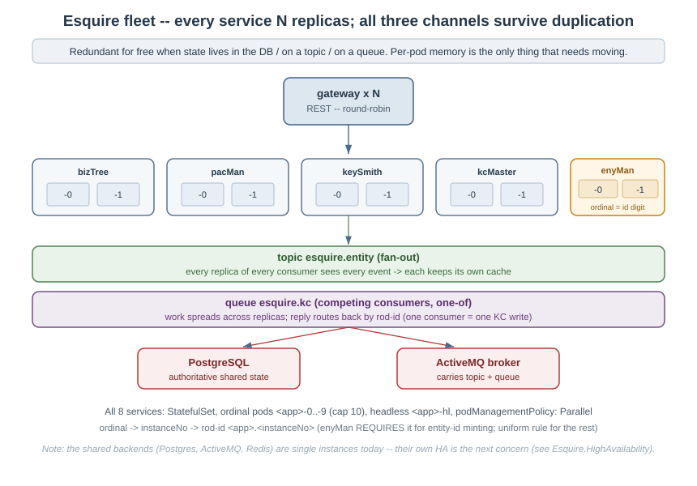
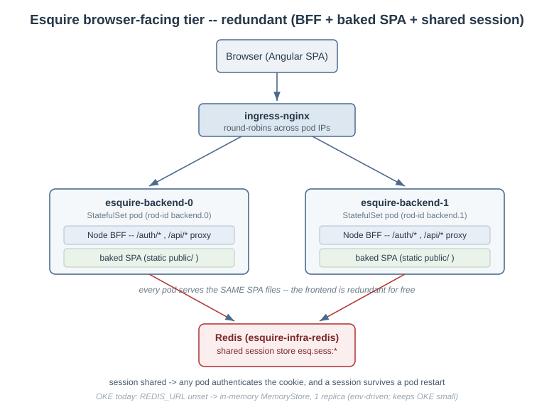
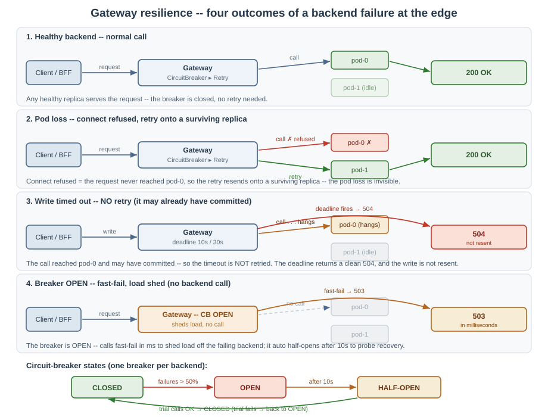
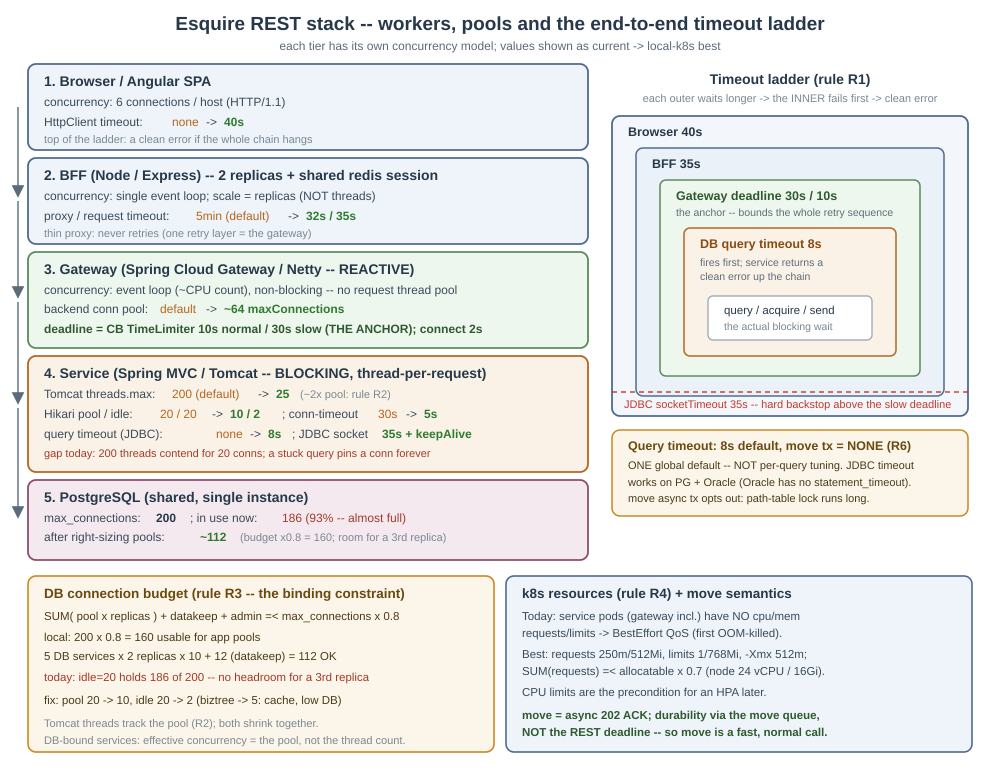

#  Esquire Application Frameworks(tm) 2.0

# **Esquire High Availability -- Deployment Nuances & Recommendations**

## Abstract

This document describes the High Availability (HA) that an Esquire deployment **can** provide, and the
deployment nuances needed to actually get it. It is deliberately honest about the difference between
**redundancy** (which Esquire's application tier gives by design) and **HA** (which also depends on *how* the
replicas are spread and on the HA mode of the stateful backends underneath them).

The short version:

- **Application tier -- HA-ready.** Every service runs N replicas and every collaboration survives the
  duplication. Any pod can serve any request; browser sessions are shared. This is built in.
- **Spread is a deployment choice.** N replicas on a single node is redundancy, not HA. Real failure
  tolerance needs the replicas spread across nodes (and availability domains), with disruption budgets so an
  upgrade or drain never takes them all at once.
- **Stateful backends are the limiting factor.** PostgreSQL, the message bus broker (an ActiveMQ instance today), Redis, and KeyCloak run as
  single instances today. Each is a single point of failure (SPOF). HA for these is something the deployment
  **enables** (managed service or clustered mode), not something the framework bundles.

**Acronyms used in this document**

| Term | Stands for | In plain words |
|---|---|---|
| **HA** | High Availability | the system keeps serving correctly through failures |
| **SPOF** | Single Point Of Failure | one component whose loss takes the whole system down |
| **redundancy** | (not an acronym) | running more than one copy of something |
| **N replicas** | N = a number | running N copies of a service (e.g. 2 or 3 pods) |
| **k8s** | Kubernetes | the container orchestration platform the services run on |
| **pod** | (Kubernetes term) | one running copy of a service (a container instance) |
| **node** | (Kubernetes term) | one machine in the cluster; pods run on nodes |
| **AD** | Availability Domain | an isolated data-center zone within a cloud region |
| **OKE** | Oracle Kubernetes Engine | the managed Kubernetes that runs the production cluster |
| **OCI** | Oracle Cloud Infrastructure | the cloud OKE runs on |
| **BFF** | Backend-for-Frontend | the Node tier that serves the browser app and holds the login session |
| **SPA** | Single-Page Application | the Angular browser app |
| **KC** | KeyCloak | the identity / login server |
| **PDB** | PodDisruptionBudget | a rule limiting how many replicas a drain/upgrade may remove at once |
| **HPA** | HorizontalPodAutoscaler | a k8s rule that adds/removes replicas automatically from a metric (e.g. CPU) |
| **KEDA** | Kubernetes Event-Driven Autoscaling | an add-on that autoscales from an event signal such as message-queue depth |
| **REST** | (HTTP API style) | the ordinary request/response web-API calls between tiers |
| **R&R** | Request/Reply | a request-then-response exchange carried over a message queue |
| **rod-id** | (Esquire term) | a per-instance routing id `<app>.<instanceNo>` that routes R&R replies back to the right caller |
| **message bus** | (Esquire term) | the transport-agnostic layer the async channels ride; it binds to a pluggable transport provider |
| **transport provider** | (Esquire term) | the driver that backs the bus with a concrete technology -- ActiveMQ, Redis, and Kafka drivers ship today |
| **SIGTERM** | (OS signal) | the "shut down" signal a pod receives before it stops |
| **CB** | Circuit Breaker | a switch that stops calling a failing backend and fast-fails instead, then probes for recovery |
| **R4j** | Resilience4j | the library that provides the circuit breaker + the per-call timeout (TimeLimiter) |
| **SCG** | Spring Cloud Gateway | the reactive framework the gateway is built on |
| **RFC 7807** | Problem Details for HTTP APIs | the standard JSON error body (`application/problem+json`) the gateway returns |
| **idempotent** | (not an acronym) | safe to repeat -- the same call twice has the same effect as once (true of reads, not of writes) |


The redundancy foundation this builds on -- N replicas with a shared session store, surviving pod loss -- is
covered in sections 2 and 3.

---

## 1. What "HA" means here

A deployment is highly available when it keeps serving correctly through each of these, with no lost requests
and no lost user sessions:

| Failure | App tier covers it when... | Backend covers it when... |
|---|---|---|
| A **pod** dies / is restarted | >=2 replicas; readiness pulls the dead one from rotation | session/state is not in that pod (DB / topic / queue / shared Redis) |
| A **node** dies | replicas are **spread** across nodes (anti-affinity) | the backend has a standby on another node |
| A **rolling upgrade / node drain** | a PodDisruptionBudget keeps a minimum serving | the backend drains/fails over gracefully |
| An **availability domain** outage (cloud) | replicas spread across ADs | the backend replicates across ADs |

Redundancy (N replicas) is necessary but not sufficient. The rest of this doc is the nuances that turn
redundancy into HA.

---

## 2. The foundation already in place

- **One fleet rule.** All 8 services (gateway, bizTree, pacMan, keySmith, kcMaster, auKeep, enyMan, backend)
  run as **StatefulSets** with ordinal pods `<app>-0 .. <app>-9` (cap 10), a headless `<app>-hl` service, and
  `podManagementPolicy: Parallel`. The ordinal gives each pod a stable `instanceNo` and `rod-id`
  `<app>.<instanceNo>`.
- **The three channels survive duplication.** REST (round-robin), entity sync (topic fan-out), and KC
  maintenance (request/reply over a competing-consumer queue) -- the two async channels ride the **message
  bus** (a transport-agnostic layer on a pluggable provider; ActiveMQ today). See the fleet diagram.
- **Browser tier is redundant.** The Angular SPA is baked into the backend image (no separate frontend
  deployment), and the BFF login session is held in **shared Redis** (`connect-redis`), so any backend replica
  authenticates any cookie and a session survives a pod restart. See the browser-tier diagram.





This is the redundancy layer. HA is what you add on top.

---

## 3. Application-tier nuances -- turning redundancy into HA

These apply to the 8 Esquire services. None of them change application code; they are deployment (chart /
values) settings. **What is in place:** the replica count, the R2/R3/R4/R5 budget, and the pod resources are
applied in the local-k8s and OKE overlays (the chart defaults stay pre-HA, so a bare install is unchanged), and
spread is on in the OKE overlay. **What is not:** PodDisruptionBudgets, graceful-shutdown hooks, and
autoscaling -- called out per item below.

### 3.1 Replica count -- applied (x2)
- Every service runs **2** replicas in the local-k8s and OKE overlays (`replicaCount: 2`). On a 3-node cluster
  **3** would give one replica per node.
- Hard cap is **10** (the `instanceNo` is a single decimal digit; the charts reject `replicaCount > 10`).

### 3.2 Spread across failure domains -- applied on OKE
N replicas on one node all die with that node. The chart renders `topologySpreadConstraints` under
`topologySpread.enabled` so a service's replicas land on **different nodes**, and on the cloud across
**availability domains**. It is **on in the OKE overlay** and off on single-node local:

```yaml
# per service template -- prefer separate nodes, then separate zones
topologySpreadConstraints:
  - maxSkew: 1
    topologyKey: kubernetes.io/hostname
    whenUnsatisfiable: ScheduleAnyway
    labelSelector: { matchLabels: { app: esquire-gateway-gateway } }   # gateway shown -- use each service's own app label
```

- **Local single-node k8s:** this is moot -- one node is one failure domain. Local exercises redundancy and
  correctness, **not** failure survival.
- **OKE (3x A1.Flex across ADs):** this is where it matters. Without spread, two replicas can co-locate and a
  node loss still drops the service.

### 3.3 PodDisruptionBudget
So a voluntary disruption (node drain, cluster upgrade) never evicts every replica at once:

```yaml
apiVersion: policy/v1
kind: PodDisruptionBudget
spec:
  minAvailable: 1            # or 50%
  selector: { matchLabels: { app: esquire-gateway-gateway } }   # one PDB per service -- use each service's own app label
```

### 3.4 Probes (already present -- keep them strict)
- **Readiness** gates traffic (`/readyz` on the BFF; bus-health on the Spring services). Keep it strict so a
  pod whose dependency (bus / DB) is down is pulled from the Service endpoints instead of failing requests.
- **Liveness** restarts a wedged pod (`/healthz`). Keep liveness *looser* than readiness -- a transient
  dependency blip should de-route a pod, not kill it.

### 3.5 Graceful shutdown (connection draining)
On a rollout or scale-down a pod gets SIGTERM. To avoid dropping in-flight work:
- Set a `terminationGracePeriodSeconds` and a small `preStop` sleep so the pod is removed from the Service
  endpoints before it stops accepting connections.
- The Node BFF should stop the HTTP server on SIGTERM after draining; the Spring services already stop their
  listeners on shutdown. (Recommended; verify per service.)

### 3.6 Rolling update vs the SPA chunk window
StatefulSets roll one pod at a time. During the window two image versions coexist, and a browser can fetch a
hash-named SPA chunk from the not-yet-updated pod and 404 (ChunkLoadError) until reload. This is **accepted**
as transient/self-healing. If zero-mismatch deploys become a goal: `strategy: Recreate` (trades a short
downtime) or version-tolerant asset serving (keep N previous builds / front with a shared asset store).

### 3.7 Horizontal autoscaling (where & how) -- NOT enabled

The fleet is shaped for autoscaling -- ordinal pods, an instance-derived `rod-id`, competing-consumer queues --
but **autoscaling is deliberately not enabled** in any deployment today; it is not a demo concern. This section
records WHERE it would attach and HOW, so it can be turned on later without rethinking the design.

The signal that matters is **REST request load** -- request rate and request duration (tail latency). Every
busy path starts as a REST call, so that is what to scale on; the broker queues are internal hops downstream of
it, not a separate driver.

- **The app tier** (gateway, enyMan, pacMan, keySmith, bizTree, and the BFF) -- a standard k8s **HPA** keyed to
  REST load. **CPU** (and/or memory) is the simple built-in proxy and is usually enough (needs `metrics-server`
  and CPU `requests` on the pods); a **custom request metric** (requests/second or p95 latency, via Prometheus
  Adapter) is the direct version when CPU does not track load closely enough.

```yaml
apiVersion: autoscaling/v2
kind: HorizontalPodAutoscaler
spec:
  scaleTargetRef: { apiVersion: apps/v1, kind: StatefulSet, name: esquire-enyman }
  minReplicas: 2
  maxReplicas: 10            # NEVER above 10 -- the instanceNo is one decimal digit (3.1)
  metrics:
    - type: Resource        # CPU as the REST-load proxy; swap/add a custom requests-per-second metric for the direct signal
      resource: { name: cpu, target: { type: Utilization, averageUtilization: 70 } }
```

**Configuring the direct REST-load signal (rate / duration).** The Spring REST services (bizTree, enyMan,
pacMan, keySmith) already expose it through Actuator / Micrometer -- `http_server_requests_seconds_count` (a
counter -> requests/second via `rate()`) and the `http_server_requests_seconds_bucket` histogram (-> p95
duration). Wire it to the HPA in three pieces:

**1. Scrape** -- Prometheus scrapes each pod's `/actuator/prometheus`.

**2. Expose as a k8s custom metric** -- a Prometheus Adapter rule turns the counter into a per-pod
requests/second metric:

```yaml
# prometheus-adapter rules
rules:
  - seriesQuery: 'http_server_requests_seconds_count{namespace!="",pod!=""}'
    resources: { overrides: { namespace: {resource: namespace}, pod: {resource: pod} } }
    name: { matches: "http_server_requests_seconds_count", as: "http_requests_per_second" }
    metricsQuery: 'sum(rate(<<.Series>>{<<.LabelMatchers>>}[1m])) by (<<.GroupBy>>)'
```

**3. Scale on it** -- the same HPA as above, but keyed to the request metric instead of CPU (this REPLACES the
CPU proxy; add a p95-latency metric the same way and the HPA takes whichever demands the most replicas):

```yaml
apiVersion: autoscaling/v2
kind: HorizontalPodAutoscaler
metadata: { name: esquire-enyman }
spec:
  scaleTargetRef: { apiVersion: apps/v1, kind: StatefulSet, name: esquire-enyman }
  minReplicas: 2
  maxReplicas: 10                       # the <=10 ceiling still holds
  metrics:
    - type: Pods                        # requests/second per pod -- the RATE signal
      pods:
        metric: { name: http_requests_per_second }
        target: { type: AverageValue, averageValue: "50" }     # keep ~50 req/s per pod
    - type: Pods                        # OPTIONAL second signal: p95 DURATION (its own adapter rule)
      pods:
        metric: { name: http_request_p95_seconds }
        target: { type: AverageValue, averageValue: "300m" }   # 0.3s p95 budget
```

Same shape for every REST service -- enyMan, pacMan, keySmith, bizTree (and the gateway). The Node BFF exposes
the equivalent from `prom-client` (`http_request_duration_seconds`); its adapter rule and HPA take the same
form.

- **kcMaster** is not a separate case. Its KC request/reply queue is a SYNCHRONOUS hop -- the caller
  (enyMan / keySmith) blocks on the reply inside its own REST request -- so a backlog there is just REST latency
  upstream. It rides the same REST-load signal; no broker-specific trigger is needed.
- **auKeep** is the one exception. The audit event is fire-and-forget (posted after commit, off the request
  thread), so its backlog is NOT visible as REST load. IF the audit consumer is ever autoscaled, **queue depth**
  is the right signal -- an event-driven autoscaler (**KEDA**) `ScaledObject` on the audit channel's backlog
  depth (whatever provider backs it), same
  `maxReplicas: 10` ceiling. This is optional: the audit log is a background write, not on the request path.

**Esquire-specific rules for any autoscaler:**

- **`maxReplicas` <= 10, always.** The `rod-id` `instanceNo` is a single decimal digit (3.1); an autoscaler
  that overshoots that breaks instance identity.
- **Scale-in is safe by design but needs graceful shutdown (3.5).** A StatefulSet removes the highest ordinal
  first; that pod's `rod-id` simply leaves -- the entity topic loses a peer, and its unacknowledged R&R
  requests are redelivered to a surviving copy (competing consumers). A `preStop` drain keeps an in-flight
  reply from being dropped.
- **The BFF autoscales only with the shared session store on** (`REDIS_URL` set) -- already true on local k8s.
  On OKE the BFF stays at 1 until HA Redis exists (section 7), so do not autoscale the BFF there yet.
- **Backends do not autoscale.** PostgreSQL, the broker, KeyCloak, and Redis are fixed single instances
  (section 7); scaling the app tier only raises load on them, so backend capacity / HA -- not the autoscaler --
  is the real ceiling.

---

## 4. Gateway resilience -- failing fast and routing around a dead backend

Sections 3.1-3.3 give you surviving replicas; this section is what the **edge** does with them when one backend
pod dies or slows. Untuned, a dead backend is the worst case for a client: the request **hangs** (the gateway
holds the connection until some far-off OS timeout) and then returns a blank error. Esquire folds three patterns
into the gateway -- a **per-route timeout**, a **circuit breaker (CB)**, and **retry** -- plus a guaranteed error
body, so a backend failure becomes a **fast, clean, meaningful** response, and (where it is provably safe) a
**transparent retry onto a surviving replica**.

This lives in the gateway only: its `application.yml` route filters plus two small classes (`ResilienceConfig`,
`GatewayErrorWebExceptionHandler`). It changes **no** backend service code, and it is the REST-path complement to
the replica/spread story above.

**Status.** The timeouts, the circuit breaker, the per-backend isolation, and the guaranteed error body are
**implemented and verified** on local k8s. The **per-route/per-command retry** in 4.4 is designed but not yet
implemented.



### 4.1 One mechanism, not three (the breaker owns the timeout)
SCG's `CircuitBreaker` filter already wraps each route in a Resilience4j **TimeLimiter**, and that TimeLimiter
**defaults to 1 second** -- unconfigured, it cancels any legitimate call longer than 1s (a move, an account
post). So timeout and breaker are *already* the same mechanism; bolting a separate Netty timeout on top just
creates competing deadlines that fight each other. The design makes the relationship explicit:

- **The per-route deadline IS the CB TimeLimiter**, set per route through an explicit
  `@Bean Customizer<ReactiveResilience4JCircuitBreakerFactory>` (`ResilienceConfig`, no `@Autowired`).
- The Netty **`response-timeout` is a generous backstop ABOVE** it (it should never fire first).
- A short Netty **`connect-timeout` fails fast** when a pod is simply unreachable -- the common pod-loss case.
- **Filter order is CircuitBreaker (outer) -> Retry (inner):** the outer TimeLimiter bounds the *whole* retry
  sequence, and the breaker records the final outcome as a single call (retries don't inflate its failure count).

### 4.2 Timeouts -- the ladder
| Layer | Default | Env knob | Role |
|---|---|---|---|
| Netty connect | 2s | `GW_CONNECT_TIMEOUT_MS` | fail fast on an unreachable pod |
| CB TimeLimiter (normal routes) | 10s | `GW_CB_TIMEOUT_S` | the real per-route deadline |
| CB TimeLimiter (slow writes: move / acct / create) | 30s | `GW_CB_SLOW_TIMEOUT_S` | room for the legitimately-slow writes |
| Netty response-timeout | 35s | `GW_RESPONSE_TIMEOUT` | backstop above the TimeLimiter; should never fire first |

The slow-write breakers (`enyman-move-cb`, `pacman-acct-cb`, `enyman-new-cb`) get the 30s limit; every other
breaker inherits the 10s default.

### 4.3 Circuit breaker -- per-backend isolation
Each backend gets its **own** breaker instance (`keysmith-cb`, `biztree-cb`, `pacman-cb`, `enyman-cb`, plus the
three slow-write instances) so a failing backend trips only its own breaker, never a healthy neighbour's.

| Knob | Default | Env | Meaning |
|---|---|---|---|
| sliding-window | 20 | `GW_CB_WINDOW` | count-based window of recent calls |
| minimum-calls | 10 | `GW_CB_MIN_CALLS` | calls observed before the breaker may trip |
| failure-rate | 50% | `GW_CB_FAILURE_RATE` | open when this share of the window fails |
| slow-call-rate / duration | 100% / 8s | `GW_CB_SLOW_RATE` / `GW_CB_SLOW_DURATION_S` | a call over 8s counts as "slow" |
| open-wait | 10s | `GW_CB_OPEN_WAIT_S` | how long it stays open before a half-open trial |
| half-open-calls | 5 | `GW_CB_HALFOPEN_CALLS` | trial calls that probe recovery |

**Behaviour.** Closed = normal. Once failures pass the threshold the breaker **opens** and every call
**fast-fails with a 503** -- shedding load off the struggling backend instead of piling on. After `open-wait` it
goes **half-open**, lets a few trial calls through, and **closes automatically** if they succeed. Recovery needs
no operator action.

### 4.4 Retry -- per-route / per-command (the refined, locked design)
HTTP method is the **wrong** axis for retry-safety in Esquire: the read/write split is per **command** (which the
gateway already routes on), and e.g. `/esq-sweep` is a POST that is idempotent. So retry is configured **per
route**, on four principles:

1. **One retry layer = the gateway.** Nothing else retries (the BFF is a thin proxy; inter-service traffic is the
   message bus, not REST). This invariant blocks **retry amplification** -- retry at several layers multiplies
   load on an already-failing backend (3 x 3 = 9 attempts).
2. **Per-route, not per-method.** Each route owns its `Retry` filter; the old shared `read-methods` /
   `write-methods` method-gate is gone.
3. **The conditions encode safety** (the `exceptions` / `series` list, not the verb):
   - **Reads** (idempotent): retry on **connection-not-established + response-timeout**. **Not on 5xx** -- a 5xx
     is usually a real error; retrying only adds load, and the breaker already handles overload.
   - **Writes** (non-idempotent): retry on **connection-not-established ONLY** --
     `exceptions: [java.net.ConnectException]` (its subclasses are Netty's connect-refused and connect-timeout)
     with an **empty `series`**. A response-timeout, a 5xx, or a reset-after-send never resends a write: the
     request provably never landed, so it cannot double-commit.
4. **The deadline bounds it** (see 4.5).

| Route(s) | Class | Retry | Conditions |
|---|---|---|---|
| `/esq-key`, `/esq`, `/esq-path`, `/esq-enode`, `/esq-tree`, `/esq-sweep`*, `/esq-cmd`, `/esq-dict`, `/esq-kinds`, `/esq-cmd-tree` | read (* `/esq-sweep` = idempotent POST) | **ON**, `${GW_RETRY_READ:3}` attempts | connect-fail + timeout |
| `/esq-cmd-save`, `/esq-key-save`, `/esq-cmd-new`, `/esq-cmd-del`, `/esq-move`, `/esq-acct` | write (non-idempotent) | **connect-fail ONLY**, `${GW_RETRY_WRITE:1}` attempt | `ConnectException` |

**Recommendations applied (mir0n, locked).** Reads do **not** retry on 5xx. `/esq-acct` (the financial post)
keeps the **uniform connect-fail retry** -- a failed connect means it was never sent, so a resend is safe and
useful on a pod-roll. `/esq-move` is async-202 but the same holds (a failed connect was never queued -> no
double-move).

**Config shape** (`application.yml` is the source of truth; mirror to compose / charts):
```yaml
esq.gateway.resilience.retry:
  read:  { attempts: ${GW_RETRY_READ:3} }
  write: { attempts: ${GW_RETRY_WRITE:1} }
```
Per route, the read filter sets `methods: GET`, an empty `series`,
`exceptions: [java.net.ConnectException, java.util.concurrent.TimeoutException]`, backoff 50->500ms; the write
filter sets `methods: POST`, an empty `series`, `exceptions: [java.net.ConnectException]`, backoff 50->200ms.
**To disable a route's retry entirely, OMIT its `Retry` filter** -- SCG forbids `retries: 0`, so leaving the
filter off is the true per-route off-switch.


### 4.5 Why retries can't run away
A retry loop that outlives the client, or piles onto a failing backend, is its own outage. Four bounds prevent
that:
- **The per-route deadline** (the outer CB TimeLimiter) caps the *whole* retry sequence and **cancels** it when
  it fires -- retries cannot exceed the 10s / 30s budget.
- **The breaker opening** stops the *cross-request* storm: once open, new calls fast-fail instead of each
  spinning up its own retries.
- **Reactive client-disconnect:** if the browser / BFF gives up, WebFlux propagates the cancellation and the
  retry loop stops.
- **One retry layer:** no multiplication across tiers.

**What it does NOT do (yet).** The gateway aborts the *downstream connection*, but a backend already parked in a
blocking JDBC call is **not** cancelled -- it runs to completion for a result nobody reads (an orphaned worker
thread + DB connection). True cancellation needs a **server-side** bound (a statement / query timeout, deadline
propagation). That is the **server-side hardening** (see section 5), not
part of this gateway work.

### 4.6 Always a meaningful error (never an empty body)
Every failure shape -- unreachable pod, timeout, open breaker -- surfaces through the single global
`GatewayErrorWebExceptionHandler`, which renders an **RFC 7807** `application/problem+json` body (status, title,
detail, instance, traceId, timestamp, processingTime) -- never a blank response. The renderer is
**null-message-safe** (`messageOf()`): an open breaker can surface with a null message, and an unguarded message
inspection used to throw inside the renderer and return a blank HTTP 500 -- it now always produces a populated
503 / 504. (A backend scaled to 0 and hammered returns a full 503 ProblemDetail on every call, including after
the breaker opens.)

### 4.7 What this buys for HA
- A **dead or slow backend becomes a fast, clean, meaningful response** instead of a hung request -- the user is
  told *Service Unavailable* in milliseconds, not left waiting.
- The breaker **sheds load** off a struggling backend so it can recover, and **recovers itself**.
- A **connect-level failure retries transparently onto a surviving replica** (kube-proxy lands the resend on
  another pod), so a single pod loss is invisible -- for reads, and for writes that never reached the dead pod.
- **Per-backend isolation** keeps one bad backend from dragging the others down through the shared edge.

It is the REST-path partner to the replica / spread / PDB work: spread keeps a surviving pod alive; this routes
around the dead one cleanly.

---

## 5. REST stack -- workers, pools and the end-to-end timeout ladder

Section 4 bounds and cancels a call at the **edge**. This is the **server-side companion**: how many workers and
connections each tier runs, and how the timeouts chain from the browser down to the DB so that work is bounded
**end-to-end** -- not just at the gateway.



### 5.1 The tiers and what bounds concurrency
Five tiers, three concurrency models. The reactive tiers (browser, BFF, gateway) scale by event loop + replicas;
only the **services are thread-per-request (blocking)**, so they are where worker count and the DB pool must be
matched.

| Tier | Concurrency model | Key knobs (full detail in 5.3) |
|---|---|---|
| Browser / Angular | 6 conns/host (HTTP/1.1) | HttpClient timeout |
| BFF (Node, x2 + redis) | single event loop; scale = replicas | proxy / `requestTimeout`; replicas |
| Gateway (SCG / Netty) | reactive event loop; non-blocking | CB deadline; connect / response-timeout; backend pool |
| Service (Tomcat MVC) | **thread-per-request, blocking** | `tomcat.threads.max`; Hikari pool / idle / connection-timeout; query timeout |
| PostgreSQL | connection slots | `max_connections` |

### 5.2 Rules for optimal setup
- **R1 Timeout ladder.** `browser >= BFF >= gateway deadline >= DB statement_timeout`, each outer longer by a
  margin, with the JDBC `socketTimeout` a hard backstop just above the largest deadline. The **gateway CB deadline
  (4.2) is the anchor**; everything else is sized around it so the *innermost* layer fails first and returns a
  clean error instead of an orphaned/dropped request.
- **R2 Thread<->pool matching.** A DB-bound service's `threads.max` ~= `2 x Hikari pool` (not 10x). Admitting more
  than the pool can serve only converts latency into thread pile-up. Hikari `connection-timeout` must be **short**
  (fail fast when saturated), not 30s.
- **R3 DB connection budget (the binding constraint).** `SUM(pool x replicas) + datakeep + admin <= max_connections x 0.8`.
  This caps every pool choice.
- **R4 k8s resource budget.** `SUM(requests) <= allocatable x 0.7`; `requests` = steady state, `limits` = burst;
  JVM `-Xmx <= mem limit`. CPU limits are the precondition for an HPA (3.7).
- **R5 No unbounded blocking wait.** Every place a thread/connection can park -- DB query, socket, connection
  acquire, proxy -- has a timeout below the deadline above it. This closes the gap 4.5 flags: the gateway aborts
  the downstream connection, but only a **server-side query timeout** actually cancels the parked JDBC call.
- **R6 Query timeout = one default per surface + opt-out, never per-query, set per service.** A default query
  timeout (8s, configurable and **disablable**) guards the common request path -- defined **per service**
  (`application.yml` / env, the config-var standard), not a hardcoded fleet constant, and applied **per
  data-access surface** (main JPA / audit keep / H2 cache; see *Data-access surfaces* below), each sized to its own
  risk. Tuning a timeout **per query is rejected** -- it is an
  unmanageable extra cluster of settings that has to be re-learned and re-tuned for every query. Instead a
  transaction that legitimately runs long **explicitly opts out** (timeout 0 / NONE). The mechanism is
  **dialect-portable**: the JDBC / JPA query timeout (`hibernate.jdbc.timeout`, or
  `jakarta.persistence.query.timeout` / `@Transactional(timeout=...)`) drives the driver to cancel the statement
  on **both Postgres and Oracle**. Postgres can add a server-side `statement_timeout` as a backstop; **Oracle has
  no direct equivalent** (only DBA-level Resource Manager `MAX_EST_EXEC_TIME`), so the JDBC timeout is the common
  guard. The **move processing transaction** is the standing exception (see 5.4).

### 5.3 Best for local k8s
Node = 24 vCPU / 16 GiB single node; `pg max_connections=200`; all services x2 replicas; **5 DB-attached services**
(auKeep, bizTree, enyMan, keySmith, pacMan -- kcMaster has no datasource). DB budget: `200 x 0.8 = 160` for app
pools; `5 x 2 x 10 (main) + 12 (datakeep, on enyMan/keySmith/pacMan) = 112` -- well inside budget, with headroom
for a 3rd replica.

Every parameter, where it is set, the **vendor preset default**, the local-k8s target, and the authoritative doc.
"(no env)" marks a knob that is yaml- or code-only today -- making them all env-overridable is part of the work
(see *Configurability* below). The `(Rn)` tag is the rule that drives the target.

| Parameter (knob) | Set via (file - key / env) | Vendor default | Local-k8s best | Ref |
|---|---|---|---|---|
| `server.tomcat.threads.max` | svc `application.yml` *(no env)* | 200 | **25** (R2) | Spring Boot |
| `server.tomcat.accept-count` | svc `application.yml` *(no env)* | 100 | **50** | Spring Boot |
| `spring.datasource.hikari.maximum-pool-size` | svc `application.yml` *(no env)* | 10 | **10** (biztree 5) (R3) | HikariCP |
| `spring.datasource.hikari.minimum-idle` | svc `application.yml` *(no env)* | = max-pool (10) | **2** | HikariCP |
| `spring.datasource.hikari.connection-timeout` | svc `application.yml` *(no env)* | 30000 ms | **5000** (R5) | HikariCP |
| `spring.transaction.default-timeout` (request-path query/tx cap) | svc `application.yml` - `ESQ_TX_TIMEOUT_S` | none (-1) | **8s; move + cache-load opt out** (R6) | Spring TX -> Hibernate/JDBC |
| JDBC `socketTimeout` (PG) / `oracle.jdbc.ReadTimeout` | datasource URL (built from `DB_*` env) | 0 (none) | **~35s** (R1) | pgjdbc |
| JDBC `tcpKeepAlive` (PG) | datasource URL | false | **true** | pgjdbc |
| PG `statement_timeout` (server backstop) | `postgresql.conf` / chart | 0 (off) | optional (not set; the cap is client-side via the JDBC query timeout) | PostgreSQL |
| audit/keep query timeout | shared `dataKeep` engine reads a **per-service** value (`KeepDataSourceParams`) - `ESQ_KEEP_QUERY_TIMEOUT_S` | none (0) | **8s** (R5 safety net) | dataKeep (JDBC) |
| bizTree H2 cache query timeout | `cacheJdbcTemplate.setQueryTimeout` - `BIZTREE_H2_QUERY_TIMEOUT_S` | none (0) | **off** (in-memory; not a risk surface) | JdbcTemplate / H2 |
| `spring.cloud.gateway.httpclient.connect-timeout` | gw `application.yml` - `GW_CONNECT_TIMEOUT_MS` | Netty 30000 ms | **2000** | SCG / ReactorNetty |
| `...httpclient.response-timeout` | gw `application.yml` - `GW_RESPONSE_TIMEOUT` | none | **35s** (backstop) | SCG |
| `...httpclient.pool.max-connections` | gw `application.yml` *(no env)* | ReactorNetty 2x CPU (min 16) | **~64** | ReactorNetty |
| `...httpclient.pool.acquire-timeout` | gw `application.yml` *(no env)* | 45000 ms | keep | ReactorNetty |
| R4j CircuitBreaker `timeoutDuration` | `ResilienceConfig.java` - `GW_CB_TIMEOUT_S` / `GW_CB_SLOW_TIMEOUT_S` | R4j 1000 ms | **10s / 30s** | Resilience4j |
| gateway Retry attempts (read / write) | gw `application.yml` - `GW_RETRY_READ` / `GW_RETRY_WRITE` | n/a (SCG needs >=1) | **3 / 1** | SCG (4.4) |
| Node `http.Server.requestTimeout` | `backend/src/index.ts` *(no env)* | 300000 ms | **35000** | Node http |
| Node `http.Server.headersTimeout` | `backend/src/index.ts` *(no env)* | 60000 ms | keep | Node http |
| Node `http.Server.keepAliveTimeout` | `backend/src/index.ts` *(no env)* | 5000 ms | keep | Node http |
| proxy `proxyTimeout` | `backend/src/proxy/apiProxy.ts` *(no env)* | none | **32000** (R1) | http-proxy-mw |
| `UV_THREADPOOL_SIZE` | env | 4 | keep | libuv/Node |
| BFF `replicaCount` | `k8s/values/backend.yaml` | chart 1 | **2** | (chart) |
| Angular HttpClient timeout | SPA HTTP interceptor (`timeout()`) *(absent today)* | none | **40000** (R1) | Angular |
| PG `max_connections` | postgres chart / `postgresql.conf` | 100 | **200** | PostgreSQL |
| pod `resources.requests` / `limits` | `k8s/values/<svc>.yaml` + OKE overlay | none (BestEffort) | **250m/512Mi - 1/768Mi** (R4) | Kubernetes |

k8s resources (R4): Java service ~ `requests 250m/512Mi, limits 1/768Mi, -Xmx 512m`; BFF ~ `100m/256Mi, 500m/384Mi`;
pg/KC/AMQ ~ `500m/1Gi`. Sum of requests ~ 6 vCPU / ~11 GiB -- inside the 0.7 envelope, CPU limits in place for a
future HPA.

**Configurability.** Several knobs above are yaml- or code-only today (*(no env)* / *(absent today)*). Part of this
work is making **every** parameter env-overridable, per the Esquire config-var consistency standard -- the service
`application.yml` (or chart values) is the source of truth and is mirrored **verbatim** to compose and the charts --
so each value is tunable per environment without a rebuild. The gateway knobs already follow this (`GW_*` envs),
and the R6 query-timeout knobs now do too (`ESQ_TX_TIMEOUT_S`, `ESQ_KEEP_QUERY_TIMEOUT_S`,
`BIZTREE_H2_QUERY_TIMEOUT_S`, plus the `enyman.move-queue.tx-timeout-s` / `biztree.cache-load.tx-timeout-s`
opt-outs); the service Tomcat / Hikari / DB-socket knobs are wired through the chart's `resilience.*` values and
applied in the overlays. The **BFF Node / proxy / Angular timeouts** are the ones that still need their env
handles added.

**Data-access surfaces.** "Query timeout" is not one knob -- the services reach a database through **three**
separate surfaces, each with its own datasource and its own single lever, and each timeout is a **per-service**
knob:
- **Main entity DB** (`spring.datasource`, JPA / Hibernate) -- the real risk (remote I/O, path / row locks, pool
  exhaustion). Capped via `spring.transaction.default-timeout` (off by default; recommended 8s); the move
  transaction and the full-tree cache load opt out (5.4).
- **Audit / keep** (the `*_log` datakeep pool) -- runs through the **shared** `dataKeep` engine (`KeepSqlStore` +
  `RodEventDbWriter`, plain JDBC), so it is **not** covered by `hibernate.jdbc.timeout`. One `setQueryTimeout` in
  that engine bounds every service's audit writes, reading a per-service value from `KeepDataSourceParams`. Audit
  is async fire-and-forget, off the request path -- the timeout is an R5 safety net, not a request bound.
- **bizTree H2 cache** (`cache-h2`, in-memory, via `cacheJdbcTemplate`) -- no network and no remote locks, so a
  SQL timeout is moot; a `biztree.h2.query-timeout-s` knob exists but defaults off (its Hikari pool already has a
  5s `connection-timeout`).

**References (vendor docs).**
- Spring Boot -- application properties (Tomcat threads, accept-count): https://docs.spring.io/spring-boot/appendix/application-properties/
- HikariCP -- configuration knobs: https://github.com/brettwooldridge/HikariCP#gear-configuration-knobs-baby
- Hibernate / Jakarta Persistence -- `hibernate.jdbc.timeout` / `jakarta.persistence.query.timeout`: https://docs.jboss.org/hibernate/orm/current/userguide/html_single/Hibernate_User_Guide.html
- PostgreSQL JDBC (pgjdbc) -- connection parameters (`socketTimeout`, `tcpKeepAlive`): https://jdbc.postgresql.org/documentation/use/
- PostgreSQL -- `statement_timeout`, `max_connections`: https://www.postgresql.org/docs/current/runtime-config-client.html
- Spring Cloud Gateway (SCG) -- httpclient config: https://docs.spring.io/spring-cloud-gateway/reference/
- Reactor Netty -- connection pool (ConnectionProvider): https://projectreactor.io/docs/netty/release/reference/
- Resilience4j -- TimeLimiter: https://resilience4j.readme.io/docs/timeout
- Node.js -- `http.Server` timeouts: https://nodejs.org/api/http.html#class-httpserver
- http-proxy-middleware: https://github.com/chimurai/http-proxy-middleware
- Angular -- HttpClient: https://angular.dev/guide/http
- Kubernetes -- resource requests / limits: https://kubernetes.io/docs/concepts/configuration/manage-resources-containers/

### 5.4 The slow bucket and the async-ACK rule (`/esq-move`)
The 30s slow deadline (4.2) is for **genuinely synchronous heavy writes**. `/esq-move` is **not** one: enyMan
answers with an **async 202 acknowledgment** ("command received") and the move itself runs through the **move
queue** (the multi-instance coordination work), not inside the request. So move's *synchronous* path is a quick
enqueue + ACK and belongs in the **normal (10s / 8s) bucket**; its durability is owned by the async pipeline, not
a REST deadline. (The gateway's `enyman-move-cb` 30s slow limit is therefore over-provisioned for an ack -- a
reconcile item.) `pacman-acct` / `enyman-new` need the same classification: keep them in the slow bucket only if
their synchronous path genuinely blocks; if they are also ack-style, they move to the normal bucket too.

**Move transaction -- query timeout NONE (locked decision, implemented).** The *async* move processing
transaction is the explicit opt-out from the request-path cap (R6): it runs with **no effective query timeout**,
set per transaction, because its initial **path-table lock** and the coordinated subtree rewrite can legitimately
take far longer than any request-path budget. It is implemented by running the move on a **dedicated transaction
template** (built in `MoveQueueManager`) whose timeout never inherits the global cap -- an explicit
`enyman.move-queue.tx-timeout-s` caps it, otherwise it carries a no-practical-limit timeout. This is portable
across Postgres and Oracle (it is the JDBC query timeout, not a server-side `statement_timeout`). The ladder (R1)
governs the **synchronous** request path; move's async work is outside it, bounded by the move-queue
coordination, not a SQL deadline. This is deliberately **not** per-query tuning -- the rest of the fleet keeps
the cap; only the move (and the cache load below) disables it.

**bizTree full-tree cache load -- also opts out.** Building the in-memory tree cache reads the whole org / usr /
acct tables (`findAllForTree`), which can run past the request-path budget on a large tree. So the cache load
runs in one read-only transaction that opts out the same way (`biztree.cache-load.tx-timeout-s`, default
uncapped) -- otherwise enabling the cap would break cache warm-up. The move and the cache load are the only two
long ops that opt out; everything else keeps the cap.

**Status -- what is applied.** The R6 query-timeout ladder is wired across all three data-access surfaces and
both opt-outs, with **every default at its pre-HA value (the cap is OFF until set)** so deploying it alone
changes nothing -- an environment turns it on per the config-var standard (local-k8s best = 8s). The knobs:
- request path (main JPA): `spring.transaction.default-timeout` / `ESQ_TX_TIMEOUT_S` (default `-1` = no cap).
- audit / keep: per-service `KeepDataSourceParams.query-timeout-seconds` / `ESQ_KEEP_QUERY_TIMEOUT_S` (default `0` = off).
- bizTree H2 cache: `biztree.h2.query-timeout-s` / `BIZTREE_H2_QUERY_TIMEOUT_S` (default `0` = off).
- opt-outs: the **move** transaction `enyman.move-queue.tx-timeout-s` and the bizTree **full-tree cache load**
  `biztree.cache-load.tx-timeout-s`, both default uncapped.

The R2/R3/R4/R5 budget -- Tomcat threads (25/50), the Hikari pool (10/2, 5s connect-timeout), the DB socket
timeout (35s) + keep-alive, and the pod resource requests/limits -- **is applied in the local-k8s and OKE
overlays** (the chart defaults stay pre-HA, so a bare install is unchanged). What is **not** wired everywhere:
the R1 ladder's browser / BFF / Node timeouts (the gateway and DB-socket ends are in place; the BFF / Node /
Angular knobs are not all env-wired), plus the graceful-shutdown / PodDisruptionBudget / autoscaling items.

### 5.5 Messaging-bus worker budget and virtual threads

Sections 5.1-5.3 budget the **synchronous** tier -- Tomcat request threads (R2), the Hikari pool (R3), k8s
resources (R4). A service also runs the **messaging-bus workers**, a separate slice of its thread footprint that
the R-catalog above does not count. Sizing an instance means budgeting **both**, inside the same R4 CPU / memory
envelope.

**The messaging workers (per bus leg).** Each knob is a per-leg x-rod parameter (`XRodParams`), env-overridable:

| Knob | Env | Default | What it spawns |
|---|---|---|---|
| feed (tx) worker | -- | **1** platform thread per producing leg (always) | the single `BoundedQueueRig` daemon that owns the send |
| `receiver-pool.size` | `*_POOL_SIZE` | **4** | the receive / apply pool -- worker count (the concurrency cap) |
| `receiver-pool.mode` | `*_POOL_MODE` | **platform** | the pool's thread model: `platform` \| `virtual` \| `virtual-per-task` |
| `concurrency` | `*_CONCURRENCY` | **1** | the transport listener's own threads |
| `publisher-pool.size` | `*_PUBLISHER_POOL_SIZE` | **0** | 0 = publish on the feed thread; >0 = an async publish pool |
| `publisher-pool.mode` | `*_PUBLISHER_POOL_MODE` | **platform** | thread model of the async publish pool (when size > 0) |
| `feed-capacity` | `*_FEED_CAPACITY` | **4096** | the feed queue depth -- **memory**, not threads |

Every pool -- receive/apply or async-publish -- is the common `WorkerPool` (`pro.mir0n.utils.concurrent`), which
owns the three-way thread model: `platform` and `virtual` are a FIXED pool of `size` reused workers (dedicated OS
threads, or `size` virtual threads); `virtual-per-task` spawns one virtual thread per event, capped by a
`Semaphore(size)` (or uncapped when `size = 0`). A service's messaging thread count is
`SUM over its buses of (1 feed + receiver-pool.size x concurrency + publisher-pool.size)`. For a producer like
keySmith (KC R&R client + audit producer + a broadcast consumer) that is ~8 threads -- small next to Tomcat, but
real, and it grows the moment a leg raises `receiver-pool.size` or turns on async publish. The feed worker is
**always** one platform thread (the ordered single-FIFO send leg cannot be virtual).

**Metal vs virtual threads -- a wired, correctness-validated lever (default `platform`).** The pool `mode` is a
first-class per-leg setting, live in every environment. It has been run end-to-end on BOTH docker and local k8s in
BOTH modes -- the full smoke + e2e matrix passes identically on `platform` and `virtual` (8/8 cells green), so a
service boots healthy and processes events the same either way. That is a **correctness** result, NOT a throughput
measurement: on a saturated single-host docker / desktop-k8s box the timings are noise, and a real metal-vs-VT
budget A/B is only meaningful on OKE under load.

**What virtual threads actually buy -- and where.** A virtual thread's only saving is the cost of a *blocked*
platform thread. A platform thread parked on a blocking call (a DB write, a broker send, a KC round-trip) still
holds a real OS thread -- a cgroup `pids` slot plus ~1 MiB of reserved stack -- doing nothing, and each in-flight
blocking call also ties up a file descriptor. A virtual thread unmounts from its carrier while blocked, so N
simultaneous blocking waits ride a few carriers instead of N OS threads. So VT pays off in exactly one regime:
**when a pod is about to exhaust the OS resources reserved for it -- the file-handle / thread (`pids`) budget --
from holding many concurrently-blocked waits.** The win is about how cheaply you can hold many simultaneous
*waits*; it is not throughput and not CPU.

**Why it does NOT help Esquire's messaging pools today.** When a service already has enough worker budget for its
load, VT gives no meaningful outcome -- and that is the case here:
- the receive / apply pool is a small FIXED pool (~4 workers) on a bounded queue, not thousands of tasks;
- its real ceiling is downstream -- the keep's dedicated DB connection pool (the sizing rule is
  `receiver-pool.size <= keep DB pool`), so concurrency is capped by the DB pool, not by thread count. More
  (virtual) threads just queue on the same connections and buy nothing;
- `publisher-pool.size` is `0` everywhere, so there is no async-send fan-out either;
- the `virtual` FIXED-pool mode cannot even capture VT's advantage by construction -- it is `size` threads either
  way, so all it adds is a layer of scheduling indirection. It is kept for uniformity and for this test matrix,
  not for a resource win.

So the OS-limit reclaim below is what VT *would* buy a service that was genuinely thread-bound; Esquire's bounded,
DB-capped apply work is not that service. Default stays `platform` everywhere (the committed value).

| Thread source | `platform` | `virtual` | Ceiling either way |
|---|---|---|---|
| Tomcat request workers | 25 local / **200** default, ~1 MiB stack each | VTs on **~NCPU carriers** | **Hikari pool (10)**, not threads |
| x-rod receive / apply pools | ~8 platform | VTs on the same carriers | `receiver-pool.size`, then the DB / downstream |
| x-rod feed workers | ~3 platform (always) | ~3 platform (unchanged) | 1 per producing leg by design |

The reclaim is real only where thread count is the binding limit: 200 blocked request threads reserve ~200 MiB of
stacks (~1/3 of a 768 MiB budget); running them as VTs would return most of that to heap and drop the OS thread /
`pids` count from hundreds to tens, moving the wall onto file descriptors (`ulimit ~65 k`, generous) and the DB
pool / CPU. For Esquire's DB-capped consumers that reclaim buys nothing useful, because concurrency is already
re-bound low by the DB pool.

**Where VT would earn its keep (not today's shape).** A future service that fans out a large number of CONCURRENT
blocking waits -- the Tomcat request path under thousands of simultaneous slow requests
(`spring.threads.virtual.enabled` / `ESQ_VIRTUAL_THREADS`, already wired), or an async client holding many
in-flight R&R waits (`virtual-per-task`) -- is where holding those waits on a few carriers avoids blowing the
per-pod thread / FD budget. Bounded, DB-pool-capped apply work is not that case.

**Runtime + pinning.** A virtual thread that blocks inside a `synchronized` monitor used to **pin** its carrier
(the x-rod engine and the send-retry lock use `synchronized`; JDBC historically pinned). JEP 491 removes that
pinning; the stack runs on the **JDK 25 LTS** runtime (compiled `--release 24`), so `synchronized` no longer pins.
All pool modes default to `platform` per the pre-HA-default principle (5.3) -- an opt-in lever that costs nothing
until a leg sets `mode`.

---

## 6. Async messaging-path resilience -- the bus carries its own

Sections 4 (the gateway edge) and 5 (the REST pools) harden the **synchronous** request path -- both built on
Resilience4j, which is sync-only. The **asynchronous** channels -- the entity-broadcast topic and the KC
request/reply queue -- ride the **Esquire Messaging Bus**, a transport-agnostic layer that binds to a pluggable
**transport provider** (ActiveMQ, Redis, and Kafka drivers ship; ActiveMQ carries the service channels today).
The bus carries **its own** resilience, in the producer leg, *above* the transport -- so it applies over whatever
provider is bound, precisely because the bus does not assume the transport supplies it. Two mechanisms are in
place today; both are producer-leg **session-sublayers**, opt-in by configuration, and cost nothing when off.

**Support matrix** (async / messaging path -- a bus capability, not a broker feature):

| Pattern | What it does (plain) | Today | Turn it on with |
|---|---|---|---|
| **Keep-alive (liveness)** | a producing leg heartbeats when idle; if no send has landed within the timeout the leg reads DOWN and feeds the bus health signal (readiness) | **Live -- opt-in** | `alive` (+ `heartbeat-interval` 10s / `alive-timeout` 30s / `alive-fail-fast`) |
| **Send-retry (survive a broker blip)** | on a failed send the producer HOLDS the message and re-sends it over a backoff ladder until it lands -- new work queues behind it rather than being lost; a resent message keeps the same id so a consumer can tell it is a repeat; while holding, the leg reads not-ready (bus health) so k8s depools the pod until it lands | **Live -- opt-in** (on in docker, local-k8s, AND OKE) | `send-retry` (+ `send-retry-backoff-sec` 1,2,5,5s / `send-retry-max-attempts` 0 = never give up, N = drop after N) |
| Circuit breaker | stop sending to a dead broker and fast-fail | **Deferred** -- needs an "on open" policy (drop / hold / dead-letter) the bus does not have yet | -- |
| Retry / backoff variants | retry shapes beyond send-retry | **Deferred** | -- |
| Per-message timeout | a deadline on one async send | **Deferred** -- async has no request/response deadline today | -- |
| Per-destination bulkhead | isolate one destination's load from another's | **Deferred** -- only `receiver-pool.size` bounds concurrency today | -- |
| Metrics | Micrometer counters, separate from the health signal | **Live** -- send/receive/error/duration + retry backoff/held/dropped, drawn on the bus dashboards | observability enabled (`ESQ_OBSERVABILITY_ENABLED`) |

**Keep-alive.** Each producing leg heartbeats on inactivity (an R&R client sends a probe its server answers, so
the round trip is observed); if no send has landed within `alive-timeout` the leg reads DOWN, which the bus
health signal surfaces to the readiness probe. Known limit -- **provider-dependent**: the health reads the
producer leg only, so a hard broker crash that leaves the socket half-open is not caught on the ActiveMQ driver
(its async-send + failover buffering makes the "send" still succeed); other providers differ. See
`doc/Esquire.MessagingBus.ContinuingDev.md`.

**Send-retry.** A broker outage makes a send fail; the single send worker holds that message and re-sends it over
the backoff ladder (default 1, 2, 5, 5 seconds, the last step repeating) until it goes through. Because the one
worker is held, new events queue behind it and producers block when the queue fills -- the change **waits** for
the broker instead of being dropped. Two modes: **block** (`send-retry-max-attempts` 0 -- never give up, the
default) or **drop-after-N** (a cap, for a channel that prefers to shed rather than back up). A held message keeps
a stable id across resends so a consumer can drop a duplicate. Heartbeats are never retried. While it is holding,
the leg reports **not-ready** (the bus health signal), so k8s depools the pod until the send lands -- a
send-retry-only leg needs no alive protocol to signal a broker outage. This is the piece that bridges the
**seconds of a broker failover** (the section-7 HA path) without losing an entity broadcast or a KC sync.

**Where it fits HA.** These make the async channels survive the same broker events section 7's HA path introduces
-- a restart, a master->slave / failover switchover, a brief blip -- and they do so **for any bound provider**,
not just ActiveMQ: the resilience is the bus's, so swapping the transport (or putting it in an HA mode) does not
change the guarantee. Enabled per bus in docker, the local-k8s overlay, AND the OKE overlay -- safe on OKE because its broker
endpoint uses `failover:`. The mechanism and the sublayer design are in `doc/Esquire.MessagingBus.md`.

---

## 7. Stateful backends -- the real SPOFs today, and the HA path for each

These run as single instances. They are shared by the whole fleet, so each is a SPOF until put into an HA mode.
HA here is a **deployment choice the operator makes**, not bundled by Esquire.

| Backend | Carries | Today | SPOF? | HA path |
|---|---|---|---|---|
| **PostgreSQL** | all authoritative entity / account state | single instance | **Yes -- total** | OCI **managed** Postgres with a standby (OKE), or a Postgres operator (CloudNativePG / Patroni) with streaming replication + automatic failover |
| **Message bus broker** | the entity topic + the KC R&R queue (over the bus; ActiveMQ today) | single broker instance | **Yes** | put the bound provider in its HA mode (ActiveMQ **shared-store master/slave** / Artemis HA), or bind the bus to another HA-capable provider via the SPI (ActiveMQ / Redis / Kafka drivers ship) -- no service-code change |
| **Redis** | BFF login sessions (+ audit stream) | single instance, **local k8s only** | **Yes** (lose it = everyone logged out) | **Redis Sentinel** or **Redis Cluster**, or OCI managed Redis. Required before the BFF is HA -- a shared store that is itself a SPOF only moves the failure |
| **KeyCloak** | identity / login | single replica | **Yes** (login outage) | DB-backed KC at **>= 2 replicas** with a clustered Infinispan cache, plus ingress **session affinity** for the login round-trip; shares the (HA) Postgres |
| **ingress-nginx** | the front door | typically 1 controller (local) | **Yes** | **>= 2** controller replicas behind the cloud load balancer |

**Key point:** scaling the BFF to N replicas with a *single* Redis does not make the browser tier HA -- it
makes it redundant against a BFF-pod loss, but a Redis loss still logs everyone out. HA of the browser tier =
HA of Redis. The same logic applies to every service over Postgres and the broker.

---

## 8. OKE vs local k8s

| | Local (Docker Desktop, 1 node) | OKE (3x A1.Flex, multi-AD) |
|---|---|---|
| Redundancy (N replicas, shared session) | Yes -- exercised | Yes |
| Real node/AD failure tolerance | **No** (one failure domain) | **Yes**, once replicas are spread (3.2) + PDBs (3.3) |
| Redis (BFF session store) | present | **not deployed** -- BFF stays at 1 replica until Redis (HA) is added |
| Stateful backend HA | single instances (fine for dev) | needs managed/clustered mode (section 7) |

Local k8s is the **correctness rehearsal** for the deployment shape; it is not a stand-in for HA. OKE is where
spread + backend HA make the deployment actually highly available.

---

## 9. What Esquire can provide -- the bottom line

- **The application tier: full horizontal HA.** Any pod serves any request; sessions are shared; the fleet
  survives pod loss now and node/AD loss once replicas are spread with disruption budgets. No code change --
  only chart/values settings (sections 3.1-3.5).
- **The edge degrades gracefully.** The gateway turns a dead or slow backend into a fast, meaningful 503/504
  (never a hang or a blank body), sheds load with a per-backend circuit breaker, and retries safely onto a
  surviving replica -- so a single pod loss is invisible on the REST path (section 4). Timeouts + breaker +
  meaningful-error are live today; the per-route/per-command retry is the locked design, implementation pending.
- **The async channels carry their own resilience.** The **message bus** -- not any one broker -- provides
  keep-alive (a liveness / health signal) and send-retry (hold + re-send a change while the broker is down), so
  an entity broadcast or a KC sync survives a broker restart or failover, over whatever transport is bound
  (ActiveMQ / Redis / Kafka). Opt-in per bus; on in docker / local-k8s / OKE (section 6; the broker-HA path
  is section 7).
- **The stateful backends: HA-enabled, not HA-bundled.** Postgres, the broker, Redis, and KeyCloak each need
  their HA mode switched on (managed service or clustered). Until then they are the limiting SPOFs, and the
  app-tier HA is capped by whichever backend a request touches.
- **Recommended minimum for a genuinely HA OKE deployment:** services at >= 2-3 replicas with anti-affinity +
  PDBs; HA Postgres; HA broker; HA Redis (and only then scale the BFF on OKE); KeyCloak >= 2 with affinity;
  ingress-nginx >= 2.
- **Autoscaling is a documented option, not turned on.** Where and how it attaches (HPA keyed to REST request
  load -- rate / duration, with CPU as the simple proxy -- across the app tier; queue depth only for the
  fire-and-forget audit consumer; `maxReplicas` capped at 10) is in section 3.7. It is left off by choice -- it
  is not part of the demo deployment.

The app-tier **spread** is applied in the OKE overlay (off on single-node local, where it is moot). What is
**not** applied: **PodDisruptionBudgets**, **graceful-shutdown hooks**, and **autoscaling**, plus the backend-HA
items above. These, and the remaining backend-HA modes, are the candidate HA-hardening scope, collected in
`doc/Esquire.ContinuingDev.md`.

**Server-side resilience -- the budget is applied in the overlays; a bare chart-default install is not.** The
local-k8s and OKE overlays size Tomcat (25 threads) against the Hikari pool (10) and set the DB socket timeout,
so the deployed fleet is bounded. A **bare chart-default install** inherits Tomcat's ~200 worker threads against
its small default pool and **no statement/query timeout** (except auKeep's pgjdbc `socketTimeout`), so a slow
query would hold its connection and a gateway-abandoned request would keep running server-side. The piece still
off everywhere is the **request-path query-timeout cap** (R6, default off until an environment sets it) and the
BFF / Node timeout wiring. Section 5 has the full parameter catalog and the sizing rules.
