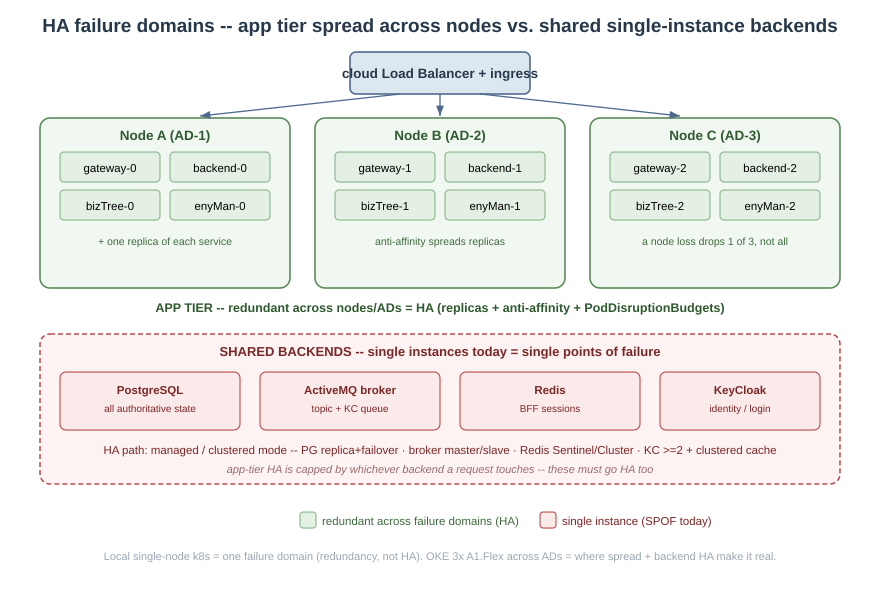

#  Esquire Application Frameworks(tm) 2.0

# **Esquire High Availability -- Deployment Nuances & Recommendations**

## Abstract

This document describes the High Availability (HA) that an Esquire deployment **can** provide, and the
deployment nuances needed to actually get it. It is deliberately honest about the difference between
**redundancy** (which Esquire's application tier gives by design) and **HA** (which also depends on *how* the
replicas are spread and on the HA mode of the stateful backends underneath them).

The short version:

- **Application tier -- HA-ready.** Every service runs N replicas and every collaboration survives the
  duplication. Any pod can serve any request; browser sessions are shared. This is built in.
- **Spread is a deployment choice.** N replicas on a single node is redundancy, not HA. Real failure
  tolerance needs the replicas spread across nodes (and availability domains), with disruption budgets so an
  upgrade or drain never takes them all at once.
- **Stateful backends are the limiting factor.** PostgreSQL, the ActiveMQ broker, Redis, and KeyCloak run as
  single instances today. Each is a single point of failure (SPOF). HA for these is something the deployment
  **enables** (managed service or clustered mode), not something the framework bundles.

**Acronyms used in this document**

| Term | Stands for | In plain words |
|---|---|---|
| **HA** | High Availability | the system keeps serving correctly through failures |
| **SPOF** | Single Point Of Failure | one component whose loss takes the whole system down |
| **redundancy** | (not an acronym) | running more than one copy of something |
| **N replicas** | N = a number | running N copies of a service (e.g. 2 or 3 pods) |
| **k8s** | Kubernetes | the container orchestration platform the services run on |
| **pod** | (Kubernetes term) | one running copy of a service (a container instance) |
| **node** | (Kubernetes term) | one machine in the cluster; pods run on nodes |
| **AD** | Availability Domain | an isolated data-center zone within a cloud region |
| **OKE** | Oracle Kubernetes Engine | the managed Kubernetes that runs the production cluster |
| **OCI** | Oracle Cloud Infrastructure | the cloud OKE runs on |
| **BFF** | Backend-for-Frontend | the Node tier that serves the browser app and holds the login session |
| **SPA** | Single-Page Application | the Angular browser app |
| **KC** | KeyCloak | the identity / login server |
| **PDB** | PodDisruptionBudget | a rule limiting how many replicas a drain/upgrade may remove at once |
| **HPA** | HorizontalPodAutoscaler | a k8s rule that adds/removes replicas automatically from a metric (e.g. CPU) |
| **KEDA** | Kubernetes Event-Driven Autoscaling | an add-on that autoscales from an event signal such as message-queue depth |
| **REST** | (HTTP API style) | the ordinary request/response web-API calls between tiers |
| **R&R** | Request/Reply | a request-then-response exchange carried over a message queue |
| **rod-id** | (Esquire term) | a per-instance routing id `<app>.<instanceNo>` that routes R&R replies back to the right caller |
| **SIGTERM** | (OS signal) | the "shut down" signal a pod receives before it stops |



The redundancy foundation this builds on is documented in `doc/plans/tasks1210.md` ("Redundant setup -- how it
works"), with the diagrams `redundancy-fleet.svg` and `redundancy-browser-tier.svg`.

---

## 1. What "HA" means here

A deployment is highly available when it keeps serving correctly through each of these, with no lost requests
and no lost user sessions:

| Failure | App tier covers it when... | Backend covers it when... |
|---|---|---|
| A **pod** dies / is restarted | >=2 replicas; readiness pulls the dead one from rotation | session/state is not in that pod (DB / topic / queue / shared Redis) |
| A **node** dies | replicas are **spread** across nodes (anti-affinity) | the backend has a standby on another node |
| A **rolling upgrade / node drain** | a PodDisruptionBudget keeps a minimum serving | the backend drains/fails over gracefully |
| An **availability domain** outage (cloud) | replicas spread across ADs | the backend replicates across ADs |

Redundancy (N replicas) is necessary but not sufficient. The rest of this doc is the nuances that turn
redundancy into HA.

---

## 2. The foundation already in place

- **One fleet rule.** All 8 services (gateway, bizTree, pacMan, keySmith, kcMaster, auKeep, enyMan, backend)
  run as **StatefulSets** with ordinal pods `<app>-0 .. <app>-9` (cap 10), a headless `<app>-hl` service, and
  `podManagementPolicy: Parallel`. The ordinal gives each pod a stable `instanceNo` and `rod-id`
  `<app>.<instanceNo>`.
- **The three channels survive duplication.** REST (round-robin), entity sync (topic fan-out), and KC
  maintenance (request/reply over a competing-consumer queue). See the fleet diagram.
- **Browser tier is redundant.** The Angular SPA is baked into the backend image (no separate frontend
  deployment), and the BFF login session is held in **shared Redis** (`connect-redis`), so any backend replica
  authenticates any cookie and a session survives a pod restart. See the browser-tier diagram.

This is the redundancy layer. HA is what you add on top.

---

## 3. Application-tier nuances -- turning redundancy into HA

These apply to the 8 Esquire services. None of them change application code; they are deployment (chart /
values) settings. **Status below is "recommended" -- they are not all in the charts yet.**

### 3.1 Replica count
- Run **>= 2** replicas of every service. On a 3-node cluster, **3** gives one replica per node.
- Hard cap is **10** (the `instanceNo` is a single decimal digit; the charts reject `replicaCount > 10`).

### 3.2 Spread across failure domains (the big one)
N replicas on one node all die with that node. Add **pod anti-affinity** (or
`topologySpreadConstraints`) so a service's replicas land on **different nodes**, and on the cloud across
**availability domains**:

```yaml
# per service template -- prefer separate nodes, then separate zones
topologySpreadConstraints:
  - maxSkew: 1
    topologyKey: kubernetes.io/hostname
    whenUnsatisfiable: ScheduleAnyway
    labelSelector: { matchLabels: { app: esquire-gateway-gateway } }   # gateway shown -- use each service's own app label
```

- **Local single-node k8s:** this is moot -- one node is one failure domain. Local exercises redundancy and
  correctness, **not** failure survival.
- **OKE (3x A1.Flex across ADs):** this is where it matters. Without spread, two replicas can co-locate and a
  node loss still drops the service.

### 3.3 PodDisruptionBudget
So a voluntary disruption (node drain, cluster upgrade) never evicts every replica at once:

```yaml
apiVersion: policy/v1
kind: PodDisruptionBudget
spec:
  minAvailable: 1            # or 50%
  selector: { matchLabels: { app: esquire-gateway-gateway } }   # one PDB per service -- use each service's own app label
```

### 3.4 Probes (already present -- keep them strict)
- **Readiness** gates traffic (`/readyz` on the BFF; bus-health on the Spring services). Keep it strict so a
  pod whose dependency (bus / DB) is down is pulled from the Service endpoints instead of failing requests.
- **Liveness** restarts a wedged pod (`/healthz`). Keep liveness *looser* than readiness -- a transient
  dependency blip should de-route a pod, not kill it.

### 3.5 Graceful shutdown (connection draining)
On a rollout or scale-down a pod gets SIGTERM. To avoid dropping in-flight work:
- Set a `terminationGracePeriodSeconds` and a small `preStop` sleep so the pod is removed from the Service
  endpoints before it stops accepting connections.
- The Node BFF should stop the HTTP server on SIGTERM after draining; the Spring services already stop their
  listeners on shutdown. (Recommended; verify per service.)

### 3.6 Rolling update vs the SPA chunk window
StatefulSets roll one pod at a time. During the window two image versions coexist, and a browser can fetch a
hash-named SPA chunk from the not-yet-updated pod and 404 (ChunkLoadError) until reload. This is **accepted**
as transient/self-healing. If zero-mismatch deploys become a goal: `strategy: Recreate` (trades a short
downtime) or version-tolerant asset serving (keep N previous builds / front with a shared asset store).

### 3.7 Horizontal autoscaling (where & how) -- NOT enabled

The fleet is shaped for autoscaling -- ordinal pods, an instance-derived `rod-id`, competing-consumer queues --
but **autoscaling is deliberately not enabled** in any deployment today; it is not a demo concern. This section
records WHERE it would attach and HOW, so it can be turned on later without rethinking the design.

The signal that matters is **REST request load** -- request rate and request duration (tail latency). Every
busy path starts as a REST call, so that is what to scale on; the broker queues are internal hops downstream of
it, not a separate driver.

- **The app tier** (gateway, enyMan, pacMan, keySmith, bizTree, and the BFF) -- a standard k8s **HPA** keyed to
  REST load. **CPU** (and/or memory) is the simple built-in proxy and is usually enough (needs `metrics-server`
  and CPU `requests` on the pods); a **custom request metric** (requests/second or p95 latency, via Prometheus
  Adapter) is the direct version when CPU does not track load closely enough.

```yaml
apiVersion: autoscaling/v2
kind: HorizontalPodAutoscaler
spec:
  scaleTargetRef: { apiVersion: apps/v1, kind: StatefulSet, name: esquire-enyman }
  minReplicas: 2
  maxReplicas: 10            # NEVER above 10 -- the instanceNo is one decimal digit (3.1)
  metrics:
    - type: Resource        # CPU as the REST-load proxy; swap/add a custom requests-per-second metric for the direct signal
      resource: { name: cpu, target: { type: Utilization, averageUtilization: 70 } }
```

**Configuring the direct REST-load signal (rate / duration).** The Spring REST services (bizTree, enyMan,
pacMan, keySmith) already expose it through Actuator / Micrometer -- `http_server_requests_seconds_count` (a
counter -> requests/second via `rate()`) and the `http_server_requests_seconds_bucket` histogram (-> p95
duration). Wire it to the HPA in three pieces:

**1. Scrape** -- Prometheus scrapes each pod's `/actuator/prometheus`.

**2. Expose as a k8s custom metric** -- a Prometheus Adapter rule turns the counter into a per-pod
requests/second metric:

```yaml
# prometheus-adapter rules
rules:
  - seriesQuery: 'http_server_requests_seconds_count{namespace!="",pod!=""}'
    resources: { overrides: { namespace: {resource: namespace}, pod: {resource: pod} } }
    name: { matches: "http_server_requests_seconds_count", as: "http_requests_per_second" }
    metricsQuery: 'sum(rate(<<.Series>>{<<.LabelMatchers>>}[1m])) by (<<.GroupBy>>)'
```

**3. Scale on it** -- the same HPA as above, but keyed to the request metric instead of CPU (this REPLACES the
CPU proxy; add a p95-latency metric the same way and the HPA takes whichever demands the most replicas):

```yaml
apiVersion: autoscaling/v2
kind: HorizontalPodAutoscaler
metadata: { name: esquire-enyman }
spec:
  scaleTargetRef: { apiVersion: apps/v1, kind: StatefulSet, name: esquire-enyman }
  minReplicas: 2
  maxReplicas: 10                       # the <=10 ceiling still holds
  metrics:
    - type: Pods                        # requests/second per pod -- the RATE signal
      pods:
        metric: { name: http_requests_per_second }
        target: { type: AverageValue, averageValue: "50" }     # keep ~50 req/s per pod
    - type: Pods                        # OPTIONAL second signal: p95 DURATION (its own adapter rule)
      pods:
        metric: { name: http_request_p95_seconds }
        target: { type: AverageValue, averageValue: "300m" }   # 0.3s p95 budget
```

Same shape for every REST service -- enyMan, pacMan, keySmith, bizTree (and the gateway). The Node BFF exposes
the equivalent from `prom-client` (`http_request_duration_seconds`); its adapter rule and HPA take the same
form.

- **kcMaster** is not a separate case. Its KC request/reply queue is a SYNCHRONOUS hop -- the caller
  (enyMan / keySmith) blocks on the reply inside its own REST request -- so a backlog there is just REST latency
  upstream. It rides the same REST-load signal; no broker-specific trigger is needed.
- **auKeep** is the one exception. The audit event is fire-and-forget (posted after commit, off the request
  thread), so its backlog is NOT visible as REST load. IF the audit consumer is ever autoscaled, **queue depth**
  is the right signal -- an event-driven autoscaler (**KEDA**) `ScaledObject` on the ActiveMQ audit queue, same
  `maxReplicas: 10` ceiling. This is optional: the audit log is a background write, not on the request path.

**Esquire-specific rules for any autoscaler:**

- **`maxReplicas` <= 10, always.** The `rod-id` `instanceNo` is a single decimal digit (3.1); an autoscaler
  that overshoots that breaks instance identity.
- **Scale-in is safe by design but needs graceful shutdown (3.5).** A StatefulSet removes the highest ordinal
  first; that pod's `rod-id` simply leaves -- the entity topic loses a peer, and its unacknowledged R&R
  requests are redelivered to a surviving copy (competing consumers). A `preStop` drain keeps an in-flight
  reply from being dropped.
- **The BFF autoscales only with the shared session store on** (`REDIS_URL` set) -- already true on local k8s.
  On OKE the BFF stays at 1 until HA Redis exists (section 4), so do not autoscale the BFF there yet.
- **Backends do not autoscale.** PostgreSQL, the broker, KeyCloak, and Redis are fixed single instances
  (section 4); scaling the app tier only raises load on them, so backend capacity / HA -- not the autoscaler --
  is the real ceiling.

---

## 4. Stateful backends -- the real SPOFs today, and the HA path for each

These run as single instances. They are shared by the whole fleet, so each is a SPOF until put into an HA mode.
HA here is a **deployment choice the operator makes**, not bundled by Esquire.

| Backend | Carries | Today | SPOF? | HA path |
|---|---|---|---|---|
| **PostgreSQL** | all authoritative entity / account state | single instance | **Yes -- total** | OCI **managed** Postgres with a standby (OKE), or a Postgres operator (CloudNativePG / Patroni) with streaming replication + automatic failover |
| **ActiveMQ broker** | the entity topic + the KC R&R queue | single broker | **Yes** | ActiveMQ **shared-store master/slave** (or Artemis HA); the messaging-bus SPI can target an HA-capable provider without service code change |
| **Redis** | BFF login sessions (+ audit stream) | single instance, **local k8s only** | **Yes** (lose it = everyone logged out) | **Redis Sentinel** or **Redis Cluster**, or OCI managed Redis. Required before the BFF is HA -- a shared store that is itself a SPOF only moves the failure |
| **KeyCloak** | identity / login | single replica | **Yes** (login outage) | DB-backed KC at **>= 2 replicas** with a clustered Infinispan cache, plus ingress **session affinity** for the login round-trip; shares the (HA) Postgres |
| **ingress-nginx** | the front door | typically 1 controller (local) | **Yes** | **>= 2** controller replicas behind the cloud load balancer |

**Key point:** scaling the BFF to N replicas with a *single* Redis does not make the browser tier HA -- it
makes it redundant against a BFF-pod loss, but a Redis loss still logs everyone out. HA of the browser tier =
HA of Redis. The same logic applies to every service over Postgres and the broker.

---

## 5. OKE vs local k8s

| | Local (Docker Desktop, 1 node) | OKE (3x A1.Flex, multi-AD) |
|---|---|---|
| Redundancy (N replicas, shared session) | Yes -- exercised | Yes |
| Real node/AD failure tolerance | **No** (one failure domain) | **Yes**, once replicas are spread (3.2) + PDBs (3.3) |
| Redis (BFF session store) | present | **not deployed** -- BFF stays at 1 replica until Redis (HA) is added |
| Stateful backend HA | single instances (fine for dev) | needs managed/clustered mode (section 4) |

Local k8s is the **correctness rehearsal** for the deployment shape; it is not a stand-in for HA. OKE is where
spread + backend HA make the deployment actually highly available.

---

## 6. What Esquire can provide -- the bottom line

- **The application tier: full horizontal HA.** Any pod serves any request; sessions are shared; the fleet
  survives pod loss now and node/AD loss once replicas are spread with disruption budgets. No code change --
  only chart/values settings (sections 3.1-3.5).
- **The stateful backends: HA-enabled, not HA-bundled.** Postgres, the broker, Redis, and KeyCloak each need
  their HA mode switched on (managed service or clustered). Until then they are the limiting SPOFs, and the
  app-tier HA is capped by whichever backend a request touches.
- **Recommended minimum for a genuinely HA OKE deployment:** services at >= 2-3 replicas with anti-affinity +
  PDBs; HA Postgres; HA broker; HA Redis (and only then scale the BFF on OKE); KeyCloak >= 2 with affinity;
  ingress-nginx >= 2.
- **Autoscaling is a documented option, not turned on.** Where and how it attaches (HPA keyed to REST request
  load -- rate / duration, with CPU as the simple proxy -- across the app tier; queue depth only for the
  fire-and-forget audit consumer; `maxReplicas` capped at 10) is in section 3.7. It is left off by choice -- it
  is not part of the demo deployment.

These backend-HA items and the app-tier spread settings (anti-affinity, PDBs, graceful shutdown) are
**recommendations, not yet applied to the charts.** They are the candidate scope for the HA hardening that
follows the redundancy work.
