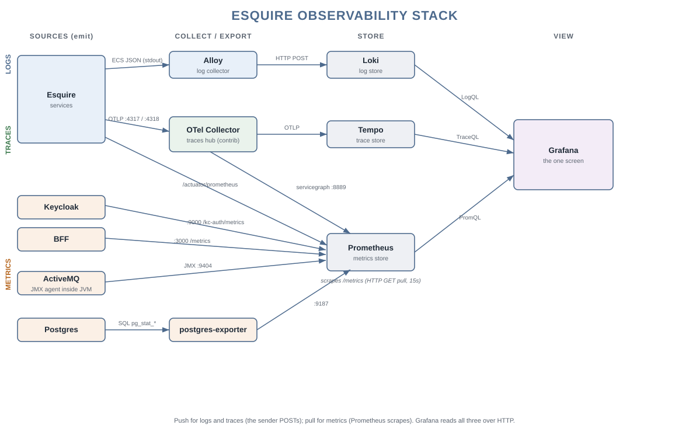
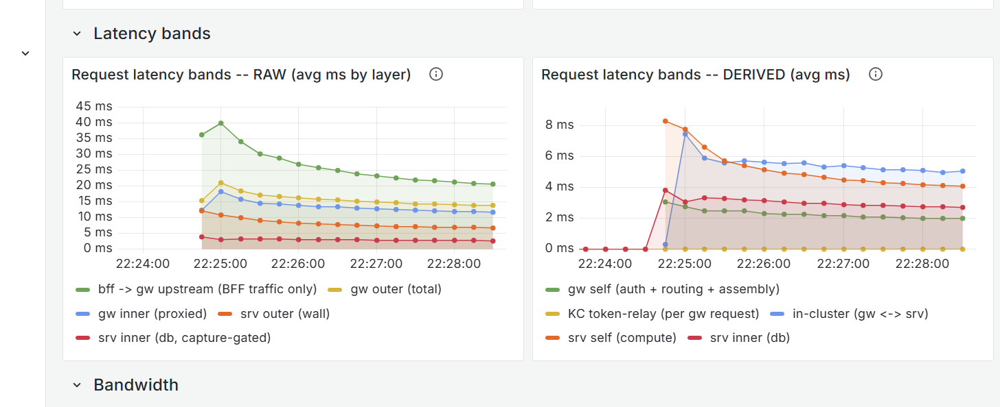

<table style="width: 100%; table-layout: fixed;">
  <tr>
    <td style="width: 12%"></td>
    <td style="width: 88%;">
       <h1>Esquire Application Frameworks(tm) 2.0</h1>
    </td>
  </tr>
</table>

# **Esquire Observability Stack**

## Abstract

Esquire supports the common, industry-standard observability stack -- the open-source Grafana stack (Grafana + Loki + Tempo + Prometheus) fed through a vendor-neutral OpenTelemetry Collector, with no lock-in to any of it. **Part 1** walks that stack, component by component.

To feed that stack -- and to *extend* it -- every Esquire service is built on the same strategic patterns: the **3+1 pillars of observability**, each covered in depth in **Part 2**.

### The 3+1 Pillars of Observability in Esquire:

-   **Distributed Tracing:** This allows following a single request's "path" through the entire distributed system.
-   **Structured Logging:**  "Two lines per Request" INFO log strategy provides the narrative of what happened, linked perfectly to the traces via the IDs.
-   **Performance Metrics:** Built-in **APM (Application Performance Monitoring)**, along with optional capture triggers, provides numerical data to assess the system's health and performance.
-   **Error Report (The RFC 7807/9457), the fourth pillar:** It provides a machine-readable state of the failure, including the root cause and processing time.

**Companion documents.** The full **logging strategy** -- the three tiers, the two-line-per-request pattern, and
the ECS fields -- is in [`Esquire.ObservabilityStack.Logging.md`](Esquire.ObservabilityStack.Logging.md). Every
signal Esquire collects is catalogued in
[`Esquire.ObservabilityStack.Inventory.csv`](Esquire.ObservabilityStack.Inventory.csv) (walked in Part 3). How to
read the panes is the [Grafana Guide](Esquire.GrafanaGuide.md). Esquire also ships in a **compact** deployment,
where several services run in one process; what that changes about watching it -- and what it deliberately does
not -- is **Part 4**.

## Part 1 -- The Observability Stack

### The Component Model

The pillars above are the observability data Esquire *produces* -- the trace ids, the ECS log lines, the
meters, the error report. This section is the **stack that carries them**: the open-source components that
collect it, store it, and show it on one screen, and the wire between each. The four pillars in depth follow in Part 2.

---

**Pull for metrics, push for logs and traces** (the sender POSTs; nobody fetches), and **Grafana is the one screen** over all three stores.
Keycloak, the broker and the database reach Grafana the same way every metric does: Prometheus *scrapes*
their `/metrics` endpoint, then Grafana queries Prometheus -- e.g. **Keycloak `/kc-auth/metrics` -->
Prometheus --> Grafana**. Every id is the same end to end (`correlationId` == `traceId` == the metric
exemplar), so any pillar jumps to any other.

---
<table style="width: 100%; table-layout: fixed;">
  <tr>
    <td style="width: auto; white-space: nowrap;"><b>Grafana Alloy</b></td>
    <td style="width: 100%;"></td>
  </tr>
</table>

The log collector. Discovers the pods on the cluster, tails each container's stdout -- already ECS JSON, so no service change -- attaches the `correlationId` / `requestId` as structured metadata, and ships the stream on.
*Communication:*
- **IN** -- reads pod logs through the Kubernetes API / kubelet
- **OUT** -- HTTP POSTs the batched log lines to Loki's `push` endpoint (`POST /loki/api/v1/push`)

*Source:* [grafana/alloy](https://github.com/grafana/alloy) (Grafana Labs, open source).

---
<table style="width: 100%; table-layout: fixed;">
  <tr>
    <td style="width: auto; white-space: nowrap;"><b>Grafana Loki</b></td>
    <td style="width: 100%;"></td>
  </tr>
</table>

The log store; aggregates and indexes the ECS streams by a small label set, keeping `correlationId` / `requestId` as structured metadata (never a label, so the index stays small).
*Communication:*
- **IN** -- the log lines Alloy HTTP POSTs to its `push` endpoint (`/loki/api/v1/push`)
- **OUT** -- queried by Grafana in LogQL over HTTP

*Source:* [grafana/loki](https://github.com/grafana/loki) (Grafana Labs, open source).

---
<table style="width: 100%; table-layout: fixed;">
  <tr>
    <td style="width: auto; white-space: nowrap;"><b>OpenTelemetry Collector</b></td>
    <td style="width: 100%;"></td>
  </tr>
</table>

A separate routing hub for traces -- its OWN service, NOT part of any app. It receives spans from every service, tail-samples (keeps the error traces, thins the rest), and forwards them to the trace store. It also derives a **service graph**: for every service-to-service call it sees in the spans (including the bus hops), it computes that edge's request / error / latency and publishes them as metrics on `:8889` -- the one place a trace becomes a metric, and what feeds the topology view. It is the ONE swap point: aim its exporter at a different trace backend and no service changes. (The `-contrib` build is required -- the `servicegraph` connector and `tail_sampling` processor are not in the core Collector.)
*Communication:*
- **IN** -- OTLP over gRPC (`:4317`) and HTTP (`:4318`) from the services
- **OUT** -- OTLP to Tempo, and service-graph metrics on `:8889` (scraped by Prometheus)

*Source:* [open-telemetry/opentelemetry-collector-contrib](https://github.com/open-telemetry/opentelemetry-collector-contrib) (OpenTelemetry / CNCF, open source).

---
<table style="width: 100%; table-layout: fixed;">
  <tr>
    <td style="width: auto; white-space: nowrap;"><b>Grafana Tempo</b></td>
    <td style="width: 100%;"></td>
  </tr>
</table>

The trace store; keeps each request's spans under its `traceId` -- which equals the `correlationId`, so a log line and its trace share one id.
*Communication:*
- **IN** -- OTLP from the OTel Collector
- **OUT** -- queried by Grafana (by id / TraceQL) over HTTP

*Source:* [grafana/tempo](https://github.com/grafana/tempo) (Grafana Labs, open source).

---
<table style="width: 100%; table-layout: fixed;">
  <tr>
    <td style="width: auto; white-space: nowrap;"><b>Prometheus</b></td>
    <td style="width: 100%;"></td>
  </tr>
</table>

The metrics store; **pull-based**. "Scrape" means Prometheus makes a plain HTTP GET to each target's `/metrics` page on a fixed interval (15s) and reads the numbers off it -- the target only exposes a text page, it pushes nothing, and every target is read the same way (no per-source driver). Where a source is not already Prometheus text, a small **exporter** does the translation first: most services expose it themselves (Spring Actuator, Keycloak/Quarkus, the BFF's prom-client); the **ActiveMQ JMX exporter is a Java agent INSIDE the broker JVM** (`:9404`, not a separate box); **postgres-exporter is a SEPARATE service** that queries Postgres over SQL and re-publishes it (`:9187`).
*Communication:*
- **IN** -- scrapes these `/metrics` endpoints (HTTP GET pull, 15s):
    - the services' `/actuator/prometheus`
    - Keycloak `/kc-auth/metrics` (`:9000`)
    - the BFF `/metrics` (`:3000`)
    - the OTel Collector -- own + service-graph (`:8888` / `:8889`)
    - the ActiveMQ JMX exporter (`:9404`)
    - postgres-exporter (`:9187`)
- **OUT** -- queried by Grafana in PromQL over HTTP

*Source:* [prometheus/prometheus](https://github.com/prometheus/prometheus) (Prometheus / CNCF, open source).

---
<table style="width: 100%; table-layout: fixed;">
    <tr>
    <td style="width: auto; white-space: nowrap;"><b>Postgres Exporter</b></td>
    <td style="width: 8%;"></td>
    <td style="width: 100%;"></td>
  </tr>
</table>

A SEPARATE service (Postgres cannot expose Prometheus metrics itself, and you cannot load an agent into it). It connects to the database, reads the `pg_stat_*` views, and re-publishes them as a Prometheus `/metrics` page.
*Communication:*
- **IN** -- SQL to Postgres (`pg_stat_*`)
- **OUT** -- `/metrics` on `:9187` (HTTP pull), scraped by Prometheus

*Source:* [prometheus-community/postgres_exporter](https://github.com/prometheus-community/postgres_exporter) (open source).

---
<table style="width: 100%; table-layout: fixed;">
  <tr>
    <td style="width: auto; white-space: nowrap;"><b>Grafana</b></td>
    <td style="width: 100%;"></td>
  </tr>
</table>

The one screen; dashboards for all three -- logs, traces, metrics -- and the cross-links between them: a log line jumps to its trace (the `TraceID` derived field), a metric spike jumps to an example trace (exemplars), all in one place.
*Communication:* three data sources, all over HTTP:
- Loki -- LogQL
- Tempo -- TraceQL
- Prometheus -- PromQL

*Source:* [grafana/grafana](https://github.com/grafana/grafana) (Grafana Labs, open source).

---

### Backend choice -- no lock-in

The component model above is the stack Esquire **ships**: Alloy → Loki for logs, the OpenTelemetry Collector → Tempo for traces, Prometheus for metrics, all read through one Grafana. It is a deliberate default, not the only choice -- and replacing any part of it is a configuration change, not a code change, because the emit side is open on both formats:

- **Logs are ECS JSON** (Elastic Common Schema) written to stdout. Anything that reads ECS reads Esquire's logs unchanged -- the full Elastic stack (Elasticsearch + a shipper such as Logstash/Filebeat + Kibana), or a cloud provider's own log service (AWS CloudWatch Logs / Insights, Google Cloud Logging, Azure Monitor) that recognizes JSON/ECS and filters on `correlationId` directly. Alloy → Loki is simply the default we ship.
- **Traces are OTLP** -- the vendor-neutral OpenTelemetry wire -- sent to the Collector. The Collector is the single swap point: aim its exporter at any OTLP backend (Tempo, shipped; or Jaeger, Zipkin) and not one service changes.
- **Metrics are Prometheus** exposition, scraped by any Prometheus-compatible tool.

Because every id is the same string end to end (`correlationId` == `traceId`), whichever backends you pick a log line, its trace, and its metrics still line up -- the correlation lives in the data, not in the tool.

## Part 2 -- The Four Pillars

### 1. Distributed Tracing

#### The Strategy: "Global Tracing with Local Granularity".

This architecture ensures that "No request is left behind." Whether a request succeeds in a service or fails in the Gateway, there is a single, consistent ID to find the entire story.

Esquire uses two identifiers: one that follows activity *inside* the service network, and one that carries the *end client's* own reference through it.

-   **Correlation ID** (*Esq-Correlation-ID*) -- the internal, end-to-end id. The Gateway settles it at the edge, and it links a request through every backend service. It is also the trace's id and the *traceId* field in the RFC 9457 *Problem Detail*, so the logs, the trace, and the error report all share one value. A client may set it explicitly with the standard *X-Correlation-ID* header.

    *Note: the Correlation ID (the internal request identity) travels in the Esq-Correlation-ID HTTP header; traceId is the matching JSON field in the Problem Detail report -- same value, two places.*

-   **Request ID** (*X-Request-ID*) -- a read-only id the client supplies (Angular, mobile, etc.). It travels through the whole system, is recorded for later investigation, echoed back in the response headers, and included in the error report -- so a user can quote it as a "support ticket number."

#### Summary of Constants

|  **Name**            | **Purpose**                                          | **Details**                                                                                                               |
|----------------------|------------------------------------------------------|---------------------------------------------------------------------------------------------------------------------------|
| *Esq-Correlation-ID* | *Header.*  The internal engine for log linking    | Circulates only internally within Esquire networks. It may appear in error reports.                                       |
| *X-Correlation-ID*   | *Header.*  Standard compatibility header          | Optional: It explicitly defines *Esq-Correlation-ID* from the client’s side. It’s echoed back to the client.              |
| *X-Request-ID*       | *Header.*  The client's original reference ID.    | Its use is highly recommended for clients' Apps. It’s tracking in every processing chain. It’s echoed back to the client. |
| *traceId*            | *Error Problem Detail.*  **THE KEY of the whole stack** -- the one id a request's trace, its log lines, and its metrics all share. | In Esquire it equals *Esq-Correlation-ID*, so a single value follows one request across every service and every pillar -- which is what makes a log jump to its trace, and a trace to its metrics.                                                                               |

#### The Trace: one id, end to end

Beyond the header identity, Esquire emits an actual distributed trace. Every service records OpenTelemetry spans and exports them over OTLP to a collector, which forwards them to a trace store (Tempo) viewed in Grafana. The defining rule is **traceId == Correlation ID**: the Gateway settles the Correlation ID at the edge and seeds the trace with it, so a request's spans, its log lines, and its error report all carry the same id — one search finds the whole story across services.

The Gateway is the root of the trace. From there the id flows to every downstream service and, crucially, **across the messaging bus**: a bus hop is recorded as a *producer* span on the sender and a *consumer* span on the receiver, so a message's journey — an entity broadcast fanning out to every replica, an audit write, a KeyCloak sync — reads as one connected trace rather than disjoint fragments.

Which instance did the work is visible per span: in the trace view each span is badged by the service **instance** (its rod-id, `<app>.<instance>`), so the two replicas of a service are told apart — while logs and metrics keep the plain, logical service name for aggregation.

Services opt individual operations into the trace with a single mark (an `@EsqTraced` annotation or an `EsqTraceMark` call), which shows up as its own span nested in the request: the service transaction, the cache apply, the account posting, the KeyCloak call.

#### R&R bus liveness round-trip (optional)

The messaging bus is a self-contained sub-framework of Esquire -- it runs on its own, and carries its own observability. Two parts of it reach the trace: every message hop is already recorded as a *producer* / *consumer* span pair (above), and a bus can run a **keep-alive** that stops an idle connection going stale and notices an outage sooner. That keep-alive matters most on a **request/reply (R&R) bus**, where *both* legs have to stay up -- the request going out and the reply coming back -- so its health is worth tracing directly, which is why it appears here in the tracing pillar.

A request/reply (R&R) bus runs a FIX-style liveness protocol: the client periodically sends a **TestRequest** and the server answers with a **HeartBeat**. When enabled, this whole round-trip is traced — `TestRequest → receive → HeartBeat → receive`, one four-span trace — so the health of an R&R bus is observable end to end: a complete round-trip means the bus is healthy in both directions; a truncated one shows exactly where it broke. It is a deliberate, separate opt-in from request tracing, because heartbeats fire on a steady cadence.

#### Notes

-   **Off by default.** Distributed tracing is opt-in per environment (it costs nothing when off). The R&R liveness round-trip is a further opt-in on top — enabled on the local docker stack, off on Kubernetes, and off by default.
-   **One id everywhere.** Because traceId equals the Correlation ID, a trace, its logs, and its error report are joined by a single value; a Correlation ID a client supplies (via *X-Correlation-ID*) becomes the trace id.
-   **Noise kept out.** Health-probe / actuator paths open no span, and framework-internal spans (the security filter chain) are suppressed, so a trace shows the request's real work.
-   **The trace view is per-instance.** The trace store labels a span by the emitting replica, while logs and metrics keep the plain logical service name for aggregation -- so correlating a per-instance span to a by-name metric means matching on the logical service name, not the rod-id.

### 2. Structured Logging

#### Context-Aware Log Levels

Esquire established a hierarchy to keep production logs clean:

-   *ERROR* -- an error in the service: the parameter values that led to it, plus the stack trace when it is an exception.
-   *INFO* -- the request lifecycle audit only (*INCOMING* / *OUTGOING*).
-   *DEBUG* -- internal logic (e.g. "settling ids", "CORS checks").
-   *TRACE* -- the finest technical detail (e.g. "generated new UUID").

#### The Foundation: Contextual Awareness

-   Every log line, at any level, is tagged with the correlation id and request id -- automatically through the MDC framework, or by hand where needed.

#### Strategic Logging Points

-   **The "Two Line per Request" Strategy.** Esquire moved away from multiple noisy logs and settled on a clean, high-visibility *INFO*-level audit. Every request generates exactly two bookend logs:

    *INCOMING* *(Entrance):* the log of the moment the request is settled. It includes the Correlation ID (internal engine) and Request ID (external witness).

    *OUTGOING (Exit):* the log of the final result. This is the most valuable log line because it combines the IDs, the HTTP Status, and the processing timing.

#### Performance Logging (AOP)

-   **Granular timing.** The final *OUTGOING* line carries the gateway, service, and backend times where they apply -- so "slow network" vs "slow database" vs "slow logic" is visible in the logs, not guessed at. This is what makes capacity work possible.

#### Standardized UTC Timestamps

-   **One clock, UTC.** With the log pattern set to *%d{yyyy-MM-dd HH:mm:ss, UTC}*, log timestamps match the ones in responses and database records -- no timezone confusion across a distributed system.

### 3. Performance Metrics

#### APM (Application Performance Monitoring) system

**Application Performance Monitoring answers one question: where does a request spend its time -- the network, the gateway, the service code, or the database?** -- so a slow request is diagnosed, not guessed at.

The usual way to get this is to aggregate the distributed **traces**: collect every span and compute the timing across them. That works, but it is heavy -- it needs the whole trace pipeline (Collector, trace store) up and running before a single number appears. **Esquire adds a lighter alternative: it measures the four tiers as the request runs and embeds the answer in the response itself** -- the `X-Response-Time` family of headers, and the same values on the `OUTGOING` log line. The timing is already prepared, so reading it needs nothing from the trace store; per request it answers *"why was THIS one slow?"* on the spot.

That already-prepared data is what the hauberk **`PerformanceMatrix`** consumes: it reads the four timing headers off each response and prints per-URL summary blocks -- the network / gateway / in-cluster / service / DB bands -- so a load run shows exactly where the time went, without aggregating a single trace. **This is what keeps load testing simple:** the performance breakdown comes straight off the responses, so a test needs **no observability stack running at all** -- no Collector, no trace store, no Grafana -- which takes a whole tier of setup out of every performance run.

Live -- while observability is on -- the same four tiers are also collected as **metrics** (still cheap, no trace aggregation) and drawn on two panels of the Grafana *Esquire Services* dashboard:

-   **Request latency bands -- RAW (avg ms by layer)** -- each layer's full timer, as measured: *gw outer* (total), *gw inner* (proxied downstream call), *srv outer* (service wall time), *srv inner* (DB), plus the *BFF -> gw* upstream.
-   **Request latency bands -- DERIVED (avg ms)** -- those same timers *subtracted* into the exclusive band each tier adds: *gw self* (auth + routing), *KC token-relay*, *in-cluster* (gw <-> srv), *srv self* (compute), *srv inner* (DB). This is the "where did the time go?" view -- the bands sum to the gateway total.

Same breakdown as the load-test bands, live over time, and with no `X-Capture-Metrics` header needed.

*The two Request latency bands charts: RAW (each layer's timer) and DERIVED (the same timers subtracted into the exclusive band each tier adds).*

The four-layer measurement below is that embedded timing.

#### Four-Layer Measurement (outer/inner pairs per tier)

Esquire captures four distinct but related metrics for every request, organized as outer/inner pairs at the gateway tier and the service tier:

-   **Gateway Outer Time (`X-Response-Time`)**: from receive-from-client to send-to-client. Includes Spring Security filter chain (JWT decode, Vanilla Token Relay broker call, Phantom Token Relay token-exchange, authorization), routing, the downstream service call, and response assembly. The full envelope of work the gateway does on the request.
-   **Gateway Inner Time (`Esq-Gw-Inner-Time`)**: from sent-to-service to received-from-service. The gateway's measurement of the downstream call only. The delta `gw_outer - gw_inner` isolates the gateway's own overhead (auth + routing + response assembly).
-   **Service Outer Time (`Esq-Srv-Outer-Time`)**: from receive-by-service to send-to-gateway. The service's measurement of its own full processing.
-   **Service Inner Time (`Esq-Srv-Inner-Time`)**: umbrella of all inner-aspect costs at the service tier -- today equals JPA / DB query time; reserves the slot for future specifics like JMS publish wait, cache lookup, or external API calls via the extensible naming pattern `Esq-Srv-Inner-{X}-Time` (e.g., `Esq-Srv-Inner-DB-Time`, `Esq-Srv-Inner-JMS-Time`). The umbrella metric is always present; sub-aspects are added alongside it as the system grows.

#### Where each timer is measured (and why outer ≠ inner)

The four headers come from two pairs of filters at two tiers. Each timer answers a slightly different question:

-   **`X-Response-Time` is set by an outer-tier WebFilter** at `HIGHEST_PRECEDENCE` so the timer starts **before** Spring Security runs. This means Vanilla Token Relay broker call, Phantom Token Relay token-exchange, JWT decode time, role-check time -- the full auth-layer cost -- is part of the gateway outer envelope, not buried as invisible pre-routing overhead.
-   **`Esq-Gw-Inner-Time` is set by a Spring Cloud Gateway `GlobalFilter` at default order**. It runs inside the gateway's WebHandler, after Spring Security has approved the request. It captures only the routing + downstream-call window. The delta `outer - inner = gateway's own work` (auth + routing + response assembly).
-   **`Esq-Srv-Outer-Time` and `Esq-Srv-Inner-Time`** are both set by the service-side `MdcFilter` in `services/common`. Outer = full servlet request lifecycle. Inner = umbrella of all "inside work" (today, JPA queries via repository AOP; extensible via `Esq-Srv-Inner-{X}-Time` for future aspects).

The derived bands (`net`, `gw_self`, `in_cluster`, `srv_self`, `srv_inner`) are not headers; they're computed at consumption time by subtracting adjacent layer values. The hauberk harness's `PerformanceMatrix` does this automatically and prints per-URL summary blocks; see `services/doc/Esquire.Haubergeon.md` for the consumer view.

#### Selective Visibility

To avoid leaking internal timing data and saving on overhead, the four timer headers are optional.

-   **The Trigger**: The Gateway only adds these headers if the client sends the *X-Capture-Metrics* header.
-   **The Master Switch**: the gateway configuration *esquire.gateway.service-metrics.enabled* allows enabling the gathering of service performance metrics globally across all backend services if needed. For normal traffic, the flag must be off to avoid the memory overhead of buffering the response body.
-   **Log Visibility**: Regardless of headers, the *OUTGOING* log always provides a total performance snapshot at the gateway tier. When the Master Switch is on, logs include all four metric values plus the per-URL derived bands.
-   **Response Visibility**: When an end-client app passes the trigger header, the four metric headers are injected directly into the response (`X-Response-Time`, `Esq-Gw-Inner-Time`, `Esq-Srv-Outer-Time`, `Esq-Srv-Inner-Time`). The service-tier headers (`Esq-Srv-*`) depend on the Master Switch state on the service side; the gateway-tier headers (`X-Response-Time`, `Esq-Gw-Inner-Time`) are always emitted under trigger.
-   **Error Report**: When an error has happened on the Gateway side, the Gateway reports the error with request timing using *processingTime Problem Detail* attribute, even in the case when the end-client did not trigger the performance metrics.

#### Summary of Constants

|  **Name**                                          | **Purpose**                                                                          | **Details**                                                                |
|----------------------------------------------------|--------------------------------------------------------------------------------------|----------------------------------------------------------------------------|
| *X-Capture-Metrics*                                | *Header.*  The end-client Trigger.                                                | Allows sending performance metrics in response headers,                    |
| *X-Response-Time*                                  | *Header.*  Gateway outer time -- full envelope.                                   | Always in the response headers when “triggered”.                           |
| *Esq-Gw-Inner-Time*                                | *Header.*  Gateway inner time -- downstream call only.                            | In the response headers, when “triggered”.                                 |
| *Esq-Srv-Outer-Time*                               | *Header.*  Service outer time -- full service processing.                         | In the response headers, when “triggered” and “Master Switch” are on.      |
| *Esq-Srv-Inner-Time*                               | *Header.*  Service inner umbrella -- today equals JPA, future may decompose.      | In the response headers, when “triggered” and “Master Switch” are on.      |
| *Esq-Srv-Inner-{X}-Time*                           | *Header.*  Optional inner-aspect decomposition (e.g., -DB-, -JMS-, -Cache-).      | Added alongside the umbrella `Esq-Srv-Inner-Time`, not in place of it.     |
| *esquire. gateway. service-metrics .enabled* | *Gateway configuration.* The “Master Switch”.                                     | Disabled by default                                                        |
| *processingTime*                                   | *Error Problem Detail.*  Request processing time                                  | Same value as for *X-Response-Time*, does not require to be “triggered.*”* |

### 4. Error Report (The RFC 7807/9457)

#### Centralized and consistent error-handling strategy

Esquire's error handling follows RFC 9457, so the API returns the same shape of error no matter *where* or *how* it happens.

Here is a breakdown of the error handling essentials that were established:

-   **RFC 9457 Compliance**: Every error response is a standard object: *Problem Detail*.
-   **Standardization**: Error JSONs in the response body look identical, whether it's a 401 Unauthorized from the Security Filter or a 500 Internal Error from a service.
-   **Uniformity**: Every error (whether from the Gateway or Service) looks identical to the client.
-   **Instance URI**: Including the instance (the failing URL) in the error JSON helps frontend developers immediately identify which endpoint call went wrong.
-   **Consistency of response**: By returning this unified type, Esquire ensures that the HTTP status headers and the JSON body are always perfectly synchronized.
-   **Root-cause extraction**: the *detail* field carries the real failure reason, dug out even when it is wrapped in several layers of exceptions.
-   **Ties back to the logs**: the two ids (*requestId*, *correlationId*) are mapped into the error body automatically, so an error report and its log lines carry the same ids.

    *Note: traceId equals correlationId. Problem Detail has both attributes:  since traceId is required, and there is a hypothetical case when no correlationId is obtained*.

-   **UTC Precision**: Every error report now carries a guaranteed UTC timestamp.
-   **Support-ready**: the *requestId* in the body gives a user one reference to quote when reporting an issue.
-   **Transparency**: For gateway errors, the *processingTime* property tells the user exactly how long the system worked on their request before it failed.

#### Problem Detail attributes

|  **Name**        | **Type**                                                                      | **Description**                                                                                                                                                                                                                         |
|------------------|-------------------------------------------------------------------------------|-----------------------------------------------------------------------------------------------------------------------------------------------------------------------------------------------------------------------------------------|
| *type*           | string                                                                        | URI identifying the error type                                                                                                                                                                                                          |
| *title*          | string                                                                        | Short, human-readable summary                                                                                                                                                                                                           |
| *traceId*        | string                                                                        | A cross-system trace ID. In Esquire, it equals *Esq-Correlation-ID,* same *correlationId.*                                                                                                                                              |
| *status*         | number                                                                        | Header.  The HTTP Status Code (e.g., 401, 503). Matches the HTTP Response Header.                                                                                                                                                    |
| *detail*         |  string                                                                       | Detailed, actionable explanation                                                                                                                                                                                                        |
| *Instance*       | string                                                                        | URI identifying the specific occurrence                                                                                                                                                                                                 |
| *Errors*         | `array<{ name?: string; reason: string; pointer?: string; }>` | Standard extension for validation errors.                                                                                                                                                                                               |
| *timestamp*      | string                                                                        | Esquire extension: Error timestamp in UTC timezone                                                                                                                                                                                      |
| *requestId*      | string                                                                        | Esquire extension: End-client request ID                                                                                                                                                                                                |
| *correlationId*  | string                                                                        | Esquire extension: Server internal correlation ID, value of *Esq-Correlation-ID*                                                                                                                                                        |
| *processingTime* | string                                                                        | Esquire extension: Only for Gateway errors: Total time the system spent on the request before the error occurred.                                                                                                                       |
| *stackTrace*     | string                                                                        | Esquire extension: Root cause stack trace. Conditional: Only included when the “Master Switch” is true to maintain security. It is the same “switch” used to control the visibility of internal metrics. It is set to false by default. |

#### Esquire Explorer Error Report

## Part 3 -- Extending the o11y Layer

### The asset inventory

Every signal Esquire collects is catalogued -- one row per asset, with what emits it, what it is for, and whether it is drawn on a dashboard -- regenerated by `test/o11y/o11y-inventory.py`. **One sheet per deployment**, because a deployment decides who carries the signals:

- [`Esquire.ObservabilityStack.Inventory.csv`](Esquire.ObservabilityStack.Inventory.csv) -- the classic stack. **128 assets:** 102 metrics (20 counters, 9 timers, 3 gauges, 2 histograms, 1 summary, 7 scrape jobs, 60 dependency metrics from the JVM / DB / broker / Keycloak / BFF), 18 traced operations (named spans -- each is both a span and a metric), and **8 log streams**.
- [`Esquire.ObservabilityStack.Inventory.Compact.csv`](Esquire.ObservabilityStack.Inventory.Compact.csv) -- the compact stack. **125 assets:** the same metrics and the same traced operations, and **5 log streams**.

The metrics are identical because the code is identical. What differs is the log pillar: a stdout stream belongs to a PROCESS, and the compact stack runs five of them.

Consult it before adding a signal: the odds are the one you want already exists.

### Patterns and traps -- read before extending the o11y layer

The index to the hard-won lessons of building this layer. The code-local ones (a `strongReference` comment, a `||` comment in the source) are the truth; this section is the discoverable map to them, not a duplicate.

#### Patterns applied (follow these when you extend)

- **One master switch = one decision point.** `ESQ_OBSERVABILITY_ENABLED` gates the whole layer and is OFF by default; everything tracing/metrics keys off that single switch, not a flag per feature.
- **Explicit `@Bean`, never auto-config.** Every o11y bean is declared per service; nothing is picked up by classpath magic (the framework's no-`@Autowired` rule).
- **A new knob reaches all four places at once.** A switch added to `application.yml` must also land in the Helm chart values, the compose env, and the code defaults -- or it silently reads the wrong value on one target.
- **The Collector is the last resort, not the first.** Do the work at the source (the service, the BFF filter) before adding a Collector processor; the Collector is the swap point, not a dumping ground.
- **The BFF filters at the source.** Browser-tier noise is dropped where it is emitted, not downstream.
- **A `common` `@Bean` whose type is absent on some service must be nested + `@ConditionalOnClass`.** A shared bean that references a class not on every service's classpath breaks the ones that lack it unless it is guarded.

#### Resolved traps (you will NOT hit these -- here is the guard that keeps it so)

- **Weak-referenced gauges.** A Micrometer gauge holds its source by a WEAK reference and reports `NaN` once it is collected. RESOLVED: the metrics facility owns gauge construction (`EsqGauge` is the one place a gauge is built), enforced by an architecture test (`NoRawGaugeBuilderTest`).
- **PromQL empty-vector subtraction.** `A - B` with an empty `B` yields EMPTY, not `A`, so a derived band goes blank. RESOLVED: `band()` is the only subtraction path (`(B) or vector(0)`), and `gen-dashboard.py` refuses naked PromQL subtraction.
- **The off-request performance probe.** A Java `||` short-circuit skipped a needed request-scope check, throwing `ScopeNotActiveException` -> HTTP 500 off the request thread. RESOLVED in the aspect (the code comment on the `||` is the local record).
- **Two Tempos, one port.** A port clash between two Tempo instances. RESOLVED: the port is pinned.

#### Live gotchas (know these before you touch tracing)

- **The orphan-span trap.** Refusing an `http.*` parent span PROMOTES the non-`http.*` framework children (e.g. Spring Security's own observations) to root spans of their own traces -- one request fragments into many. Turning Spring Security's observations OFF is what makes the path filter CORRECT, not merely tidy; filter at the source, do not refuse the parent.
- **`aspectjweaver` on the classpath crashes boot.** Keep it off unless a service genuinely weaves aspects.
- **`tomcat.global.*` needs the MBean registry Boot disables.** Re-enable it if you want those meters.
- **`curl` cannot drive the k8s login.** The BFF login is an interactive OIDC flow; drive it with the e2e harness / Playwright against the k8s target, not curl.

### The cost of observability

Observability is not free -- it trades a slice of throughput for the ability to see inside the system. Measured under a saturating load on **capped 1-CPU pods** (the realistic case -- every real deployment caps a pod near one core), the rough cost is:

| what is turned on | throughput cost |
|---|---|
| **Logging only** -- `pro.mir0n` at INFO: the two `INCOMING` / `OUTGOING` lines per request, in every service | ~**18-20%** |
| **Full stack** -- logging + tracing + metrics | ~**24-27%** |

- **Logging is the bulk of the bill** -- roughly **70-83%** of the whole observability cost is the logging, not the tracing or the metrics. The two INFO lines per request, across every service, are what you pay for; tracing and metrics on top cost comparatively little.
- Measured two ways, and they agree on the shape: **local Kubernetes** (a 24-core host, but every pod capped at 1 CPU, so the JVM sees a single core -- exactly what a small cloud node gives), and **OKE** on its minimal Always-Free ~1-OCPU nodes.

**Why docker is not a valid measurement.** A docker container is UNCAPPED -- it grabs all 24 cores, saturates the host, and the OS throttles it -- and the sag scales *with* throughput: the faster arm (logging off) saturates harder and sags harder than the slower arm (logging on), so the decline eats part of the very delta being measured. That is a bias, not noise, and averaging does not remove it. docker also resembles nothing we deploy (a real pod is capped near 1 CPU), so it is only a smoke test, never an observability-cost instrument. All the numbers above come from the capped k8s / OKE runs.

*(Full method and per-run tables: [the performance-matrix method doc](review/Esquire.PerfMatrix-07-17.md).)*

### Metrics cost -- read before adding a meter

The one thing people get backwards: **counters are cheap, histograms are expensive** -- the opposite of the instinct that counters "add up" and histograms are "just a summary." Measured on the fleet (the business-meter register + the performance matrix), not guessed.

| tier | what it is | cost | gated by |
|------|------------|------|----------|
| counters / gauges | a single number -- a count, or a level | ~84 ns per call; the business tier (`esq.biz.*`) is 75 series = 1.25% of the whole scrape, at 0.45 calls per request | `observability.enabled` (master) + `metrics.business-enabled` (default ON) |
| timers (mean + count) | a duration's average and how many | cheap -- two numbers per timer | `observability.enabled` |
| timers WITH histograms (buckets) | percentiles + the exemplar diamonds that link to a trace | THE expensive tier -- buckets take the scrape from **4,597 series to 10,686 (~2.3x)**; `http.server.requests` alone is 1,173 bucket series = 20.5% of the whole scrape | `metrics.histograms` (default OFF) |

- **A counter costs 84 ns; histograms roughly double the scrape.** Add counters and gauges freely; think before turning histograms on. The percentile panels and their exemplar diamonds ride the buckets, so they go dark when histograms are off -- that is the trade, not a fault.
- **OFF is free.** With `observability.enabled` off no registry reaches the metrics facility, so every meter call in the fleet collapses to a null check.

The framework's continuing-dev backlog -- including the business-statistics (business-meter) collection decision
record -- lives in [Esquire.ContinuingDev.md](Esquire.ContinuingDev.md).

## Part 4 -- Watching a compact deployment

Esquire ships in two deployment shapes. The **classic** one runs a process per service. The **compact** one
composes them: **Mesnie** runs enyMan, keySmith and kcMaster in one process, and **gateWard** runs the gateway
and the tree cache in one. pacMan, auKeep and the browser tier stay as they are -- what compact composes is the
REQUEST path, and the audit sink is not on it.

That changes nothing about WHAT is collected. It changes WHO carries it, and this section is the whole of the
difference.

### Two identities on every meter

A meter carries two tags, because a reader asks two different questions:

| tag | answers | example |
|---|---|---|
| `application` | which **process** emitted it | `mesnie`, `gateward`, `pacman`, `aukeep` |
| `service` | which **Esquire service** did the work | `enyman`, `keysmith`, `kcmaster`, `gateway`, `biztree` |

On the classic stack the two are equal, and every board reads exactly as it always did. On the compact stack
they part company: one JVM, one connection pool and one CPU belong to `mesnie`, while the entity operations
inside it belong to `enyman` and the identity syncs to `kcmaster`.

So the *Esquire Services* dashboard has two pickers. **The machine rows** -- JVM, pool, CPU, bandwidth, broker,
Postgres, KeyCloak, the browser tier, capacity -- filter by `application`. **The work rows** -- the overview,
messaging, the latency bands, the business rows, the breakers -- filter by `service`.

**A meter's tags are fixed when the meter is CREATED, not when it is recorded.** That is why the service is
worked out from the meter itself -- its name, the route it was served on, or the bus it travelled -- and never
from the calling thread: a per-request value would freeze whichever service touched the meter first. A service
running alone contributes no owner at all, and then `service` is simply the process name.

**What is deliberately NOT split:** anything there is only one of. The JVM, the connection pool, the Netty edge
server and the permission checks the composed services share all stay with the process. Splitting them would be
an invention, not a measurement.

### The log pillar follows the process

A stdout stream belongs to a process, so the compact stack has five where the classic one has eight: `mesnie`
carries what enyMan, keySmith and kcMaster write, and `gateward` what the gateway and the tree cache write. The
line itself is unchanged -- same ECS JSON, same `correlationId`, so the log <-> trace hop works the same way.

The same is true of a **trace node**: the Collector rewrites `service.name` to `<process>.<instance>`, so a
compact trace shows a `gateward` node where a classic one shows `gateway` and `biztree`.

### The compact stack has its own everything

The compact deployment is isolated in full, and its observability follows that rule:

| | classic | compact |
|---|---|---|
| stack folders | `compose/`, `k8s/`, `k8s-oci/` | `compose-compact/`, `k8s-compact/` |
| Grafana boards | generated into the classic folders | generated into the compact folders, by the compact copy of the generator |
| asset inventory | `Esquire.ObservabilityStack.Inventory.csv` | `Esquire.ObservabilityStack.Inventory.Compact.csv` |
| verify launcher | `compose/o11y-verify.bat`, `k8s/o11y-verify.bat` | `compose-compact/o11y-verify.bat`, `k8s-compact/o11y-verify.bat` |

Each launcher declares its own fleet -- the processes to check and the trace nodes to expect -- and the shared
`o11y-verify.py` / `o11y-inventory.py` read that declaration rather than assuming a shape. `o11y-inventory.py
--profile compact` writes the compact sheet.

### The topology board draws what it composes

The compact topology view is the same picture with the composed services drawn as what they hold: **Mesnie**
carries small blocks naming enyMan, keySmith and kcMaster, and **gateWard** blocks naming the gateway and
bizTree, each wearing that service's own icon. **No line touches an inner block** -- every arrow lands on the
card, because that is what the architecture says: nothing connects to enyMan any more, it connects to Mesnie.

There are **two bus lanes**, not three. The identity request-response bus is gone: kcMaster runs inside Mesnie,
so an identity command is a method call onto an in-memory queue and never reaches the wire. What remains is the
entity broadcast and the audit broadcast.

## Appendix -- the panes (screenshots)

The stack above is best seen live. These are the three views that matter; how to read them is the [Grafana Guide](Esquire.GrafanaGuide.md).

**Esquire Services dashboard** -- how the system runs and what it does (the RED / APM view of section 3, plus infrastructure, business, resilience, and capacity). **19 groups, 71 panels:**

| group | panels | | group | panels | | group | panels |
|---|---|---|---|---|---|---|---|
| Overview | 4 | | Postgres | 4 | | Business -- entity operations | 4 |
| Logs + Traces | 2 | | KeyCloak | 4 | | Business -- money | 3 |
| JVM | 3 | | Messaging bus | 7 | | Business -- identity + token relay | 4 |
| Pool / DB / Logs | 3 | | Broker (ActiveMQ) | 6 | | Business -- cache, keep + permissions | 3 |
| CPU | 2 | | Latency bands | 3 | | Resilience -- circuit breakers | 6 |
| DB connection detail | 2 | | Bandwidth | 3 | | Capacity -- cores in use | 4 |
| BFF (Node.js) | 4 | | | | | | |

**Esquire Logging dashboard** -- the log lines from every service; paste a `correlationId` in the box and every panel narrows to one request across every service it touched.

**Topology board -- the production-support front door.** The live service graph: every component and every connection between them (including the bus hops), built from the OTel Collector's servicegraph metrics. This is the **main monitor for production support** -- one screen that shows the whole system at a glance, so an on-call engineer sees what is up, what is degraded, and where a failure is spreading, without opening a single service. Paired with the **health alarms** -- a service gone dark, a dropped message, a tripped safety switch, a database with no spare connections -- it is also the alerting front door: open it first to spot the red, then drill into the Services or Logging dashboard for the detail. In steady state it is the one screen worth leaving up on the wall.

