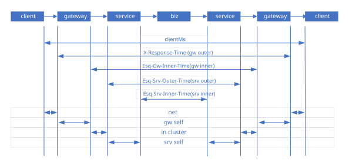
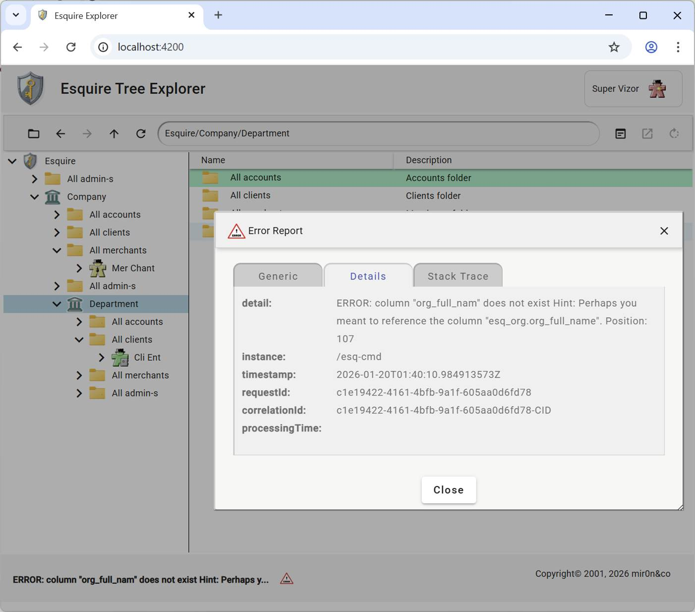

|Esquire Frameworks™ 2.0|
|:-|:-|

# **Esquire Observability Stack**

## Abstract

#### **The 3+1 Pillars of Observability in Esquire:**

-   **Distributed Tracing:** This allows following a single request's "path" through the entire distributed system.
-   **Structured Logging:**  "Two lines per Request" INFO log strategy provides the narrative of what happened, linked perfectly to the traces via the IDs.
-   **Performance Metrics:** Built-in **APM (Application Performance Monitoring)**, along with optional capture triggers, provides numerical data to assess the system's health and performance.
-   **Error Report (The RFC 7807/9457), the fourth pillar:** It provides a machine-readable state of the failure, including the root cause and processing time.

## 1. Distributed Tracing

#### **The Strategy: "Global Tracing with Local Granularity".**

This architecture ensures that "No request is left behind." Whether a request succeeds in a service or fails in the Gateway, there is a single, consistent ID to find the entire story.

Esquire distinguishes between two main identifiers to ensure a balance between tracking activity within service networks and requests from end customers.

-   **Correlation ID (***Esq-Correlation-ID***)**: The "Long-Term" ID. It links a user's initial action at the Gateway through all backend services. To keep tracing consistent, the *Esq-Correlation-ID* value is used for the *traceId* attribute in RFC 9457 *Problem Detail*.   
    *Esq-Correlation-ID* value can be explicitly defined at the end-user level using the *X-Correlation-ID* standard header.

    *Note: The Correlation ID (generic term for the internal request identity) is transported via the Esq-Correlation-ID HTTP header, while traceId is the corresponding JSON field in the Problem Detail report."*

-   **Request ID (***X-Request-ID***)**: This is a read-only ID provided by the client (Angular/Mobile/&c). It goes through the whole system, is recorded for possible investigation, is echoed back in the headers, and is included in the error report so the user can use it as a "Support Ticket Number."

#### **Summary of Constants**

|  **Name**            | **Purpose**                                          | **Details**                                                                                                               |
|----------------------|------------------------------------------------------|---------------------------------------------------------------------------------------------------------------------------|
| *Esq-Correlation-ID* | *Header.*  The internal engine for log linking    | Circulates only internally within Esquire networks. It may appear in error reports.                                       |
| *X-Correlation-ID*   | *Header.*  Standard compatibility header          | Optional: It explicitly defines *Esq-Correlation-ID* from the client’s side. It’s echoed back to the client.              |
| *X-Request-ID*       | *Header.*  The client's original reference ID.    | Its use is highly recommended for clients' Apps. It’s tracking in every processing chain. It’s echoed back to the client. |
| *traceId*            | *Error Problem Detail.*  A cross-system trace id. | In Esquire, it equals *Esq-Correlation-ID.*                                                                               |

## 2. Structured Logging

#### **Context-Aware Log Levels**

Esquire established a hierarchy to keep production logs clean:

-   *ERROR*: Any error record in the service, describing parameter values that may cause the error, in case of exception: stack trace included.
-   *INFO*: Reserved for the lifecycle audit (*INCOMING*/*OUTGOING*).
-   *DEBUG*: Used for internal logic debug (e.g., "Settling IDs," "CORS checks").
-   *TRACE*: Used for extreme technical details (e.g., "Generated new UUID").

#### **The Foundation: Contextual Awareness**

-   Every log message (at any level) in the service is automatically (over the MDC framework) or manually "tagged" with the correlation ID and request ID.

#### **Strategic Logging Points**

-   **The "Two Line per Request" Strategy.** Esquire moved away from multiple noisy logs and settled on a clean, high-visibility *INFO*-level audit. Every request generates exactly two bookend logs:

    *INCOMING* *(Entrance):* the log of the moment the request is settled. It includes the Correlation ID (internal engine) and Request ID (external witness).

    *OUTGOING (Exit):* the log of the final result. This is the most valuable log line because it combines the IDs, the HTTP Status, and the processing timing.

#### **Performance Logging (AOP)**

-   **Granular Metrics**: Final *OUTGOING INFO* log includes Backend time, Service Time, Gateway time, where and when applicable. This allows distinguishing between “Slow Network”, "Slow DB", and "Slow Logic" in logs, which is essential for scaling.

#### **Standardized UTC Timestamps**

-   **Global Synchronization**: By configuring your log pattern with *%d{yyyy-MM-dd HH:mm:ss, UTC}*, logs match the timestamps in responses and database records. This removes any confusion when working with distributed environments in different time zones.

## 3. Performance Metrics

#### **APM (Application Performance Monitoring) system**

It allows you to answer the question *"Is it the network, code, or the database?"* for any specific request in real time, just by toggling a header.

#### **Four-Layer Measurement (outer/inner pairs per tier)**

Esquire captures four distinct but related metrics for every request, organized as outer/inner pairs at the gateway tier and the service tier:

-   **Gateway Outer Time (`X-Response-Time`)**: from receive-from-client to send-to-client. Includes Spring Security filter chain (JWT decode, Vanilla Token Relay broker call, Phantom Token Relay token-exchange, authorization), routing, the downstream service call, and response assembly. The full envelope of work the gateway does on the request.
-   **Gateway Inner Time (`Esq-Gw-Inner-Time`)**: from sent-to-service to received-from-service. The gateway's measurement of the downstream call only. The delta `gw_outer - gw_inner` isolates the gateway's own overhead (auth + routing + response assembly).
-   **Service Outer Time (`Esq-Srv-Outer-Time`)**: from receive-by-service to send-to-gateway. The service's measurement of its own full processing.
-   **Service Inner Time (`Esq-Srv-Inner-Time`)**: umbrella of all inner-aspect costs at the service tier -- today equals JPA / DB query time; reserves the slot for future specifics like JMS publish wait, cache lookup, or external API calls via the extensible naming pattern `Esq-Srv-Inner-{X}-Time` (e.g., `Esq-Srv-Inner-DB-Time`, `Esq-Srv-Inner-JMS-Time`). The umbrella metric is always present; sub-aspects are added alongside it as the system grows.

#### **Where each timer is measured (and why outer ≠ inner)**

The four headers come from two pairs of filters at two tiers. Each timer answers a slightly different question:

-   **`X-Response-Time` is set by an outer-tier WebFilter** at `HIGHEST_PRECEDENCE` so the timer starts **before** Spring Security runs. This means Vanilla Token Relay broker call, Phantom Token Relay token-exchange, JWT decode time, role-check time -- the full auth-layer cost -- is part of the gateway outer envelope, not buried as invisible pre-routing overhead.
-   **`Esq-Gw-Inner-Time` is set by a Spring Cloud Gateway `GlobalFilter` at default order**. It runs inside the gateway's WebHandler, after Spring Security has approved the request. It captures only the routing + downstream-call window. The delta `outer - inner = gateway's own work` (auth + routing + response assembly).
-   **`Esq-Srv-Outer-Time` and `Esq-Srv-Inner-Time`** are both set by the service-side `MdcFilter` in `services/common`. Outer = full servlet request lifecycle. Inner = umbrella of all "inside work" (today, JPA queries via repository AOP; extensible via `Esq-Srv-Inner-{X}-Time` for future aspects).

The derived bands (`net`, `gw_self`, `in_cluster`, `srv_self`, `srv_inner`) are not headers; they're computed at consumption time by subtracting adjacent layer values. The hauberk harness's `PerformanceMatrix` does this automatically and prints per-URL summary blocks; see `services/doc/Esquire.Haubergeon.md` for the consumer view.

#### **Selective Visibility**

To avoid leaking internal timing data and saving on overhead, the four timer headers are optional.

-   **The Trigger**: The Gateway only adds these headers if the client sends the *X-Capture-Metrics* header.
-   **The Master Switch**: the gateway configuration *esquire.gateway.service-metrics.enabled* allows enabling the gathering of service performance metrics globally across all backend services if needed. For normal traffic, the flag must be off to avoid the memory overhead of buffering the response body.
-   **Log Visibility**: Regardless of headers, the *OUTGOING* log always provides a total performance snapshot at the gateway tier. When the Master Switch is on, logs include all four metric values plus the per-URL derived bands.
-   **Response Visibility**: When an end-client app passes the trigger header, the four metric headers are injected directly into the response (`X-Response-Time`, `Esq-Gw-Inner-Time`, `Esq-Srv-Outer-Time`, `Esq-Srv-Inner-Time`). The service-tier headers (`Esq-Srv-*`) depend on the Master Switch state on the service side; the gateway-tier headers (`X-Response-Time`, `Esq-Gw-Inner-Time`) are always emitted under trigger.
-   **Error Report**: When an error has happened on the Gateway side, the Gateway reports the error with request timing using *processingTime Problem Detail* attribute, even in the case when the end-client did not trigger the performance metrics.

#### **Summary of Constants**

|  **Name**                                          | **Purpose**                                                                          | **Details**                                                                |
|----------------------------------------------------|--------------------------------------------------------------------------------------|----------------------------------------------------------------------------|
| *X-Capture-Metrics*                                | *Header.*  The end-client Trigger.                                                | Allows sending performance metrics in response headers,                    |
| *X-Response-Time*                                  | *Header.*  Gateway outer time -- full envelope.                                   | Always in the response headers when “triggered”.                           |
| *Esq-Gw-Inner-Time*                                | *Header.*  Gateway inner time -- downstream call only.                            | In the response headers, when “triggered”.                                 |
| *Esq-Srv-Outer-Time*                               | *Header.*  Service outer time -- full service processing.                         | In the response headers, when “triggered” and “Master Switch” are on.      |
| *Esq-Srv-Inner-Time*                               | *Header.*  Service inner umbrella -- today equals JPA, future may decompose.      | In the response headers, when “triggered” and “Master Switch” are on.      |
| *Esq-Srv-Inner-{X}-Time*                           | *Header.*  Optional inner-aspect decomposition (e.g., -DB-, -JMS-, -Cache-).      | Added alongside the umbrella `Esq-Srv-Inner-Time`, not in place of it.     |
| *esquire. gateway. service-metrics .enabled* | *Gateway configuration.* The “Master Switch”.                                     | Disabled by default                                                        |
| *processingTime*                                   | *Error Problem Detail.*  Request processing time                                  | Same value as for *X-Response-Time*, does not require to be “triggered.*”* |

## 4. Error Report (The RFC 7807/9457)

#### **Centralized and consistent error-handling strategy**.

By moving the core logic to support the RFC 9457, Esquire ensured that the API behaves the same way regardless of *where* or *how* an error occurs.

Here is a breakdown of the error handling essentials that were established:

-   **RFC 9457 Compliance**: Every error response is a standard object: *Problem Detail*.
-   **Standardization**: Error JSONs in the response body look identical, whether it's a 401 Unauthorized from the Security Filter or a 500 Internal Error from a service.
-   **Uniformity**: Every error (whether from the Gateway or Service) looks identical to the client.
-   **Instance URI**: Including the instance (the failing URL) in the error JSON helps frontend developers immediately identify which endpoint call went wrong.
-   **Consistency of response**: By returning this unified type, Esquire ensures that the HTTP status headers and the JSON body are always perfectly synchronized.
-   **Recursive Cause Analysis**: The framework uses automated root-cause extraction to ensure the detail field contains the actual failure reason, even if wrapped in multiple exception layers.
-   **Traceability Integration**: The automatically maps your "Double-Settle" IDs into the JSON body (*requestId*, *correlationId*), ensuring the error report matches your logs.

    *Note: traceId equals correlationId. Problem Detail has both attributes:  since traceId is required, and there is a hypothetical case when no correlationId is obtained*.

-   **UTC Precision**: Every error report now carries a guaranteed UTC timestamp.
-   **Support Readiness**: By including the *requestId* in the JSON body, you've created a bridge for your users to report issues easily.
-   **Transparency**: For gateway errors, the *processingTime* property tells the user exactly how long the system worked on their request before it failed.

#### **Problem Detail attributes**

|  **Name**        | **Type**                                                                      | **Description**                                                                                                                                                                                                                         |
|------------------|-------------------------------------------------------------------------------|-----------------------------------------------------------------------------------------------------------------------------------------------------------------------------------------------------------------------------------------|
| *type*           | string                                                                        | URI identifying the error type                                                                                                                                                                                                          |
| *title*          | string                                                                        | Short, human-readable summary                                                                                                                                                                                                           |
| *traceId*        | string                                                                        | A cross-system trace ID. In Esquire, it equals *Esq-Correlation-ID,* same *correlationId.*                                                                                                                                              |
| *status*         | number                                                                        | Header.  The HTTP Status Code (e.g., 401, 503). Matches the HTTP Response Header.                                                                                                                                                    |
| *detail*         |  string                                                                       | Detailed, actionable explanation                                                                                                                                                                                                        |
| *Instance*       | string                                                                        | URI identifying the specific occurrence                                                                                                                                                                                                 |
| *Errors*         | array\<{   name?: string;  reason: string;  pointer?: string; }\> | Standard extension for validation errors.                                                                                                                                                                                               |
| *timestamp*      | string                                                                        | Esquire extension: Error timestamp in UTC timezone                                                                                                                                                                                      |
| *requestId*      | string                                                                        | Esquire extension: End-client request ID                                                                                                                                                                                                |
| *correlationId*  | string                                                                        | Esquire extension: Server internal correlation ID, value of *Esq-Correlation-ID*                                                                                                                                                        |
| *processingTime* | string                                                                        | Esquire extension: Only for Gateway errors: Total time the system spent on the request before the error occurred.                                                                                                                       |
| *stackTrace*     | string                                                                        | Esquire extension: Root cause stack trace. Conditional: Only included when the “Master Switch” is true to maintain security. It is the same “switch” used to control the visibility of internal metrics. It is set to false by default. |

## Esquire Explorer Error Report

## Observability Tools enabled

For the framework, because it has implemented structured logging (using **ECS - Elastic Common Schema**) and unified tracing IDs, logs are designed to be consumed by the industry's most powerful observability tools.

Here are the primary tools used to turn "Audit Trail" into actionable insights:

#### **The ELK Stack**

Since it is configured with “console: ecs”, logs are natively formatted for the **Elastic Stack**.

**Elasticsearch**: The search engine that indexes your logs.

-   **Logstash/Filebeat**: The "shippers" that collect the logs from Docker containers and send them to Elasticsearch.
-   **Kibana**: The visual dashboard. This is where logs enter the search bar, and you can see the "INCOMING" and "OUTGOING" lines appear across all services.

#### **Grafana Loki**

In the Grafana ecosystem, which is excellent for performance metrics:

-   **Loki**: A log aggregation system inspired by Prometheus. It is very efficient and handles custom labels perfectly.
-   **Grafana**: The UI where metrics and side-by-side logs may stay on the same screen.

#### **Distributed Tracing Tools**

Because logs contain trace IDs, they integrate perfectly with tracing UIs:

-   **Jaeger / Zipkin**: These tools show you a "Gantt Chart" of the request. Since logs are linked, a span in Jaeger will redirect to the specific INFO log lines generated by the Esquire for that exact moment.

#### **Cloud-Native Solutions**

Esquire is deployed to a cloud provider, and the following tools automatically ingest structured logs:

-   **AWS CloudWatch Logs / Insights**: Using "Insights," SQL-like queries can be used: fields @message \| filter correlationId = "esq-123".
-   **Google Cloud Logging (Stackdriver)**: Automatically recognizes JSON/ECS logs and allows for deep filtering.
-   **Azure Monitor**: Similar to AWS, it uses Kusto Query Language (KQL) to parse unified IDs.
