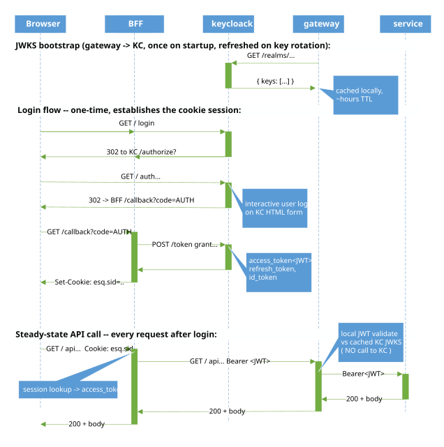
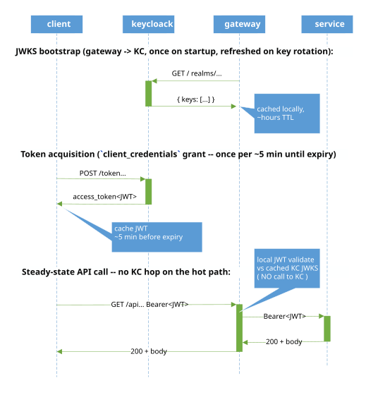
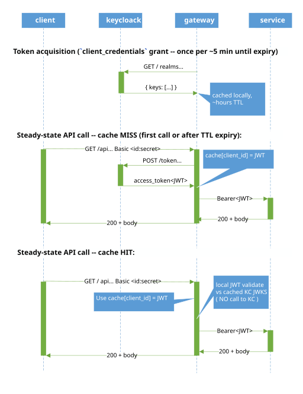
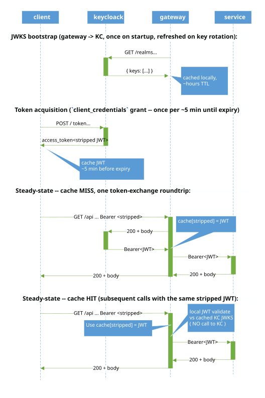

# Keycloak / Gateway -- Authentication Patterns

The platform ships four working authentication patterns. Each pattern wins on a different combination of properties; clients pick by kind. JWE is the only access-token format in the standards space that satisfies both *claim-hidden from client* and *self-contained on the hot path* simultaneously, but stock Keycloak does not emit JWE on its standard `/token` endpoint -- so the platform compromises across patterns instead. The gateway-side JWE decoder lives in tree as a latent lab, inert under the current IAS.

## Token formats -- JWT, JWS, JWE, JWK, JWKS

These five names appear together throughout this doc and are **not** synonyms:

- **JWT** (RFC 7519) -- *payload format*. A set of JSON claims (`sub`, `iss`, `exp`, plus custom claims like `esq_uid`, `esq_rootpath`, `realm_access.roles`). On its own, a JWT is just the spec for what's inside the token -- it says nothing about how the bytes are framed on the wire.
- **JWS** (RFC 7515) -- *signed wrapper* around a payload. Compact form: 3 dot-separated base64url parts -- `header.payload.signature`. The payload is readable by anyone (base64-decode the middle part); only the signer can produce a valid signature. This is what stock KC emits.
- **JWE** (RFC 7516) -- *encrypted wrapper* around a payload. Compact form: 5 dot-separated base64url parts -- `header.encrypted_key.iv.ciphertext.tag`. The payload is unreadable without the recipient's private key.
- **JWK** (RFC 7517) -- *one public key in JSON form*. Carries `kty` (key type, e.g. RSA), `kid` (key id), `use`, plus the key material itself (modulus + exponent for RSA). The signer's `kid` lands in the JWS header; the verifier uses it to pick the right JWK.
- **JWKS** (JSON Web Key Set, also RFC 7517) -- *a JSON document containing a list of JWKs*, published at a well-known URL (KC: `/realms/esquire/protocol/openid-connect/certs`). The gateway fetches this once on startup, caches it ~hours TTL, and uses it to local-validate every JWS signature without calling KC per request. This is the mechanism that keeps KC off the hot path for Patterns 1 and 2.

```
   JWS compact (what KC issues today):    eyJhbGc...  .  eyJzdWI...  .  3uS9pE...
                                          └─ header ─┘└─ payload ──┘└─ signature ┘
                                                          ▲
                                                          └─ JWT claims (readable!)

   JWE compact (the "ideal" -- not issued by stock KC):
                                          eyJhbGc...  .  Qq9Hd...  .  fRk...  .  Wg7y...  .  Hp8...
                                          └─ header ─┘└─ enc.key ─┘└─ iv ──┘└─ ciphertext ─┘└─ tag ┘
                                                                              ▲
                                                                              └─ JWT claims (encrypted)
```

A JWT can be carried inside either wrapper: a JWS (signed, 3 parts) or a JWE (encrypted, 5 parts). When the industry says "JWT" casually, it almost always means *a signed JWT in JWS compact form* -- which is exactly what stock Keycloak issues. When this doc says "Bearer JWT" in the block / sequence diagrams, that's what's on the wire. In this doc, **JWS** is used only where the wrapper format itself matters -- specifically the JWS-vs-JWE comparison that motivates the "ideal" below.

## The goal

The "perfect" handshake protocol from the platform's perspective has two simultaneous properties:

```
ideal access token:
   - ENCRYPTED bytes      -- client cannot read claims
   - SELF-CONTAINED       -- gateway + services validate locally,
                             no roundtrip to IAS per request
```

Only one single-token answer meets both properties simultaneously: JWE. Every other option in the standards space trades one property for the other -- as the catalog of generic options below shows.

## The detour: Plain JWT → Vanilla Token Relay → Phantom Token Relay

Stock Keycloak 26 does not emit JWE on its standard `/token` endpoint for any standard grant; `DefaultTokenManager` has no encryption code path there. **Plain JWE is therefore inaccessible** until KC ships it or the platform swaps the IAS. The working answer is a detour — three patterns that incrementally hide more from the client, together approximating what a single JWE token would have given us:

```
   Plain JWT  ───►  Vanilla Token Relay  ───►  Phantom Token Relay
       │                    │                          │
       │                    │                          └─ client holds a JWT whose claims are empty
       │                    └─ client holds NO token, only credentials
       └─ client holds a JWT with readable claims (the OAuth baseline)

                       ⤴ detour around the inaccessible Plain JWE goal
```

Each step hides one more thing from the client. The three together form the working answer KC's missing JWE forced us into. The pattern catalog below details each option; the chosen ones are the ones along this detour.

## Options in the standards space

Every viable approach in the OAuth / OIDC / JOSE world sits on two axes: *self-contained on the hot path?* (every resource server can authorize from the token bytes alone, no per-request callback to the IAS) and *claim-hidden from the client?* (the holder of the bearer cannot read the principal's identity / scope / roles by base64-decoding it).

| Option | Self-contained on hot path? | Claim-hidden from client? |
|---|---|---|
| **Plain JWS** | Yes -- everything in the token | No |
| **JWE** | Yes -- everything still in the token, just encrypted | Yes |
| **Opaque + Introspection (RFC 7662)** | No -- gateway must call IAS per request | Yes |
| **Lightweight Access Tokens + Userinfo** | No -- token deliberately gutted, claims fetched on demand | Yes |
| **Vanilla Token Relay (HTTP Basic / mTLS at client; gateway brokers JWT via `client_credentials`)** | Yes from gateway through services; on cache HIT zero IAS roundtrips, on cache MISS one. The single stateful hop is the per-`client_id` JWT cache at the gateway | Yes (by *absence* -- client holds no token at all, only credentials) |
| **Phantom Token Relay (stripped JWT at client + RFC 8693 token-exchange at gateway)** | Yes from gateway through services; on cache HIT zero IAS roundtrips, on cache MISS one exchange call. The single stateful hop is the per-`jti` JWT cache at the gateway | Yes (claims stripped from the wire JWT; the full JWT only exists inside the cluster) |
| **BFF (browser tier only)** | Yes on gateway/service side; the cookie-session lookup is at the BFF -- one hop at the front edge, not on every microservice hop behind it | Yes (by *absence* -- browser holds no token at all) |

### The other claim-hiding options -- and why Phantom Token Relay supersedes them

Three rows in the table -- Opaque + Introspection (RFC 7662), Lightweight Access Tokens + Userinfo, and Phantom Token Relay (RFC 8693) -- share one insight: hide claims from the client and let the gateway fetch them on demand. The first two stop at "fetch on demand," and that's where the regression lives:

- **Opaque + Introspection:** client carries a random string; every resource server (gateway *and* every microservice behind it) calls `/introspect` per request to learn anything about the token. The local-validation property JWT was invented to deliver is gone -- every request pays a KC roundtrip, pre-JWT session-style.
- **Lightweight Access Tokens + Userinfo:** client carries a stripped JWT; the resource server calls `/userinfo` per request to fetch claims. Same per-request regression as introspection, *plus* a leak: `/userinfo` accepts the bearer itself, so the holder can pump it for the claims that were supposedly hidden.

**Phantom Token closes the loop.** Same wire form on the client as Lightweight, but instead of a claims-blob endpoint (`/userinfo` or `/introspect`), the gateway uses `/token grant=token-exchange` to receive a *real signed JWT* from the IAS. The gateway caches that JWT per `jti` and forwards it downstream as-is; services validate it locally against IAS JWKS, exactly as they do for plain JWT. The "fetch on demand" cost is borne once per token TTL at the gateway tier, not per request, and the regression doesn't propagate past the gateway. Phantom Token is the clean successor to the previous two -- it keeps their wire shape on the client side, drops their per-request cost on the resource-server side.

### Partition patterns

BFF, Vanilla Token Relay, and Phantom Token Relay are **partition patterns** -- they achieve the same outcome JWE would, but split across tiers rather than packing both properties into a single token:

- **BFF** partitions at the **browser / cluster** edge. Browser sees an opaque cookie; gateway + services see a self-contained JWS with full claims.
- **Vanilla Token Relay** partitions at the **client / gateway** edge by *removing* the bearer entirely. Client sees no token -- only credentials it needs anyway; gateway brokers a JWT via `client_credentials` and caches per `client_id`. Two trade-offs this pattern makes that the others don't:
  - **Steps outside the OAuth paradigm.** Credentials are presented to (and verified at) the gateway, not directly to the IAS. The gateway proxies the auth one hop, but operationally the credentials live at a place other than the canonical authentication authority -- the OAuth assumption that the client authenticates to the IAS and presents a bearer to resource servers is broken on purpose.
  - **No SSO.** Each gateway authenticates the client independently; the client re-presents credentials to every gateway it talks to. The "single sign-on" property -- one IAS session works across many resource servers -- is gone, because there's no IAS-issued bearer on the client side to carry.
- **Phantom Token Relay** partitions at the **client / gateway** edge by *stripping* the bearer. Client sees a JWT whose payload has been emptied (a *phantom token*); gateway restores via RFC 8693 token-exchange and caches per `jti`.

All three keep the property that matters most for performance -- KC off the hot path through the microservices behind the gateway -- and absorb the cost of claim-hiding at one well-defined seam.

## Token Relay -- the umbrella shared by Vanilla Token Relay and Phantom Token Relay

Vanilla Token Relay and Phantom Token Relay are both **Token Relay** patterns. The gateway acts as an OAuth 2.0 client on behalf of downstream services: it ingests an edge credential from the inbound request, resolves or exchanges it for a JWT, caches the result, and relays the JWT down the service chain. Downstream services don't authenticate against KC themselves; they validate the gateway-relayed JWT locally against cached JWKS -- the same mechanism Plain JWT uses. The two patterns differ only in **what the edge credential is**:

- **Vanilla Token Relay:** edge credential = static OAuth client credentials (HTTP Basic, or mTLS in the strongest form). Gateway runs the `client_credentials` grant against KC to obtain the JWT.
- **Phantom Token Relay:** edge credential = a *phantom token* (a stripped JWT whose payload has been emptied). Gateway runs RFC 8693 token-exchange to restore the full claim-rich JWT.

The two share workflow, cache shape, and downstream behaviour; they differ in four points -- edge credential extraction, cache key derivation, KC grant form, and which client opt-in env they consult. Per-pattern details follow below.

## Caches in play

"KC off the hot path" is bought with caching, not by being stateless. Three caches participate; none are per-request:

| Cache | Used by | Key | Value | Where | TTL |
|---|---|---|---|---|---|
| **JWKS** | all patterns | KC realm | KC public keys | gateway + every service | Nimbus default (minutes; refresh-ahead on miss) |
| **Vanilla Token Relay JWT** | Vanilla Token Relay | `client_id` | full JWT | gateway only | until JWT `exp` |
| **Phantom Token Relay JWT** | Phantom Token Relay | source-token `jti` | full JWT | gateway only | until JWT `exp` |

JWKS is shared signature-validation infrastructure used by every microservice on every request -- without it none of the patterns would be hot-path-local. The Vanilla Token Relay and Phantom Token Relay JWT caches are gateway-tier state, pattern-specific; they absorb the per-request KC roundtrip that would otherwise happen on every call. Downstream of the gateway, only the JWKS cache exists -- services see plain Bearer JWTs and validate locally.

## What we use with Keycloak

The generic options above assume an IAS that cleanly implements the relevant standards. Stock Keycloak 26.4.7 doesn't, in two specific ways:

- **No JWE on `/token`.** KC's `DefaultTokenManager` has no encryption branch on `/token` for any standard grant; the relevant client attribute (`access.token.encrypted.response.alg=RSA-OAEP`) is silently ignored. JWE on the wire is therefore unavailable until KC ships it or the platform swaps to an IAS that does (Auth0, Okta, ForgeRock, Ping all do). The "ideal" single-token option is out.
- **RFC 8693 token-exchange + admin-fine-grained permissions don't interoperate cleanly.** v1 token-exchange (what KC 26.4.7 ships) calls into v2 permissions and trips `UnsupportedOperationException: Not supported in V2` when given an `audience=` parameter -- so the cleanest Phantom Token form (exchange *for the audience client* so its mappers run on the response) can't be expressed directly. Also `client.use.lightweight.access.token.enabled=true` on the source client propagates stripping through the exchange response, so the audience mappers never repopulate claims.

The platform deploys **BFF + JWT + Vanilla Token Relay + Phantom Token Relay**, and applies a workaround for the Phantom Token Relay gap.

### Phantom Token Relay -- deployed workaround

The clean theoretical design is "client carries a stripped JWT; gateway exchanges it for a full claim-rich JWT minted for the audience client." KC 26.4.7 blocks both halves of that. Deployed today:

- `client.use.lightweight.access.token.enabled=false` on the phantom clients -- the source bearer therefore is *not* actually stripped right now and carries the same claims as a plain JWT. The "claim-hidden at client" property of Phantom Token Relay is the named goal but **not currently realized** in production.
- Claim mappers (`esq_uid`, `esq_rootpath`, `realm_access.roles`) duplicated on the `esq-gw-exchange` requesting client, so the exchanged token (which KC issues *for the requesting client* when v1 exchange runs without `audience=`) carries the principal's claims. Downstream services validate as for plain JWT.
- The token-exchange code path itself is correct, tested end-to-end, and live. The source-token stripping property comes off the workaround list when KC ships token-exchange v2 (cleanly interoperable with v2 admin permissions) or a per-target lightweight switch.

## Implementation -- the four patterns

### BFF -- token hidden from the browser

Use case: browser-based clients (the Angular SPA via `explorer/backend/`). The browser never sees the JWT; the BFF tier holds it server-side and proxies API calls.

```
   BFF holds JWT in server-side session store (Redis / in-memory);
   browser never sees the JWT. Solid arrows = per-request hot path;
   downward arrows (1)(2)(3) = one-time / bootstrap interactions.
```
- **Claim-hidden:** yes (by absence -- there's no token on the browser tier)
- **Self-contained on hot path:** yes from gateway onwards (gateway + services do local JWT validation against KC's JWKS)
- **Cost:** one extra tier (BFF) + session-store sizing + cookie/CSRF semantics
- **Where wired:** `services/bff/`, `services/gateway/` (TokenRelay filter on `/api/*`), `services/keycloak/import/esquire.json` (`esq-angular` client with auth-code + PKCE)



### Plain JWT -- client holds the JWT, gateway validates locally

Use case: non-browser clients that can be trusted to carry a JWT (service-to-service callers, future mobile or API consumers when claim-visibility is acceptable).

```
   Gateway local-validates JWT against cached KC JWKS — NO KC roundtrip
   per request. Solid horizontal arrows = per-request hot path;
   downward arrows (1)(2) = bootstrap / token refresh.
```

- **Claim-hidden:** no (anyone with the JWT can base64-decode and read claims)
- **Self-contained on hot path:** yes (gateway + services local-validate; KC JWKS cached)
- **Cost:** lowest -- nothing extra; the standard OAuth2 / OIDC bearer flow
- **Where wired:** every Esquire client by default



### Vanilla Token Relay -- static client credentials at the edge

Use case: non-browser clients that need **maximum claim-hiding and bearer-replay protection** without a BFF tier -- service-to-service callers, high-trust automation, principals performing high-value or financial actions. **The client holds no token of any kind**, not even a claim-less one. The client presents credentials per request (HTTP Basic over TLS, or mTLS); the gateway authenticates the client, brokers a JWT with KC on the client's behalf via the `client_credentials` grant, caches the JWT per `client_id`, and forwards a full JWT to internal services. Services do the same local JWT validation as for plain JWT -- they never see anything different.

```
   Client side: ZERO bearer tokens. Just credentials the client needs
   anyway. Gateway brokers all token interactions with KC and caches the
   JWT per client_id (TTL = JWT exp minus 30s buffer). Hot path is zero
   KC roundtrips after first cache fill.
```

- **Claim-hidden:** **yes, absolutely** -- the client never holds a token; if an attacker exfiltrates the credentials, they must be replayed against the gateway, where they can be IP-restricted, rate-limited, or hardened with mTLS. A stolen bearer JWT, by contrast, is accepted by any resource server that trusts the issuer -- there is no single chokepoint where network-layer controls can be applied.
- **Bearer-replay risk at client/gateway edge:** **eliminated** -- credentials are not bearer tokens; only the gateway-service hop carries bearers, and that traffic stays inside the cluster
- **Self-contained on hot path:** yes, after first cache fill. First request pays one KC roundtrip (~3 ms); subsequent requests within JWT TTL hit gateway cache and pay zero
- **Revocation visibility:** bounded by cache TTL (default ~5 min). For faster revocation, shorten cache TTL; for immediate revocation, invalidate cache on KC admin events
- **Cost:** +3 ms p50 on cache MISS (one `client_credentials` grant); zero on cache HIT; cache memory ~1 KB per active client_id; +1 KC roundtrip per ~5 min per client_id (not per request)
- **Where wired:** `VanillaTokenRelay` variant under the shared `TokenRelayFilter` + `TokenRelayCache` + `WebClientTokenRelayClient` (impl of `ITokenRelayClient`) seam in `services/gateway/src/.../security/tokenrelay/`; per-client opt-in via `ESQ_GW_VANILLA_CLIENTS` env.
- **Inbound-Bearer enforcement:** `VanillaTokenRelay.examine()` also inspects inbound `Authorization: Bearer` requests. `JwtClaimPeek.peekAzp()` extracts the `azp` claim **without signature check**; if the value is in this variant's allowlist, the variant returns `VariantAction.Reject("Bearer JWT with azp=[X] is in Vanilla Token Relay allowlist -- must use HTTP Basic")` and `TokenRelayFilter` short-circuits the chain with **401**. This closes an architectural bypass: a misconfigured or compromised client could otherwise call KC's `/token` endpoint directly and present the resulting JWT as Bearer to skip the no-token-on-client property. The peek's role is catching *honest misconfigurations* with a clear error; a *forged* token (lying `azp` that escapes the allowlist match) would still fail JWS signature validation one step later at the service tier -- so the unauthenticated peek costs nothing on the attack path.



**mTLS variant (strongest form):** replace HTTP Basic with mutual TLS. Client presents a certificate during the TLS handshake; gateway maps the cert's subject (or SAN) to a configured `client_id` and looks up a server-held secret to perform the `client_credentials` grant. The wire then carries **neither bearer token nor shared-secret credential** -- only the client's **public certificate** is exposed during the handshake; the matching private key never leaves the client. All other components (cache, KC call, forward) are identical. Operational cost: cert lifecycle management on the client side.

**Threat-model contrast vs Plain JWT:** a stolen bearer in Plain JWT grants the attacker the user's full identity (claims base64-readable) until natural expiry. In Vanilla Token Relay, there is no bearer to steal at the client side -- only credentials, which the gateway can additionally protect with IP allowlists, rate limits, or mTLS. The full JWT exists only between gateway and service, never crosses the cluster boundary.

> **Anti-pattern note: Credential Over-Exposure.** Sending the client secret on every request -- even over TLS -- is classified in formal OAuth 2.0 security reviews as *Credential Over-Exposure*. Standard OAuth practice uses the secret once to obtain a token and then carries only the token; this pattern accepts that regression to get *no bearer at the client* in exchange. The mTLS variant above removes the regression entirely (no shared secret on the wire). For HTTP Basic deployments, mitigations are TLS-only transport, IP allowlists or rate limits at the gateway, and short cache TTLs to bound the blast radius of any leaked credential.

### Phantom Token Relay -- stripped JWT on client, gateway restores via RFC 8693

Use case: non-browser clients that need claim-hiding **and** the standard OAuth bearer-flow shape -- service-to-service callers that get a token from KC once and present it to multiple gateways/services, with claims invisible to the holder. Same anti-leakage property as Vanilla Token Relay, but the client carries a bearer (stripped of claims) instead of credentials. This restores the **token portability** property Vanilla Token Relay gives up (one token works across multiple cluster-edges), at the cost of a per-`jti` gateway-to-KC roundtrip on cache MISS and a stealable (if claim-empty) bearer at the client.

```
   Client side: bearer is a real JWT but its payload is stripped --
   no esq_uid, no rootpath, no roles. Decoding it tells the holder
   nothing useful about the principal. /userinfo also returns nothing
   useful by virtue of the esq-lightweight scope. The full JWT exists
   ONLY between gateway and service; gateway caches per jti so the KC
   roundtrip is amortized across the stripped token's lifetime.
```

- **Claim-hidden:** **yes** -- client's wire token has no readable claims; the full JWT materializes only after the gateway exchange. `/userinfo` is also stripped (scope-driven), so the client cannot pump it for claims.
- **Self-contained on hot path:** partial -- gateway-to-KC token-exchange is per-`jti` (cache HIT skips KC); gateway-to-service-to-service is fully self-contained (local JWT validation against cached KC JWKS).
- **Token portability / service SSO:** **yes** -- one stripped JWT works against multiple gateways that all share the same `esq-gw-exchange` permission grant. Vanilla Token Relay clients have to re-authenticate to each gateway; Phantom clients don't.
- **Bearer-replay risk at client edge:** yes -- the stripped JWT is a stealable bearer; an attacker with it has the same gateway access as the legitimate client until natural expiry. Mitigated by claim-hiding -- the stolen token reveals nothing -- and by short TTLs.
- **Revocation visibility:** bounded by gateway cache TTL (same as Vanilla Token Relay).
- **Cost:** +5-15 ms p50 on cache MISS (token-exchange roundtrip); zero on cache HIT; cache memory ~1 KB per active `jti`; +1 KC roundtrip per token TTL per active `jti`.
- **Where wired:** `PhantomTokenRelay` variant under the shared `TokenRelayFilter` + `TokenRelayCache` + `WebClientTokenRelayClient` (impl of `ITokenRelayClient`) seam in `services/gateway/src/.../security/tokenrelay/`; gateway authenticates to KC token-exchange as the dedicated `esq-gw-exchange` client; per-client opt-in via `ESQ_GW_PHANTOM_CLIENTS` env.
  
**Vanilla Token Relay vs Phantom Token Relay -- when to pick which:**

| | Vanilla Token Relay | Phantom Token Relay |
|---|---|---|
| Client holds | nothing token-shaped -- only credentials | a stripped JWT (bearer) |
| Cache key at gateway | `client_id` | `jti` (per-token) |
| One token across multiple gateways | NO -- per-gateway credential auth | YES -- portable bearer |
| Bearer-replay risk at client edge | none (no bearer) | yes (stripped JWT is stealable) |
| Client must support | HTTP Basic over TLS (or mTLS) | standard OAuth Bearer flow |
| KC config burden | one allowlist on gateway | client + scope + token-exchange permission |
| KC roundtrip frequency | ~1 per `client_id` per 5 min | ~1 per `jti` per 5 min |

Vanilla Token Relay is the strongest claim-hiding for clients that can present credentials per request. Phantom Token Relay keeps the standard OAuth client shape and adds token portability across multiple gateways, accepting the bearer-replay surface as the cost.

#### What the client actually receives (when `lightweight.access.token.enabled=true`)

The client's bearer is a real, signed JWT (3 parts, `header.payload.signature`), valid for downstream JWS verification. Only the **payload** is stripped. Every KC framework-level claim still has to be present so the token validates as OIDC:

```json
{
  "iss":   "https://esquire.mir0n.pro/kc-auth/realms/esquire",
  "iat":   1778797924,
  "exp":   1778798224,
  "jti":   "trrtcc:8e4b5b...",         // unique token id (cache key on gateway)
  "sub":   "b28d5f6e-3a99-4c1d-...",   // KC user UUID (service-account-<phantom-client>)
  "typ":   "Bearer",
  "azp":   "<phantom-client>",         // authorized party
  "scope": "<lightweight-scope>",
  "aud":   "<exchange-client>"         // audience mapper output -- required for the gateway to call token-exchange
}
```

Business claims (`esq_uid`, `esq_rootpath`, `realm_access.roles`) are configured per-mapper via the `lightweight.claim` attribute:

- `lightweight.claim=true`  -> claim IS included in lightweight access tokens
- `lightweight.claim=false` -> claim is OMITTED from lightweight access tokens (this is what we want for stripping)

So a stripped token tells the holder: "you're authenticated, here's a token id, this is the client and KC realm, here's when it expires" -- nothing about the principal's Esquire-side identity, permission scope, or roles. The decoder learns operational metadata, not business identity. Payload size is ~150 bytes vs ~400 bytes for a full token.

**Current deployment state:** `client.use.lightweight.access.token.enabled=false` on the Phantom Token Relay clients because KC v1 token-exchange propagated stripping to the exchanged token too (leaving the backend with no claims). The exchange flow itself is correct and tested; flipping lightweight back on cleanly needs KC token-exchange v2 (not in 26.4.7) or per-audience mappers. Known KC-version limitation.

## Measured performance

Per-request auth-layer cost lands entirely in the `gw_self` band of the PerformanceMatrix decomposition (see [Esquire.ObservabilityStack.md](Esquire.ObservabilityStack.md) and [Esquire.Haubergeon.md](Esquire.Haubergeon.md) for the column definitions). The other bands -- `net`, `in_cluster`, `srv_self`, `srv_inner` -- are pattern-independent because the request and downstream are the same. Numbers below are p50 over 5 warm runs of `GET /esq-cmd-tree?kind=32&id=5`.

```
per pattern (gw_self band, ms; only the varying column shown):

  Pattern                                       cache    gw_self
  ----------------------------------------------------------+----
  BFF / JWT (baseline)                          n/a         ~1
  Vanilla Token Relay                           HIT         ~1
  Vanilla Token Relay                           MISS        ~10
  Phantom Token Relay                           HIT         ~6
  Phantom Token Relay                           MISS        ~11-16
```

MISS happens once per `client_id` (Vanilla Token Relay) or once per `jti` (Phantom Token Relay) per JWT TTL (~5 min); every other request in the same window is HIT. Logon handshake -- the one-time KC `/token` call the client itself runs to acquire the bearer it presents -- is ~9 ms on the wire to KC and amortized across the JWT's full lifetime.

## Decision matrix (which pattern, when)

| Property needed | BFF | JWT | Vanilla Token Relay | Phantom Token Relay |
|---|---|---|---|---|
| Browser client (no JWT on wire) | ✓ | -- | -- | -- |
| Service-to-service or trusted client | -- | ✓ | ✓ | ✓ |
| No bearer token on client side | ✓ (cookie) | -- | ✓ (credentials only) | -- (stripped JWT) |
| Standard OAuth Bearer flow at client | -- | ✓ | -- | ✓ |
| Token portability (one token, many gateways) | -- | ✓ | -- | ✓ |
| Zero-overhead hot path | (yes, behind BFF) | ✓ | ✓ (after cache fill) | ✓ (after cache fill) |
| Token bytes opaque to holder | ✓ (absence) | -- | ✓ (absence) | ✓ (claims stripped) |
| Standards-compliant on the wire | ✓ | ✓ | ✓ (HTTP Basic / mTLS) | ✓ (RFC 8693 exchange) |

The four patterns coexist in one realm. Each client opts in via its KC config: Vanilla Token Relay clients via gateway env allowlist; Phantom Token Relay clients via both gateway env allowlist and KC token-exchange permission grant.

## When JWE reopens

Reopen this design only when one of:

1. **KC ships proper access-token JWE on `/token` for standard grants.** No roadmap signals as of May 2026.
2. **An alternative IAS enters the deployment story.** Auth0, Okta, ForgeRock, and Ping all emit JWE on the standard token endpoint natively; the gateway-side decoder we keep in tree (`JweAwareJwtDecoder` + `/jwe-jwks` exposure) is the standard consumer-side pattern and would work without code changes -- just swap the issuer URL and adjust realm / issuer claim configuration.
3. **A new threat model demands claim-hidden + local-validation together in a single token format** -- which none of BFF, Vanilla Token Relay, or Phantom Token Relay can satisfy without partitioning across tiers. (Only JWE achieves both properties in one token.)

| IAS | JWE access-token capability |
|---|---|
| **Auth0**            | Specific APIs can be configured to encrypt access tokens using JWE Compact Serialization. Available for all supported grant types. JWKS-based key exchange. |
| **Okta**             | OIDC token JWE encryption is a configurable feature on Custom Authorization Servers; algorithms selected per CAS. |
| **ForgeRock / Ping** | Both support encrypted access tokens per OIDC profile / OAuth2 enterprise extensions. |

